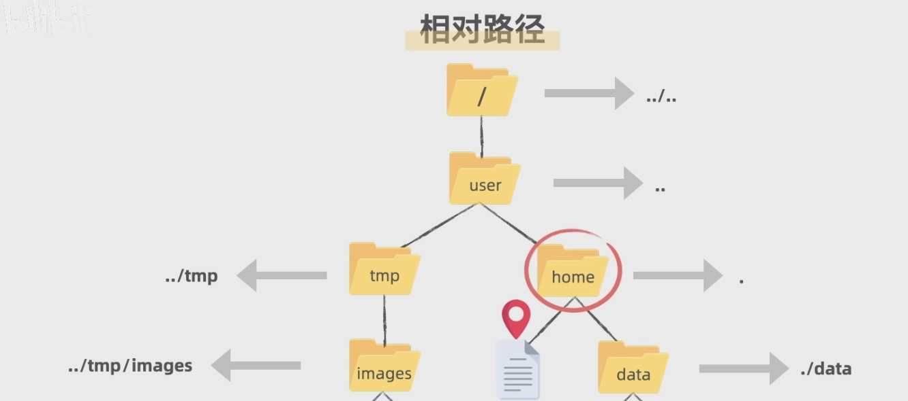

# 文件路径写法

> **本页关键词**：相对路径、绝对路径、根目录、协议相对 URL、../、./

---



## 一、操作系统路径差异

### 根目录表示

**Linux/Mac**

```bash
/           # 根目录
/home/user  # 绝对路径
./file.txt  # 当前目录
../file.txt # 上级目录
```

**Windows**

```cmd
C:\         # C 盘根目录
.\file.txt  # 当前目录
..\file.txt # 上级目录
```

### 关键差异对比

| 特性 | Linux/Mac | Windows |
|------|-----------|---------|
| 目录分隔符 | `/` | `\`（也支持 `/`） |
| 根目录 | `/` | `C:\`、`D:\` 等 |
| 当前/上级目录 | `.`、`..` | 相同 |

---

## 二、HTML 中的路径写法

### 相对路径

```
project/
├── index.html
├── css/style.css
├── js/main.js
└── images/
    ├── logo.png
    └── bg.jpg
```

**`./` - 当前目录（通常可省略）**

```html


<link rel="stylesheet" href="css/style.css">
```

**`../` - 上级目录**

```html
<!-- 从 pages/about.html 访问上级 images -->


```

### 绝对路径

**从网站根目录开始**

```html

<link href="/css/style.css">
```

**完整 URL**

```html

```

### 协议相对 URL（`//`）

```html

```

根据当前页面协议自动选择 http/https，常用于 CDN。

---

## 三、路径类型对比表

| 写法 | 类型 | 含义 |
|------|------|------|
| `file.txt` | 相对 | 当前目录 |
| `./file.txt` | 相对 | 当前目录（显式） |
| `folder/file.txt` | 相对 | 子文件夹内 |
| `../file.txt` | 相对 | 上级目录 |
| `/images/logo.png` | 绝对 | 网站根目录 |
| `//cdn.com/file` | 协议相对 | 协议自适应 |
| `https://...` | 完整 URL | 完整网络地址 |

---

## 四、实际应用场景

### 开发环境目录结构

```
my-project/
├── index.html
├── css/main.css
├── images/logo.png
└── assets/fonts/font.ttf
```

**index.html**

```html
<link rel="stylesheet" href="css/main.css">
<script src="js/app.js"></script>

```

**css/main.css**

```css
body {
  background-image: url("../images/bg.jpg");
}
@font-face {
  src: url('../assets/fonts/font.ttf');
}
```

> **面试要点**：CSS 中的 `url()` 路径相对于 **CSS 文件**所在位置，而非 HTML 文件。

---

## 五、常见错误

### 混淆操作系统路径和 Web 路径

```html
<!-- 错误 -->


<!-- 正确 -->


```

### 路径大小写

Linux 服务器大小写敏感，`Images/Logo.png` 与 `images/logo.png` 不同。

### 忘记上级目录

```html
<!-- 文件位置：products/phone.html -->
<link rel="stylesheet" href="css/style.css">  <!-- 错误：会去 products/css/ 找 -->
<link rel="stylesheet" href="../css/style.css">  <!-- 正确 -->
```

---

## 六、最佳实践

| 场景 | 建议 |
|------|------|
| 开发阶段 | 相对路径，便于本地测试 |
| 生产环境 | 根绝对路径或 CDN |
| 多级目录 | 使用 `../` 逐级向上 |

**记忆口诀**：同级用 `./` 或省略；子级用 `文件夹/`；上级用 `../`；根目录用 `/`；网络资源用 `//` 或 `https://`。
