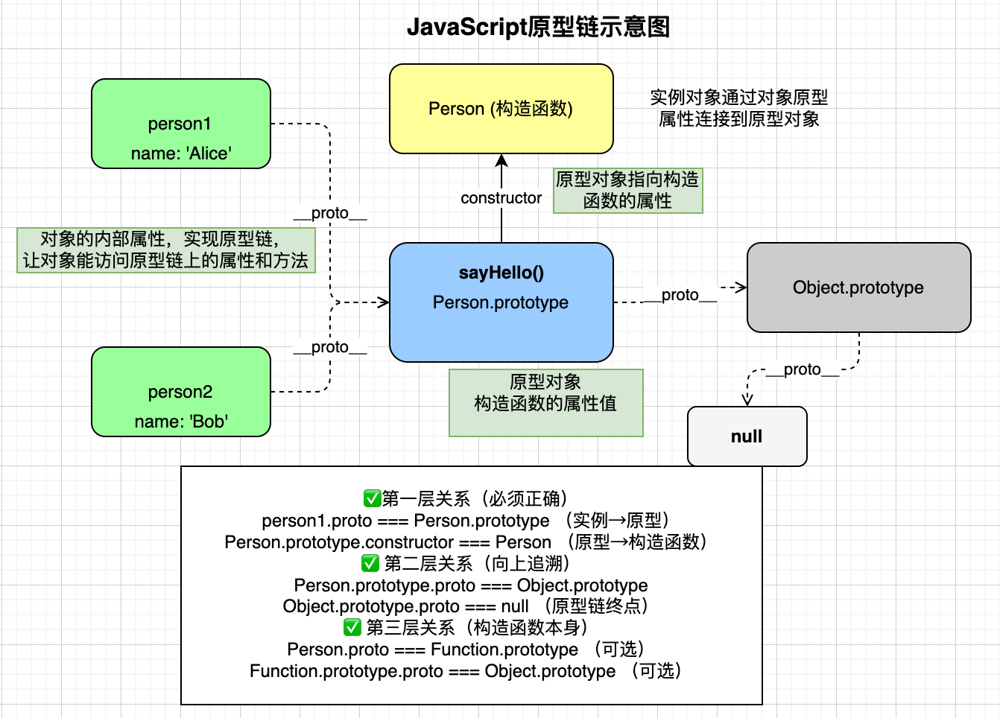

# JS 进阶与面向对象

> **本页关键词**：作用域、闭包、提升、箭头函数、构造函数、原型链、深浅拷贝、this、防抖节流

---

## 一、作用域与闭包

### 块级作用域（ES6）

```javascript
if (true) {
  let y = 20;
}
```

`let` / `const` 支持块级作用域，`var` 不支持。

### 垃圾回收

- 核心：引用计数 / 可达性；变量只要还能被访问，就不会被回收
- 常见触发：函数执行完毕，局部变量无外部引用 → 可回收
- 内存泄漏：全局变量、闭包保留无用数据、未清理定时器 / 事件

### 闭包

函数 + 定义时的作用域。外层函数执行结束后，内部仍能访问外层变量，延长变量生命周期，也易导致内存泄漏。

```javascript
function outer() {
  let count = 0;
  return function () {
    count++;
    return count;
  };
}
```

### 变量与函数提升

- 函数声明整体提升，可先调用后定义
- `var`：只提升声明，不提升赋值；`console.log(a)` 得 `undefined`
- `let` / `const`：存在暂时性死区（TDZ），提前访问报错

---

## 二、数组方法

### forEach 与 map

| 对比点 | forEach | map |
|--------|---------|-----|
| 返回值 | 无 | 新数组 |
| 链式 | 否 | 是 |
| 场景 | 遍历 / 渲染 | 数据转换 |
| 修改原数组 | 否 | 否 |

```javascript
arr.forEach((item) => console.log(item));
const prices = arr.map((item) => item.price);
```

### filter 与 reduce

```javascript
const res = arr.filter((item) => item.price > 100);
const className = classes.reduce((res, cur) => res + ' ' + cur, '');
```

### 数组方法速记

| 方法 | 用途 | 返回新数组 |
|------|------|------------|
| forEach | 遍历 | 否 |
| map | 映射 | 是 |
| filter | 筛选 | 是 |
| reduce | 累积 | 是 |

> **面试要点**：forEach 无法 break / return；箭头函数无 `arguments`，推荐用剩余参数 `...args`。

---

## 三、面向对象与原型链

### 原型链示意



### 构造函数

```javascript
function Modal(title = '', message = '') {
  this.title = title;
  this.message = message;
  this.modalBox = document.createElement('div');
}
```

`new` 创建独立实例，数据与 DOM 相互独立。

### 原型方法

```javascript
Modal.prototype.open = function () {
  if (!document.querySelector('.modal')) {
    document.body.appendChild(this.modalBox);
  }
};

Modal.prototype.close = function () {
  document.body.removeChild(this.modalBox);
};
```

- 方法挂在 `prototype` 上共享，属性为实例私有
- 事件回调中需用箭头函数保持 `this` 指向实例

### 设计思想

- 结构由 JS 动态创建，HTML 只保留入口
- 数据驱动视图、行为与结构分离
- 防止重复渲染（如先判断是否已存在 `.modal`）

> **面试要点**：为什么 open/close 写在 prototype？为什么关闭按钮必须用箭头函数？理解「方法共享、属性私有」。

---

## 四、深浅拷贝

### 浅拷贝现象（Object.assign）

- 修改第一层基本类型 → 原对象不受影响
- 修改嵌套对象 → 原对象同步被修改（引用共享）

### 深拷贝实现

递归创建新对象 / 数组，基本类型直接赋值；需先判断 `Array` 再判断 `Object`（数组本质是对象）。

### 对比表

| 对比项 | 浅拷贝 | 深拷贝 |
|--------|--------|--------|
| 第一层属性 | 新值 | 新值 |
| 嵌套对象 | 共享引用 | 独立对象 |
| 是否递归 | 否 | 是 |
| 影响原对象 | 会 | 不会 |

### 常见实现方式

| 方式 | 示例 | 特点 |
|------|------|------|
| 原生 API | `structuredClone(obj)` | 推荐，不支持函数 |
| JSON | `JSON.parse(JSON.stringify(obj))` | 简单，有丢失风险 |
| 递归 | 手写 `deepCopy` | 可控，面试常考 |

---

## 五、this 指向

### 调用方式与 this

| 调用方式 | 示例 | this（非严格） | this（严格） |
|----------|------|----------------|-------------|
| 普通函数 | `fn()` | window | undefined |
| 对象方法 | `obj.fn()` | obj | obj |
| new | `new Fn()` | 新实例 | 新实例 |
| call/apply | `fn.call(obj)` | obj | obj |
| bind | `fn.bind(obj)()` | obj | obj |
| 箭头函数 | `() => {}` | 外层 this | 外层 this |

### 等价于 window 调用的场景

`setTimeout`、`setInterval` 的回调，普通全局函数调用。

### 事件回调中的 this

- `btn.onclick = function () {}` → `btn`
- `addEventListener('click', function () {})` → `btn`
- `addEventListener('click', () => {})` → 外层 this（多为 window）

### 强制改变 this

| 方式 | 是否立即调用 | 是否改变 this |
|------|--------------|---------------|
| call | 是 | 是 |
| apply | 是 | 是 |
| bind | 否（返回新函数） | 是 |

---

## 六、防抖与节流

### 防抖（debounce）

频繁触发，只执行最后一次。

```javascript
function debounce(fn, t) {
  let timeId;
  return function () {
    if (timeId) clearTimeout(timeId);
    timeId = setTimeout(() => fn(), t);
  }
}
box.addEventListener('mousemove', debounce(mouseMove, 200));
```

### 节流（throttle）

频繁触发，最多每 X 毫秒执行一次。

```javascript
function throttle(fn, t) {
  let startTime = 0;
  return function () {
    let now = Date.now();
    if (now - startTime >= t) {
      fn();
      startTime = now;
    }
  };
}
box.addEventListener('mousemove', throttle(mouseMove, 500));
```

两者均利用闭包保存 `timeId` 或 `startTime`。

> **面试要点**：防抖 = 只执行最后一次；节流 = 固定间隔内最多执行一次；理解闭包在其中的作用。
