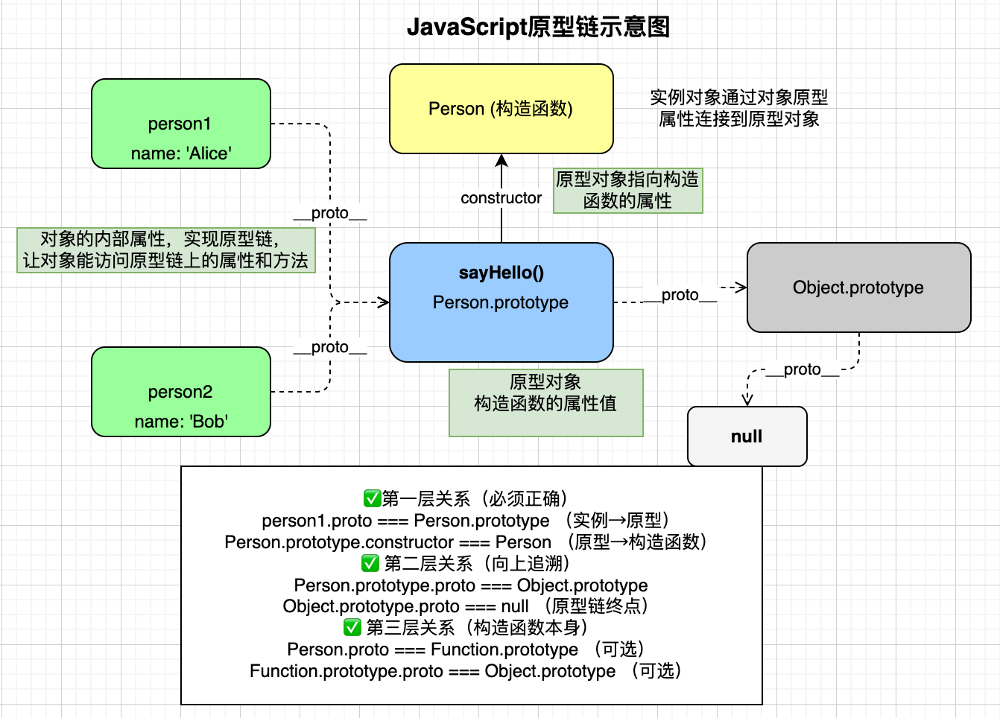

## day1:作用域，垃圾回收，闭包，变量和函数提升，箭头函数，解构，forEach，filter


##### 块级作用域（ES6）

```js
if (true) {
  let y = 20
}
```

* `let / const` 支持
* `var` 不支持

### 二、垃圾回收（Garbage Collection）

#### 1. GC 的核心原则

* **引用计数 / 可达性**
* 变量只要还能被访问，就不会被回收

#### 2. 常见触发场景

```js
function fn() {
  let obj = {}
}
fn()
```

* `obj` 无外部引用 → 可回收

#### 3. 内存泄漏常见原因

* 全局变量
* 闭包中保存无用数据
* 未清理的定时器 / 事件

---

### 三、闭包（Closure）

#### 1. 定义

* **函数 + 定义时的作用域**
* 即使外层函数执行结束，内部仍能访问外层变量

#### 2. 基本示例

```js
function outer() {
  let count = 0
  return function () {
    count++
    return count
  }
}
```

#### 3. 特点

* 延长变量生命周期
* 既强大，也容易导致内存泄漏

---

### 四、变量与函数提升（Hoisting）

#### 1. 函数提升

```js
fn()
function fn() {}
```

* 函数声明整体提升

#### 2. 变量提升（var）

```js
console.log(a) // undefined
var a = 10
```

* 只提升声明，不提升赋值

#### 3. let / const

```js
console.log(b) // 报错
let b = 20
```

* 存在暂时性死区（TDZ）

---

### 五、箭头函数（Arrow Function）

#### 1. 基本语法

```js
const fn = (a, b) => a + b
```

#### 2. 核心特点

* 没有自己的 `this`
* 没有 `arguments`
* 不能作为构造函数

#### 3. this 对比

```js
function fn() {
  console.log(this)
}

const arrow = () => {
  console.log(this)
}
```

---

### 六、arguments 对象

#### 1. 什么是 arguments

* 函数内部的**类数组对象**
* 保存所有传入的参数

#### 2. 使用示例

```js
function sum() {
  let total = 0
  for (let i = 0; i < arguments.length; i++) {
    total += arguments[i]
  }
  return total
}
```

#### 3. 注意事项

* **箭头函数没有 arguments**
* ES6 推荐使用 **剩余参数**

```js
function sum(...args) {
  return args.reduce((a, b) => a + b, 0)
}
```

---

### 七、解构赋值（Destructuring）

#### 1. 对象解构

```js
const { name, price } = item
```

#### 2. 数组解构

```js
const [a, b] = [1, 2]
```

#### 3. 常见用法

```js
const { price = 0 } = item
```

---

### 八、forEach

#### 1. 定义

* 用于遍历数组
* **不返回新数组**

#### 2. 用法

```js
arr.forEach(item => {
  console.log(item)
})
```

#### 3. 特点

* 无法 `break / return`
* 适合执行副作用操作

---

### 九、map

#### 1. 定义

* 对数组每一项进行映射
* **返回新数组**

#### 2. 用法

```js
const prices = arr.map(item => item.price)
```

---

### 十、forEach vs map（高频对比）

| 对比点     | forEach | map  |
| ------- | ------- | ---- |
| 返回值     | 无       | 新数组  |
| 是否可链式   | 否       | 是    |
| 使用场景    | 遍历 / 渲染 | 数据转换 |
| 是否修改原数组 | 否       | 否    |

---

### 十一、filter

#### 1. 定义

* 按条件筛选数组

#### 2. 用法

```js
const res = arr.filter(item => item.price > 100)
```

#### 3. 特点

* 返回新数组
* 不影响原数组

---

### 十二、数组方法总结（面试速记）

| 方法      | 用途 | 是否返回新数组 |
| ------- | -- | ------- |
| forEach | 遍历 | 否       |
| map     | 映射 | 是       |
| filter  | 筛选 | 是       |
| reduce  | 累积 | 是       |

---


下面我**完全按「项目模块」的视角**，把你今天学到的所有知识点**嵌入到这个模态框项目的真实结构中讲解**。
你可以把它当成：**“这是一个小组件项目，每一块在项目里承担什么职责，用到了哪些 JS 核心能力”**。

---

## 项目模块总览（先有全局认知）

这个项目本质是一个 **Modal 消息提示组件**，可以拆成 5 个模块：

1. **组件初始化模块（构造函数 + new）**
2. **DOM 构建模块（基本包装类型 + 字符串方法）**
3. **组件行为模块（原型方法 + this）**
4. **事件交互模块（箭头函数 + 查找判断）**
5. **数据与集合处理模块（数组方法 / Object 方法 / reduce 思想）**

下面逐模块拆解。

---

## day2:对象，数组字符串方法
### 模块一：组件初始化模块

**（new 实例化 + 构造函数）**

#### 模块职责

* 创建一个“模态框对象”
* 初始化该对象的**私有数据**
* 为后续行为方法提供状态

#### 项目中的代码

```js
function Modal(title = '', message = '') {
  this.title = title
  this.message = message
  this.modalBox = document.createElement('div')
}
```

#### 知识点落地

##### 1️⃣ 为什么要用构造函数

* 项目里会创建**多个模态框实例**
* 每个实例内容不同，但行为一致

```js
const m1 = new Modal('温馨提示', '没有删除权限')
const m2 = new Modal('友情提示', '未注册账号')
```

##### 2️⃣ `new` 在项目中的真实意义

`new Modal()` = 创建一个**独立组件实例**

* 每次 `new`：

  * 数据独立
  * DOM 独立
  * 状态不互相污染

---

### 模块二：DOM 构建模块

**（字符串方法 + 基本包装类型）**

#### 模块职责

* 生成组件内部 DOM 结构
* 用数据渲染视图

#### 项目中的代码

```js
this.modalBox.className = 'modal'
this.modalBox.innerHTML = `
  <div class="header">${this.title} <i>x</i></div>
  <div class="body">${this.message}</div>
`
```

---

#### 知识点 1：字符串是“临时对象”（基本包装类型）

```js
`${this.title}`
```

这里发生了什么：

* `this.title` 是字符串（基本类型）
* JS 自动包装为 `String` 对象
* 调用模板字符串能力
* 用完即销毁

等价理解：

```js
new String(this.title).toString()
```

---

#### 知识点 2：字符串常见方法在项目中的真实用途

| 方法       | 项目用途   |
| -------- | ------ |
| trim     | 清洗用户输入 |
| includes | 判断关键词  |
| slice    | 截断提示内容 |
| replace  | 关键词高亮  |

示例（项目增强）：

```js
this.message = message.trim().slice(0, 50)
```

---

### 模块三：组件行为模块

**（原型方法 + this 设计）**

#### 模块职责

* 定义组件“能做什么”
* 控制显示 / 销毁

---

#### 打开模块（open）

```js
Modal.prototype.open = function () {
  if (!document.querySelector('.modal')) {
    document.body.appendChild(this.modalBox)
  }
}
```

##### 为什么放在 prototype 上？

* `open` 是**行为**
* 所有模态框行为一致
* 不应该每个实例创建一份

---

#### 关闭模块（close）

```js
Modal.prototype.close = function () {
  document.body.removeChild(this.modalBox)
}
```

#### this 在模块中的含义

* `this` 始终指向 **当前组件实例**
* 不操作全局
* 保证组件封闭性

---

### 模块四：事件交互模块

**（箭头函数 + 查找判断）**

### 模块职责

* 响应用户行为
* 触发组件方法

---

#### 项目中的关键代码

```js
this.modalBox.querySelector('i').addEventListener('click', () => {
  this.close()
})
```

---

#### 知识点 1：为什么用箭头函数

* 事件回调默认 `this` 指向 DOM
* 组件方法需要 `this === Modal 实例`

箭头函数：

* 不绑定 `this`
* 直接继承外层 `this`

---

#### 知识点 2：查找 / 判断思维（find / every）

虽然项目里没直接写数组，但逻辑是一样的：

```js
if (!document.querySelector('.modal')) {
  ...
}
```

等价数组思维：

```js
modals.every(m => !m.isOpen)
```

项目意识：

> **先判断，再执行**

---

### 模块五：数据与集合处理模块

**（Object 方法 + reduce 思想）**

### 模块职责

* 管理组件配置
* 批量处理数据

---

#### Object 静态方法（配置型组件必备）

假设未来支持配置：

```js
function Modal(options) {
  const defaults = { title: '', message: '' }
  this.options = Object.assign(defaults, options)
}
```

* `Object.assign` → 合并配置
* `Object.keys` → 遍历配置项

---

#### reduce 思想在组件项目中的位置

虽然当前项目没写 `reduce`，但组件项目中非常常见：

##### 例：拼接 className

```js
const className = classes.reduce((res, cur) => {
  return res + ' ' + cur
}, '')
```

##### 本质

* 把**多个值 → 一个结果**
* 非常适合组件状态计算

---

### 项目级总结（非常重要）

这个项目表面是一个 **模态框**，本质是在练：

1. **如何用构造函数表示“组件实例”**
2. **如何用原型方法表示“组件行为”**
3. **如何用字符串 / DOM 构建视图**
4. **如何控制 this，避免组件失控**
5. **如何用数组 / 对象方法支撑扩展性**

---

## day3:原型链，模态框
### 流程图


### 一、Modal（模态框）是什么？本案例在做什么？

#### 1️⃣ 什么是模态框（Modal）

模态框（Modal）是一种**覆盖在页面之上的临时窗口**，用于向用户传递重要信息或要求用户进行确认操作。

典型特征：

* 覆盖页面主体内容
* 通常居中显示
* 出现时阻断用户对页面其他区域的操作
* 可关闭

---

#### 2️⃣ 本案例要解决的问题

本案例实现的是一个 **“可复用的消息提示模态框”**，具体目标包括：

* 页面中有多个按钮（删除 / 登录）
* 点击不同按钮，弹出**样式相同但内容不同**的模态框
* 页面中**同一时间只能存在一个模态框**
* 点击右上角 `x` 可以关闭模态框

👉 **核心思想**：

> 使用 JavaScript 的“构造函数 + 原型方法”，对模态框进行面向对象封装，实现组件级复用。

---

### 二、HTML 与 CSS 层设计（为什么 HTML 中没有 modal）

#### 1️⃣ HTML 中没有写死 modal 结构

```html
<!--
<div class="modal">
  ...
</div>
-->
```

原因分析：

* 模态框是否显示、显示什么内容，是**动态行为**
* 如果写死在 HTML 中，页面加载时就会存在
* 不利于复用，也不利于控制

👉 **设计思想**：

> 结构由 JavaScript 动态创建，HTML 只保留触发入口

这已经是**组件化思想的雏形**

---

### 三、Modal 构造函数 —— 模态框的“创建器”

#### 1️⃣ 构造函数的职责划分

```js
function Modal(title = '', message = '') {
```

构造函数只负责三件事：

1. 接收外部传入的数据
2. 保存为实例属性
3. 创建模态框 DOM 结构（不负责显示）

---

#### 2️⃣ 定义实例私有属性（状态）

```js
this.title = title
this.message = message
```

说明：

* `title`：模态框标题
* `message`：模态框正文内容
* 每个实例的数据是独立的

---

#### 3️⃣ 创建模态框 DOM 节点

```js
this.modalBox = document.createElement('div')
this.modalBox.className = 'modal'
```

特点：

* `modalBox` 是**实例私有 DOM**
* 每 `new Modal()` 一次，就创建一个新的模态框节点

---

#### 4️⃣ 使用模板字符串填充结构与数据

```js
this.modalBox.innerHTML = `
  <div class="header">${this.title} <i>x</i></div>
  <div class="body">${this.message}</div>
`
```

这里体现了三个核心思想：

* 模板字符串
* 数据驱动视图
* 结构复用、内容可变

👉 这是 Vue / React 等框架的核心理念来源

---

### 四、open 方法 —— 打开模态框（原型方法）

#### 1️⃣ 为什么把 open 挂在 prototype 上

```js
Modal.prototype.open = function () {}
```

原因：

* `open` 是行为，不是数据
* 所有实例的行为一致
* 挂在原型上可以让所有实例共享

👉 **关键词**：方法共享，属性私有

---

#### 2️⃣ 防止模态框重复创建

```js
if (!document.querySelector('.modal')) {
```

作用：

* 页面中始终只允许存在一个 `.modal`
* 防止用户连续点击按钮，产生多个模态框

👉 这是非常重要的**防御性代码**

---

#### 3️⃣ 将模态框渲染到页面中

```js
document.body.appendChild(this.modalBox)
```

说明：

* 构造函数阶段只是“准备”
* `appendChild` 才是真正显示到页面

---

#### 4️⃣ 绑定关闭事件（this 指向是重点）

```js
this.modalBox.querySelector('i').addEventListener('click', () => {
  this.close()
})
```

为什么必须使用箭头函数：

* 箭头函数没有自己的 `this`
* `this` 向上查找，指向当前实例对象

如果使用普通函数：

```js
function () {
  this.close() // this 指向 i 元素，错误
}
```

👉 这是 **this 指向问题的经典应用场景**

---

### 五、close 方法 —— 关闭模态框

```js
Modal.prototype.close = function () {
  document.body.removeChild(this.modalBox)
}
```

特点分析：

* 只移除 DOM
* 不销毁实例对象
* 实例仍可再次调用 `open()`

👉 **对象存在，视图消失**

---

### 六、事件驱动实例化（使用阶段）

#### 1️⃣ 删除按钮触发模态框

```js
document.querySelector('#delete').addEventListener('click', () => {
  const m = new Modal('温馨提示', '您没有权限删除')
  m.open()
})
```

---

#### 2️⃣ 登录按钮触发模态框

```js
document.querySelector('#login').addEventListener('click', () => {
  const m = new Modal('友情提示', '您还么有注册账号')
  m.open()
})
```

说明：

* 同一个构造函数
* 不同实例
* 不同数据
* 相同行为

👉 这是**面向对象编程的标准使用方式**

---

### 七、本案例必须掌握的核心知识点（面试级）

#### 1️⃣ JavaScript 核心

* 构造函数
* prototype 原型
* 实例属性与原型方法
* 箭头函数的 this 绑定规则

---

#### 2️⃣ DOM 操作

* document.createElement
* appendChild / removeChild
* querySelector
* addEventListener

---

#### 3️⃣ 设计思想（非常重要）

* 组件化封装
* 数据驱动视图
* 行为与结构分离
* 防止重复渲染

---

### 八、自我检验（学会 vs 学熟）

如果你能**脱离代码**回答下面问题，说明你已经掌握：

1. 为什么 modal 不写在 HTML 中？
2. 为什么 open / close 要写在 prototype 上？
3. 为什么关闭按钮事件中必须使用箭头函数？
4. 为什么要判断页面中是否已经存在 `.modal`？

---

## day4:深浅拷贝，this，防抖节流

### 一、案例一：Object.assign 的浅拷贝结论

```js
const o = {}
Object.assign(o, obj)

o.age = 20
o.family.baby = '老pink'
```

**现象总结：**

* 修改 `o.age` → `obj.age` **不受影响**
* 修改 `o.family.baby` → `obj.family.baby` **同时被修改**

**原因：**

* 第一层基本类型 → 值拷贝
* 嵌套对象 `family` → 引用拷贝（共享同一地址）

---

### 二、案例二：递归函数实现深拷贝

```js
deepCopy(o, obj)

o.age = 20
o.hobby[0] = '篮球'
o.family.baby = '老pink'
```

**现象总结：**

* 修改基本类型 → 原对象不变
* 修改数组元素 → 原数组不变
* 修改对象属性 → 原对象不变

**原因：**

* 数组创建新 `[]`
* 对象创建新 `{}`
* 基本类型直接赋值
* 所有层级均重新分配内存

---

### 三、深拷贝与浅拷贝对比表（重点）

| 对比项     | 浅拷贝（assign / 展开） | 深拷贝（递归） |
| ------- | ---------------- | ------- |
| 第一层属性   | 新值               | 新值      |
| 嵌套对象    | 共享引用             | 独立对象    |
| 嵌套数组    | 共享引用             | 独立数组    |
| 是否递归    | ❌                | ✅       |
| 是否影响原对象 | 会                | 不会      |

---

### 四、为什么要先判断 Array 再判断 Object

```js
if (oldObj[k] instanceof Array) {
  newObj[k] = []
} else if (oldObj[k] instanceof Object) {
  newObj[k] = {}
}
```

**原因说明：**

* 数组本质上也是对象
* 若先判断 `Object`，数组会被误判为普通对象
* 导致拷贝结果结构错误

---

### 五、深拷贝的三种常见实现方式（记重点）

| 实现方式     | 示例                                | 特点           |
| -------- | --------------------------------- | ------------ |
| 原生 API   | `structuredClone(obj)`            | 最推荐，可靠但不支持函数 |
| JSON 序列化 | `JSON.parse(JSON.stringify(obj))` | 简单但有数据丢失风险   |
| 递归拷贝     | 手写 `deepCopy`                     | 可控性强，面试常考    |

---

**一句话总结：**

> **浅拷贝只复制第一层引用，深拷贝会递归复制所有层级；
> 实际开发优先使用 structuredClone，原理理解靠手写递归。**
### 一、案例一：Object.assign 的浅拷贝结论

```js
const o = {}
Object.assign(o, obj)

o.age = 20
o.family.baby = '老pink'
```

**现象总结：**

* 修改 `o.age` → `obj.age` **不受影响**
* 修改 `o.family.baby` → `obj.family.baby` **同时被修改**

**原因：**

* 第一层基本类型 → 值拷贝
* 嵌套对象 `family` → 引用拷贝（共享同一地址）

---

### 二、案例二：递归函数实现深拷贝

```js
deepCopy(o, obj)

o.age = 20
o.hobby[0] = '篮球'
o.family.baby = '老pink'
```

**现象总结：**

* 修改基本类型 → 原对象不变
* 修改数组元素 → 原数组不变
* 修改对象属性 → 原对象不变

**原因：**

* 数组创建新 `[]`
* 对象创建新 `{}`
* 基本类型直接赋值
* 所有层级均重新分配内存

---

### 三、深拷贝与浅拷贝对比表（重点）

| 对比项     | 浅拷贝（assign / 展开） | 深拷贝（递归） |
| ------- | ---------------- | ------- |
| 第一层属性   | 新值               | 新值      |
| 嵌套对象    | 共享引用             | 独立对象    |
| 嵌套数组    | 共享引用             | 独立数组    |
| 是否递归    | ❌                | ✅       |
| 是否影响原对象 | 会                | 不会      |

---

### 四、为什么要先判断 Array 再判断 Object

```js
if (oldObj[k] instanceof Array) {
  newObj[k] = []
} else if (oldObj[k] instanceof Object) {
  newObj[k] = {}
}
```

**原因说明：**

* 数组本质上也是对象
* 若先判断 `Object`，数组会被误判为普通对象
* 导致拷贝结果结构错误

---

### 五、深拷贝的三种常见实现方式（记重点）

| 实现方式     | 示例                                | 特点           |
| -------- | --------------------------------- | ------------ |
| 原生 API   | `structuredClone(obj)`            | 最推荐，可靠但不支持函数 |
| JSON 序列化 | `JSON.parse(JSON.stringify(obj))` | 简单但有数据丢失风险   |
| 递归拷贝     | 手写 `deepCopy`                     | 可控性强，面试常考    |
｜

---


### 一、this 判断总览表（最重要的一张）

| 调用方式         | 示例               | this 指向（非严格） | this 指向（严格模式） |
| ------------ | ---------------- | ------------ | ------------- |
| 普通函数调用       | `fn()`           | `window`     | `undefined`   |
| 对象方法调用       | `obj.fn()`       | `obj`        | `obj`         |
| 构造函数调用       | `new Fn()`       | 新实例          | 新实例           |
| call / apply | `fn.call(obj)`   | `obj`        | `obj`         |
| bind         | `fn.bind(obj)()` | `obj`        | `obj`         |
| 箭头函数         | `() => {}`       | 外层 this      | 外层 this       |

---

### 二、哪些函数“等价于 window 调用”？（浏览器环境）

| 场景             | 示例                | 本质调用          | this     |
| -------------- | ----------------- | ------------- | -------- |
| 普通全局函数         | `fn()`            | `window.fn()` | `window` |
| setTimeout 回调  | `setTimeout(fn)`  | 全局调用          | `window` |
| setInterval 回调 | `setInterval(fn)` | 全局调用          | `window` |
| 事件解绑后直接调用      | `handler()`       | 全局调用          | `window` |

⚠️ **前提**：非严格模式

---

### 三、事件回调里的 this（单独记）

| 写法                                              | this                |
| ----------------------------------------------- | ------------------- |
| `btn.onclick = function () {}`                  | `btn`               |
| `btn.addEventListener('click', function () {})` | `btn`               |
| `btn.addEventListener('click', () => {})`       | 外层 this（通常是 window） |

---

### 四、严格模式下 this 的变化（必考）

```js
'use strict'
```
#### 行为变化表

| 场景            | 非严格      | 严格          |
| ------------- | -------- | ----------- |
| 普通函数 `fn()`   | `window` | `undefined` |
| setTimeout 回调 | `window` | `undefined` |
| 对象方法          | 调用对象     | 调用对象        |
| new           | 实例       | 实例          |

---

### 五、this 的“强制改变”方式汇总

| 方式    | 是否立即调用   | this 是否改变 |
| ----- | -------- | --------- |
| call  | ✅        | ✅         |
| apply | ✅        | ✅         |
| bind  | ❌（返回新函数） | ✅         |
| new   | ✅        | 指向新实例     |


### 闭包，防抖节流


#### 案例中的节流：拆解版，不拆解没看懂
- 初始化
```js
// 这行代码执行时：
box.addEventListener('mousemove', debounce(mouseMove, 200))

// 1. 先执行 debounce(mouseMove, 200)
function debounce(fn, t) {
  let timeId  // 创建局部变量
  return function () {  // 返回内部函数
    if (timeId) clearTimeout(timeId)
    timeId = setTimeout(function () {
      fn()
    }, t)
  }
}
```
- 事件绑定
```js
// 实际上相当于：
const innerFunction = function() {
  if (timeId) clearTimeout(timeId)
  timeId = setTimeout(function() {
    mouseMove()
  }, 200)
}

box.addEventListener('mousemove', innerFunction)
// 注意：innerFunction 已经包含了 timeId 的闭包！

```
#### 节流案例：
- 跟上边的一样，也是先初始化，形成闭包，
```js
function throttle(fn, t) {
  let startTime = 0  // 起始时间
  
  return function () {
    let now = Date.now()
    if (now - startTime >= t) {
      fn()//执行一下i++，
      startTime = now
      //注意这个now
    }
  }
}

box.addEventListener('mousemove', throttle(mouseMove, 500))
```
- 假设t = 500ms,用户隔100ms动一下，初始i为1
```text
时间:   0   100  200  300  400  500  600  700  800  900  1000...
移动:   ✓   ✓    ✓    ✓    ✓    ✓    ✓    ✓    ✓    ✓    ✓
执行fn: ✗   ✗    ✗    ✗    ✗    ✓    ✗    ✗    ✗    ✗    ✓
i的值:  1   1    1    1    1    2    2    2    2    2    3
```
简单记法：
- 防抖：频繁触发，只执行最后一次
- 节流：频繁触发，最多每X毫秒执行一次