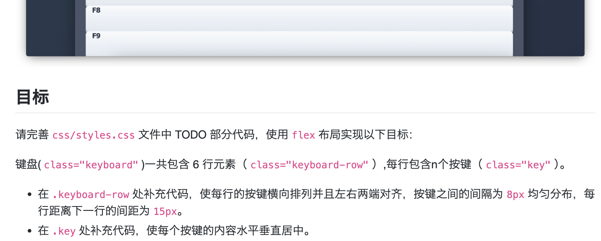

# 蓝桥基础题

> **本页关键词**：Flex 布局、双角色 Flex、Performance API、导航性能

---

## 一、键盘艺术家

> 考察 Flex 嵌套布局：行内两端对齐、按键内居中

题目要求用 Flex 实现键盘布局，结构如下：

```text
键盘 (.keyboard)
  ├── 行 (.keyboard-row) [flex容器1]
  │    ├── 按键 (.key) [flex项目1 + flex容器2]
  │    │    └── 按键文字 [flex项目2]
  │    └── ...
  └── ...
```

每个 `.key` 具有双角色：作为 `.keyboard-row` 的 flex 项目（由父元素控制排列），同时作为自己内部内容的 flex 容器（控制文字居中）。



<details>
<summary>参考答案</summary>

### 样式实现

```css
/* .keyboard-row */
display: flex;                    /* 启用 flex 布局 */
justify-content: space-between;   /* 两端对齐（左右贴边）*/
gap: 8px;                         /* 项目间固定间距 */
margin-bottom: 15px;              /* 行间距 */

/* .key */
display: flex;           /* 让按键成为 flex 容器 */
justify-content: center; /* 水平居中 */
align-items: center;     /* 垂直居中 */
```

**要点**：父容器用 `space-between` 控制行内按键分布，子元素用 `display: flex` + `justify-content`/`align-items` 实现内部文字居中。

</details>

> 补充说明：Flex 项目中可再嵌套 Flex 容器，形成「父管排列、子管内部」的典型模式。

---

## 二、性能看板

> 考察 Performance API 与页面导航性能数据获取

实现 `getNavigationMetrics()` 函数：使用 Performance API 获取页面加载各阶段的时间节点（DNS、TCP、响应、DOM 解析、资源加载等）。若浏览器不支持或无法获取数据，返回 `null`。

<details>
<summary>参考答案</summary>

### 完整实现

```javascript
function getNavigationMetrics() {
  if (
    !window.performance ||
    typeof window.performance.getEntriesByType !== 'function'
  ) {
    return null;
  }

  const navigationEntries = performance.getEntriesByType('navigation');
  if (!navigationEntries || navigationEntries.length === 0) {
    return null;
  }

  const navigationTiming = navigationEntries[0];
  return {
    navigationStart: navigationTiming.navigationStart,
    domainLookupStart: navigationTiming.domainLookupStart,
    domainLookupEnd: navigationTiming.domainLookupEnd,
    connectStart: navigationTiming.connectStart,
    connectEnd: navigationTiming.connectEnd,
    responseStart: navigationTiming.responseStart,
    responseEnd: navigationTiming.responseEnd,
    domContentLoadedEventEnd: navigationTiming.domContentLoadedEventEnd,
    loadEventEnd: navigationTiming.loadEventEnd
  };
}
```

### 关键点

| 步骤 | 说明 |
|------|------|
| API 兼容 | 检查 `window.performance` 与 `getEntriesByType` 是否存在 |
| 数据获取 | `performance.getEntriesByType('navigation')` 返回 `PerformanceNavigationTiming` 数组 |
| 字段提取 | 从第一个 navigation 对象提取 9 个时间戳字段 |

### 导航时间线

- **navigationStart** → **domainLookupStart**：重定向/卸载
- **domainLookupStart** → **domainLookupEnd**：DNS 查询
- **connectStart** → **connectEnd**：TCP 连接
- **responseStart** → **responseEnd**：服务器响应
- **responseEnd** → **domContentLoadedEventEnd**：DOM 解析
- **domContentLoadedEventEnd** → **loadEventEnd**：资源加载

</details>

> 补充说明：Performance API 支持程度因浏览器而异；导航数据仅在当前页面有效；缓存命中时部分时间可能为 0；SPA 路由切换需结合其他 API。
