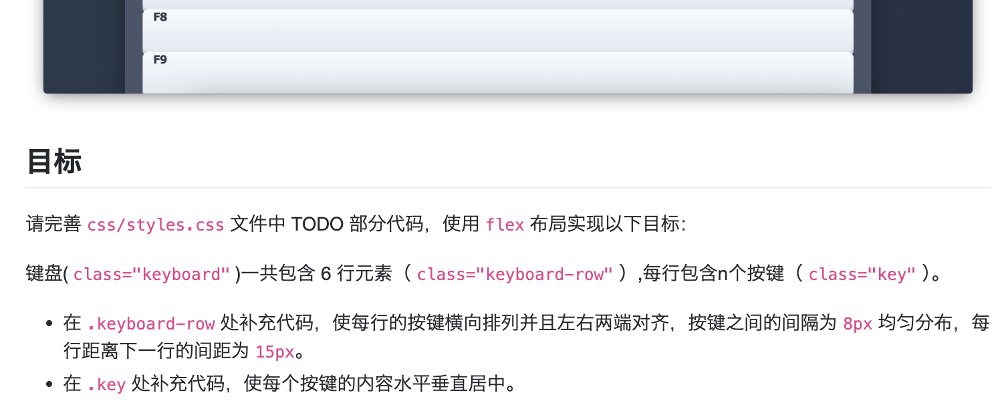

## 键盘艺术家
- Flex布局
### 题目


```text
键盘 (.keyboard)
  ├── 行 (.keyboard-row) [flex容器1]
  │    ├── 按键 (.key) [flex项目1 + flex容器2]
  │    │    └── 按键文字 [flex项目2]
  │    ├── 按键 (.key) [flex项目1 + flex容器2]
  │    │    └── 按键文字 [flex项目2]
  │    └── ...
  ├── 行 (.keyboard-row) [flex容器1]
  └── ...
```
每个.key实际上有两个角色：
- 作为.keyboard-row的 flex项目（由父元素控制排列）
- 作为自己内部内容的 flex容器（控制内部文字居中）
### answer
```css
/* row */
display: flex;                    /* 启用flex布局 */
justify-content: space-between;   /* 两端对齐（左右贴边）*/
gap: 8px;                         /* 项目间固定间距 */
margin-bottom: 15px;              /* 行间距 */
/* key */
display: flex;           /* 让按键自己成为flex容器 */
justify-content: center; /* 水平居中 */
align-items: center;     /* 垂直居中 */
```


## 性能看板
- Performance API

### 题目描述
本题要求实现一个网页性能监控工具，核心任务是补全`getNavigationMetrics()`函数。该函数需要使用浏览器的Performance API获取页面加载过程中的关键时间节点数据，包括DNS查询、TCP连接、服务器响应、DOM解析和资源加载等各阶段的耗时信息。如果浏览器不支持Performance API或无法获取数据，函数应返回`null`以便界面显示相应的提示信息。

### 关键词
- **Performance API**：现代浏览器提供的性能监测接口，可以获取页面加载、资源请求等性能数据
- **PerformanceNavigationTiming**：专门记录页面导航性能的对象，包含从导航开始到页面完全加载的详细时间节点
- **getEntriesByType('navigation')**：Performance API的方法，返回包含页面导航性能数据的数组
- **导航时间线**：包括navigationStart、domainLookupStart、connectStart、responseStart、domContentLoadedEventEnd、loadEventEnd等关键时间点

### 解题思路与答案

### 完整函数实现
```javascript
function getNavigationMetrics() {
  if (
    !window.performance ||
    typeof window.performance.getEntriesByType !== 'function'
  ) {
    console.warn('当前环境不支持 Performance API');
    return null;
  }
  let metrics = null;
  
  const navigationEntries = performance.getEntriesByType('navigation');
  
  if (navigationEntries && navigationEntries.length > 0) {
    const navigationTiming = navigationEntries[0];
    
    metrics = {
      navigationStart: navigationTiming.navigationStart,
      domainLookupStart: navigationTiming.domainLookupStart,
      domainLookupEnd: navigationTiming.domainLookupEnd,
      connectStart: navigationTiming.connectStart,
      connectEnd: navigationTiming.connectEnd,
      responseStart: navigationTiming.responseStart,
      responseEnd: navigationTiming.responseEnd,
      domContentLoadedEventEnd: navigationTiming.domContentLoadedEventEnd,
      loadEventEnd: navigationTiming.loadEventEnd
    };
  }
  
  return metrics;
}
```

### 关键点解析

1. **API兼容性检查**：首先检查浏览器是否支持Performance API及其`getEntriesByType`方法，这是健壮代码的基础

2. **数据获取**：
   - 使用`performance.getEntriesByType('navigation')`获取导航性能数据
   - 该方法返回一个数组，通常包含一个`PerformanceNavigationTiming`对象

3. **数据验证**：
   - 检查返回的数组是否存在且不为空
   - 确保能够获取到有效的导航性能对象

4. **字段提取**：
   - 从`PerformanceNavigationTiming`对象中提取题目要求的9个关键时间点
   - 这些时间点以毫秒时间戳的形式表示

5. **错误处理**：
   - 如果API不支持或数据获取失败，返回`null`
   - 后续代码会检查返回值并显示相应的用户提示

### 性能时间线说明
函数返回的时间点构成了完整的页面加载时间线：
- **navigationStart** → **domainLookupStart**：重定向/卸载前一个文档
- **domainLookupStart** → **domainLookupEnd**：DNS查询时间
- **connectStart** → **connectEnd**：TCP连接建立时间
- **responseStart** → **responseEnd**：服务器响应时间
- **responseEnd** → **domContentLoadedEventEnd**：DOM解析和构建时间
- **domContentLoadedEventEnd** → **loadEventEnd**：资源加载时间

#### 应用场景
该函数是性能监控工具的核心，获取的数据可用于：
1. 性能诊断和分析
2. 用户体验优化
3. 网站性能基准测试
4. 监控页面加载速度趋势

### 注意事项
1.# Performance API在不同浏览器中的支持程度可能略有差异
2. 导航性能数据只在当前页面有效，页面刷新后会重新记录
3. 某些时间点在某些情况下可能为0（如缓存命中时DNS查询时间为0）
4. 对于单页应用(SPA)，可能需要使用其他Performance API方法获取路由切换的性能数据