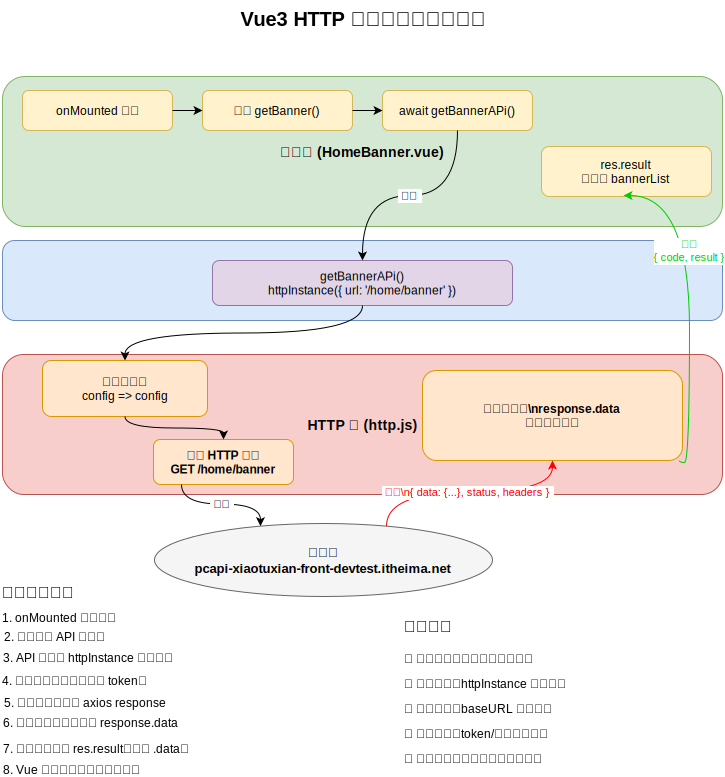
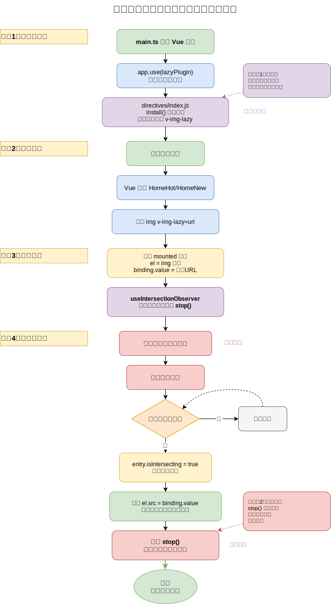

# Layout 与 Home 页

> **本页关键词**：Layout 组件拆分、Pinia 单例优化重复请求、`useScroll` 吸顶交互、HTTP 请求三层架构、slot 组件复用、自定义指令 `v-img-lazy`、IntersectionObserver、GoodsItem 可复用组件

---

## 一、Layout 页核心逻辑

### 1. 组件结构与拆分思路

Layout 是整个应用的「外壳」组件 — 首页、分类页、详情页都共享这个外壳，只有中间内容区（`<RouterView />`）不同。把外壳拆分为 5 个子组件，各自负责独立区域：

```vue
<!-- Layout/index.vue -->
<script setup>
import LayoutNav from './components/LayoutNav.vue'
import LayoutHeader from './components/LayoutHeader.vue'
import LayoutFooter from './components/LayoutFooter.vue'
import LayoutFixed from './components/LayoutFixed.vue'
import { useCategoryStore } from '@/stores/category'
import { onMounted } from 'vue'

const categoryStore = useCategoryStore()
onMounted(() => categoryStore.getCategory())
</script>

<template>
  <LayoutFixed />
  <LayoutNav />
  <LayoutHeader />
  <RouterView />
  <LayoutFooter />
</template>
```

### 2. 一级导航 API 渲染

**数据流**：API 层封装接口 → 组件 `onMounted` 中调用 → `v-for` 渲染导航列表。

最初的实现是在 LayoutHeader 组件内直接调接口获取分类数据。但很快发现一个问题：LayoutFixed（吸顶导航）和 HomeCategory（首页左侧分类）也需要同样的数据，如果各自都请求一次，就会造成重复请求。

```js
// apis/layout.js
export const getCategoryAPI = () => httpInstance({ url: '/home/category/head' })
```

```vue
<!-- LayoutHeader 中使用 -->
<li v-for="item in categoryStore.categoryList" :key="item.id">
  <RouterLink :to="`/category/${item.id}`">{{ item.name }}</RouterLink>
</li>
```

### 3. Pinia 优化重复请求


**问题**：LayoutHeader、LayoutFixed、HomeCategory 三个组件都需要分类数据，如果各自调 API 就会发 3 次相同请求。

**解决思路**：把分类数据提升到 Pinia Store 中统一管理。在 Layout（三者的共同父组件）的 `onMounted` 中只请求一次，数据存入 Store，三个子组件直接从 Store 读取。

```js
// stores/category.ts
export const useCategoryStore = defineStore('category', () => {
  const categoryList = ref([])
  const getCategory = async () => {
    const res = await getCategoryAPI()
    categoryList.value = res.result
  }
  return { categoryList, getCategory }
})
```

**为什么这样就避免了重复请求**：Pinia Store 是单例模式。无论多少个组件调用 `useCategoryStore()`，拿到的都是同一个 store 实例、同一份 `categoryList` 数据。只要在 Layout 层触发一次 `getCategory()`，所有子组件就能通过 store 直接消费数据。

> **面试要点**：Pinia Store 是单例（每个 `defineStore` 只创建一个实例），多个组件共享同一份响应式数据。这是 Flux 架构的核心思想 — 数据集中管理，组件只负责展示和交互。

### 4. 吸顶交互（`useScroll` + 动态 class）

**需求**：页面滚动超过一定距离后，顶部出现一个固定导航栏。

**实现思路**：通过 VueUse 的 `useScroll` 获取实时滚动位置 `y`，用动态 class 控制吸顶栏的显隐。CSS 上默认把吸顶栏通过 `transform: translateY(-100%)` 移出视口，当 `y > 78`（原始 header 高度）时添加 `.show` 类，移除 transform 并设置过渡动画。

```vue
<script setup>
import { useScroll } from '@vueuse/core'
const { y } = useScroll(window)
</script>

<template>
  <div class="app-header-sticky" :class="{ show: y > 78 }">
    <!-- 吸顶导航内容，复用分类 Store 数据 -->
  </div>
</template>
```

**CSS 关键**：默认 `transform: translateY(-100%); opacity: 0;`，`.show` 时 `transform: none; opacity: 1;`，配合 `transition: all 0.3s` 实现平滑的滑入/淡入效果。

---

## 二、Home 页面

### 1. 整体结构

Home 拆分为 5 个子组件：HomeCategory（左侧分类面板）/ HomeBanner（轮播图）/ HomeNew（新鲜好物）/ HomeHot（人气推荐）/ HomeProduct（产品列表）。每个子组件独立负责自己的数据请求和渲染。

### 2. Banner 轮播图 — HTTP 请求三层架构



这是项目中贯穿始终的数据获取模式，以 Banner 为例说明三层各自的职责：

| 层 | 代码 | 职责 |
|----|------|------|
| **HTTP 层** | `utils/http.js` | 创建 Axios 实例、配置 baseURL/timeout、拦截器 |
| **API 层** | `apis/home.js` | 封装具体接口 URL 和参数，返回 Promise |
| **组件层** | `HomeBanner.vue` | 调用 API、管理本地状态、渲染 UI |

```js
// apis/home.js — API 层
export function getBannerAPI (params = {}) {
  const { distributionSite = '1' } = params
  return httpInstance({
    url: '/home/banner',
    params: { distributionSite }
  })
}
```

```vue
<!-- HomeBanner.vue — 组件层 -->
<script setup>
import { getBannerAPI } from '@/apis/home'
import { onMounted, ref } from 'vue'

const bannerList = ref([])
const getBanner = async () => {
  const res = await getBannerAPI()
  bannerList.value = res.result
}
onMounted(() => getBanner())
</script>

<template>
  <el-carousel height="500px">
    <el-carousel-item v-for="item in bannerList" :key="item.id">
      
    </el-carousel-item>
  </el-carousel>
</template>
```

**为什么分三层**：如果把 URL、请求配置、业务逻辑全写在组件内，改一个接口地址要翻遍所有组件。分层后：换 baseURL 只改 HTTP 层，改接口路径只改 API 层，组件层只关注「数据怎么用」。

### 3. HomePanel 组件封装（slot 复用）

**问题**：HomeNew、HomeHot、HomeProduct 三个模块的 UI 结构相似 — 都有标题 + 副标题 + 主体内容区，只是主体内容不同。

**解决思路**：提取公共结构为 `HomePanel` 组件，标题/副标题通过 props 传入，主体内容通过 slot 插入。这是 Vue 中组件复用的经典模式。

```vue
<!-- HomePanel.vue -->
<script setup>
defineProps({
  title: { type: String },
  subTitle: { type: String }
})
</script>

<template>
  <div class="home-panel">
    <div class="container">
      <div class="head">
        <h3>{{ title }}<small>{{ subTitle }}</small></h3>
      </div>
      <!-- 默认插槽 — 不同模块插入不同内容 -->
      <slot />
    </div>
  </div>
</template>
```

使用时，各模块只需要关注自己的内容部分：

```vue
<HomePanel title="新鲜好物" sub-title="新鲜出炉 品质靠谱">
  <ul class="goods-list">
    <li v-for="item in newList" :key="item.id">...</li>
  </ul>
</HomePanel>
```

> **面试要点**：slot（插槽）是 Vue 组件复用的核心机制。默认插槽用于单一内容区的分发，具名插槽 `<slot name="xxx">` 用于多内容区。slot 的设计理念是「组件定义结构，使用者填充内容」，实现了模板级别的控制反转。

### 4. 新鲜好物 & 人气推荐

这两个模块的开发模式完全一致：封装 API → `onMounted` 获取数据 → `v-for` 渲染列表 → 复用 HomePanel 组件。区别仅在于接口 URL 和渲染的数据字段不同。

```js
export const findNewAPI = () => httpInstance({ url: '/home/new' })
export const getHotAPI = () => httpInstance({ url: '/home/hot' })
```

---

## 三、图片懒加载自定义指令 `v-img-lazy`



### 为什么需要懒加载

首页有大量商品图片，如果一次性全部加载，用户在还没滚动到底部时就会请求几十张图片，浪费带宽和性能。懒加载的思路是：**图片进入视口时才设置 `src`，触发实际加载**。

### 核心实现

使用 `@vueuse/core` 的 `useIntersectionObserver`（底层是浏览器原生 IntersectionObserver API）监听元素是否进入视口。封装为 Vue 插件形式，通过 `app.directive` 注册全局自定义指令：

```js
// directives/index.js
import { useIntersectionObserver } from '@vueuse/core'

export const lazyPlugin = {
  install (app) {
    app.directive('img-lazy', {
      mounted (el, binding) {
        // el: 指令绑定的 DOM 元素（img 标签）
        // binding.value: 指令等号后面的表达式值（图片 URL）
        const { stop } = useIntersectionObserver(el, ([entry]) => {
          if (entry?.isIntersecting) {
            el.src = binding.value   // 进入视口 → 设置 src → 触发图片加载
            stop()                   // 加载完成后停止观察，释放资源
          }
        })
      }
    })
  }
}
```

```js
// main.ts 注册插件
import { lazyPlugin } from '@/directives'
app.use(lazyPlugin)
```

使用方式非常简洁 — 把 `:src` 替换为 `v-img-lazy`：

```vue

```

**`stop()` 的作用**：每个 `useIntersectionObserver` 调用会创建一个观察器实例。如果页面有 100 张图片，就会有 100 个活跃的观察器持续监听。图片加载完成后调用 `stop()` 释放观察器，避免内存浪费。

> **面试要点**：`IntersectionObserver` 是浏览器原生 API，用于异步检测元素与视口的交叉状态，替代传统的 scroll 事件监听（后者需要频繁计算 `getBoundingClientRect`，性能差）。自定义指令的 `mounted` 钩子在元素插入 DOM 后触发，`el` 是真实 DOM 引用，`binding.value` 是表达式求值结果。Vue 插件通过 `install(app)` 方法注册，内部可以调用 `app.directive`、`app.component`、`app.provide` 等全局 API。

---

## 四、GoodsItem 组件封装

**设计思路**：商品卡片在首页、分类页、详情页热榜等多处使用，UI 结构相同（图片 + 名称 + 描述 + 价格），通过 props 接收不同数据即可复用。

```vue
<!-- GoodsItem.vue -->
<script setup>
defineProps({
  goods: { type: Object, default: () => ({}) }
})
</script>

<template>
  <RouterLink to="/" class="goods-item">
    
    <p class="name ellipsis">{{ goods.name }}</p>
    <p class="desc ellipsis">{{ goods.desc }}</p>
    <p class="price">&yen;{{ goods.price }}</p>
  </RouterLink>
</template>
```

```vue
<!-- 使用 — 传入不同的 goods 数据 -->
<li v-for="goods in cate.goods" :key="goods.id">
  <GoodsItem :goods="goods" />
</li>
```

注意这里用到了 `v-img-lazy` 懒加载指令，和普通 `:src` 的区别是图片会在滚动到可视区域时才加载。
