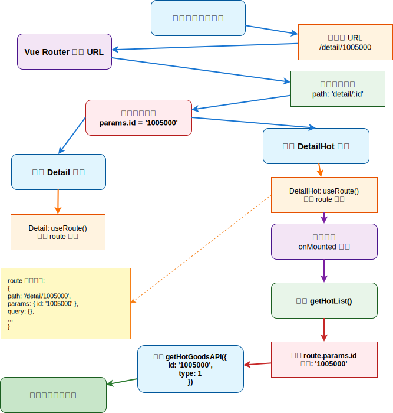

# 商品详情

> **本页关键词**：详情页路由与异步数据 `v-if` 守卫、DetailHot 热榜（`useRoute` 获取参数）、图片预览放大镜（`useMouseInElement`、滑块跟随、反向二倍）、全局组件插件化注册

---

## 一、详情页路由与数据渲染

### 路由配置

详情页需要接收商品 ID，使用动态路由：

```ts
{ path: 'detail/:id', component: Detail }
```

### 数据获取与渲染

数据获取模式与之前一致 — API 层封装、组件层调用。但详情页有一个关键的坑需要注意：

```js
// apis/detail.js
export const getDetailAPI = (id) => {
  return httpInstance({ url: '/goods', params: { id } })
}
```

```vue
<script setup>
import { getDetailAPI } from '@/apis/detail'
import { useRoute } from 'vue-router'

const goods = ref({})
const route = useRoute()
const getGoods = async () => {
  const res = await getDetailAPI(route.params.id)
  goods.value = res.result
}
onMounted(() => getGoods())
</script>
```

### 异步数据的 `v-if` 守卫

**问题**：模板中访问 `goods.categories[1].name` 时，由于数据是异步获取的，首次渲染时 `goods` 还是空对象 `{}`，访问 `categories` 得到 `undefined`，继续访问 `[1]` 就会报错。

**解决思路**：在容器层级使用 `v-if` 确保数据存在后才渲染，同时在嵌套属性访问处使用可选链 `?.` 作为双重保险：

```vue
<div class="container" v-if="goods.details">
  <el-breadcrumb-item :to="{ path: `/category/${goods.categories?.[1].id}` }">
    {{ goods.categories?.[1].name }}
  </el-breadcrumb-item>
</div>
```

> **面试要点**：异步数据渲染时，模板会在数据到达前先执行一次。对于深层嵌套属性的访问（`a.b.c.d`），需要用 `v-if` 保证父对象存在，或用可选链 `?.` 防止中间环节为 undefined。`v-if` 比 `v-show` 更适合这个场景，因为 `v-show` 仍然会执行模板表达式（只是隐藏 DOM），不能阻止报错。

---

## 二、DetailHot 热榜组件



### 设计思路

详情页侧边栏有「24小时热榜」和「周热榜」两个模块，UI 结构相同，只是请求参数不同（`type: 1` vs `type: 2`）。通过 props 的 `hotType` 区分，用 computed 映射标题文本：

```vue
<script setup>
import { getHotGoodsAPI } from '@/apis/detail'
import { useRoute } from 'vue-router'

const props = defineProps({
  hotType: { type: Number }  // 1: 24小时热榜  2: 周热榜
})

const TYPEMAP = { 1: '24小时热榜', 2: '周热榜' }
const title = computed(() => TYPEMAP[props.hotType])

const hotList = ref([])
const route = useRoute()
const getHotList = async () => {
  const res = await getHotGoodsAPI({
    id: route.params.id,   // 当前商品 ID，用于推荐同类热榜
    type: props.hotType
  })
  hotList.value = res.result
}
onMounted(() => getHotList())
</script>
```

使用时传入不同 type 即可渲染不同热榜：

```vue
<DetailHot :hot-type="1" />
<DetailHot :hot-type="2" />
```

**`useRoute` vs `useRouter` 的区别**：
- `useRoute()` 返回当前路由信息（只读），用于**获取**路由参数、query、path 等
- `useRouter()` 返回路由器实例，用于**执行导航操作**（push、replace、go、back）

两者任何组件都可以直接调用，不需要通过 props 传递路由信息。

> **面试要点**：`useRoute()` 返回的是响应式对象，路由参数变化时会自动更新。子组件可以直接通过 `useRoute()` 获取路由参数，而不需要父组件通过 props 层层传递。

---

## 三、图片预览组件（放大镜效果）

这是项目中交互最复杂的组件，分三个 commit 逐步实现：小图切大图 → 滑块跟随鼠标 → 放大镜效果。

### 第一步：小图切大图

点击下方小图列表中的某张图，上方大图区域切换为对应图片。用 `activeIndex` 记录当前选中的索引：

```js
const activeIndex = ref(0)
const enterhandler = (i) => activeIndex.value = i
```

```vue
<li v-for="(img, i) in imageList" :key="i"
  @mouseenter="enterhandler(i)"
  :class="{ active: i === activeIndex }">
  
</li>
```

### 第二步：滑块跟随鼠标

利用 `@vueuse/core` 的 `useMouseInElement` 实时追踪鼠标在图片容器内的坐标。关键尺寸关系：

- 图片容器（middle）：400 × 400
- 半透明蒙层滑块（layer）：200 × 200
- 滑块需要以鼠标为中心显示，所以偏移量 = 鼠标坐标 - 滑块宽度/2

```js
import { useMouseInElement } from '@vueuse/core'

const target = useTemplateRef('target')
const { elementX, elementY, isOutside } = useMouseInElement(target)

const left = ref(0)
const top = ref(0)

watch([elementX, elementY, isOutside], () => {
  if (isOutside.value) return  // 鼠标不在容器内，不处理

  // 滑块居中跟随鼠标（滑块宽 200，容器宽 400）
  // 有效移动范围：鼠标 X 在 100~300 之间时，滑块跟随
  if (elementX.value > 100 && elementX.value < 300)
    left.value = elementX.value - 100
  if (elementY.value > 100 && elementY.value < 300)
    top.value = elementY.value - 100

  // 边界处理：滑块不能移出容器
  if (elementX.value >= 300) left.value = 200  // 右边界
  if (elementX.value <= 100) left.value = 0    // 左边界
  if (elementY.value >= 300) top.value = 200   // 下边界
  if (elementY.value <= 100) top.value = 0     // 上边界
})
```

### 第三步：放大镜效果（反向二倍）

大图区域（large）是 400 × 400 的容器，背景图是 800 × 800 的大图。滑块覆盖的区域正好是原图的 1/4（200/400），大图是原图的 2 倍（800/400），因此 `background-position` 需要**反向移动 2 倍距离**：

```js
const positionX = ref(0)
const positionY = ref(0)

// 在上面的 watch 中追加：
positionX.value = -left.value * 2
positionY.value = -top.value * 2
```

模板中通过动态 style 绑定滑块位置和大图偏移：

```vue
<!-- 半透明蒙层滑块 — 跟随鼠标 -->
<div class="layer" v-show="!isOutside"
  :style="{ left: `${left}px`, top: `${top}px` }" />

<!-- 放大镜大图 — 背景偏移与滑块反向 -->
<div class="large" v-show="!isOutside" :style="{
  backgroundImage: `url(${imageList[activeIndex]})`,
  backgroundPositionX: `${positionX}px`,
  backgroundPositionY: `${positionY}px`,
}" />
```

通过 props 接收图片列表，使组件可在不同场景复用：

```js
defineProps({
  imageList: { type: Array, default: () => [] }
})
```

> **面试要点**：放大镜的数学原理 — 滑块是容器的 1/2 尺寸（200/400），所以滑块最大偏移量 = 容器宽度 - 滑块宽度 = 200px。大图是容器的 2 倍（800/400），所以大图 `background-position` 反向移动 2 倍距离（left=100 → positionX=-200）。`useMouseInElement` 返回的 `elementX/Y` 是鼠标相对元素左上角的坐标，`isOutside` 判断鼠标是否在元素外部。

---

## 四、全局组件插件化注册

### 设计思路

`XtxImageView`（图片预览）和 `XtxSku`（规格选择）在多个页面使用。如果每个使用方都手动 `import`，代码重复且容易遗漏。通过 Vue 插件统一全局注册，任何组件中可以直接使用，无需 import。

```js
// components/index.js
import ImageView from './imageView/index.vue'
import XtxSku from './XtxSku/index.vue'

export const componentPlugin = {
  install (app) {
    app.component('XtxImageView', ImageView)
    app.component('XtxSku', XtxSku)
  }
}
```

```js
// main.ts
import { componentPlugin } from '@/components'
app.use(componentPlugin)
```

注册后任何组件可直接使用 `<XtxImageView />` 和 `<XtxSku />`。

> **面试要点**：`app.use(plugin)` 内部调用 `plugin.install(app)`，是 Vue 的插件注册机制。全局注册适合高频复用组件（减少重复 import），但会使组件无法被 tree-shaking。局部注册适合低频组件（未使用的不会打包）。建议全局组件使用统一前缀（如 `Xtx`）避免与 HTML 原生标签或第三方库冲突。
