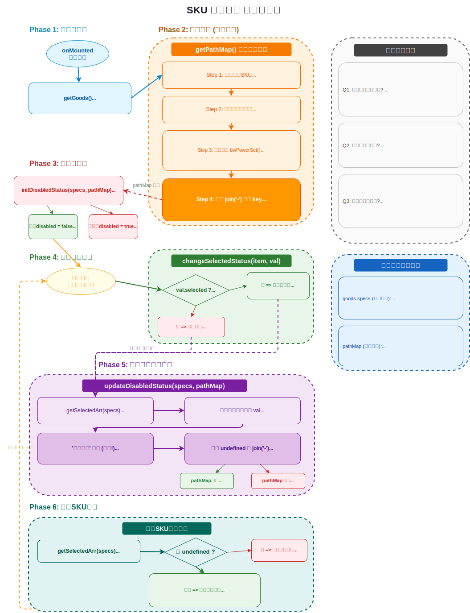

# SKU 组件

> **本页关键词**：SKU 规格选择、排他互斥、幂集算法（位运算枚举子集）、路径字典 PathMap、初始化禁用、组合禁用更新、产出 SKU 数据

---

## 整体思路



SKU（Stock Keeping Unit）规格选择组件是电商项目中复杂度最高的前端组件之一。需要实现三个核心功能：

1. **选中/取消选中**：同一规格行内排他互斥（选「蓝色」则自动取消「红色」）
2. **规格禁用**：根据库存情况和当前已选规格，实时禁用无效组合（如「蓝色+20cm+中国」无库存，则在选了「蓝色+20cm」后，「中国」应被禁用）
3. **产出数据**：所有规格维度都选择完毕后，输出对应的 SKU 对象（含价格、库存、ID），用于加入购物车

**难点**在于第 2 点 — 规格禁用。朴素做法是每次点击后遍历所有 SKU 判断组合是否有效，时间复杂度高。本方案使用**幂集 + 路径字典**将判断降为 O(1) 查找。

---

## 一、选中/取消选中（排他互斥）

逻辑很直接：点击未选中项 → 同行其他项全部取消，当前项选中；点击已选中项 → 直接取消选中。

```js
const changeSku = (item, val) => {
  if (val.selected) {
    val.selected = false       // 已选中 → 取消
  } else {
    item.values.forEach(v => v.selected = false)  // 同行全部取消
    val.selected = true        // 当前项选中
  }
}
```

模板中通过动态 class 控制选中和禁用的样式：

```vue
<template v-for="val in item.values" :key="val.name">
  
  <span v-else
    @click="changeSku(item, val)"
    :class="{ selected: val.selected, disabled: val.disabled }">
    {{ val.name }}
  </span>
</template>
```

---

## 二、规格禁用算法

规格禁用的核心问题：**给定当前已选的规格组合，如何快速判断某个未选规格按钮是否可用？**

整体方案分四步：幂集算法 → 路径字典 → 初始化禁用 → 点击时更新禁用。

### 1. 幂集算法（Power Set）

**目的**：把一个有效 SKU 的规格值数组（如 `['蓝色', '20cm', '中国']`）展开为所有可能的子集组合。

**为什么需要子集**：假设该 SKU 有库存，那么不仅 `'蓝色-20cm-中国'` 这个完整组合是有效的，`'蓝色'`、`'20cm'`、`'蓝色-20cm'` 等子集也都是有效的（说明选了这些部分组合后仍然存在有效的完整 SKU）。

```js
export default function bwPowerSet (originalSet) {
  const subSets = []
  const numberOfCombinations = 2 ** originalSet.length

  for (let combinationIndex = 0; combinationIndex < numberOfCombinations; combinationIndex++) {
    const subSet = []
    for (let setElementIndex = 0; setElementIndex < originalSet.length; setElementIndex++) {
      // 位运算判断：当前数字的第 setElementIndex 位是否为 1
      if (combinationIndex & (1 << setElementIndex)) {
        subSet.push(originalSet[setElementIndex])
      }
    }
    subSets.push(subSet)
  }
  return subSets
}
```

**算法原理**：对于长度为 n 的数组，共有 2^n 个子集。用 0 到 2^n-1 的整数的二进制表示来枚举所有子集 — 每一位对应数组中的一个元素，1 表示包含、0 表示不包含。

例如 `['蓝色', '20cm', '中国']`（n=3）的 8 个子集：

| 二进制 | 十进制 | 子集 |
|--------|--------|------|
| 000 | 0 | `[]` |
| 001 | 1 | `['蓝色']` |
| 010 | 2 | `['20cm']` |
| 011 | 3 | `['蓝色', '20cm']` |
| 100 | 4 | `['中国']` |
| 101 | 5 | `['蓝色', '中国']` |
| 110 | 6 | `['20cm', '中国']` |
| 111 | 7 | `['蓝色', '20cm', '中国']` |

> **面试要点**：幂集的位运算枚举是经典算法。时间复杂度 O(2^n * n)，其中 n 是规格维度数（通常很小，3-5 维）。相比递归实现，位运算无函数调用开销，且代码简洁。

### 2. 路径字典（PathMap）

**核心数据结构**：遍历所有有库存的 SKU，对每个 SKU 的规格值数组求幂集，将每个子集（用 `-` 拼接为字符串）作为 key 存入字典，value 是该子集对应的 SKU ID 列表。

```js
const getPathMap = () => {
  const pathMap = {}
  // 只取有库存的 SKU
  const effectiveSkus = goods.value.skus.filter(sku => sku.inventory > 0)

  effectiveSkus.forEach(sku => {
    const specs = sku.specs.map(spec => spec.valueName)  // ['蓝色', '20cm', '中国']
    const powerSet = bwPowerSet(specs)

    powerSet.forEach(set => {
      const key = set.join('-')
      if (pathMap[key]) {
        pathMap[key].push(sku.id)
      } else {
        pathMap[key] = [sku.id]
      }
    })
  })
  return pathMap
}
```

构建完成后，pathMap 大致长这样：

```
{
  '蓝色': [skuId1, skuId2],
  '20cm': [skuId1],
  '蓝色-20cm': [skuId1],
  '蓝色-20cm-中国': [skuId1],
  '红色': [skuId3],
  ...
}
```

**查找复杂度**：构建 pathMap 的时间是 O(2^k * s)（k=规格维度数，s=有效 SKU 数），但构建完成后每次查找都是 O(1) 的哈希查找。这是典型的「预处理换查询速度」的 trade-off。

### 3. 初始化禁用状态

组件加载时，检查每个规格按钮的 `name` 是否在 pathMap 中存在。存在说明该规格值至少有一个有库存的 SKU 包含它，可选；不存在说明无论怎么组合都没有库存，禁用。

```js
const initDisabledStatus = (specs, pathMap) => {
  specs.forEach(item => {
    item.values.forEach(val => {
      val.disabled = !pathMap[val.name]
    })
  })
}
```

### 4. 组合禁用更新（点击后）

每次用户点击选中/取消某个规格后，需要重新计算所有未选中按钮的禁用状态。

**核心思路**：

1. 获取当前已选规格值数组，未选的位置填 `undefined`，如 `['蓝色', undefined, '中国']`
2. 对于每个未选中的规格按钮，将其 name 放入数组对应位置，得到「假如选了这个按钮」的组合
3. 过滤掉 undefined，拼接为 key，在 pathMap 中查找
4. 找到 → 该按钮可选；找不到 → 禁用

```js
// 获取当前已选值数组
const getSelectedArr = (specs) => {
  const selectedArr = []
  specs.forEach(item => {
    const selectedVal = item.values.find(val => val.selected)
    selectedArr.push(selectedVal ? selectedVal.name : undefined)
  })
  return selectedArr
}

// 更新禁用状态
const updateDisabledStatus = (specs, pathMap) => {
  specs.forEach((item, index) => {
    item.values.forEach(val => {
      const selectedArr = getSelectedArr(specs)
      // 将待判断按钮的 name 放入对应位置
      selectedArr[index] = val.name
      // 过滤 undefined 后拼接为 key
      const key = selectedArr.filter(value => value).join('-')
      // 在路径字典中查找
      val.disabled = !pathMap[key]
    })
  })
}
```

**举例说明**：假设已选 `['蓝色', undefined, undefined]`（只选了颜色），现在要判断尺寸行的「20cm」是否可选：

1. selectedArr = `['蓝色', undefined, undefined]`
2. 放入 '20cm' → `['蓝色', '20cm', undefined]`
3. 过滤 undefined → `['蓝色', '20cm']`
4. key = `'蓝色-20cm'`
5. 在 pathMap 中查找 `'蓝色-20cm'` — 如果存在说明有库存，不禁用

> **面试要点**：SKU 禁用本质是一个**组合可行性判断**问题。路径字典方案通过预计算所有有效子集，将运行时判断从暴力遍历的 O(n*m) 降为 O(1) 的哈希查找。trade-off 是初始化时需要 O(2^k * s) 的预处理时间和空间（k 通常很小，3-5 维，所以 2^k 最多 32，完全可以接受）。

---

## 三、产出 SKU 数据

当所有规格维度都已选择时（selectedArr 中没有 undefined），拼接完整 key 在 pathMap 中查找对应的 SKU ID，再从原始数据中找到完整的 SKU 对象（含价格、库存等），用于后续的加入购物车操作。

```js
const changeSku = (item, val) => {
  // ... 选中/取消逻辑（见上文）

  // 更新禁用状态
  updateDisabledStatus(goods.value.specs, pathMap)

  // 判断是否所有维度都已选择
  const selectedValues = getSelectedArr(goods.value.specs)
  const isComplete = selectedValues.every(v => v !== undefined)

  if (isComplete) {
    const key = selectedValues.join('-')
    const skuIds = pathMap[key]
    const skuObj = goods.value.skus.find(item => item.id === skuIds[0])
    // skuObj 包含 price / inventory / id 等信息，可以传给购物车
  }
}
```

**完整数据流**：用户点击规格按钮 → `changeSku` → 更新选中状态 → `updateDisabledStatus` 重算禁用 → 检查是否完整选择 → 是则产出 SKU 对象（含价格、库存）→ 外层组件可用于展示价格和加入购物车。
