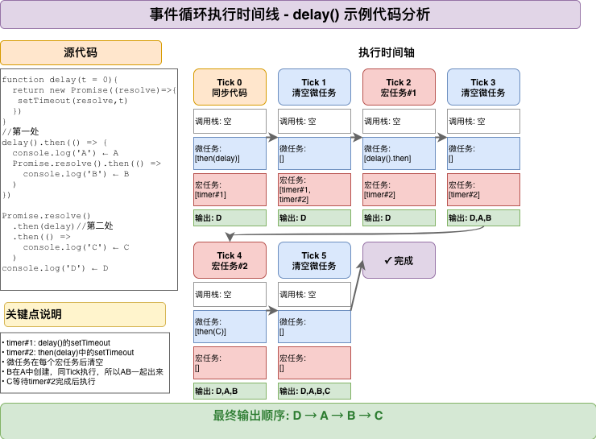

# 课程笔记：JavaScript事件循环机制



## 一、事件循环基础

### 核心概念
JavaScript是单线程语言，同一时间只能执行一个任务。事件循环（Event Loop）是JavaScript在单线程环境下实现"异步并发"的调度机制，通过协调调用栈、Web APIs、任务队列来管理代码执行顺序。

事件循环由四个核心组件构成：调用栈负责执行同步代码，Web APIs提供异步能力，宏任务队列存放setTimeout等回调，微任务队列存放Promise.then等回调。理解这四者的协作关系是掌握异步编程的关键。

**核心组件**：
- **调用栈（Call Stack）**：执行同步代码，遵循"后进先出"原则
- **Web APIs**：提供定时器、DOM事件、网络请求等异步能力
- **宏任务队列**：存放setTimeout、DOM事件等回调
- **微任务队列**：存放Promise.then、queueMicrotask等回调

### 关键代码

**调用栈工作示例：**
```js
function first() {
  console.log('1');
  second();
  console.log('3');
}
function second() {
  console.log('2');
}
first();
// 输出顺序: 1 → 2 → 3
// 调用栈: first() 入栈 → second() 入栈 → second() 出栈 → first() 出栈
```

**事件循环流程：**
```
┌─────────────────────────┐
│  1. 执行同步代码         │
│     (直到调用栈为空)     │
└───────────┬─────────────┘
            ↓
┌─────────────────────────┐
│  2. 清空所有微任务       │
│     (Promise.then 等)    │  ←─┐
└───────────┬─────────────┘    │
            ↓                  │
┌─────────────────────────┐    │
│  3. 执行一个宏任务       │    │
│     (setTimeout 等)      │    │
└───────────┬─────────────┘    │
            │                  │
            └──────────────────┘
            不断重复循环
```

这段流程展示了事件循环的核心机制：同步代码先执行，然后清空所有微任务，接着取一个宏任务执行，执行完再清空微任务，如此循环往复。

### 📝 要点测验

<details>
<summary>宏任务和微任务的区别是什么？常见的宏任务和微任务有哪些？</summary>

**核心区别：**

**宏任务（Macrotask）：**
- 每次事件循环**只执行一个**宏任务
- 常见类型：`setTimeout`、`setInterval`、DOM事件回调、I/O回调、`setImmediate`(Node.js)

**微任务（Microtask）：**
- 每次事件循环会**清空所有**微任务
- 常见类型：`Promise.then`、`Promise.catch`、`Promise.finally`、`queueMicrotask`、`MutationObserver`、`async/await`后续代码

**执行优先级：**
```
同步代码 > 微任务 > 宏任务
```

**示例对比：**
```js
console.log('1');  // 同步

setTimeout(() => {
  console.log('2');  // 宏任务
}, 0);

Promise.resolve().then(() => {
  console.log('3');  // 微任务
});

console.log('4');  // 同步

// 输出顺序: 1 → 4 → 3 → 2
```

**面试要点：**
- 微任务优先级高于宏任务，每个宏任务执行完立即清空所有微任务
- 微任务中产生的新微任务会在当前轮次继续执行
- 宏任务每次只执行一个，下一个宏任务要等微任务清空后才执行
</details>

<details>
<summary>为什么微任务优先级比宏任务高？这样设计的好处是什么？</summary>

**设计原因：**

**1. 保证Promise回调的及时性**
```js
fetch('/api/data')
  .then(data => {
    // 微任务，能尽快执行
    updateUI(data);
  });

setTimeout(() => {
  // 宏任务，可能被延后
  console.log('timeout');
}, 0);
```

**2. 避免UI阻塞**
- 微任务执行时间短，快速处理完毕
- 宏任务可能耗时较长，逐个执行避免卡顿

**3. 符合开发者预期**
```js
Promise.resolve()
  .then(() => console.log('A'))
  .then(() => console.log('B'));

setTimeout(() => console.log('C'), 0);

// 输出: A → B → C
// Promise链式调用连续执行，符合预期
```

**实际好处：**
- 数据处理更及时：API响应后立即更新状态
- 避免竞态条件：相关的Promise回调连续执行
- 性能优化：批量处理微任务，减少渲染次数

**浏览器渲染时机：**
- 渲染发生在微任务清空后、下一个宏任务前
- 多个DOM操作在微任务中执行，只触发一次渲染
</details>

## 二、Promise与异步任务

### 核心概念
Promise是处理异步操作的标准方案，有三种状态：pending（进行中）、fulfilled（已成功）、rejected（已失败）。理解Promise的状态转换和.then()的执行时机是掌握事件循环的关键。

`.then()`的回调永远是异步的，即使Promise已经是fulfilled状态，回调也会被放入微任务队列，而不是立即执行。这保证了代码的可预测性，避免同步和异步混合导致的bug。

Promise链式调用中，每个`.then()`都返回新的Promise，多个`.then()`会依次将回调加入微任务队列，在同一轮事件循环中连续执行。

### 关键代码

**Promise三种状态：**
```js
// 1. Pending (进行中) - 初始状态
const p1 = new Promise((resolve, reject) => {
  // 还未调用 resolve 或 reject
});

// 2. Fulfilled (已成功) - resolve 被调用
const p2 = Promise.resolve('成功');

// 3. Rejected (已失败) - reject 被调用
const p3 = Promise.reject('失败');
```

**Promise.then执行时机：**
```js
console.log('1');

Promise.resolve().then(() => {
  console.log('2');  // 微任务，稍后执行
});

console.log('3');
// 输出: 1 → 3 → 2
```

**Promise链式调用：**
```js
Promise.resolve()
  .then(() => {
    console.log('第一个 then');
    return 'hello';
  })
  .then((value) => {
    console.log('第二个 then:', value);
  });
```

Promise.resolve()创建已完成的Promise，但.then()回调不会立即执行，而是进入微任务队列。同步代码执行完后，事件循环才会处理微任务。

### 📝 要点测验

<details>
<summary>Promise.then()为什么是异步的？即使Promise已经fulfilled也不会立即执行吗？</summary>

**核心原因：保证行为一致性**

**1. 避免同步/异步混合：**
```js
// 如果Promise.then可能同步执行，会导致混乱
function getData(useCache) {
  if(useCache) {
    return Promise.resolve(cachedData);  // 已fulfilled
  } else {
    return fetch('/api');  // pending
  }
}

getData(true).then(data => {
  console.log(data);  // 是同步还是异步？不确定！
});
console.log('after');
```

**2. 统一为异步执行：**
```js
// 实际情况：.then()永远异步
const p = Promise.resolve('data');
p.then(data => {
  console.log('Promise:', data);  // 微任务，总是异步
});
console.log('同步代码');

// 输出: 同步代码 → Promise: data
// 行为可预测！
```

**3. 防止栈溢出：**
```js
// 如果同步执行，可能导致栈溢出
function recursivePromise(n) {
  if(n === 0) return Promise.resolve();
  return Promise.resolve().then(() => recursivePromise(n - 1));
}

recursivePromise(10000);  // 如果同步会栈溢出，异步则正常
```

**规范要求：**
- Promise/A+规范明确要求：`.then()`回调必须异步执行
- 即使Promise已经settled（fulfilled或rejected）
- 回调也必须在当前调用栈清空后才执行

**面试要点：**
- 保证代码行为的一致性和可预测性
- 避免同步异步混合导致的bug
- 符合Promise/A+规范要求
</details>

<details>
<summary>async/await与Promise.then有什么区别？在事件循环中如何执行？</summary>

**本质关系：**
async/await是Promise的语法糖，await后面的代码相当于Promise.then()中的代码。

**等价转换：**
```js
// async/await写法
async function example() {
  console.log('A');
  await Promise.resolve();
  console.log('B');
  console.log('C');
}

// 等价于Promise写法
function example() {
  console.log('A');
  Promise.resolve().then(() => {
    console.log('B');
    console.log('C');
  });
}
```

**执行时机：**
```js
console.log('1');

async function test() {
  console.log('2');
  await Promise.resolve();
  console.log('3');  // await后的代码 = 微任务
}

test();

Promise.resolve().then(() => {
  console.log('4');  // 微任务
});

console.log('5');

// 输出: 1 → 2 → 5 → 3 → 4
```

**关键点：**
1. **await之前的代码**：同步执行
2. **await表达式**：如果是Promise，等待其完成
3. **await之后的代码**：作为微任务执行

**多个await的情况：**
```js
async function multi() {
  console.log('A');
  await Promise.resolve();
  console.log('B');  // 微任务1
  await Promise.resolve();
  console.log('C');  // 微任务2（在B执行后才加入队列）
}
```

**错误处理：**
```js
// Promise方式
fetch('/api')
  .then(data => console.log(data))
  .catch(error => console.error(error));

// async/await方式
async function fetchData() {
  try {
    const data = await fetch('/api');
    console.log(data);
  } catch(error) {
    console.error(error);
  }
}
```

**优势对比：**
- async/await代码更像同步，可读性更好
- 错误处理可以用try-catch，更直观
- 调试更方便，可以直接断点在await处
- 本质仍是Promise，执行机制完全相同
</details>

## 三、完整示例代码分析

### 核心概念
通过实际代码执行分析，能够深入理解事件循环的完整流程。下面的示例包含了Promise、setTimeout、微任务、宏任务的综合运用，展示了代码在事件循环各个阶段的状态变化。

理解示例的关键在于：追踪每个异步任务何时创建、何时进入队列、何时执行。需要特别注意timer#1和timer#2是两个独立的setTimeout，A和B虽然输出时间接近但执行逻辑不同。

执行分析按时间轴分为6个阶段：同步代码执行、清空微任务、执行第一个宏任务、再次清空微任务、执行第二个宏任务、最后清空微任务。掌握这个流程就能分析任何复杂的异步代码。

### 关键代码
```js
function delay(duration = 0) {
  return new Promise((resolve) => {
    setTimeout(resolve, duration)
  })
}

/* 情况一：直接调用 delay() 之后的 then */
delay().then(() => {
  console.log('【A】我是 delay().then 里的打印')
  Promise.resolve().then(() => {
    console.log('【B】我是 A 里面 Promise.then 的打印')
  })
})

/* 情况二：Promise.resolve().then(delay) 这条链 */
Promise.resolve()
  .then(delay)
  .then(() => {
    console.log('【C】我是 Promise.then(delay) 后面的打印')
  })

/* 同步代码 */
console.log('【D】我是最外层同步打印')

// 最终输出：D → A → B → C
```

代码执行分为6个阶段：同步代码执行输出D，清空微任务（调用delay创建timer#2），执行宏任务timer#1，清空微任务（输出A和B），执行宏任务timer#2，最后清空微任务输出C。关键点是A和B在同一轮微任务中连续执行。

### 📝 要点测验

<details>
<summary>为什么输出顺序是 D → A → B → C？请详细分析每个阶段的执行过程。</summary>

**完整执行流程：**

**阶段0 - 同步代码执行：**
1. 定义delay函数
2. 执行`delay()`：创建Promise，`setTimeout(resolve, 0)`回调进入宏任务队列（**timer#1**）
3. 注册`.then(...)`：等待timer#1完成
4. 执行`Promise.resolve()`：创建已完成的Promise
5. 执行`.then(delay)`：因为Promise已完成，回调立即进入**微任务队列**
6. 执行`console.log('D')`：**输出 D** ✅

**此时队列状态：**
- 微任务队列：`[then(delay)]`
- 宏任务队列：`[timer#1]`

---

**阶段1 - 清空微任务：**
7. 取出并执行微任务`then(delay)`
8. 调用`delay()`：创建新Promise，`setTimeout(resolve, 0)`回调进入宏任务队列（**timer#2**）
9. 返回pending Promise，`.then(() => console.log('C'))`等待

**此时队列状态：**
- 微任务队列：`[]`（已清空）
- 宏任务队列：`[timer#1, timer#2]`

---

**阶段2 - 执行第一个宏任务：**
10. 取出并执行**timer#1**
11. 调用`resolve()`，Promise状态变为fulfilled
12. `delay().then(...)`的回调进入**微任务队列**

**此时队列状态：**
- 微任务队列：`[delay().then的回调]`
- 宏任务队列：`[timer#2]`

---

**阶段3 - 清空微任务（关键阶段）：**
13. 取出并执行`delay().then`的回调
14. 执行`console.log('A')`：**输出 A** ✅
15. 执行`Promise.resolve().then(...)`，回调进入**微任务队列**
16. **继续清空微任务**：取出并执行刚添加的回调
17. 执行`console.log('B')`：**输出 B** ✅

**关键点：A和B在同一轮微任务清空中连续执行！**

**此时队列状态：**
- 微任务队列：`[]`（已清空）
- 宏任务队列：`[timer#2]`

---

**阶段4 - 执行第二个宏任务：**
18. 取出并执行**timer#2**
19. 调用`resolve()`，Promise状态变为fulfilled
20. `.then(() => console.log('C'))`的回调进入**微任务队列**

**此时队列状态：**
- 微任务队列：`[C的回调]`
- 宏任务队列：`[]`

---

**阶段5 - 最后清空微任务：**
21. 取出并执行C的回调
22. 执行`console.log('C')`：**输出 C** ✅

**最终输出：D → A → B → C** 🎯

---

**为什么是这个顺序：**
- **D最先**：同步代码立即执行
- **A、B在C之前**：timer#1先于timer#2进入队列，先执行
- **B紧跟A**：B是A中创建的微任务，同一轮清空
- **C最后**：依赖timer#2完成
</details>

<details>
<summary>如果将 delay(duration = 0) 改为 delay(duration = 100)，输出顺序会改变吗？</summary>

**答案：不会改变，输出顺序依然是 D → A → B → C**

**原因分析：**

虽然延迟时间变长，但执行逻辑没有改变：
- timer#1 和 timer#2 都是 100ms 延迟
- timer#1 先创建，先进入宏任务队列
- timer#1 先执行（约100ms后），输出A和B
- timer#2 后执行（约100ms后），输出C

**时间线对比：**

```js
// duration = 0 的情况
0ms:    输出D
1ms:    输出A、B（timer#1完成）
2ms:    输出C（timer#2完成）

// duration = 100 的情况
0ms:    输出D
100ms:  输出A、B（timer#1完成）
100ms:  输出C（timer#2完成，几乎同时）
```

**关键点：**
1. 两个timer的延迟时间相同
2. timer#1先创建，大约先完成
3. 相对顺序不变

**实际测试：**
```js
function delay(duration = 100) {
  return new Promise((resolve) => {
    setTimeout(resolve, duration)
  })
}

// ... 其余代码不变

// 输出仍然是: D → A → B → C
// 只是时间间隔变长了
```

**特殊情况：**
如果给timer#2更短的延迟，可能改变顺序：
```js
delay(100).then(...)  // timer#1: 100ms

Promise.resolve()
  .then(() => delay(50))  // timer#2: 50ms
  .then(...)

// 此时C可能在A、B之前输出
```
</details>

<details>
<summary>面试题：如何判断任意异步代码的执行顺序？有什么通用方法？</summary>

**通用分析方法 - 三步法：**

**第1步：标记同步代码**
```js
console.log('1');  // 同步 ✅
const p = Promise.resolve();  // 同步 ✅
setTimeout(() => {...}, 0);  // 同步调用，但回调是宏任务
console.log('2');  // 同步 ✅
```

**第2步：找出微任务**
- `Promise.then/catch/finally`
- `queueMicrotask`
- `async`函数中`await`之后的代码
- `MutationObserver`

**第3步：找出宏任务**
- `setTimeout/setInterval`
- DOM事件回调
- I/O回调
- `setImmediate`(Node.js)

**分析示例：**
```js
console.log('1');  // 标记：同步

setTimeout(() => {
  console.log('2');  // 标记：宏任务1
  Promise.resolve().then(() => {
    console.log('3');  // 标记：微任务（宏任务1产生）
  });
}, 0);

Promise.resolve().then(() => {
  console.log('4');  // 标记：微任务
  setTimeout(() => {
    console.log('5');  // 标记：宏任务2（微任务产生）
  }, 0);
});

console.log('6');  // 标记：同步
```

**执行顺序推导：**
1. **同步代码**：1、6
2. **第一轮微任务**：4（并添加宏任务2）
3. **第一个宏任务**：2（并添加微任务）
4. **第二轮微任务**：3
5. **第二个宏任务**：5

**输出：1 → 6 → 4 → 2 → 3 → 5** ✅

**记忆口诀：**
```
同步先行，栈空检微
微任务尽，取一宏执
宏执毕再清微，循环往复
```

**进阶技巧：**
- 画时间轴图，标注每个阶段的队列状态
- 注意微任务中产生的新微任务会继续执行
- 注意宏任务中产生的微任务在下一轮清空
- 使用Chrome DevTools的Performance面板验证

**面试加分项：**
- 提到浏览器渲染时机（微任务后、宏任务前）
- 说明Node.js的差异（process.nextTick优先级）
- 举例说明实际应用场景（防抖节流、批量更新）
</details>

## 四、常见面试题与实战技巧

### 核心概念
掌握事件循环的理论后，需要通过实战练习来巩固。常见面试题通常包含多层嵌套的Promise、setTimeout、async/await组合，考察对执行顺序的精准判断能力。

实用技巧的核心是"三步分析法"：先标记同步代码，再找出微任务，最后找出宏任务。按照事件循环规则逐步推导，就能准确判断任何复杂代码的执行顺序。

浏览器和Node.js的事件循环有差异：浏览器在微任务后可能触发渲染，Node.js有多个阶段且`process.nextTick`优先级最高。实际开发中需要根据运行环境选择合适的异步方案。

### 关键代码

**经典面试题：**
```js
console.log('1');

setTimeout(() => {
  console.log('2');
  Promise.resolve().then(() => {
    console.log('3');
  });
}, 0);

Promise.resolve().then(() => {
  console.log('4');
  setTimeout(() => {
    console.log('5');
  }, 0);
});

console.log('6');

// 输出顺序：1 → 6 → 4 → 2 → 3 → 5
```

**执行分析：**
1. 同步代码：输出1、6
2. 第一轮微任务：输出4（并添加新的setTimeout）
3. 第一个宏任务：输出2（并添加微任务）
4. 第二轮微任务：输出3
5. 第二个宏任务：输出5

**调试追踪代码：**
```js
console.log('[同步] 开始');

setTimeout(() => {
  console.log('[宏任务] setTimeout');
}, 0);

Promise.resolve().then(() => {
  console.log('[微任务] Promise.then');
});

console.log('[同步] 结束');

// 输出: [同步] 开始 → [同步] 结束 → [微任务] Promise.then → [宏任务] setTimeout
```

通过给日志添加标签，能清晰看到代码在事件循环中的执行位置。这种方法在调试复杂异步逻辑时非常有效。

### 📝 要点测验

<details>
<summary>浏览器和 Node.js 的事件循环有什么差异？如何影响代码执行？</summary>

**核心差异：**

**1. 事件循环阶段：**

**浏览器：**
- 简化的事件循环模型
- 执行一个宏任务 → 清空所有微任务 → （可能渲染）→ 下一个宏任务

**Node.js：**
- 多阶段事件循环
- 6个阶段：timers → pending callbacks → idle/prepare → poll → check → close callbacks
- 每个阶段有自己的任务队列

**2. process.nextTick（Node.js特有）：**
```js
// Node.js环境
console.log('1');

Promise.resolve().then(() => {
  console.log('2');  // 微任务
});

process.nextTick(() => {
  console.log('3');  // nextTick队列，优先级最高
});

console.log('4');

// 输出: 1 → 4 → 3 → 2
// nextTick优先于Promise.then！
```

**3. setImmediate vs setTimeout：**
```js
// Node.js环境
setTimeout(() => {
  console.log('timeout');
}, 0);

setImmediate(() => {
  console.log('immediate');
});

// 执行顺序不确定，取决于进入事件循环的时机
// 在I/O回调中，setImmediate总是先执行
```

**4. 浏览器渲染时机：**
```js
// 浏览器环境
console.log('start');

setTimeout(() => {
  console.log('timeout');
  // 执行后可能触发渲染
}, 0);

Promise.resolve().then(() => {
  console.log('promise');
  // 微任务执行完后可能触发渲染
});

// 渲染时机：微任务清空后、下一个宏任务前
```

**5. 微任务处理差异：**
```js
// Node.js会在每个阶段之间清空微任务
// 浏览器在每个宏任务后清空微任务
```

**实际影响：**
- Node.js的nextTick可能导致事件循环饥饿
- setImmediate在Node.js中更可预测
- 浏览器需要考虑渲染性能
- 跨平台代码需要测试两种环境

**最佳实践：**
- 优先使用Promise而非nextTick
- 避免依赖setTimeout和setImmediate的顺序
- 大量DOM操作放在微任务中批量处理
</details>

<details>
<summary>如何使用 Chrome DevTools 调试事件循环？</summary>

**方法1：Performance面板**

**步骤：**
1. 打开Chrome DevTools（F12）
2. 切换到Performance面板
3. 点击录制按钮（圆形）
4. 执行你的代码
5. 停止录制
6. 查看Main线程的时间线

**查看内容：**
```
Main线程时间线：
├─ Task (宏任务)
│  ├─ Run Microtasks (微任务)
│  └─ 其他操作
├─ Task (下一个宏任务)
│  └─ Run Microtasks
└─ ...
```

**优势：**
- 可视化展示任务执行顺序
- 查看每个任务的耗时
- 发现性能瓶颈

---

**方法2：Console日志追踪**

```js
function log(msg, type = 'sync') {
  const colors = {
    sync: 'color: blue',
    micro: 'color: green', 
    macro: 'color: red'
  };
  console.log(`%c[${type}] ${msg}`, colors[type]);
}

log('同步代码1', 'sync');

setTimeout(() => {
  log('setTimeout回调', 'macro');
}, 0);

Promise.resolve().then(() => {
  log('Promise.then回调', 'micro');
});

log('同步代码2', 'sync');
```

---

**方法3：使用debugger断点**

```js
console.log('1');

setTimeout(() => {
  debugger;  // 断点1：宏任务执行时
  console.log('2');
}, 0);

Promise.resolve().then(() => {
  debugger;  // 断点2：微任务执行时
  console.log('3');
});

console.log('4');
```

**调试技巧：**
- 在关键位置设置断点
- 查看Call Stack（调用栈）
- 单步执行查看执行顺序

---

**方法4：Async Stack Traces**

```js
// Chrome DevTools Settings → Experiments
// 启用 "Capture async stack traces"

async function example() {
  await fetch('/api');  // 异步调用
  throw new Error('test');  // 错误会显示完整异步调用栈
}
```

**优势：**
- 查看异步操作的完整调用链
- 更容易定位异步代码的问题

---

**方法5：使用queueMicrotask观察**

```js
console.log('start');

queueMicrotask(() => {
  console.log('microtask 1');
});

queueMicrotask(() => {
  console.log('microtask 2');
});

console.log('end');

// 输出: start → end → microtask 1 → microtask 2
```

**实用工具：**
- Loupe可视化工具：http://latentflip.com/loupe/
- 在线模拟事件循环过程
- 适合教学和学习
</details>

<details>
<summary>实际开发中如何利用事件循环优化性能？</summary>

**优化场景1：批量DOM操作**

**❌ 低效写法：**
```js
for(let i = 0; i < 1000; i++){
  const div = document.createElement('div');
  div.textContent = i;
  document.body.appendChild(div);
  // 每次appendChild可能触发重排
}
```

**✅ 优化写法：**
```js
// 方法1：使用DocumentFragment
const fragment = document.createDocumentFragment();
for(let i = 0; i < 1000; i++){
  const div = document.createElement('div');
  div.textContent = i;
  fragment.appendChild(div);
}
document.body.appendChild(fragment);  // 只触发一次重排

// 方法2：使用微任务批量处理
let pendingUpdates = [];

function scheduleUpdate(update){
  pendingUpdates.push(update);
  if(pendingUpdates.length === 1){
    queueMicrotask(() => {
      const updates = pendingUpdates;
      pendingUpdates = [];
      // 批量执行所有更新
      updates.forEach(fn => fn());
    });
  }
}
```

---

**优化场景2：防止阻塞主线程**

**❌ 阻塞写法：**
```js
function heavyTask(){
  for(let i = 0; i < 1000000000; i++){
    // 长时间计算，阻塞页面
  }
}

button.onclick = heavyTask;  // 点击后页面卡死
```

**✅ 优化写法：**
```js
// 分片处理
function heavyTask(onProgress, onComplete){
  let i = 0;
  const total = 1000000000;
  const chunkSize = 10000000;
  
  function processChunk(){
    const end = Math.min(i + chunkSize, total);
    for(; i < end; i++){
      // 处理数据
    }
    
    onProgress(i / total * 100);
    
    if(i < total){
      setTimeout(processChunk, 0);  // 让出控制权
    } else {
      onComplete();
    }
  }
  
  processChunk();
}

button.onclick = () => {
  heavyTask(
    progress => console.log(`进度: ${progress}%`),
    () => console.log('完成')
  );
};
```

---

**优化场景3：使用requestIdleCallback**

```js
// 在浏览器空闲时执行低优先级任务
function lowPriorityTask(){
  requestIdleCallback((deadline) => {
    while(deadline.timeRemaining() > 0 && tasks.length > 0){
      const task = tasks.shift();
      task();
    }
    
    if(tasks.length > 0){
      lowPriorityTask();  // 继续处理剩余任务
    }
  });
}
```

---

**优化场景4：防抖和节流**

**防抖（利用宏任务）：**
```js
function debounce(fn, delay){
  let timer;
  return function(...args){
    clearTimeout(timer);
    timer = setTimeout(() => {
      fn.apply(this, args);
    }, delay);
  };
}

// 搜索框输入
input.addEventListener('input', debounce((e) => {
  searchAPI(e.target.value);
}, 300));
```

**节流（利用时间戳）：**
```js
function throttle(fn, interval){
  let lastTime = 0;
  return function(...args){
    const now = Date.now();
    if(now - lastTime >= interval){
      lastTime = now;
      fn.apply(this, args);
    }
  };
}

// 滚动事件
window.addEventListener('scroll', throttle(() => {
  console.log('scroll');
}, 100));
```

---

**优化场景5：Vue/React的批量更新**

**Vue的nextTick：**
```js
// Vue内部使用微任务批量更新DOM
this.message = 'new value';
this.$nextTick(() => {
  // DOM已更新
  console.log(this.$el.textContent);
});
```

**React的批量更新：**
```js
// React自动批量更新state
this.setState({count: 1});
this.setState({count: 2});
this.setState({count: 3});
// 只会触发一次渲染，count为3
```

---

**性能优化总结：**
- ✅ 批量DOM操作，减少重排重绘
- ✅ 长任务分片，避免阻塞主线程
- ✅ 使用requestIdleCallback处理低优先级任务
- ✅ 防抖节流减少频繁调用
- ✅ 利用框架的批量更新机制

**面试要点：**
- 理解浏览器渲染时机（微任务后）
- 掌握任务分片技术
- 了解requestIdleCallback和requestAnimationFrame
- 说明实际项目中的优化案例
</details>

---

## 五、课程总结

### 核心要点
通过本课程学习，你已经掌握了JavaScript事件循环的完整机制。事件循环是JavaScript异步编程的基石，理解它能帮助你写出更高效、更可预测的代码。

**核心知识点：**
- **执行优先级**：同步代码 > 微任务 > 宏任务
- **队列特点**：微任务一次性清空所有，宏任务每次只执行一个
- **Promise关键点**：`.then()`回调永远异步，进入微任务队列
- **setTimeout陷阱**：`setTimeout(fn, 0)`不是立即执行，是宏任务
- **记忆口诀**：同步先行，栈空检微；微任务尽，取一宏执；宏执毕再清微，循环往复

**面试要点：**
- 能准确分析包含Promise、setTimeout、async/await的复杂代码执行顺序
- 理解浏览器和Node.js事件循环的差异
- 掌握性能优化技巧：批量DOM操作、任务分片、防抖节流
- 了解实际框架（Vue/React）如何利用事件循环优化性能

**实践建议：**
1. 多做执行顺序分析练习，培养条件反射
2. 使用Chrome DevTools验证自己的分析
3. 在实际项目中应用性能优化技巧
4. 阅读Vue/React源码，学习框架的异步更新策略

**进阶学习：**
- 深入学习浏览器渲染机制（重排、重绘）
- 研究Web Worker和Service Worker
- 了解React Fiber的调度机制
- 学习Node.js的libuv事件循环实现
