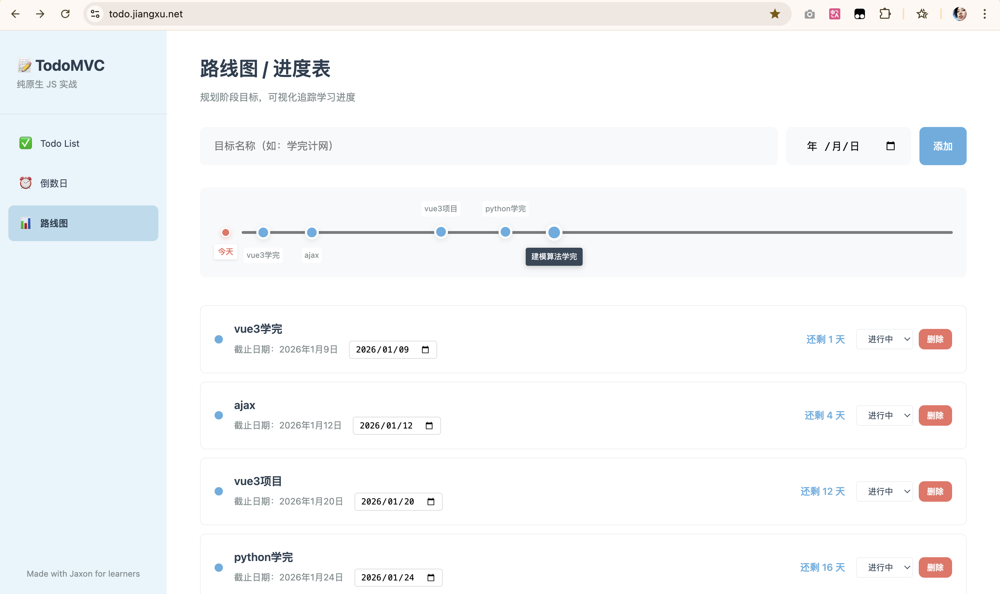

# 🎯 从零到一！纯原生JavaScript实战TodoMVC完整教程（附Vue对比版本）

> 💡 一个专为前端零基础/刚入门学习者设计的手把手教学项目
>
> 作者：Jaxon | 个人主页：[www.jiangxu.net](http://www.jiangxu.net)
>**项目在线体验**： [todo.jiangxu.net](todo.jiangxu.net)
>**GitHub 仓库**：[https://github.com/Jaxon1216/todomvc-vanillajs](https://github.com/Jaxon1216/todomvc-vanillajs)

---

## 📌 写在前面

你是否在学完 HTML、CSS、JavaScript 基础语法后，不知道如何进阶？

你是否想深入理解 DOM 操作、事件处理、数据管理，但找不到合适的实战项目？

你是否准备学习 Vue/React 框架，但担心原生 JS 基础不够扎实？

**如果你有以上困惑，这个项目就是为你准备的！**

---

## 🎯 项目简介

这是一个**完全开源、零门槛**的前端教学项目，通过实现一个功能完整的多模块 TodoMVC 应用，手把手带你掌握前端三件套（HTML/CSS/JavaScript）的核心技能。

### ✨ 项目亮点

- ✅ **100% 纯原生实现** - 不使用任何框架和第三方库
- ✅ **代码已完整实现** - 可以直接运行使用，也可以跟着教程从零写起
- ✅ **详细教程文档** - 每一行代码都有注释和说明，共 4 篇教程
- ✅ **配套检测手册** - 77 道自测题，检验学习成果
- ✅ **全响应式设计** - 支持桌面端、平板、手机全平台
- ✅ **Vue 版本开发中** - 即将推出对比版本，适合学习框架思维

### 📦 项目地址
**项目在线体验**： [todo.jiangxu.net](todo.jiangxu.net)
**GitHub 仓库**：[https://github.com/Jaxon1216/todomvc-vanillajs](https://github.com/Jaxon1216/todomvc-vanillajs)
**作者主页**：[www.jiangxu.net](http://www.jiangxu.net)

---
### 效果图

---

## 🎨 功能展示

项目包含 3 个完整的功能模块：

### 1️⃣ Todo List - 待办事项管理

- ✅ 添加/删除/标记完成
- ✅ 筛选显示（全部/未完成/已完成）
- ✅ 数据持久化（localStorage）
- ✅ 实时计数

### 2️⃣ 倒数日 - 重要日期提醒

- ⏰ 添加事件名称和目标日期
- ⏰ 自动计算剩余天数
- ⏰ 区分过期/今天/未来状态
- ⏰ 支持修改和删除

### 3️⃣ 路线图 - 学习进度追踪

- 📊 可视化时间轴布局
- 📊 里程碑动态渲染
- 📊 状态管理（进行中/已完成/已取消）
- 📊 日期修改自动重算

---

## 📚 你能学到什么？

### 基础篇：Todo List（4-6小时）

**核心知识点：**
- HTML5 语义化标签的正确使用
- CSS Flex 布局从入门到精通
- DOM 元素获取和操作
- **事件绑定与事件委托**（重点！）
- localStorage 数据持久化
- 数组方法的实战应用（`push`、`filter`、`find`、`forEach`）
- XSS 安全防护

**你将掌握：**
```javascript
// 事件委托处理动态元素
todoList.addEventListener('click', function(event) {
    const target = event.target;
    const todoItem = target.closest('.todo-item');
    const todoId = parseInt(todoItem.getAttribute('data-id'));
    
    if (target.classList.contains('todo-delete')) {
        deleteTodo(todoId);
    }
});
```

### 进阶篇 1：倒数日（2-3小时）

**核心知识点：**
- Date 对象的深入使用
- 时间戳差值计算
- `setInterval` 定时器
- 日期格式化
- 数组排序

**你将掌握：**
```javascript
// 精准计算剩余天数
function calculateDaysRemaining(dateString) {
    const today = new Date();
    today.setHours(0, 0, 0, 0);
    
    const targetDate = new Date(dateString);
    targetDate.setHours(0, 0, 0, 0);
    
    const timeDiff = targetDate.getTime() - today.getTime();
    const daysDiff = Math.ceil(timeDiff / (1000 * 60 * 60 * 24));
    
    return daysDiff;
}
```

### 进阶篇 2：路线图（3-4小时）

**核心知识点：**
- CSS 定位（relative/absolute）
- 动态样式计算
- 多状态管理
- 复杂 DOM 联动更新
- 时间轴可视化

**你将掌握：**
```javascript
// 动态计算节点在时间轴上的位置
const position = ((mDate - minDate) / (maxDate - minDate)) * 100;
node.style.left = position + '%';
```

### 进阶篇 3：响应式布局（1-2小时）

**核心知识点：**
- CSS 媒体查询（Media Queries）
- 三档断点设计（桌面/平板/手机）
- Flexbox 响应式应用
- 移动端 UI 优化

---

## 🎓 适合谁学习？

✅ **前端零基础学习者** - 跟着教程从第一行代码开始写

✅ **学过基础语法的同学** - 通过实战项目巩固知识

✅ **准备学 Vue/React 的同学** - 先打好原生 JS 基础（Vue 对比版即将推出！）

✅ **想转前端的后端开发者** - 系统学习前端技术栈

---

## 🚀 如何开始？

### 方式一：直接体验（推荐先看效果）

```bash
# 克隆项目
git clone https://github.com/Jaxon1216/todomvc-vanillajs.git
cd todomvc-vanillajs

# 用浏览器打开 index.html
# 双击文件或右键选择"用浏览器打开"
```

### 方式二：跟着教程学习（推荐）

1. **阅读基础篇教程**：`docs/basic.md`
2. **参考源码**：`app.js`、`style.css`、`index.html`
3. **边学边写**：理解每一行代码的作用
4. **完成自测**：`docs/quiz.md` 包含 77 道检测题

### 方式三：视频讲解（计划中）

正在录制配套视频教程，欢迎关注！

---

## 📖 教程结构

| 篇章 | 预计时间 | 核心内容 | 文档链接 |
|------|---------|---------|---------|
| 基础篇 | 4-6h | Todo List 完整实现 | `docs/basic.md` |
| 进阶篇 1 | 2-3h | 倒数日功能 + Date 对象 | `docs/countdown.md` |
| 进阶篇 2 | 3-4h | 路线图 + 时间轴可视化 | `docs/timeline.md` |
| 进阶篇 3 | 1-2h | 响应式布局 + 移动端适配 | `docs/responsive.md` |
| 检测手册 | - | 77 道自测题（附答案） | `docs/quiz.md` |

---

## 💡 项目特色

### 1. 教学导向，注重理解

```javascript
// 每一行代码都有详细注释
function addTodo() {
    // 获取输入框元素
    const todoInput = document.getElementById('todo-input');
    // 获取输入的文本，并去掉首尾空格
    const text = todoInput.value.trim();
    
    // 如果输入为空，不添加
    if (text === '') {
        return;
    }
    
    // 创建新的 Todo 对象
    const newTodo = {
        id: Date.now(),        // 使用时间戳作为唯一 ID
        text: text,            // Todo 的文本内容
        completed: false       // 是否已完成
    };
    // ...
}
```

### 2. 实战技巧，避免踩坑

```javascript
// ❌ 常见错误：忘记重新赋值
todos.filter(item => item.id !== id);

// ✅ 正确做法：filter 不改变原数组
todos = todos.filter(item => item.id !== id);
```

### 3. 安全意识，防范攻击

```javascript
// 防止 XSS 攻击
function escapeHtml(text) {
    const div = document.createElement('div');
    div.textContent = text;  // 自动转义特殊字符
    return div.innerHTML;
}
```

### 4. 最佳实践，可维护代码

- 使用 CSS 变量管理颜色和尺寸
- 事件委托处理动态元素
- 函数职责单一，便于理解
- localStorage 数据持久化

---

## 🆚 Vue 对比版本（开发中）

为了帮助大家更好地理解**原生 JS** 和**现代框架**的区别，我正在开发 Vue 版本的 TodoMVC！

### 🎯 对比学习的价值

**原生 JS 版本：**
```javascript
// 手动操作 DOM
function renderTodos() {
    const todoList = document.getElementById('todo-list');
    let html = '';
    todos.forEach(todo => {
        html += `<li>${todo.text}</li>`;
    });
    todoList.innerHTML = html;
}
```

**Vue 版本（预览）：**
```vue
<!-- 声明式渲染，Vue 自动更新 DOM -->
<template>
  <ul>
    <li v-for="todo in todos" :key="todo.id">
      {{ todo.text }}
    </li>
  </ul>
</template>
```

### 📅 发布计划

- ✅ 原生 JS 版本（已完成）
- 🚧 Vue 3 版本（开发中，预计 1 周后发布）
- 📝 对比文档（同步更新）

**敬请期待！欢迎 Star 关注项目进展！**

---

## 🎁 项目收获

完成这个项目后，你将：

✅ **掌握原生 JS 核心技能** - DOM 操作、事件处理、数据管理

✅ **拥有可运行的作品** - 可以写进简历、作为作品集

✅ **建立编程思维** - 从需求到实现的完整流程

✅ **为框架学习打基础** - 理解框架在解决什么问题

✅ **获得实战经验** - 遇到问题、解决问题、优化代码

---

## 📝 学习建议

### 1. 动手实践，不要只看

```
❌ 复制粘贴代码
✅ 逐行手动输入，理解每一行的作用
```

### 2. 小步快跑，及时验证

```
每完成一个小功能 → 保存文件 → 刷新浏览器 → 查看效果
```

### 3. 善用工具，高效调试

- **F12** 打开开发者工具
- **Console** 查看 `console.log` 输出
- **Elements** 检查 HTML 结构和样式
- **Application** 查看 localStorage 数据

### 4. 遇到问题，多问多查

- **MDN 文档**：权威的前端技术文档
- **AI 工具**：辅助理解代码和调试
- **项目 Issues**：欢迎提问和反馈

---

## 🌟 项目信息

| 项目 | 链接 |
|------|------|
| **GitHub 仓库** | [https://github.com/Jaxon1216/todomvc-vanillajs](https://github.com/Jaxon1216/todomvc-vanillajs) |
| **作者主页** | [www.jiangxu.net](http://www.jiangxu.net) |
| **开源协议** | MIT License |
| **技术栈** | HTML5 + CSS3 + Vanilla JavaScript |
| **项目状态** | ✅ 已完成，持续优化中 |

---

## 🙏 支持项目

如果这个项目对你有帮助，欢迎：

- ⭐ **Star** 项目仓库
- 🔀 **Fork** 并尝试自己的创意
- 📢 **分享**给需要的朋友
- 💬 **反馈**问题和建议
- 📝 **写文章**分享学习心得

**你的支持是我持续更新的动力！**

---

## 💬 写在最后

前端学习没有捷径，**唯有实践**。

这个项目凝聚了我作为过来人的经验和思考，希望能帮你少走弯路，更快成长。

**记住**：框架会变，但原生 JS 的核心思想是永恒的。打好基础，未来无论学习什么框架都会游刃有余。

🎯 **现在就开始吧！** Clone 项目，打开教程，写下你的第一行代码！

🚀 **Vue 对比版本即将发布**，让我们一起见证原生 JS 到现代框架的演进！

---

**作者：Jaxon**  
**个人主页**：[www.jiangxu.net](http://www.jiangxu.net)  
**项目地址**：[GitHub - todomvc-vanillajs](https://github.com/Jaxon1216/todomvc-vanillajs)  
**最后更新**：2025-01

---

> 💡 **觉得有用？点个赞再走呗！关注我，更多优质内容持续更新！**

---

**标签**：`#前端入门` `#JavaScript` `#TodoMVC` `#原生JS` `#Vue对比` `#开源项目` `#实战教程`