> 收纳 Agent 学习路线、架构模块、RAG、MCP/A2A、工具调用和应用工程实践相关问题；偏模型机制的问题放在 `../llm/LLM原理.md`。

---

**第一部分：大模型与智能体基础**

---

## 1. 学习路线导览：Agent 应用要学什么？

### 回答重点
RAG 全称是 Retrieval Augmented Generation，也就是**检索增强生成**。说白了就是给大模型挂一个外部知识库，让它开卷考试。

大模型有两个硬伤：一是知识有滞后性，训练数据截止到某个时间点，不知道最近的事；二是不懂私有数据，压根没见过你公司的内部文档。RAG 就是为了解决这两个问题。

核心流程可以概括为三步走：找、缝、写。

1）用户提问时，先不问大模型，而是去向量数据库里把跟问题相关的资料片段**找**出来

2）把用户的问题和刚才找到的资料片段**缝**合在一起，变成一个信息量更大的 Prompt

3）把这个缝合好的 Prompt 喂给大模型，这时候大模型就不是瞎编了，而是根据我们给的资料生成（**写**）准确的答案

用户提问后，先通过 Embedding 模型将问题向量化，然后在向量数据库中检索语义相近的文档片段，接着把检索到的内容和原始问题拼接成 Prompt，最后送给大模型生成回答。

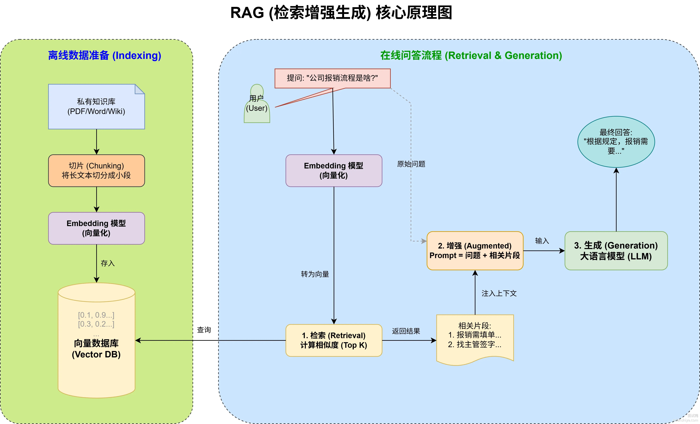

简单来说就是利用外部知识动态补充模型生成能力，既能保证回答的准确性，又能在知识库更新时及时反映最新信息。另外部分业务是内部文档，网上压根没有，可以通过本地知识库来增强 AI 的能力。

---

---

## 2. 什么是大模型 Agent？它和传统 AI 有什么区别？

### 回答重点

**大模型 Agent** 是以大语言模型为大脑，配合规划、记忆、工具调用等模块，能够自主完成复杂任务的系统。它和传统 AI 最大的区别在于：传统 AI 是你问一句它答一句，Agent 是你给它一个目标，它自己拆任务、调工具、一步步干完。

具体差异可以从这几个维度来看：

1）目标导向 vs 被动响应。传统大模型就是个对话机器，用户输入什么它输出什么，没有主动性。Agent 不一样，你给它一个最终目标，比如"帮我调研竞品并写一份分析报告"，它会自己规划要做哪些步骤、先做什么后做什么，然后一步步执行。

2）有记忆 vs 无状态。传统模型只能看到当前对话的上下文窗口，聊完就忘。Agent 有专门的记忆模块，短期记忆存当前任务的中间状态，长期记忆存历史经验，下次碰到类似问题可以复用。

3）能调用工具 vs 只能说话。传统模型只能输出文本，想搜索、算数、操作数据库都得人来做。Agent 能调用搜索引擎、执行代码、读写文件、调 API，真正把事情做出来。

4）多步推理 vs 单轮问答。Agent 能在执行过程中不断评估结果、发现问题、调整策略，形成一个闭环。传统 AI 系统要么靠写死的规则引擎，要么就是一锤子买卖。


### 扩展知识

### Agent 的核心架构

一个典型的大模型 Agent 由四个模块组成：

1）规划器负责把复杂目标拆解成可执行的子任务。常见的规划方法有 ReAct 范式和 Plan-and-Execute 范式。ReAct 是思考一步执行一步，灵活但容易跑偏；Plan-and-Execute 是先整体规划再逐个执行，稳定但不够灵活。

2）执行器负责实际干活，调用工具、执行代码、发起请求。

3）记忆模块分短期和长期。短期记忆通常就是当前任务的上下文，用 Context Window 或者 Scratchpad 实现。长期记忆一般用向量数据库存储，比如 Pinecone、Milvus、Chroma，需要的时候检索出来。

4）工具模块是 Agent 能力的关键扩展点。OpenAI 的 Function Calling、LangChain 的 Tools、AutoGPT 的 Plugins 都是这个思路。工具可以是搜索引擎、计算器、代码解释器、数据库连接器，甚至是另一个 AI 模型。


### 主流 Agent 框架对比

|框架|核心特点|适用场景|上手难度|
|---|---|---|---|
|LangChain|生态最完善，工具和集成最多|复杂业务流程|中等|
|AutoGPT|全自动运行，自主性最强|探索性任务|低|
|BabyAGI|任务驱动，循环迭代|研究型任务|低|
|CrewAI|多 Agent 协作，角色分工|团队模拟场景|中等|
|MetaGPT|软件开发专用，流程规范|代码生成|较高|

实际生产中 LangChain 用得最多，它的 Agent 模块支持 ReAct、Plan-and-Execute、OpenAI Functions 等多种范式，还能方便地接入各种 LLM 和工具。

---

## 3. LLM Agent 的核心架构由哪几部分组成？

ADK（Agent Development Kit）是 Google 推出的智能体开发工具包，核心思想是**让智能体开发回归软件工程本质**。开发者可以用熟悉的编码范式，像搭积木一样组合各种模块，快速构建能自主决策、多模块协作的 AI 智能体。

举个例子，要做一个法律咨询系统，可能需要法律条款分析 Agent、案例匹配 Agent、文档生成 Agent 三个 Agent 协同完成。ADK 就是帮你把这些 Agent 串起来、管起来的框架。

ADK 的两大核心能力：

1）**模块化**：每个 Agent 是独立的执行单元，可以单独开发、单独测试、单独升级，改一个模块不会把整个系统搞崩

2）**协调能力**：负责多 Agent 之间的分工调度，支持三种协调方式

三种协调方式的特点：

LLM Agents 方式：让大模型来当"调度员"，根据用户输入动态决定调用哪个 Agent。适合需要灵活理解自然语言的场景，比如用户问"帮我分析这个合同有没有问题"，LLM 会自动判断要先调法律条款分析 Agent 还是案例匹配 Agent。

工作流方式：预先定好执行顺序，按照顺序、并行或循环的模式跑，不依赖 LLM 做决策。适合流程固定的场景，比如"先提取数据→再清洗→最后生成报告"这种确定性流程。

自定义 Agent 方式：直接继承 BaseAgent 基类，自己实现控制逻辑。适合有特殊业务需求、需要对接非标系统的场景。
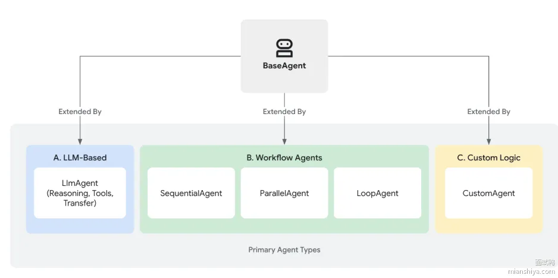

### ADK 的架构设计

ADK 的架构分三层：Agent 层、工具层、运行时层。

Agent 层就是各种智能体，每个 Agent 有自己的职责边界和能力描述。工具层提供 Agent 可以调用的各种能力，比如搜索、代码执行、API 调用等。运行时层负责 Agent 的生命周期管理、状态持久化、并发控制这些脏活累活。

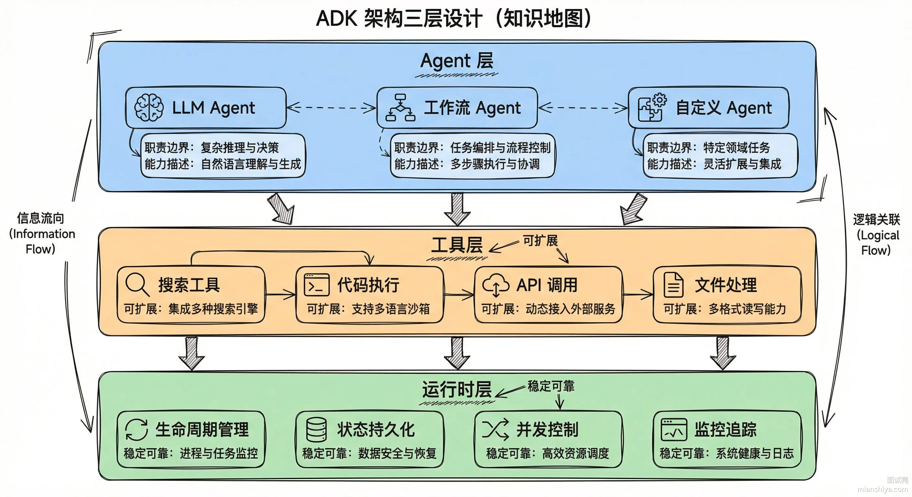

---

## 4. LLM Agent 的四大模块（LLM/规划/记忆/工具）具体怎么协作？

### 回答重点

**LLM Agent** 的核心架构由四个部分组成：LLM 核心、规划模块、记忆模块、工具模块。

1）LLM 核心是整个系统的大脑，负责理解任务、生成计划、协调各模块工作。GPT、Claude、Qwen 这些大模型都可以充当这个角色。

2）规划模块负责把复杂目标拆成可执行的子任务。比如"帮我写一篇市场分析报告"这种任务，规划模块会拆成：搜集行业数据、分析竞品、整理趋势、撰写报告等步骤。执行过程中还能根据结果动态调整计划。

3）记忆模块分短期和长期两种。短期记忆保存当前任务的上下文和中间状态，长期记忆存储跨任务的知识和经验。没有记忆模块，Agent 干完上一步就忘了，没法处理多轮复杂任务。

4）工具模块是 Agent 的手和脚，让它能和外部世界交互。搜索引擎、代码解释器、数据库、API 接口都可以作为工具接入。没有工具，Agent 只能动嘴不能动手。


### 扩展知识

### 规划模块的实现细节

规划是 Agent 区别于普通 LLM 的关键能力。目前主流的规划方法有几种：

1）ReAct 范式把推理和行动交替进行。先 Thought 说明要做什么、为什么，再 Action 执行具体操作，然后 Observation 观察结果，循环往复。LangChain 的 Agent 默认就是这种模式。

2）Plan-and-Execute 范式先一次性生成完整计划，再逐步执行。BabyAGI 就是这个思路，先列出任务清单，一个个勾掉。

3）Tree of Thoughts 把推理过程展开成树状结构，每步可能有多个分支，最后选最优路径。适合需要多步推理的复杂问题。

4）Reflexion 机制让 Agent 在失败后能反思原因、调整策略。不是简单重试，是带着教训重来。

---

## 5. Agent 的工作过程「感知-思考-行动」循环具体是怎样的？

### 回答重点

Agent 的工作过程本质上是一个 **感知-思考-行动** 的循环，可以拆成这么几步：

1）接收与理解输入：Agent 拿到用户的自然语言指令后，先把它解析成内部能处理的格式，搞清楚用户到底想干啥、有什么约束条件。

2）规划：LLM 根据输入生成一份行动计划，把大任务拆成可执行的小步骤并排好序。比如用户说"帮我订明天北京到上海的机票"，Agent 会拆成查航班、筛选合适的、确认价格、完成预订这几步。

3）工具调用：按照计划，Agent 挑选合适的外部工具来干活。查航班可能调携程 API，算价格用计算器，存订单信息用数据库。这一步是 Agent 区别于普通聊天机器人的关键能力。

4）观测：工具执行完会返回结果，Agent 把这个结果作为 Observation 反馈给 LLM，更新当前状态。如果查航班返回"没有直飞"，Agent 就知道该调整策略了。

5）记忆：关键的观测结果和交互细节会被存进短期或长期记忆，保证多轮对话时不会"失忆"。

6）决策：综合最新的观测结果、记忆内容和任务目标，Agent 判断下一步该干啥。任务完成就准备输出，没完成就继续执行下一个子任务，遇到问题就重新规划。

7）输出：所有步骤跑完后，Agent 汇总信息，生成最终结果返回给用户。

8）反思与纠错：高级 Agent 还会启动自我反思模块，回顾执行过程，评估结果是否正确，发现问题就重规划或修正策略，避免下次犯同样的错。


---

## 6. 大模型的记忆机制是怎样的？短期和长期记忆如何实现？

### 回答重点

大模型的记忆机制分两块：**短期记忆**靠上下文窗口，**长期记忆**靠外部存储。

短期记忆的实现方式主要有三种：

1）直接缓存，把最近的对话全部保留在上下文里。比如 GPT-4 的 400k tokens 窗口、Gemini 3 Pro 的100 万 (1M) tokens 窗口，能装多少就装多少

2）滑动窗口，只保留最近 N 轮对话，比如只保留最近 5 轮，老的对话直接丢掉

3）Token 限制，按 Token 数量截断历史，比如只保留最近 12k tokens

长期记忆就得靠外部存储了：

1）摘要压缩，对历史内容生成摘要，比如每 10 轮对话压缩成 1 段，模仿人类记忆的"模糊记忆"机制

2）向量数据库，把历史信息存入 Milvus、Pinecone 这类向量库，通过语义检索动态召回相关片段，这就是 RAG 的思路

3）知识图谱，构建实体关系图，支持结构化查询


从目前的实现来看，短期记忆依赖模型原生能力，长期记忆通过外部存储实现检索。

### 扩展知识

### 记忆系统的读写流程

按照 LangChain 的设计，记忆系统需要支持两个基本动作：read 和 write。

1）接收到用户输入后，在执行核心逻辑之前，先从记忆存储系统中读取相关内容，增强用户输入

2）执行核心逻辑后，在返回答案之前，把当前这轮的输入和输出写入内存，以便后续引用


### LangChain 记忆模块详解

LangChain 提供了几种开箱即用的记忆实现：

**ConversationBufferMemory**：最简单的方案，存储完整对话历史，适合对话轮次不多的场景。缺点是历史长了就超窗口

**ConversationSummaryBufferMemory**：结合短期缓存与长期摘要，最近几轮保留原文，更早的压缩成摘要。在记忆容量和信息保真之间取得平衡

**VectorStoreRetrieverMemory**：把每轮对话嵌入向量数据库，需要时通过语义检索召回相关片段。适合需要从海量历史中精准定位信息的场景

**ConversationKGMemory**：构建知识图谱，抽取实体和关系存储。适合需要追踪多个实体状态的复杂对话，比如客服场景要记住用户的订单号、地址、投诉记录等


### 工程落地的几个坑

**上下文爆炸**：对话多了，上下文越来越长，推理成本指数上涨。解决方案是定期做摘要压缩，或者用滑动窗口强制截断

**检索噪音**：RAG 检索回来的片段不一定都相关，混进去反而干扰模型。需要做相关性打分，设置阈值过滤

**记忆一致性**：多轮对话中，如果用户纠正了之前说的话，记忆系统要能更新，不能一直用错误信息。这需要额外的逻辑来处理冲突

**冷启动问题**：新用户没有历史记忆，模型表现可能不如老用户。可以通过预设一些通用的 few-shot 示例来缓解

---

## 7. LLM Agent 如何借助外部机制实现长期记忆？

### 回答重点

LLM 原生的上下文窗口只有几千到十几万 tokens，聊多了前面的内容就被"挤出去"了，所以要给 Agent 加长期记忆，必须借助外部机制。

主流方案有两种：

1）**向量数据库 + RAG**：把历史对话和知识转成向量 embeddings，存进 Pinecone、ChromaDB、Milvus 这类向量库。新会话来了，先根据用户输入检索相关的历史内容，把检索结果塞进 prompt，LLM 就能"回忆"起之前聊过什么。这是目前最成熟、落地最多的方案。

2）**分层记忆体系**：把记忆分成短期和长期两层。短期记忆就是当前会话的上下文，长期记忆是压缩后的关键信息摘要或 embeddings。MemGPT 就是这个思路，它借鉴操作系统的虚拟内存机制，把记忆分成 main context 和 archival storage，按需换入换出。


### 扩展知识

### MemGPT 的分层记忆架构

MemGPT 把记忆管理做得更精细，它借鉴了操作系统的虚拟内存概念：

Main Context 相当于内存，容量有限但访问快，存放当前对话最相关的信息。

Archival Storage 相当于硬盘，容量几乎无限但访问需要检索，存放所有历史记忆。

Recall Storage 专门存对话历史的原始记录，需要时可以精确回溯到某一轮对话。

Agent 会自动管理这三层存储之间的数据流动。当 Main Context 快满了，会把不太重要的信息压缩后存到 Archival Storage；需要某个历史信息时，从 Archival Storage 检索出来加载到 Main Context。


### 长上下文技术的新进展

除了外挂记忆，还可以从模型本身下手，扩展原生上下文窗口：

LongRoPE 通过改进位置编码，把上下文窗口扩展到 200 万 tokens。它用了两个关键技巧：位置插值和渐进式扩展，让模型能处理超长文本而不损失太多性能。

LLoCO 的思路是把长上下文压缩成紧凑的表示，存进模型的 KV cache。这样即使原始文本很长，实际占用的 context 长度也可控。

CEPE 用并行编码的方式处理长文本，把文本切成多段分别编码，再通过特殊的注意力机制融合。

这些技术还在演进中，目前生产环境用得最多的还是 RAG 方案，因为工程上最成熟、效果也够用。

### 落地时的工程考量

存储成本：向量库存几百万条记录问题不大，但到了千万、亿级别，存储和索引成本会急剧上升。可以考虑分层存储，热数据用内存型向量库，冷数据用磁盘型。

检索延迟：向量检索本身很快，通常几十毫秒。但如果数据量大、检索 top-k 设得高，延迟会上去。可以用 ANN 算法做近似检索，牺牲一点精度换速度。

数据隐私：用户的历史对话属于敏感数据，存储和检索都要做好权限隔离。每个用户的记忆只能自己访问，不能串到别人那去。

记忆更新：人的记忆会被新信息覆盖和修正，Agent 的记忆也应该支持更新和删除。用户说"忘掉我之前说的"，得真能删掉对应的记忆条目。

### 相关论文与扩展阅读链接

1）[Github项目-LLM-Agent](https://github.com/AkiRusProd/llm-agent)

2）[RAG-维基百科](https://en.wikipedia.org/wiki/Retrieval-augmented_generation)

3）[Understanding Memory in AI: How LLMs Remember What Matters](https://medium.com/%40t.sankar85/understanding-memory-in-ai-how-llms-remember-what-matters-af7050251d92)

4）[LongRoPE: Extending LLM Context Window Beyond 2 Million Tokens](https://arxiv.org/abs/2402.13753)

### 面试官追问

### 提问：向量检索召回的内容不相关怎么办？比如用户问的是 A 话题，结果召回了 B 话题的历史记录？

回答：几个优化方向。一是优化 embedding 模型，换用针对特定领域微调过的模型，或者用更强的通用模型比如 text-embedding-3-large。二是加元数据过滤，给每条记忆打上时间、话题、用户意图等标签，检索时先按元数据筛选再做向量匹配。三是用 rerank 模型，初筛出 top-20 后再用 cross-encoder 精排一遍。四是混合检索，同时用关键词匹配和向量检索，两路结果融合。

### 提问：记忆数据量太大，检索变慢了怎么处理？

回答：先看瓶颈在哪。如果是向量库本身慢，换成支持 GPU 加速的方案比如 Milvus，或者用 HNSW、IVF 这类 ANN 索引加速。如果是数据量确实太大，做分层存储，最近 7 天的记忆放高性能存储，更早的归档到便宜存储，检索时先查热数据。还可以做记忆压缩，定期把多轮对话总结成一段摘要，用摘要替代原始记录。

### 提问：用户要求删除他的所有历史记忆，技术上怎么实现？

回答：向量库通常支持按 ID 或 metadata 删除。设计时每条记忆都要绑定 user_id，删除时按 user_id 过滤出所有相关条目批量删除。要注意的是，如果用了缓存层，缓存里的数据也得清掉。另外删除操作要做好审计日志，合规检查时能证明确实删干净了。如果用的是 Pinecone 这种托管服务，它们一般有 namespace 机制，每个用户一个 namespace，删除时直接删整个 namespace 最干净。

---

## 8. LLM Agent 在多模态推理中是怎么实现的？

### 回答重点

LLM Agent 在多模态推理中，核心是先把不同模态的数据转换成统一的**向量表示**，再将这些表示注入到大模型进行跨模态融合和推理。主流方案有三种：


1）视觉-语言融合：用 CLIP、BLIP-2 等视觉编码器将图像转为 embeddings，然后与文本输入一起提供给 LLM。或者直接使用 GPT-4V 这种内置视觉理解能力的模型，一站式处理图像并输出自然语言回答。

2）语音-文本桥接：用 Whisper 等 ASR 模型将音频转换成文本，再交给 LLM 分析和生成响应。这种串联方式简单直接，工程上容易落地。

3）**工具链调用**：LLM Agent 根据任务需求按需调用 OCR、物体检测、视频帧提取等工具，将结果合并进上下文，再由模型执行更高级别的推理或决策。

以 GPT-4V 为例，多模态调用大概是这样：

```python
import openai
import base64
# 读取图片并转为 base64
with open("image.jpg", "rb") as f:
    image_data = base64.standard_b64encode(f.read()).decode("utf-8")
    response = openai.chat.completions.create( model="gpt-4-vision-preview", messages=[{ "role": "user", "content": [ {"type": "text", "text": "这张图里有什么？"}, {"type": "image_url", "image_url": {"url": f"data:image/jpeg base64,{image_data}"}} ] }] )
```

### 扩展知识

### 跨模态对齐的底层原理

多模态推理不是简单地把图拼上、把字读出来就完事了，关键在于**模态对齐**。不同模态的数据天生就在不同的向量空间里，图像是像素矩阵，文本是 token 序列，音频是波形信号。要让 LLM 能理解这些信息，必须把它们映射到同一个语义空间。

CLIP 的做法是用对比学习，让图像和对应文本描述的 embedding 尽量靠近，不相关的尽量远离。训练完成后，图像编码器和文本编码器输出的向量就天然在同一个空间里了，可以直接做相似度计算。


### BLIP-2 的轻量化思路

BLIP-2 提供了一种资源友好的方案：图像编码器和 LLM 都保持冻结，只在中间加一个小型的 Q-Former 映射层。这个映射层用一组可学习的 query token 去"询问"图像编码器，提取出最相关的视觉特征，再传给 LLM。

好处很明显，不用重新训练几十亿参数的大模型，只需要训练几百万参数的映射层，显存占用和训练成本都大幅降低。在资源受限的场景下，这个架构很实用。

### 视频的时序推理

处理视频会比单张图片复杂不少。一般的做法是：

1）对视频做关键帧抽取，比如每秒取 1-2 帧 2）对每个关键帧用图像编码器提取特征 3）如果有音轨，用 Whisper 提取语音转文本 4）把所有模态的信息按时间顺序排列，塞进 LLM 的上下文

这样 LLM 就能理解"先发生了什么、后发生了什么"，做时序相关的推理。比如分析一段会议录像，模型能知道"张三在第 3 分钟提出了方案，李四在第 5 分钟表示反对"。

### 工程实践中的注意点

1）上下文长度：多模态输入会占用大量 token，一张图片可能就要消耗几百上千个 token。要注意控制输入规模，避免超出模型的上下文窗口

2）延迟问题：图像编码、语音转文本都需要时间，串联多个模型会导致端到端延迟累加。实时场景下要做好预处理和缓存

3）幻觉风险：多模态模型的幻觉问题比纯文本更严重，可能会"看到"图里压根没有的东西。关键场景建议加一层校验

---

## 9. Manus 是什么？为什么说它是全球首款通用型 AI 智能体？

### 回答重点

Manus 是咱们中国团队 Monica.im 在 2025 年 3 月推出的**全球首款通用型AI智能体**，最大的特点是能独立思考、规划并执行复杂任务，直接交付完整成果，不是那种只会聊天给建议的 AI。

比如你让它做股票分析，它会自己去抓数据、跑分析、生成报告，最后给你一份完整的 PDF，不需要你一步步指挥。简历筛选、市场调研这些任务也是同样的逻辑，扔给它一个目标，它自己想办法搞定。


底层实现是通过一个中央调度模块，把用户的高层指令拆解为多个子任务，再分配给不同的内部 Agent 或工具执行，形成端到端的自动化流程。规划和决策还是靠大模型，比如 Claude、Qwen 这些。

---

## 10. Anthropic 的 Computer Use 是什么？核心原理是什么？

### 回答重点

Computer Use 是 Anthropic 在 Claude 3.5 Sonnet 中推出的一项能力，让 AI 能够直接操作计算机，通过模拟鼠标点击、键盘输入等方式与操作系统和软件交互，实现从"文字对话"到"实际操作"的跨越。

核心原理主要包含三个层面：

1）通过操作系统级 API 把自然语言指令转化为计算机可执行的操作。比如用户说"打开 Chrome 搜索面试鸭"，AI 就会调用 Windows API 或 macOS 系统调用启动浏览器并输入关键词。

2）内置**多智能体协作**机制，包括任务规划代理负责分解任务、工具调用代理负责执行操作、验证代理负责校验结果，形成流水线式处理。比如"生成报告"这个指令会被拆分为数据获取、图表绘制、格式校验等子任务。

3）利用 **OCR 技术**识别屏幕内容，结合语义理解定位目标。比如"点击页面右上角的'登录'按钮"，AI 会先分析页面结构，找到按钮位置，再模拟点击。


下面这张图是 Anthropic 官方的演示，左边是 AI 的思考和指令展示，中间是操作浏览器进行搜索，右边是把获取到的信息填入表单：


---

## 11. Copilot 模式、Agent 模式、Embedding 模式有什么区别？

### 回答重点

两者的核心差异在于**控制权归属**：Copilot 模式下人类保留决策权，大模型只是提供建议；Agent 模式下大模型拿到完整的任务目标后，自己拆解、自己执行、自己收尾，人只管验收结果。

**Copilot 模式**：用户输入需求，模型给出建议，用户审核后决定是否采纳，然后再继续下一轮交互。整个过程用户始终握着方向盘，模型像副驾驶一样实时提醒、辅助，但不会越俎代庖。典型场景就是 GitHub Copilot 写代码，它给你补全建议，按不按 Tab 接受是你自己的事。

**Agent 模式**：用户只需要给一个目标，比如"帮我订下周三去上海的机票和酒店"，Agent 自己规划步骤、调用航班 API 查票、调用酒店 API 比价、处理支付流程，中间遇到问题自己想办法解决，最后把结果汇报给你。整个链路可能跑十几个工具调用，用户压根不用盯着。


还有个 **Embedding 模式**，属于"隐身"玩法，把大模型能力嵌到现有系统里，用户根本感知不到背后有 AI。比如电商的智能搜索，你搜"适合送女朋友的礼物"，背后是向量检索在做语义匹配，但用户只觉得搜索变聪明了。

|维度|Embedding|Copilot|Agent|
|---|---|---|---|
|用户感知|无感知，后台默默干活|实时交互，每一步都要用户确认|只管下达目标，中间过程全托管|
|自主程度|零自主，纯被动响应|半自主，给建议但不做决定|高度自主，能独立跑完整条任务链|
|核心技术栈|向量化 + 语义检索 + 微调|提示工程 + 多轮对话 + 上下文管理|任务规划 + 记忆系统 + 工具调用 + 强化学习|
|典型产品|Algolia AI Search、电商推荐系统|GitHub Copilot、Notion AI|AutoGPT、Devin、Cursor Agent|

---

**第二部分：智能体构建与编排**

---

## 12. 什么是 ReAct 框架？它和 CoT 有什么区别？

### 回答重点

ReAct 是 Reasoning and Acting 的缩写，是一种基于大语言模型的智能体框架，核心思想是让模型在生成回答时 **交替输出"思考"和"行动"** 步骤，边想边做来完成复杂任务。

整个流程是这样的：

1）模型先通过自然语言生成思考过程，明确是否需要工具、需要什么工具、输入什么参数

2）根据当前思路选择合适的操作，比如调用搜索引擎、请求 API、跟环境交互等，并输出具体的指令

3）执行完 Action 后，系统把返回的结果给模型，这一步叫 观察（Observation）

4）把 Observation 附加到上下文，模型在新的上下文中继续"思考→行动→观察"循环，直到输出最终答案


和传统的链式思维 CoT 相比，CoT 只能线性推导，一条路走到黑。ReAct 允许在行动失败后重试或切换方案，灵活性高很多。

---

## 13. ReAct 在 Spring AI 中是怎么实现的？

ReAct，即 Reasoning + Acting（推理与行动），是一种结合推理和行动的智能体架构。它模仿人类解决问题时“思考 - 行动 - 观察”的循环。AI 首先对问题进行推理（Reason），将原始问题拆分为多步骤任务，明确当前要执行的步骤。然后，它会调用外部工具执行行动（Act），比如调用搜索引擎或访问网页。最后，它会观察（Observe）工具返回的结果，并将这些结果反馈给智能体，用于下一步的决策。这个过程会不断循环迭代，直到任务完成或达到预设的终止条件。


基于 ReAct 模式构建具备自主规划能力的 AI 智能体，核心在于实现这个 “思考-行动-观察” 的循环。这意味着智能体要实现：

1. 接收用户指令后，能分析并拆解成可执行的子任务。
2. 根据子任务的需要，从可用的工具集中选择合适的工具并执行。
3. 分析工具执行的结果，判断任务进展，决定下一步是继续调用工具、向用户澄清还是结束任务。

在本项目中，我实现的拥有自主规划能力的超级智能体就是基于 ReAct 模式，通过 ReActAgent 定义先 think 思考再 act 行动的流程，然后通过 ToolCallAgent 具体实现这两个方法。在 `think()` 方法中决定使用哪个工具（推理），在 `act()` 方法中执行工具（行动），并将执行结果作为下一步思考的输入（观察）。

---

## 14. 什么是 CoT（Chain of Thought）思维链？

### 回答重点

**CoT（Chain of Thought）思维链** 就是让大模型别急着给答案，先把推理过程一步步写出来。这招对数学题、逻辑推理、多步骤问题特别有效，准确率能提升 20% 以上。

核心原理很直白：人做复杂题也得打草稿，让 LLM 把"草稿"写出来，中间步骤错了更容易发现，最终答案也更靠谱。


实现 CoT 主要有两种方式：

1）Few-shot CoT：给几个带推理过程的例子，让模型照着学

```python
# Few-shot CoT 示例
prompt = """ 问题：一本书 48 页，小明每天读 8 页，几天能读完？ 思考：要求读完需要的天数，就是用总页数除以每天读的页数。48 ÷ 8 = 6 答案：6 天 问题：教室里有 5 排座位，每排 6 个座位，坐满了学生后又来了 3 个学生，现在教室里有多少学生？ 思考： """
```

2）System Prompt 引导：在系统提示词里明确要求展示推理过程

```python
system_prompt = """ 你是一个善于逻辑推理的助手。回答问题时，请遵循以下步骤： 1. 先分析问题的核心是什么 2. 列出解决问题需要的已知条件 3. 逐步推导，每一步写清楚依据 4. 最后给出明确答案 """
```

---

## 15. CoT 提示词技巧具体怎么用？

### 回答重点

CoT（Chain of Thought，思维链）是一种让 AI 在给出最终答案前展示推理过程的提示词技巧。就像人类解决复杂问题时会一步步思考，CoT 让 AI 也把思考过程说出来，而不是直接蹦出答案。

CoT 的核心思想是"让我们一步步思考"。通过引导 AI 展示推理步骤，可以显著提升它在数学计算、逻辑推理、复杂分析等任务上的表现。研究表明，使用 CoT 后，AI 在算术推理任务上的准确率能提升 30%-50%。

工作原理很直观：当 AI 被要求展示思考过程时，它会在生成最终答案前先生成中间推理步骤。这些中间步骤不仅让人类能理解 AI 的推理逻辑，更重要的是，生成这些步骤的过程本身帮助 AI 建立了更好的内部表征，从而得出更准确的答案。

**基础示例：**

```text
问题：一个餐厅有23位顾客，又来了17位，然后走了9位，现在有多少位顾客？
使用 CoT： 让我们一步步思考：
1. 开始有23位顾客
2. 来了17位，那么23 + 17 = 40位
3. 走了9位，那么40 - 9 = 31位 所以现在有31位顾客。
```

### 扩展知识

CoT 的提出源于 2022 年 Google 的研究团队发现的一个现象：当模型规模达到一定程度（通常是 1000 亿参数以上）后，简单地加上"让我们一步步思考"这句话，就能大幅提升推理能力。这个发现揭示了大模型具有潜在的推理能力，只是需要适当的提示来激发。

CoT 特别适合需要多步推理的任务。数学应用题需要理解题意、提取数字、列式计算，每一步都可能出错，CoT 能让每步都清晰可见。逻辑推理题需要根据前提一步步推导结论，CoT 让推理链条完整展现。复杂的分析任务需要从不同角度思考问题，CoT 能让思考过程系统化。

值得注意的是，CoT 并不是对所有模型都有效。研究表明，只有参数量足够大的模型才能真正从 CoT 中受益。小模型可能会机械地模仿格式，但并不真正理解推理过程，效果反而可能更差。所以使用 CoT 时要确保模型本身有足够的能力。

在实际应用中，CoT 也有局限性。首先是 Token 消耗增加，因为要生成完整的推理过程。其次是响应时间变长，多步推理需要更多计算。最后是可能出现推理错误，虽然 CoT 能提升准确率，但如果某一步推理错了，后续步骤都会受影响。因此在使用 CoT 时要权衡收益和成本。

有个实用技巧是选择性使用 CoT。对于简单问题直接回答就行，不需要展示推理过程。只有当问题确实复杂，需要多步推理时才使用 CoT。可以设计一个判断机制，先评估问题难度，然后决定是否启用 CoT。这样能在保证效果的同时控制成本。

CoT 还可以跟其他技巧结合使用。比如结合 Few-shot，在示例中展示推理过程，让 AI 学会如何一步步思考。比如结合自洽性（Self-Consistency），让 AI 生成多条推理链，然后选择最一致的答案，能进一步提升准确性。这些组合技巧在高要求场景下很有价值。

---

## 16. CoT 的应用场景和效果如何？

### 回答重点

CoT（Chain of Thought，思维链）是一种让 AI 在给出最终答案前展示推理过程的提示词技巧。就像人类解决复杂问题时会一步步思考，CoT 让 AI 也把思考过程说出来，而不是直接蹦出答案。

CoT 的核心思想是"让我们一步步思考"。通过引导 AI 展示推理步骤，可以显著提升它在数学计算、逻辑推理、复杂分析等任务上的表现。研究表明，使用 CoT 后，AI 在算术推理任务上的准确率能提升 30%-50%。

工作原理很直观：当 AI 被要求展示思考过程时，它会在生成最终答案前先生成中间推理步骤。这些中间步骤不仅让人类能理解 AI 的推理逻辑，更重要的是，生成这些步骤的过程本身帮助 AI 建立了更好的内部表征，从而得出更准确的答案。

**基础示例：**

```text
问题：一个餐厅有23位顾客，又来了17位，然后走了9位，现在有多少位顾客？
使用 CoT： 让我们一步步思考：
1. 开始有23位顾客
2. 来了17位，那么23 + 17 = 40位
3. 走了9位，那么40 - 9 = 31位 所以现在有31位顾客。
```

### 扩展知识

CoT 的提出源于 2022 年 Google 的研究团队发现的一个现象：当模型规模达到一定程度（通常是 1000 亿参数以上）后，简单地加上"让我们一步步思考"这句话，就能大幅提升推理能力。这个发现揭示了大模型具有潜在的推理能力，只是需要适当的提示来激发。

CoT 特别适合需要多步推理的任务。数学应用题需要理解题意、提取数字、列式计算，每一步都可能出错，CoT 能让每步都清晰可见。逻辑推理题需要根据前提一步步推导结论，CoT 让推理链条完整展现。复杂的分析任务需要从不同角度思考问题，CoT 能让思考过程系统化。

值得注意的是，CoT 并不是对所有模型都有效。研究表明，只有参数量足够大的模型才能真正从 CoT 中受益。小模型可能会机械地模仿格式，但并不真正理解推理过程，效果反而可能更差。所以使用 CoT 时要确保模型本身有足够的能力。

在实际应用中，CoT 也有局限性。首先是 Token 消耗增加，因为要生成完整的推理过程。其次是响应时间变长，多步推理需要更多计算。最后是可能出现推理错误，虽然 CoT 能提升准确率，但如果某一步推理错了，后续步骤都会受影响。因此在使用 CoT 时要权衡收益和成本。

有个实用技巧是选择性使用 CoT。对于简单问题直接回答就行，不需要展示推理过程。只有当问题确实复杂，需要多步推理时才使用 CoT。可以设计一个判断机制，先评估问题难度，然后决定是否启用 CoT。这样能在保证效果的同时控制成本。

CoT 还可以跟其他技巧结合使用。比如结合 Few-shot，在示例中展示推理过程，让 AI 学会如何一步步思考。比如结合自洽性（Self-Consistency），让 AI 生成多条推理链，然后选择最一致的答案，能进一步提升准确性。这些组合技巧在高要求场景下很有价值。

---

## 17. Few-shot Learning 在提示词工程中怎么用？

### 回答重点

Few-shot Learning（少样本学习）是提示词工程中的一个重要技巧，通过在提示词中提供少量示例，让 AI 理解任务的模式和期望输出，从而更准确地完成类似任务。

Zero-shot、One-shot、Few-shot 的区别在于提供的示例数量。Zero-shot 是零样本，不提供任何示例，直接给出指令让 AI 执行。One-shot 是单样本，提供 1 个示例。Few-shot 是少样本，通常提供 2-5 个示例。示例越多，AI 对任务的理解越准确，但也会消耗更多 Token。

**Zero-shot 示例：**

```text
请将以下句子分类为正面、负面或中性： "这个产品质量不错，值得推荐。"
```

**Few-shot 示例：**

```text
请将句子分类为正面、负面或中性。
示例1：
输入：这个产品质量不错，值得推荐。
输出：正面
示例2：
输入：完全不好用，浪费钱。
输出：负面
示例3：
输入：还可以吧，没什么特别的。
输出：中性 现在请分类：
输入：服务态度很好，物流也快。
输出：
```

---

## 18. 提示词模板是什么？如何设计与复用？

### 回答重点

提示词模板是把提示词中可变的部分提取为变量，固定的部分保留为模板框架，这样可以重复使用同一个结构，只需要替换变量值就能生成新的提示词。就像填空题一样，留几个空让你填，其他部分都是固定的。

设计可复用的提示词模板要先分析任务的共性和个性。共性部分做成模板，个性部分做成变量。比如翻译任务，语言类型是变量，翻译的指令是固定的。代码生成任务，编程语言和具体需求是变量，代码规范要求是固定的。

一个好的模板应该包含清晰的变量定义、完整的指令框架、必要的约束条件。变量命名要有意义，让使用者一看就知道该填什么。模板本身要经过充分测试，确保在各种变量值下都能正常工作。

**基础模板示例：**

```python
# Python 字符串格式化
template = """ 你是一位{role}，擅长{specialty}。 请帮我{task}，要求： 1. 风格：{style} 2. 长度：{length} 内容：{content} """
# 使用模板
prompt = template.format( role="技术作家", specialty="用简单语言解释复杂概念", task="写一篇技术文章", style="通俗易懂", length="800字", content="Python装饰器" )
```

### 扩展知识

提示词模板的设计要考虑灵活性和稳定性的平衡。太灵活的模板，变量太多，使用起来复杂。太固定的模板，适用场景有限，复用价值不高。好的模板应该抓住任务的核心结构，把经常变化的部分参数化，把稳定的部分固化。

在实际项目中，通常会建立分层的模板体系。最上层是通用模板，适用于大类任务，比如"内容生成模板"、"数据分析模板"。中层是具体场景模板，比如"技术文章生成模板"、"营销文案模板"。底层是高度定制的模板，针对特定业务需求。这种分层设计让模板既能复用又能满足个性化需求。

模板的维护也很重要。随着使用经验的积累，会发现模板的不足之处，要及时更新优化。可以建立版本管理机制，记录每次修改的原因和效果。对于重要的模板，改动前要充分测试，避免影响已有的应用。团队协作时，模板的管理要规范化，不能各自为战。

条件逻辑可以让模板更智能。虽然提示词本身不支持 if-else，但在模板的使用层面可以实现。根据不同的参数值，选择不同的模板片段组合。比如根据目标用户的技术水平，自动调整语言难度；根据内容长度，自动选择详略程度。这种动态模板能适应更多场景。

模板还可以嵌套使用。一个复杂模板可以由多个子模板组合而成。比如文章生成模板可以嵌套"引言模板"、"正文模板"、"总结模板"。这种模块化设计让模板更易维护，而且子模板可以在不同的父模板中复用。

在开发 AI 应用时，模板管理是个重要环节。可以用专门的工具或平台来管理提示词模板，比如 LangChain 的 PromptTemplate、一些提示词管理工具等。这些工具通常提供版本控制、测试、部署等功能，让模板管理更专业。

有个实践经验是从实际案例中提炼模板。不要凭空设计模板，而是先积累一些好用的提示词，然后分析它们的共性，提炼出模板。这样的模板更实用，因为它来自真实需求。可以定期回顾自己用过的提示词，把那些经常重复使用的整理成模板，逐步建立起自己的模板库。

---

## 19. LangChain 是什么？为什么说它类似 Java 生态里的 Spring？

### 回答重点

LangChain 是一个专门用来构建大语言模型应用的开源框架，定位类似 Java 生态里的 Spring，把 LLM 开发中常用的组件都封装好了，文档加载、向量数据库、外部 API 调用、对话记忆管理这些脏活累活，框架都帮你处理了，开箱即用。

传统 LLM 开发有三个头疼的问题：

1）**上下文管理难**：聊几轮之后模型就"忘了"之前说的话，得自己写逻辑拼接历史消息。LangChain 的 Memory 组件直接搞定，对话历史缓存、实体关系跟踪都有现成实现。

2）**多工具协同麻烦**：比如用户问"2025年全球GDP排名"，模型自己答不了，得去调搜索引擎或数据库。LangChain 内置了一堆 Tools，搜索引擎、数据库查询、HTTP 请求都能直接用，还能让模型自己决定什么时候调哪个工具。

3）**复杂任务编排复杂**：一个任务可能涉及多次 LLM 调用和工具调用，比如"分析财报→提取关键指标→生成可视化建议"，手写这种流程代码很乱。LangChain 用 Chains 和 Agents 把这些操作串成工作流，逻辑清晰好维护。


LangChain 的几个实用特性：

1）内置 RetrievalQA 等预制链，5 行代码就能搭出一个知识库问答系统

2）支持 OpenAI、Hugging Face、Anthropic 等主流模型，甚至可以混合调用，比如用 GPT-4 生成创意，再用 Claude 审核合规性

3）配套的 LangSmith 平台支持全链路监控、成本分析和性能优化，乐天集团用 LangSmith 把 API 调用成本降了 60%

### 1.0 版本核心更新

2025 年 10 月 22 日发布的 LangChain 1.0，把定位从"LLM 工具链"升级为"LLM 应用开发全栈框架"，承诺 2.0 版本前无破坏性变更：

1）上下文管理升级：不光能缓存对话历史，还加了向量化存储、语义记忆优化、记忆过期策略、多轮对话摘要压缩，Token 成本能省不少

2）多工具协同升级：Core 层做了标准化抽象接口，对接外部工具、数据源不用再重复适配不同工具的调用逻辑

3）复杂任务编排升级：深度整合 LangGraph，支持可视化状态图编排和多智能体协作，告别旧版本线性链式调用的局限

|升级点|0.x 版本|1.0 版本|
|---|---|---|
|架构分层|高度耦合|拆分为 Core / Community / Partner 三层|
|核心执行接口|各组件接口不统一|所有组件统一实现 Runnable 接口|
|调用方式|仅支持同步|原生支持 invoke / ainvoke / stream 三种模式|
|复杂流程编排|线性 Chain，难以分支循环|深度集成 LangGraph，支持状态图、多智能体协作|
|稳定性承诺|无明确承诺|承诺 2.0 前无破坏性变更|

### 扩展知识

### 0.x 版本核心模块

**Chains**

LLMChain 是最基础的链，直接调用 LLM 生成内容。RetrievalQA 是做 RAG 的，先从向量数据库检索相关文档，再把文档塞给 LLM 生成答案。RouterChain 可以根据输入内容动态路由到不同的处理链，比如中文问题走中文链，技术问题走技术知识库链。

**Agents**

ReAct 模式是经典的"思考→行动→观察"循环，用户问"杭州今天天气如何"，Agent 会先思考需要调天气 API，然后执行调用，拿到结果后再组织回答。OpenAI Function Calling 则是直接让模型调用预定义的函数，省去了手动解析 JSON 的麻烦。

**Memory**

ConversationBufferMemory 最简单，把对话历史全存下来。VectorStoreRetrieverMemory 更智能，把记忆存到向量数据库里，用户提到"上周会议记录"，能通过语义检索自动关联相关文档。

### 1.0 架构拆分详解


1.0 最大的变化是架构解耦。以前组件耦合严重，改一个地方可能牵连一堆。现在拆成三层：

1）**Core 层**：定义核心抽象，Model、Retriever、Tool、Chain 这些基础接口都在这里，所有组件的兼容性靠它保证

2）**Community 层**：社区贡献的第三方集成，各种 LLM 适配器、向量数据库对接、工具插件都在这，不用重复造轮子

3）**Plus 层**：企业级功能，LangSmith 监控平台、LangServe 部署服务的商用支持

### 统一的 Runnable 接口

1.0 把所有可执行组件都统一到 Runnable 接口下，支持三种调用方式：`invoke()` 同步、`ainvoke()` 异步、`stream()` 流式输出。

以前写 RAG，得用 `RetrievalQA.from_chain_type()` 这种工厂方法，逻辑封装在内部，改起来麻烦。现在用 Runnable 组合组件，像搭积木一样拼流程：

```python
from langchain_core.prompts import ChatPromptTemplate
from langchain_core.runnables import RunnablePassthrough
from langchain_openai import ChatOpenAI, OpenAIEmbeddings
from langchain_community.vectorstores import Chroma
# 初始化向量数据库检索器
embeddings = OpenAIEmbeddings()
vectorstore = Chroma(embedding_function=embeddings, persist_directory="./chroma_db")
retriever = vectorstore.as_retriever(search_kwargs={"k": 3})
# 定义提示词模板
prompt = ChatPromptTemplate.from_messages([ ("system", "严格根据以下上下文回答问题，不要编造：{context}"), ("human", "我的问题：{question}") ])
# 用 Runnable 拼接链
rag_chain = ( {"context": retriever, "question": RunnablePassthrough()} | prompt | ChatOpenAI(model="gpt-3.5-turbo") )
# 同步执行
result = rag_chain.invoke("LangChain 1.0 最大的变化是什么？")
# 流式输出
#
for chunk in rag_chain.stream("问题"):
    #
    print(chunk.content, end="", flush=True)
```

### 1.0 的 Agents 升级

1.0 的 Agents 基于 LangGraph 重构，从单智能体升级到多智能体协作：

1）**经典 ReAct 模式**：单智能体的"思考→调用工具→观察结果→再思考"循环，1.0 优化了工具调用的重试机制和权限控制

2）**多智能体模式**：比如搭一个销售分析系统，可以有"分析师智能体"负责分析销售数据、"写作智能体"负责生成报告、"发送智能体"负责发邮件给老板，通过 LangGraph 定义智能体间的消息传递和状态流转

### 相关文档与扩展阅读链接

- [LangChain官方文档](https://python.langchain.com/)

LangChain 生态还是比较全面的，包括 LangServe（将链部署为 REST API）、LangSmith（用于调试和监控）等工具，支持从开发到部署的全流程。


### 面试官追问

### 提问：LangChain 和直接调用 OpenAI API 比，什么场景下用 LangChain 更合适？

回答：简单的单轮对话，直接调 API 更轻量。但只要涉及多轮对话记忆、外部工具调用、多步骤任务编排，LangChain 的价值就体现出来了。比如做一个客服机器人，需要记住用户之前说过的订单号，还要能查数据库、调物流接口，这种场景手写逻辑很繁琐，LangChain 几行代码就能搞定。

### 提问：LangChain 的 Memory 组件会不会占用太多 Token？有什么优化手段？

回答：确实会，特别是 ConversationBufferMemory 把所有历史都塞进去，聊多了 Token 就爆了。优化手段有几种：用 ConversationSummaryMemory 把历史压缩成摘要；用 ConversationBufferWindowMemory 只保留最近 N 轮；1.0 版本还支持记忆过期策略，自动清理过时的上下文。

### 提问：LangGraph 和传统的 Chains 有什么本质区别？

回答：Chains 是线性的，A→B→C 顺序执行，想做分支或循环很别扭。LangGraph 是状态图，每个节点是一个处理单元，边可以带条件，支持分支、循环、并行执行。比如做一个审批流程，初审通过走 A 分支，不通过走 B 分支，这种用 LangGraph 画个图就行，用 Chains 得写一堆 if-else。

---

## 20. LangChain 的六大核心组件分别是什么？

LangChain 是一个专门用来开发大语言模型应用的框架，核心就是把 LLM 的能力和外部工具、数据源串起来。它的**六大核心组件**分别是：

1）Models：统一的模型接口层，支持 OpenAI、Anthropic、Mistral、Llama 等主流模型，换模型只需要改一行配置，业务代码不用动。

2）Prompt Templates：提示词模板，把提示词参数化。比如你有个客服场景，用户名、问题内容都是变量，模板引擎会自动填充进去，不用每次手动拼字符串。

3）Memory：记忆组件，分短期和长期两种。短期记忆就是当前会话的上下文，长期记忆一般配合向量数据库，把重要信息持久化下来，下次对话还能调用。

4）Chains：链式调用，把多个处理步骤串成一条流水线。简单任务用 Simple Chain，复杂任务用 Sequential Chain 把子任务串起来，每个环节都能复用。

5）Agents：智能体，基于 ReAct 框架实现。Agent 会根据用户输入动态决定该调哪个工具、执行什么动作，不是写死的流程。

6）Tools：工具集，Agent 调用外部资源的入口，比如 Google 搜索、SQL 查询、调第三方 API，让模型能干的事不只是生成文本。


---

## 21. LangChain 1.x 是怎么从组件库演进为 Agent 操作系统的？

### 回答重点

在 1.x 版本中，LangChain 完成了从“组件库”到“Agent 操作系统”的蜕变，核心架构从四层演进为**包含 LangGraph 在内的全新五大模块**。

1）LangChain Libraries：框架的代码库本体，又细分成三层。langchain-core 是最底层的抽象，定义模型接口、工具接口、向量存储这些基础协议，代码量很少但扩展性强。langchain 是主库，Chain 和 Agent 的编排逻辑都在这里。langchain-community 放的是社区贡献的第三方集成，比如各种模型适配器、文档解析器、向量库连接器。

2）LangGraph (核心编排引擎)： 这是 1.x 最重大的变化。它取代了老旧的 `AgentExecutor`，提供了一个**支持循环、状态持久化和“人在回路” (Human-in-the-loop)** 的图结构运行时。它是构建工业级、可控 Agent 的事实标准。

3）LangChain Middleware (中间件)： 1.x 新增层级，提供如 `SummarizationMiddleware`（长文本自动总结）和 `PIIMiddleware`（脱敏）等能力，让开发者通过“钩子”而非硬编码来处理安全和上下文管理。

3）LangServe：将 Chain 或 Graph 一行代码部署为生产级 REST API。它原生支持 **GPT-5 级别的长文本流式输出**，并自动生成符合 OpenAPI 标准的文档。

4）LangSmith：官方的可观测性平台，链路追踪、调试回放、A/B 测试、性能监控全都有，生产环境排查问题全靠它。

### 扩展知识

### 为什么要拆成这么多包

早期 LangChain 就一个包，所有代码塞一起，结果越来越臃肿。装个 langchain 要拉一堆你根本用不上的依赖，比如你只想用 OpenAI，结果把 Anthropic、Cohere、HuggingFace 的 SDK 全装上了，包大小直接爆炸。

0.1 版本开始拆包，核心抽象放 langchain-core，各家模型适配器独立成 langchain-openai、langchain-anthropic 这种小包，用哪个装哪个。社区贡献的放 langchain-community，官方维护的高质量集成放 langchain 主包。

这么拆的好处是依赖干净、升级风险小。langchain-core 基本不怎么变，业务代码依赖它就不容易被升级搞挂。

### LangServe 的实现细节

LangServe 本质上是把 LCEL 定义的 Chain 包装成 FastAPI 的 endpoint。它自动帮你干这些事：

1）生成 /invoke、/batch、/stream 三个端点，分别对应单次调用、批量调用、流式调用。

2）自动生成 OpenAPI schema，前端可以直接用 swagger 调试。

3）提供 /playground 页面，不写代码也能测试 Chain 的效果。

```python
from fastapi import FastAPI
from langchain_core.prompts import ChatPromptTemplate
from langchain_openai import ChatOpenAI
from langserve import add_routes
app = FastAPI()
prompt = ChatPromptTemplate.from_template("翻译成英文：{text}")
chain = prompt | ChatOpenAI()
# 一行代码把 Chain 变成 API
add_routes(app, chain, path="/translate")
```

部署上线后，客户端调用 POST /translate/invoke，body 传 {"input": {"text": "你好"}} 就行。


### LangSmith 解决什么问题

LLM 应用调试特别头疼，输入输出都是大段文本，出了问题很难定位是哪一步挂的。传统日志只能看到最终结果，中间每个 Chain 节点的输入输出、token 消耗、耗时分布全看不到。

LangSmith 会自动采集每次调用的完整 trace，包括：

1）每个节点的输入输出，精确到每一步 prompt 模板渲染出来是什么样。

2）token 统计，input tokens、output tokens、总花费一目了然。

3）耗时瀑布图，哪个环节慢一眼就能看出来。

4）支持给 trace 打标签、写评注，方便团队协作排查问题。

用法也简单，设置两个环境变量就自动上报：

```bash
export LANGCHAIN_TRACING_V2=true export LANGCHAIN_API_KEY=your_api_key
```

### 面试官追问

### 提问：langchain-core 和 langchain 这两个包到底怎么分工的，我 import 的时候老搞混？

回答：记住一条原则就行，langchain-core 里的东西都是接口和协议，不带具体实现。比如 BaseChatModel、BaseRetriever、RunnableSequence 这些抽象类都在 core 里。langchain 主包放的是基于这些抽象构建的高级功能，比如 create_react_agent、load_tools 这些工厂函数。日常写代码，prompt 模板、output parser 这些从 langchain_core 导入，Agent 相关的从 langchain 导入，模型适配器从对应的 langchain-xxx 包导入。

### 提问：LangServe 的流式响应底层是怎么实现的？

回答：用的 Server-Sent Events，就是 HTTP 长连接持续推送。客户端发请求到 /stream 端点，服务端不是等 LLM 生成完再返回，而是每拿到一个 token 就往连接里写一条事件。前端用 EventSource API 或者 fetch + ReadableStream 接收，逐个 token 渲染出来，用户体验上就是打字机效果。LangServe 封装了这层逻辑，Chain 只要用 LCEL 写的，自动就支持 .stream()，不用自己处理 SSE 协议。

---

## 22. LangChain 的 Model 模块是怎么做统一接口封装的？

### 回答重点

LangChain 的 **Model 模块**就是一层统一的接口封装，让你用同样的代码去调用 OpenAI、Anthropic、Hugging Face 等不同厂商的模型，不用每换一个模型就改一套调用逻辑。

核心组件有这么几块：

1）LLM 和 ChatModel 接口。LLM 接口是传统的文本进文本出，ChatModel 则是专门为对话场景设计的，支持多轮对话的上下文管理。

2）Prompt 模板系统。用来构建和管理提示词，支持变量替换、条件逻辑，生成动态输入内容。

3）输出解析器。把模型吐出来的原始文本转成 JSON、列表这类结构化数据，方便后续处理。

4）同步异步双支持。同步调用、异步处理都能用，高并发场景直接上 async 就行。

5）批量处理和流式输出。一次性处理几十上百个输入，或者边生成边返回给用户看，都支持。

Model I/O 模块的整体架构分为三层：输入层是 Prompt 模板系统，负责构建动态提示词；中间层是 Model 调用层，统一封装了 LLM 和 ChatModel 两类接口，向下对接 OpenAI、Anthropic、HuggingFace 等各厂商 API；输出层是 Output Parser，将原始响应解析成结构化数据。


---

## 23. LangChain Agent 的自主决策能力是怎么实现的？

### 回答重点

LangChain Agent 是框架里负责**自主决策**的组件，核心能力是让 LLM 根据用户输入动态选择该调哪个工具、按什么顺序执行，而不是走写死的流程。

传统的 Chain 是你提前定好第一步干什么、第二步干什么，执行路径是固定的。Agent 不一样，它拿到用户的问题后会先思考这个任务需要哪些信息、该用什么工具获取，执行完一个工具后还会根据返回结果判断够不够，不够就继续调别的工具，直到能给出最终答案。

举个例子，用户问"北京今天天气怎么样，适合跑步吗"。Agent 会先调天气 API 拿到温度、湿度、空气质量这些数据，然后把这些数据喂给 LLM，让它结合健康知识判断适不适合户外运动，最后组织成自然语言回复用户。整个过程 Agent 自己决定先查天气再做判断，不是你硬编码的。


### 扩展知识

### Agent 的决策原理

Agent 能做决策靠的是 ReAct 框架，全称 Reasoning and Acting。核心思想是让模型交替进行"推理"和"行动"，每一步都输出结构化的内容：

1）Thought：模型先说清楚现在在想什么，需要什么信息。

2）Action：决定调用哪个工具，传什么参数。

3）Observation：工具执行完返回的结果。

4）循环往复，直到模型觉得信息够了，输出 Final Answer。

这个过程全靠 prompt 驱动。LangChain 会把所有可用工具的名称、描述、参数格式塞进 system prompt，要求模型按固定格式输出。框架解析模型输出，提取 Action 字段去调用对应工具，再把 Observation 拼回对话历史让模型继续推理。

```python
from langchain_openai import ChatOpenAI
from langchain.agents import create_react_agent, AgentExecutor
from langchain import hub
from langchain_community.tools import DuckDuckGoSearchRun
# 准备工具
search = DuckDuckGoSearchRun()
tools = [search]
# 拉取 ReAct prompt 模板
prompt = hub.pull("hwchase17/react")
# 创建 Agent
llm = ChatOpenAI(model="gpt-4")
agent = create_react_agent(llm, tools, prompt)
# 包装成 executor 才能跑
executor = AgentExecutor(agent=agent, tools=tools, verbose=True)
result = executor.invoke({"input": "OpenAI 最新发布了什么产品"})
```

### 不同类型的 Agent

LangChain 提供了好几种 Agent 实现，适用场景不同：

|类型|特点|适用场景|
|---|---|---|
|ReAct Agent|经典的推理-行动循环|通用场景，工具数量不多|
|OpenAI Functions Agent|用 OpenAI 的 function calling|工具调用更稳定，格式不容易乱|
|OpenAI Tools Agent|支持并行调用多个工具|需要同时查多个数据源|
|Structured Chat Agent|支持多输入参数的工具|工具参数复杂的场景|
|Self-Ask Agent|拆解问题后逐个解决|复杂的多跳推理|

0.1 版本之前常用 initialize_agent 这个工厂函数创建 Agent，0.2 版本推荐用 create_react_agent、create_openai_functions_agent 这些更细粒度的函数，可控性更强。

### Agent 和 Chain 怎么选

不是所有场景都适合用 Agent。Agent 的优势是灵活，但灵活的代价是不可控。模型可能调错工具、陷入死循环、token 消耗爆炸，这些问题在生产环境很头疼。

选型建议：

1）流程固定、步骤明确的任务用 Chain。比如"先翻译再总结"这种，用 Chain 串起来就行，没必要让模型自己决策。

2）流程不确定、需要根据中间结果调整的任务用 Agent。比如"帮我调研一下竞品"，不知道要查多少资料、查到什么程度算够，这种交给 Agent 合适。

3）生产环境优先考虑 OpenAI Functions Agent，因为 function calling 是模型原生支持的，格式稳定性比 ReAct 靠纯 prompt 引导要好很多。

### 常见的坑

1）工具描述写不好，模型就选不对工具。描述要清晰说明这个工具干什么、什么时候该用、参数是什么含义，别指望模型自己猜。

2）没设 max_iterations，Agent 可能无限循环。一般设个 10-15 次上限，超了就强制返回。

3）工具太多，模型容易懵。单个 Agent 挂 5-8 个工具差不多了，再多就考虑拆成多个 Agent 分工。

4）没做异常处理，工具调用失败直接崩。要用 handle_parsing_errors=True 让 Agent 能从错误中恢复。

### 面试官追问

### 提问：Agent 执行过程中 token 消耗怎么控制，一个复杂任务跑下来成本会不会很高？

回答：确实会高，每一轮 ReAct 循环都要把历史对话全部发给模型，越到后面 token 越多。控制手段有几个：设 max_iterations 限制最大循环次数；用 ConversationSummaryMemory 压缩历史对话；选便宜的模型跑中间步骤，只在最后一步用贵的模型出结果；还有就是优化工具，让工具返回精简的结果而不是大段原始数据。

### 提问：怎么让 Agent 调用多个工具并行执行，而不是串行一个一个来？

回答：用 OpenAI Tools Agent，它支持 parallel_tool_calls。模型一次可以输出多个 tool_call，框架会并发执行这些工具，把结果一起返回给模型。不过要注意，并行只在工具之间没有依赖关系时才合适，如果后一个工具的输入依赖前一个工具的输出，那还是得串行。

### 提问：Agent 调用工具失败了怎么办，比如 API 超时或者返回了错误？

回答：AgentExecutor 有个 handle_parsing_errors 参数，开启后解析失败不会直接抛异常，而是把错误信息作为 Observation 返回给模型，让模型自己决定怎么处理，可能是重试、换个工具、或者告诉用户这个信息拿不到。更稳妥的做法是在工具层面做 try-catch，工具内部处理异常，返回友好的错误提示而不是让框架崩掉。

---

## 24. LangChain 中 Chain 和 Agent 的本质区别是什么？

### 回答重点

Chain 和 Agent 是 LangChain 里两种完全不同的任务编排方式，核心区别在于**执行流程是固定的还是动态决策的**。

**Chain** 是一条预定义的流水线，步骤写死在代码里，输入进去按顺序走完就出结果。比如"拿到用户问题 → 检索相关文档 → 拼成 prompt → 调 LLM 生成答案"，每一步干什么、下一步去哪都是确定的。

**Agent** 是一个能自己思考的智能体，拿到任务后会判断该用什么工具、该怎么一步步推进。它有一个 ReAct 循环：思考当前状态 → 决定下一个动作 → 执行动作 → 观察结果 → 继续思考，直到任务完成。整个过程是 LLM 在做决策，代码只提供工具和约束。


举几个具体场景：

Chain 适用场景： 1）RAG 问答系统。用户问题进来，检索 → 拼 prompt → 生成答案，流程固定，Chain 跑起来稳定又快。 2）文档摘要。读文档 → 切分 → 分段总结 → 合并，每步都确定。 3）数据清洗流水线。格式转换 → 校验 → 入库，不需要 LLM 动态判断。

Agent 适用场景： 1）复杂信息查询。用户问"帮我查下 OpenAI 最近的股价走势和新闻"，Agent 判断需要先调股票 API 拿数据，再调搜索引擎查新闻，最后整合成答案。 2）代码调试助手。拿到报错后，Agent 决定是先看日志、查文档还是搜 Stack Overflow，根据每一步结果动态调整。 3）自动化办公。用户说"帮我约下周和张三的会议"，Agent 需要查日历、发邮件、等回复，每一步都依赖上一步结果。

---

## 25. LangGraph 是什么？为什么需要它？

### 回答重点

LangGraph 是 LangChain 生态下专门做**复杂 AI 工作流编排**的框架，核心思路是把任务流程建模成有向图，节点是各种执行单元，边是状态流转路径，支持分支、循环、并行、人工审批这些传统线性 Chain 搞不定的场景。

传统的 LangChain Chains 是线性执行的，A→B→C 顺序走，想做个"如果 A 失败就走 B，成功就走 C"的分支逻辑，得写一堆 if-else，代码乱得很。LangGraph 直接把这套逻辑画成图，每个节点干什么、什么条件走哪条边，一目了然。

举个例子，做一个客服系统：用户提问→意图识别→如果是退款问题走退款处理节点，如果是咨询问题走知识库检索节点，如果识别不了走人工客服节点。这种多分支场景，用 LangGraph 画个图就行，用传统 Chains 写起来很痛苦。


LangGraph 的几个核心能力：

1）**状态管理**：全局 State 在节点间传递，支持持久化存储，长对话、多轮任务都能保持上下文

2）**条件分支**：根据运行时状态动态决定走哪条路径，比如"金额超过 1000 元→走人工审核节点"

3）**人工介入**：关键节点可以暂停流程等待人工确认，高风险操作不能让 AI 自己拍板

4）**流式输出**：支持 streaming 执行，边生成边输出，用户体验好

### 扩展知识

### 核心概念

LangGraph 把工作流抽象成三个核心概念：

**Node**：执行单元，可以是 LLM 调用、工具调用、普通 Python 函数，接收当前 State，返回更新后的 State

**Edge**：连接节点的路径，分普通边和条件边。普通边无条件跳转，条件边根据当前 State 决定走哪个节点

**State**：全局状态对象，在节点间流转，存储对话历史、中间结果、用户信息这些上下文


### 代码示例

用 LangGraph 搭一个简单的对话 Agent：

```python
from langgraph.graph import StateGraph, END
from typing import TypedDict, Annotated
from operator import add
# 定义状态结构
class AgentState(TypedDict):
    messages: Annotated[list, add]
    # 对话历史 next_action: str
    # 下一步动作
    # 定义节点函数
def chat_node(state: AgentState) -> AgentState:
    # 调用 LLM 生成回复
    response = llm.invoke(state["messages"])
    return {"messages": [response], "next_action": "decide"}
def decide_node(state: AgentState) -> AgentState:
    # 判断是否需要调用工具
    last_message = state["messages"][-1]
    if "查询" in last_message.content:
        return {"next_action": "tool"}
return {"next_action": "end"}
def tool_node(state: AgentState) -> AgentState:
    # 执行工具调用
    result = search_tool.invoke(state["messages"][-1])
    return {"messages": [result], "next_action": "chat"}
# 构建图
graph = StateGraph(AgentState)
# 添加节点 graph.add_node("chat", chat_node)
graph.add_node("decide", decide_node)
graph.add_node("tool", tool_node)
# 添加边 graph.set_entry_point("chat")
graph.add_edge("chat", "decide")
# 条件边：根据 next_action 决定走向 graph.add_conditional_edges( "decide", lambda state: state["next_action"], {"tool": "tool", "end": END} )
graph.add_edge("tool", "chat")
# 编译并执行
app = graph.compile()
result = app.invoke({"messages": ["帮我查询北京天气"], "next_action": ""})
```

### 与传统 Chains 的区别

|特性|传统 Chains|LangGraph|
|---|---|---|
|执行模式|线性顺序执行|图结构，支持分支循环|
|状态管理|需要手动传递|内置 State，自动流转|
|条件分支|用 if-else 硬编码|声明式条件边|
|人工介入|不原生支持|内置 interrupt 机制|
|可视化|无|支持图结构可视化|
|错误处理|需要手动 try-catch|支持重试、回退到指定节点|

### 人工介入机制

做企业级应用，有些决策不能让 AI 自己拍板，必须有人工审批环节。LangGraph 的 interrupt 机制专门解决这个问题：

```python
from langgraph.graph import StateGraph
from langgraph.checkpoint.memory import MemorySaver
# 定义需要人工确认的节点
def approval_node(state):
    if state["amount"] > 10000:
        # 金额超过 1 万，暂停等待人工确认
        return {"status": "pending_approval"}
return {"status": "approved"}
graph = StateGraph(AgentState)
# ... 添加节点和边
# 使用 checkpointer 保存状态
memory = MemorySaver()
app = graph.compile(checkpointer=memory, interrupt_before=["approval"])
# 执行到 approval 节点会暂停
result = app.invoke({"amount": 50000}, config={"configurable": {"thread_id": "1"}})
# 人工确认后继续执行
result = app.invoke(None, config={"configurable": {"thread_id": "1"}})
```

### 多 Agent 协作

LangGraph 天然适合多 Agent 协作场景。比如搭一个研究助手系统：

1）**研究员 Agent**：根据用户问题去搜索资料、整理信息

2）**写作 Agent**：把研究员整理的信息写成报告

3）**审核 Agent**：检查报告质量，不合格打回重写

这三个 Agent 之间的协作关系用 LangGraph 画成图，研究员输出给写作，写作输出给审核，审核不通过就回到写作节点重来，形成一个闭环。


---

## 26. LangGraph 的编排原理是怎样的？

### 回答重点

LangGraph 的编排原理就是把复杂的 AI 任务拆成一个个**节点**，用**边**把它们串起来，靠**状态**驱动整个流程往前走。

三个核心要素：

1）节点 Node，代表独立处理单元，比如 Agent 调用 LLM、Tool 执行工具函数。每个节点接收状态，处理完返回更新后的状态

2）边 Edge，定义节点间的流转路径。支持条件分支，比如根据用户输入选择不同处理逻辑；也支持循环，比如需要多次修正结果的场景

3）状态 State，贯穿整个流程的上下文数据，包括对话历史、中间结果这些。状态驱动节点间的动态交互


LangGraph 本质上就是个"流程图引擎"，我们通过画图的方式定义节点和边来描述任务逻辑，框架自动根据状态流转执行节点，天然支持多 Agent 协作和动态决策。

---

## 27. LangChain 和 LangGraph 的核心差异有哪些？

### 回答重点

LangChain 是基于**链式结构** Chain，适合线性任务，通过预定义步骤顺序执行，像工厂流水线一样一步接一步往下走。典型场景是文档问答、简单客服这类。

LangGraph 是基于**图结构** Graph，支持循环、分支和动态决策，适合需要多角色协作、状态跟踪的复杂任务，比如临床试验审批、多智能体投资分析这种。

LangChain 更像是一个"模块化 AI 应用框架"，用于拼接模型、工具、记忆等组件。LangGraph 则是专注于流程控制和任务编排的"有状态执行图框架"。

链式结构：任务 A → 任务 B → 任务 C → 输出，单向流动，不能回头

图结构：任务 A 可以走向 B 或 C，B 执行完可以回到 A 重试，C 可以并行触发 D 和 E


实际开发中根据任务复杂度选择：简单任务用 LangChain，复杂任务用 LangGraph。超复杂场景可以结合两者，用 LangChain 处理基础链，LangGraph 管理全局流程。要注意哈，两者并非替代关系，是互补的。LangGraph 可作为 LangChain 的扩展，在需要动态控制流和状态管理的场景中提升应用的灵活性和可靠性。

### 扩展知识

### 核心差异对比

|维度|LangChain|LangGraph|
|---|---|---|
|执行模型|链式顺序执行|图结构动态执行|
|循环支持|不支持|原生支持|
|状态管理|简单上下文传递|持久化状态、断点续跑|
|多 Agent|需手动协调|原生支持编排|
|人机协作|需手动插入|内置审核节点|
|适用场景|线性流程、简单问答|复杂决策、多角色协作|


### 典型场景对比

**简单问答场景**

LangChain：用户提问 → 检索工具 → LLM 生成回答，三步走完就结束

LangGraph：用户提问 → 分析意图 → 需要搜索就调用工具 → 生成回答 → 用户不满意还能自动重试

**多智能体协作**

LangChain 不直接支持，需要手动协调多个链

LangGraph 原生支持，比如客服代理处理不了就自动转技术代理，技术代理搞不定再转经理代理，根据问题复杂度自动路由

**人机协作**

LangChain 需要手动插入人工步骤

LangGraph 内置人工审核节点，用户输入 → 代理生成方案 → 人工审核节点 → 通过就执行，不通过就返回修改

---

## 28. LlamaIndex 和 LangChain 怎么结合使用？

### 回答重点

LlamaIndex 和 LangChain 结合的核心思路是**把 LlamaIndex 的检索能力包装成 LangChain 的 Tool**，让 LangChain 的 Agent 在需要查资料的时候调用它。

LlamaIndex 擅长干数据索引和检索这块，对各种文档格式的解析、向量化、多种检索策略支持得很全。LangChain 则擅长编排复杂流程，链式调用、Agent 决策、多工具协同这些。两者各有所长，结合起来能搭出功能更强的 RAG 系统。

最常见的集成方式是用 LlamaIndex 提供的 LlamaIndexTool：

```python
from llama_index.core.langchain_helpers.agents import ( IndexToolConfig, LlamaIndexTool, )
tool_config = IndexToolConfig( query_engine=query_engine, name="Vector Index", description="Useful
for answering queries about X", tool_kwargs={"return_direct":
    True}, ) tool = LlamaIndexTool.from_tool_config(tool_config)
```

这样 LangChain 的 Agent 就能像调用其他工具一样调用 LlamaIndex 的查询引擎了。

整体架构分三层：最上层是 LangChain Agent，负责任务拆解和决策；中间层是 Tool 层，LlamaIndex 的 QueryEngine 被封装成 LlamaIndexTool，和其他工具如 Calculator、WebSearch 并列；底层是 LlamaIndex 的数据层，包括 Document Loader、Index、Vector Store 等组件，负责数据的加载、索引和检索。Agent 接到用户问题后，判断需要查知识库就调用 LlamaIndexTool，工具内部走 LlamaIndex 的检索流程，把结果返回给 Agent 做最终回答。


---

## 29. 在 LangChain 中如何自定义 Tool？

### 回答重点

在 LangChain 中自定义 Tool 主要有两种方式。

**方式一：使用 @tool 装饰器（推荐简单场景）**

```python
from langchain.tools import tool
@tool
def search_database(query: str) -> str:
    """在数据库中搜索信息。 参数: query: 要搜索的关键词 """
    # 实现搜索逻辑
    return f"找到关于 {query} 的结果"
```

函数名会作为工具名，docstring 会作为工具描述，Agent 就能理解这个工具是干什么的了。

**方式二：继承 BaseTool 类（适合复杂场景）**

```python
from langchain.tools import BaseTool
class DatabaseTool(BaseTool):
    name = "database_search"
    description = "在数据库中搜索信息，输入关键词返回相关结果"
def _run(self, query: str) -> str:
    # 实现具体逻辑
    return f"搜索结果：{query}"
```

关键是工具的描述要写清楚。Agent 完全依靠描述来理解工具的用途，描述写得越详细越准确，Agent 就越能正确使用这个工具。

### 扩展知识

自定义 Tool 的核心思路是把你的业务功能封装成 Agent 可以调用的接口。比如你想让 Agent 能够查询数据库，就可以写一个数据库查询工具。想让它能发邮件，就写一个发邮件工具。把各种能力都封装成 Tool，Agent 就像有了很多"技能"，能做的事情就多了。

在实现 Tool 时有几个实用技巧。首先是参数校验，因为 Agent 调用工具时传的参数是它自己生成的，可能不符合预期，所以要做好参数检查和容错。其次是返回值要规范，最好返回字符串格式的结果，因为这样 Agent 更容易理解。如果要返回复杂数据，可以转成 JSON 字符串。

还有一点很重要，就是工具的执行时间不能太长。如果一个工具要运行很久，Agent 可能会超时或者陷入等待。建议给工具加上超时控制，超过一定时间就主动中断，返回错误信息。对于确实需要长时间运行的任务，可以考虑用异步方式处理。

工具的描述也是个学问。我见过很多人写的描述太简单，就一句话，结果 Agent 不知道什么时候该用这个工具。好的描述应该包含这几个要素：工具做什么、什么场景下使用、需要什么参数、会返回什么结果。描述越详细，Agent 的判断就越准确。

在生产环境中，建议给每个 Tool 加上日志和监控。记录 Agent 调用了哪些工具、传了什么参数、返回了什么结果，这对调试和优化很有帮助。有时候 Agent 工作不正常，往往是某个工具出了问题，有日志就能快速定位。而且通过分析工具调用情况，还能发现哪些工具常用、哪些工具从来不用，帮助你优化工具集合。

---

## 30. LangChain 的 Memory 组件起到什么作用？

### 回答重点

Memory 组件的作用就是给 AI 提供记忆能力，让它能记住之前的对话内容。因为大模型本身是无状态的，每次调用都是独立的，不会记得上一次说了什么。有了 Memory，AI 就能理解上下文，实现真正的多轮对话。

LangChain 提供了好几种 Memory 类型，各有各的适用场景。ConversationBufferMemory 是最简单的，它会把所有对话历史都存下来，然后在每次调用时都传给模型。这种方式最直接，但历史记录太长的话会超出模型的上下文限制。ConversationBufferWindowMemory 改进了一下，只保留最近的 N 轮对话，这样可以控制上下文长度。

还有更智能的类型。ConversationSummaryMemory 会定期把历史对话总结一下，存储总结内容而不是原始对话，这样可以用更少的 token 保留更多信息。ConversationEntityMemory 更高级，它会提取对话中的实体信息（比如人名、地名、数字等）单独存储，既能节省空间又能保留关键信息。

### 扩展知识

1）Memory 的工作原理

Memory 的底层实现其实就是在管理对话历史的存储和检索。每次用户发送消息时，Memory 会把历史记录按一定格式组织好，添加到 Prompt 中一起发给模型。模型回复后，Memory 又会把这轮对话存起来，等下次用。

这个过程看似简单，但要做好并不容易。

2）不同场景下的 Memory 选择

选择哪种 Memory 类型要根据实际场景。如果对话轮数不多，比如就聊几轮，用 ConversationBufferMemory 就够了，简单直接。如果是长对话场景，建议用 ConversationBufferWindowMemory，设置窗口大小为 5-10 轮比较合适，既能保留足够上下文，又不会太长。如果对话特别长，而且需要记住很久之前的关键信息，那就得用 ConversationSummaryMemory 或者 ConversationEntityMemory。这两种类型的好处是压缩了存储空间，但也有代价——总结过程需要额外调用模型，会增加响应时间和成本。

3）生产环境中的 Memory 持久化

在生产环境中，Memory 通常还需要配合数据库使用。LangChain 默认是把记忆存在内存里的，服务重启就没了。实际应用中一般会用 Redis 或者数据库来持久化存储，这样用户下次回来还能接着之前的对话继续聊。LangChain 提供了很多集成方案，可以很方便地对接不同的存储后端。还有个实用技巧是给 Memory 加个过期时间，比如用户一周没回来，之前的对话就清掉，避免存储空间无限增长。这些工程化的细节，都是实际应用中需要考虑的。

---

## 31. LangChain 中多轮对话的上下文是怎么管理的？

### 回答重点

LangChain 中多轮对话的上下文管理主要依靠 Memory 组件来实现。

最简单的方式是使用 ConversationChain，它内置了 Memory 组件。你只需要创建一个 ConversationChain 实例，它会自动记住对话历史，每次调用时都会把历史上下文加入到 Prompt 中。这样模型就能理解之前聊了什么，实现连贯的多轮对话。

对于更复杂的场景，可以单独配置 Memory。比如用 ConversationBufferMemory 保存完整历史，或者用 ConversationBufferWindowMemory 只保留最近几轮。Memory 的配置决定了保留多少上下文，以及如何组织这些上下文。

在使用 LCEL 时，可以通过 RunnableWithMessageHistory 来添加消息历史管理。它会自动处理历史消息的加载和保存，你只需要提供一个获取历史的函数就行。

关键是要给每个会话分配唯一的 session_id，这样才能区分不同对话的上下文。

### 扩展知识

上下文管理的难点在于平衡记忆完整性和成本控制。保留所有历史记录虽然上下文最完整，但会快速消耗 token，而且可能超出模型的上下文窗口限制。所以要根据场景选择合适的 Memory 类型和窗口大小。

对于长对话场景，ConversationSummaryMemory 是个好选择。它会定期总结历史对话，用摘要代替原始记录。这样既保留了关键信息，又控制了 token 消耗。但要注意总结本身需要调用模型，也有成本。可以设置一个阈值，比如超过 10 轮对话才触发总结。

ConversationEntityMemory 更智能，它会从对话中提取实体信息（人名、地名、数字等）单独存储。在后续对话中，如果提到这些实体，会自动把相关信息加入上下文。这种方式既节省空间，又能精准召回相关信息。

在 Agent 场景中，上下文管理更复杂。Agent 不仅要记住对话历史，还要记住工具调用的结果。LangChain 的 Agent Memory 会把整个执行过程都记录下来，包括思考、行动、观察等步骤。这样 Agent 在后续决策时能参考之前的经验。

多会话管理也是实际问题。如果用户同时有多个对话，要确保不同会话的上下文不会串。可以用 session_id 作为 key 来存储和检索对应的 Memory。如果用户量大，要考虑 Memory 的存储和清理策略，避免内存爆炸。

上下文的注入时机也有讲究。一般是在每次调用前，从 Memory 中加载历史，格式化后加入 Prompt。但如果历史太长，可以做一些过滤，只保留最相关的部分。比如用向量相似度检索历史消息，只把最相关的几条加入上下文。

还有个优化技巧是分层管理上下文。短期记忆存在 Redis 这种快速存储中，长期记忆归档到数据库。最近几轮对话从 Redis 读取，更早的对话需要时再从数据库查询。这样既保证了访问速度，又能长期保留历史。

对于一些特殊场景，比如客服系统，可能需要在对话中插入系统提示或知识库信息。这时候要合理安排不同信息在 Prompt 中的位置，确保模型能正确理解。一般是系统指令在最前面，知识库信息在中间，对话历史在后面，用户最新输入在最后。

---

## 32. LangChain 是怎么支持多模态数据的？

### 回答重点

LangChain 对多模态数据的支持主要通过集成多模态大模型来实现，比如 GPT-4V、Claude 3、Gemini 等。这些模型能同时处理文本、图片等不同类型的输入。

在 LangChain 中使用多模态能力，核心是构造正确的消息格式。对于图片，你需要把图片转成 base64 编码或者提供图片 URL，然后作为消息内容的一部分传给模型。LangChain 提供了相应的消息类型，比如 HumanMessage 可以包含多个内容块，每个块可以是文本或图片。

实际使用时，你可以在 RAG 应用中处理包含图片的文档。比如 PDF 里有图表和图片，可以用支持多模态的模型来理解这些视觉内容，而不是只提取文字。或者在 Agent 中添加图片处理工具，让 Agent 能够分析图片、生成图片描述等。

### 扩展知识

多模态处理最大的挑战是成本和性能。多模态模型的调用成本比纯文本模型高很多，而且处理速度也慢。所以不是所有场景都适合用多模态，要根据实际需求判断。如果文档里的图片只是装饰性的，没必要去识别。但如果图片包含关键信息，比如数据图表、流程图、产品照片，那用多模态模型就很有必要。

在 RAG 场景中集成多模态有几种思路。一种是在文档处理阶段，用多模态模型给图片生成文本描述，然后把描述和原文一起向量化存储。检索时还是用文本检索，但检索到的内容包含了图片的语义信息。这种方式的好处是检索环节不变，只是预处理时多了一步。

另一种是直接存储图片，检索时同时返回文本和图片，让多模态模型一起分析。这种方式能保留图片的完整信息，但实现复杂度更高，而且每次查询都要调用多模态模型，成本也更高。

对于图片比较多的场景，可以考虑专门的图片向量化模型，比如 CLIP。它能把图片和文本编码到同一个向量空间，实现图文混合检索。这样用户可以用文本查图片，或者用图片查相关文档，很灵活。LangChain 也支持集成 CLIP 等模型。

在实际项目中见过一个很巧妙的方案。他们先用 OCR 提取图片中的文字，对于包含文字的图片（比如截图、表格），OCR 效果就够用了，不需要多模态模型。只有那些纯视觉内容（图表、照片）才用多模态模型处理。这样能大幅降低成本，因为多模态调用次数少了很多。

多模态能力还在快速发展，未来可能会支持音频、视频等更多模态。LangChain 的架构设计是可扩展的，能很方便地集成新的多模态能力。关键是要理解不同模态的处理方式和成本特点，然后根据业务需求做合理的技术选型和方案设计。

---

## 33. Function Calling 在 LangChain 中是如何封装的？

### 回答重点

Function Calling 是 OpenAI 等模型提供的原生能力，让模型能够识别应该调用哪个函数以及传什么参数。LangChain 对这个能力做了很好的封装。

**使用 OpenAI Functions Agent：**

```python
from langchain.agents import AgentType, initialize_agent
from langchain.chat_models import ChatOpenAI
from langchain.tools import tool
@tool
def get_weather(city: str) -> str:
    """查询城市的天气信息 Args: city: 城市名称，如"北京"、"上海" """
    return f"{city}的天气是晴天"
llm = ChatOpenAI(model="gpt-3.5-turbo")
agent = initialize_agent( tools=[get_weather], llm=llm, agent=AgentType.OPENAI_FUNCTIONS )
result = agent.run("北京今天天气怎么样？")
```

Agent 会自动把 Tool 转换成函数定义，模型返回要调用的函数后，Agent 自动执行并把结果继续发给模型。Function Calling 相比传统文本解析更可靠，因为返回的是结构化的 JSON。

### 扩展知识

Function Calling 的原理是在模型训练时，专门教会模型识别和生成函数调用的格式。当你传入函数定义时，模型会理解这些函数的用途，然后在适当的时候返回标准格式的函数调用请求。这比让模型直接生成代码或者从文本中解析指令要可靠得多。

函数定义的写法很重要，直接影响模型的理解和调用准确性。定义中要包含函数名、描述、参数列表，参数的描述要尽量详细。比如不要只写"日期"，要写"YYYY-MM-DD 格式的日期字符串"。描述越清晰，模型调用时传的参数就越准确。

在 LangChain 中，Tool 可以自动转换成函数定义。Tool 的 name、description 和参数定义会被转换成 OpenAI Function 的格式。所以写 Tool 时，描述要写得足够详细，让模型能准确理解。如果 Tool 的描述写得不好，模型可能理解错误，调用出问题。

Function Calling 支持强制调用模式。你可以指定 function_call 参数为 "auto"（自动判断）、"none"（不调用）或者 {"name": "函数名"}（强制调用某个函数）。强制调用在某些场景很有用，比如你确定用户意图，想让模型直接调用特定函数而不是自己判断。

对于复杂的多步骤任务，Function Calling Agent 能自动处理。它会循环执行"判断 → 调用函数 → 获取结果 → 再判断"的流程，直到得出最终答案。你不需要手动管理这个循环，Agent 会自动处理。这比传统的文本解析方式要省心很多。

Function Calling 也有局限性。首先是只有部分模型支持，像 GPT-3.5-turbo、GPT-4 支持，但很多开源模型不支持。其次是有时候模型会误判，该调用的时候不调用，或者不该调用的时候乱调用。遇到这种情况，需要优化函数描述或者调整 Prompt。

还有个实用技巧是组合使用多个函数。你可以定义一组相关的函数，模型会根据任务需要调用其中一个或多个。比如天气查询、日程管理、邮件发送等函数放在一起，模型能根据用户需求灵活调用。但函数不要定义太多，一般 10 个以内比较合适，太多了模型容易混乱。

---

## 34. LangChain 应用的性能瓶颈通常在哪里？

### 回答重点

LangChain 应用的性能瓶颈主要集中在几个方面。

首先是大模型调用延迟。这是最主要的瓶颈，一次调用可能需要几秒甚至十几秒。优化方法包括使用更快的模型（GPT-3.5 比 GPT-4 快）、减少生成长度、使用流式输出提升感知速度、对高频请求做缓存等。

其次是向量检索性能。当数据量大到百万千万级别时，检索会变慢。可以优化索引结构，使用支持分布式的向量数据库（如 Milvus），或者用分层检索策略（先粗筛再精筛）。还可以用 GPU 加速向量计算。

第三是 Agent 的多轮调用开销。Agent 可能需要多次调用模型和工具才能完成任务，整体延迟会很高。可以优化 Prompt 让 Agent 更高效决策，减少不必要的工具调用，或者让多个独立工具并行执行。

最后是数据传输和序列化开销。大量文本在不同组件间传递会有开销，特别是跨网络调用时。可以减少不必要的数据传递，压缩大文本，或者用更高效的序列化格式。

### 扩展知识

性能优化要先做好监控和分析。通过 Callback 记录每个环节的耗时，找出真正的瓶颈所在。不要凭感觉优化，要用数据说话。可以用 Python 的 cProfile 或者 line_profiler 做性能分析，精确定位耗时操作。

对于大模型调用，除了前面提到的方法，还可以考虑批量处理。如果有多个独立的请求，可以攒一批一起发送，利用模型的批处理能力。OpenAI 等 API 都支持批量调用，比单独调用快很多。但要注意批量会增加单个请求的等待时间，要在吞吐量和延迟间平衡。

向量检索的优化空间很大。FAISS 提供了多种索引类型，从简单的暴力检索（速度慢但准确）到近似检索（速度快但可能不精确）。可以根据数据规模和精度要求选择合适的索引类型。对于海量数据，用 IVF 或 HNSW 等近似算法能大幅提升速度。

缓存是最有效的优化手段之一。对于相同或相似的查询，直接返回缓存结果，不走完整流程。可以用 Redis 做缓存，设置合理的过期时间。相似查询的识别可以用向量相似度，查询先转成向量，在缓存中找最相似的，如果相似度够高就返回对应结果。

并发和异步也是优化方向。LangChain 支持异步调用，在等待 I/O 时不阻塞，能提升并发处理能力。对于 Agent 中的多个独立工具，可以并行执行而不是串行，显著减少总耗时。Python 的 asyncio 和 concurrent.futures 都可以用来实现并发。

预加载和预热也有用。应用启动时就把模型、向量索引等加载好，避免首次请求时才加载导致超时。对于热点数据，可以预先缓存。对于常见查询，可以预计算结果。这些都能减少实际请求的响应时间。

资源池化可以减少重复创建开销。比如向量数据库连接、HTTP 连接等，用连接池管理，避免每次请求都创建新连接。LangChain 的很多组件内部已经做了池化，但自定义组件要注意这个问题。

对于特别慢的环节，可以考虑异步化。比如对话记录的持久化，不一定要在响应前完成，可以异步保存。日志上报、统计更新等非关键操作也可以异步处理，不阻塞主流程。

还有个策略是服务降级。当系统负载高时，暂时关闭一些非核心功能。比如不做复杂的向量检索，降级到简单的关键词匹配。或者使用更简单的模型，牺牲一些质量换取速度。这样可以保证核心功能在高负载下依然可用。

最后是架构层面的优化。可以用 CDN 加速静态资源，用负载均衡分散请求，用消息队列削峰填谷。对于计算密集型任务，可以专门用 GPU 服务器。合理的架构设计能从根本上提升系统性能。

---

## 35. 什么是工具调用（Tool Calling / Function Calling）？

### 回答重点

工具调用 (Tool Calling)，也常被称为 Function Calling，是一种允许 AI 大模型在对话过程中，根据需要请求执行外部工具来完成特定任务的机制。

AI 模型本身可能不具备实时查询天气、操作数据库或访问特定 API 的能力，通过工具调用，它可以识别出什么时候需要这些外部能力，并生成一个包含工具名称和所需参数的请求。 应用程序接收到这个请求后，实际执行相应的工具，并将执行结果返回给 AI 模型，模型再基于这个结果继续对话或生成最终答案。

**注意，真正执行工具的是我们的应用程序，而非 AI 服务器本身。**

Spring AI 极大地简化了工具调用的实现：


1）定义工具：通常使用注解方式，在一个 Java 类中，将希望作为工具的方法标记上 `@Tool` 注解。方法的参数可以使用 `@ToolParam` 注解来提供描述和指定是否必需。Spring AI 支持多种 Java 类型作为参数和返回值，但返回值需要可序列化。

2）注册与使用工具：

- 按需使用：在构建 `ChatClient` 请求时，通过 `.tools()` 方法直接传入工具类的实例。
- 全局使用：在构建 `ChatClient` 时，通过 `.defaultTools()` 注册默认工具，这些工具对该 `ChatClient` 发起的所有对话都可用。
- 集中注册：可以创建一个配置类，使用 `@Bean` 方法将所有工具实例化并通过 `ToolCallbacks.from()` 统一注册为一个 `ToolCallback[]` 数组，方便管理和注入。

3）调用流程：当使用配置了工具的 `ChatClient` 进行对话时，如果 AI 模型判断需要使用某个工具，Spring AI 框架会自动执行以下步骤，无需开发者关心：

- 解析 AI 模型返回的工具调用请求（包含工具名和参数）。
- 根据工具名找到对应的 Java 方法并执行。
- 将工具执行的结果转换并返回给 AI 模型。
- AI 模型根据工具结果生成最终回复。

---

## 36. Tool Calling 的完整链路是怎样的？

### 回答重点

Tool Calling 的核心链路就四步：定义工具 → LLM 决策 → 系统执行 → 结果回传。

打个比方：LLM 就像一个只会动嘴的指挥官，它不能亲自去查数据库、读文件，但它可以"下命令"让外部系统去执行，然后看执行报告决定下一步。

Tool Calling 就是这个"下命令再拿报告"的标准化流程。

先说**工具定义**。每个工具本质上就是一段 JSON Schema（一种描述数据结构的标准格式），里面包含工具的名字、一段自然语言描述、以及参数的类型约束。**LLM 不会直接执行任何代码**，它只认这段 Schema 文本。你在系统侧注册好工具，然后把这些 Schema 塞进 system prompt 或者 tools 字段传给 LLM：

```json
{
  "name": "get_weather",
  "description": "查询指定城市的当前天气",
  "parameters": {
    "type": "object",
    "properties": {
      "city": {
        "type": "string",
        "description": "城市名称"
      }
    },
    "required": [
      "city"
    ]
  }
}
```

然后是 **LLM 决策调用**。LLM 收到用户消息和工具列表后，如果判断当前问题得调用工具，它不会直接回答用户，而是返回一个特殊的 `tool_use` 消息，里面带着工具名和填好的参数 JSON。

> 备注：不同厂商命名不同，OpenAI 用 tool_calls，Anthropic 用 tool_use，本文以 Anthropic 命名为例。

注意，LLM 只是"说"它想调什么工具、传什么参数，它自己压根不会去执行。这跟你在聊天里说"帮我查一下天气"一样，说的人不会真的去查，执行的是系统侧。

系统侧拿到 tool_use 消息后，解析出工具名，找到本地注册的对应函数，把参数传进去跑。执行完拿到结果，包装成 tool_result 消息追加到对话历史里，再整个发回给 LLM。

LLM 看到 tool_result 后有两种选择：

- 如果信息够了就直接生成最终回答
- 如果还需要更多信息，它会再发一个 tool_use，形成一个循环，直到它认为可以回复用户为止。

整个链路：用户发消息 → LLM 分析消息和工具列表 → LLM 返回 tool_use 含工具名和参数 → 系统执行工具函数 → 系统构造 tool_result → 发回 LLM → LLM 决定继续调用或输出最终回复


### 扩展知识

### 从 Function Calling 到 Tool Calling 的演进

OpenAI 最早在 2023 年 6 月推出的叫 **Function Calling**，当时一次只能调一个函数。到了 2023 年 11 月，升级成了 Tool Calling，最大的变化是支持 parallel tool calls，LLM 一次可以返回多个 tool_use，系统可以并行执行完再统一回传结果。

举个场景：用户问"北京和上海今天天气怎么样"，用 Function Calling 的话 LLM 得先调一次 get_weather("北京")，等结果回来再调 get_weather("上海")，两轮网络往返。换成 Tool Calling，LLM 直接返回两个 tool_use，系统并发执行，一轮就搞定了。

Anthropic 的 Claude、Google 的 Gemini 也都支持 Tool Calling，机制基本一样，但在 Schema 处理上有差异。

比如 Gemini 不支持 patternProperties 和 additionalProperties 这些关键字，xAI 不支持 minLength、maxLength 约束，OpenAI 要求参数顶层必须是 type: "object"。实际工程里通常需要一层 Schema 归一化来抹平这些差异。

### 工具结果的上下文管理

工具返回的数据量可能非常大。一次代码搜索可能返回 50KB 的内容，直接塞进上下文会快速吃掉 token 配额。

生产级系统一般会做截断处理，常见的策略是 head + tail 保留，取开头和结尾各一部分，中间用省略标记替代，同时设置单条结果的上限，比如一般会设置单条结果占上下文窗口比例的上限（如 20%-30%）以及字符数硬上限。

### 安全和权限控制

工具调用是 Agent 系统里最容易出安全问题的环节。LLM 可能被 prompt injection 诱导去调用不该调的工具，比如删除文件、发送邮件。所以生产环境至少要做三件事：

1）工具白名单，只暴露当前场景必需的工具。

2）参数校验，不能完全信任 LLM 填的参数，服务端必须做 Schema 验证和业务规则校验。

3）敏感操作加人工确认，像 LangChain 的 HumanApprovalCallbackHandler 就是在执行前弹一个确认。


### 错误处理和重试

工具执行失败是常态，网络超时、API 限流、参数格式错误都可能发生。好的做法是把错误信息也包装成 tool_result 返回给 LLM，让它自己决定怎么处理。大多数模型看到错误后会尝试修改参数重新调用，或者换一个工具，或者直接告诉用户"这个信息暂时查不到"。

但要注意设置最大重试次数，不然 LLM 可能陷入死循环不停地调同一个工具。一般 3-5 次就够了，超了就强制返回。

### 面试官追问

### 提问：如果 LLM 返回的工具参数格式不对，比如少了必填字段或者类型不匹配，你怎么处理？

回答：两层防线。第一层是在系统侧用 JSON Schema 做参数校验，不合规直接拦住不执行，把校验错误信息包装成 tool_result 返回给 LLM，大多数模型看到具体的报错信息后会自己修正参数重新调用。第二层是设置重试上限，一般 3 次，避免来回纠错死循环。

### 提问：parallel tool calls 并行执行多个工具的时候，如果其中一个失败了怎么办？

回答：各工具的执行结果是独立回传的，失败的那个单独返回错误信息，成功的正常返回结果。所有 tool_result 一起发回给 LLM，让它自己判断：可能只用成功的那几个结果就够了，也可能决定重试失败的那个。不需要全部成功才继续，这跟 Promise.allSettled 的思路一样。

### 提问：Tool Calling 和 RAG 都是给 LLM 补充外部信息，它们的边界在哪？

回答：RAG 是"提前检索、一次性注入"，把相关文档片段塞进 prompt 就完事了，适合知识查询类的场景。Tool Calling 是"按需执行、多轮交互"，LLM 在推理过程中动态决定要不要调、调哪个，适合需要实时数据、需要执行副作用的场景，比如查数据库、发请求、操作文件系统。简单说，RAG 解决"LLM 不知道的事"，Tool Calling 解决"LLM 做不到的事"。

### 提问：怎么让 LLM 更准确地选择正确的工具？

回答：工具的 description 写得好不好直接决定调用准确率。description 要写清楚这个工具干什么、什么场景该用、什么场景不该用。参数的 description 也一样重要，别偷懒写个"id"就完了，要写明白"用户的唯一标识符，必须是数字格式"。另外工具数量不能太多，超过 15-20 个的时候 LLM 选择准确率会明显下降，这时候要么分场景加载不同的工具集，要么做一层路由先判断意图再加载对应工具。

---

## 37. 如何让 LLM Agent 动态调用外部 API？

### 回答重点

让 LLM Agent 动态调用外部 API，核心思路是把各种 API 封装成"工具"提供给模型，让模型根据用户意图自动选择并执行。主流方案有三种：

1）Function Calling：这是目前最常用的方式。事先定义好函数接口，包括函数名、参数格式、返回值结构，模型在生成响应时如果判断需要调用某个函数，就会输出符合该接口的 JSON，后端框架解析后触发真实 API 调用，拿到结果再返回给模型继续生成。

2）插件机制：在平台中注册好各类 API，把它们封装成插件或工具。当模型检测到用户需要某项功能时，自动加载对应插件并发起调用。OpenAI Plugin、LangChain Agents 都是这个思路。

3）代码解释器：部署一个受限的 Python 沙箱环境，当模型需要做计算、数据处理或调用第三方库时，会生成代码片段在沙箱中执行，再将结果反馈给用户。


以 OpenAI 的 Function Calling 为例，调用流程大概是这样：

```python
import openai
# 1. 定义可用的工具
tools = [{ "type": "function", "function": { "name": "get_weather", "description": "获取指定城市的天气信息", "parameters": { "type": "object", "properties": { "city": {"type": "string", "description": "城市名称"} }, "required": ["city"] } } }]
# 2. 发送请求，模型判断是否需要调用工具
response = openai.chat.completions.create( model="gpt-4-turbo", messages=[{"role": "user", "content": "北京今天天气怎么样？"}], tools=tools )
# 3. 如果模型返回 tool_calls，解析并执行真实 API
if response.choices[0].message.tool_calls:
    tool_call = response.choices[0].message.tool_calls[0]
    # 解析参数，调用真实的天气 API，拿到结果后继续对话
```

---

## 38. System Prompt 在 Agent 中起到什么作用？

### 回答重点

System Prompt 就是 Agent 的"操作系统"，所有行为的底层规则都写在这里面。

> 简单理解：每次你跟 ChatGPT、Cursor 这类 AI 工具对话时，你看到的只是 User Prompt（你的提问），但在你看不见的地方，开发者已经预先塞了一大段"隐藏指令"告诉模型该怎么表现，这段隐藏指令就是 System Prompt。Agent 系统比普通聊天复杂得多，所以它的 System Prompt 也更长、职责更重。

它承载的职责可以归成五类：

1）**角色定义和行为准则**：告诉模型"你是谁"，比如你是一个编程助手、客服机器人还是数据分析师，同时约束它的语气、风格和边界。

2）**工具使用规范和约束**：Agent 最核心的能力是"能调用工具"（读文件、跑命令、搜索网页等），System Prompt 要告诉模型有哪些工具可用、每个工具怎么调、什么场景该用哪个。

3）**输出格式要求**：规定模型以什么格式回复，比如 JSON、还是 markdown？消息标签怎么打、多通道消息怎么路由、静默回复用什么标记等。

4）**安全与权限控制**：设定模型不能做什么，比如不能执行危险命令、不能泄露内部配置、不能擅自做破坏性操作等。这相当于给 AI 划红线。

5）**上下文信息补充**：把当前运行环境的关键信息（工作目录、当前时间、用户身份、技能清单）告诉模型，让它的回答更贴合当前场景。


至于 System Prompt 越来越长怎么办，核心策略就三个字：**拆、选、扔**。

- 拆，是把 System Prompt 按职责拆成独立模块，每个模块管一件事。
- 选，是根据当前任务场景只注入相关模块，不需要的不塞进去。
- 扔，是把稳定不变的知识从 prompt 里移出去，放到外部文件或知识库里，让 Agent 需要的时候通过工具调用自己去读。

### 扩展知识

### 模块化组装方案

以 OpenClaw 为例，它的 System Prompt 不是一整坨字符串，而是拆成了**十几个独立模块**，每次请求时按需拼接。

这些模块可以分成三层来理解：

**第一层：基础身份与安全（每次必加）**

- 身份声明：一句话告诉模型"你是谁"，这是整个 prompt 的锚点
- 安全红线：写明不能自我复制、不能绕过安全机制、不能追求超出用户请求的目标
- 工具列表：根据权限策略过滤后，列出当前可用的工具及调用规范
- 工具调用风格：低风险操作不用解释直接调、敏感操作要先跟用户确认

**第二层：场景能力模块（按需加载）**

- 技能提示：告诉 Agent "你有哪些预装技能可以激活"，类似手机里的 App 列表
- 记忆召回：指导模型在回答前先搜索历史记忆，避免"失忆"
- 消息路由：跨通道（Signal、Telegram、Discord 等）发消息的规则
- 语音合成：只有开启了 TTS 功能才注入

**第三层：动态运行时上下文（每次请求动态生成）**

- 当前时间、工作目录、操作系统、shell 类型等环境信息
- 授权白名单用户列表
- 沙箱信息（如果 Agent 跑在 Docker 里，要告诉它路径映射关系）
- 项目配置文件的内容（行为规则、人格语气、用户偏好等）

还有个**关键设计：分级加载**。

OpenClaw 用一个加载级别参数控制注入哪些模块：

- **完整模式**：加载全部模块，主 Agent 用
- **精简模式**：只保留工具列表、工作目录、运行时信息等核心模块，子 Agent 用（子 Agent 不需要消息路由、心跳这些能力）
- **最小模式**：只返回一句身份声明

这样同一套代码就能服务不同角色，子 Agent 不用背负主 Agent 那几千 token 的冗余指令。

这种拆法的好处：每个模块独立维护、独立测试。加一个新功能不用在一个几千行的字符串里找位置插入，直接新增一个模块就行。

### 插件化扩展机制

除了内置模块，OpenClaw 还支持**第三方插件向 System Prompt 注入内容**。

原理是在 System Prompt 即将拼装完成时，系统广播一个信号："我要构建 prompt 了，谁想加点东西？" 注册了这个钩子（Hook）的插件就能在这时候把自己的内容塞进去。

插件有四种注入方式：

- **替换系统提示**：直接覆盖整个 System Prompt（后注册的覆盖先注册的）
- **系统提示头部追加**：拼到 System Prompt 开头，适合静态指令，能被 LLM 的 prompt cache 缓存
- **系统提示尾部追加**：拼到 System Prompt 末尾，同样可缓存
- **对话层注入**：放到用户消息前面，适合每轮可能变化的动态上下文

比如一个"代码规范检查"插件，可以通过钩子把当前项目的编码规范注入到 System Prompt 里，Agent 写代码时就会自动遵守这些规范。不需要改任何核心代码。

### 长 System Prompt 的性能影响

System Prompt 越长，每次请求消耗的 token 就越多，响应延迟也会上去。

所以"按需加载"不只是架构上好看，在成本上也是刚需。

一个代码审查任务根本不需要知道消息路由规范，一个简单问答也不需要加载完整的工具列表。模块化拼接 + 分级加载，能让子 Agent 的 prompt 比主 Agent 短得多，直接节省 token 开销。

同时，**prompt cache**（提示缓存）也是降本的重要手段。

很多 LLM 提供商（如 Anthropic、OpenAI）支持对 System Prompt 中不变的部分做缓存，第二次请求如果 prompt 前缀没变，就不重复计算 token 费用。

所以插件注入方式才区分了"系统提示层"和"对话层"：把稳定内容放系统提示里吃缓存，动态内容走对话层每轮注入。

### 业界其他方案的对比

Cursor 的做法是把大量规则写进 System Prompt，然后靠模型的长上下文能力硬扛，简单粗暴但有效。它的 System Prompt 非常长（包含工具说明、代码引用格式、提交规范等等），但因为 Cursor 面向的场景相对单一（代码编辑），所以每次都全量加载也还能接受。

Devin 走的是另一个极端，把很多行为规则编码成代码逻辑而不是自然语言 prompt，减少对 System Prompt 的依赖，但灵活性就差一些，改规则要改代码，不像改 prompt 那样随时能调。

LangChain 的 Agent 框架用模板化的方式组装 prompt，跟 OpenClaw 思路类似，也有 Callbacks 系统可以在生命周期各节点插入逻辑，但它的 Callbacks 更偏"观测"（日志、追踪），在 prompt 注入这个环节的灵活度不如 OpenClaw 的四字段钩子精细。

其实模块化组装 + 按需加载已经成了 Agent 系统处理 System Prompt 的主流方案，OpenClaw 在这个基础上加了分级加载（promptMode）和四字段插件钩子，算是做到了比较好的平衡。

### 面试官追问

### 提问：System Prompt 里的安全规则真的靠谱吗？用户通过 prompt injection 绕过去怎么办？

回答：纯靠 System Prompt 写安全规则肯定不够，模型层面的 prompt injection（用户故意构造输入来"欺骗"模型忽略之前的指令）防不胜防。所以关键操作必须在代码层面做硬校验，比如文件操作要做路径白名单检查，危险命令要在执行层面拦截，不能只靠 System Prompt 里写一句"禁止执行 rm -rf"就完事了。OpenClaw 的做法就是这样分层的：System Prompt 里有 Safety 模块写明安全红线（第一道防线，降低模型主动犯错的概率），但真正的保障在工具执行层。比如 `before_tool_call` 钩子可以在工具真正执行前拦截或修改参数，exec 工具有审批机制（用户要 `/approve` 才能执行敏感命令）。

### 提问：模块化拼接 System Prompt 的时候，模块之间的顺序会影响模型的行为吗？

回答：会的，研究表明模型对 System Prompt 开头和结尾的内容关注度更高，中间部分容易被"稀释"（这跟人类阅读习惯类似）。所以最核心的身份定义和安全规则一般放在最前面，工具列表和格式要求放中间，动态上下文信息放后面。OpenClaw 的模块拼接顺序是固定写在 `buildAgentSystemPrompt` 函数里的：Identity → Tooling → Safety 在最前面，Skills → Memory 等能力模块在中间，Runtime 信息放最后。这个顺序符合"重要内容靠前"的通用原则。

### 提问：如果把知识移到外部文件让 Agent 按需读取，模型读文件这个动作本身不也消耗 token 吗？怎么判断什么时候该放 prompt 里，什么时候该放外部？

回答：判断标准就两条。第一看频率，每次请求都需要用到的信息放 prompt 里，偶尔才用到的放外部。第二看体积，几十个 token 的信息直接放 prompt 里没关系，但如果是几千 token 的编码规范文档，放外部按需读取更划算。读文件虽然也消耗 token，但它是"用到才花钱"，比每次请求都带上要省得多。一般来说，超过 500 token 且使用频率低于 30% 的信息，放外部就更经济。OpenClaw 的 Skills 模块就是这个思路：System Prompt 里只放一个技能目录（很短），模型判断需要某个技能时再通过 read 工具去读完整的 SKILL.md 文件。

### 提问：多个插件同时通过钩子注入 System Prompt，有没有冲突的可能？怎么解决？

回答：完全可能冲突。比如两个插件一个要求"输出格式用 JSON"，另一个要求"输出格式用 Markdown"，模型就懵了。OpenClaw 的解决方案是 **优先级机制**：每个钩子注册时可以指定 `priority` 数值，数值越大优先级越高，执行越靠前。对于 `systemPrompt` 字段，合并逻辑是"后执行的覆盖先执行的"（即低优先级插件的 systemPrompt 会被高优先级的覆盖）；对于 `prependContext`、`prependSystemContext`、`appendSystemContext` 这些拼接型字段，则是按优先级顺序依次拼接，不存在覆盖。所以插件开发者需要注意：如果你要覆盖核心 prompt，就设高优先级 + 用 `systemPrompt` 字段；如果只是追加上下文，用拼接型字段就不会跟别人冲突。

---

## 39. 如何写好一个 Agent 的 System Prompt？

### 回答重点

System Prompt 就是 Agent 的"操作系统"，所有行为的底层规则都写在这里面。

> 简单理解：每次你跟 ChatGPT、Cursor 这类 AI 工具对话时，你看到的只是 User Prompt（你的提问），但在你看不见的地方，开发者已经预先塞了一大段"隐藏指令"告诉模型该怎么表现，这段隐藏指令就是 System Prompt。Agent 系统比普通聊天复杂得多，所以它的 System Prompt 也更长、职责更重。

它承载的职责可以归成五类：

1）**角色定义和行为准则**：告诉模型"你是谁"，比如你是一个编程助手、客服机器人还是数据分析师，同时约束它的语气、风格和边界。

2）**工具使用规范和约束**：Agent 最核心的能力是"能调用工具"（读文件、跑命令、搜索网页等），System Prompt 要告诉模型有哪些工具可用、每个工具怎么调、什么场景该用哪个。

3）**输出格式要求**：规定模型以什么格式回复，比如 JSON、还是 markdown？消息标签怎么打、多通道消息怎么路由、静默回复用什么标记等。

4）**安全与权限控制**：设定模型不能做什么，比如不能执行危险命令、不能泄露内部配置、不能擅自做破坏性操作等。这相当于给 AI 划红线。

5）**上下文信息补充**：把当前运行环境的关键信息（工作目录、当前时间、用户身份、技能清单）告诉模型，让它的回答更贴合当前场景。


至于 System Prompt 越来越长怎么办，核心策略就三个字：**拆、选、扔**。

- 拆，是把 System Prompt 按职责拆成独立模块，每个模块管一件事。
- 选，是根据当前任务场景只注入相关模块，不需要的不塞进去。
- 扔，是把稳定不变的知识从 prompt 里移出去，放到外部文件或知识库里，让 Agent 需要的时候通过工具调用自己去读。

### 扩展知识

### 模块化组装方案

以 OpenClaw 为例，它的 System Prompt 不是一整坨字符串，而是拆成了**十几个独立模块**，每次请求时按需拼接。

这些模块可以分成三层来理解：

**第一层：基础身份与安全（每次必加）**

- 身份声明：一句话告诉模型"你是谁"，这是整个 prompt 的锚点
- 安全红线：写明不能自我复制、不能绕过安全机制、不能追求超出用户请求的目标
- 工具列表：根据权限策略过滤后，列出当前可用的工具及调用规范
- 工具调用风格：低风险操作不用解释直接调、敏感操作要先跟用户确认

**第二层：场景能力模块（按需加载）**

- 技能提示：告诉 Agent "你有哪些预装技能可以激活"，类似手机里的 App 列表
- 记忆召回：指导模型在回答前先搜索历史记忆，避免"失忆"
- 消息路由：跨通道（Signal、Telegram、Discord 等）发消息的规则
- 语音合成：只有开启了 TTS 功能才注入

**第三层：动态运行时上下文（每次请求动态生成）**

- 当前时间、工作目录、操作系统、shell 类型等环境信息
- 授权白名单用户列表
- 沙箱信息（如果 Agent 跑在 Docker 里，要告诉它路径映射关系）
- 项目配置文件的内容（行为规则、人格语气、用户偏好等）

还有个**关键设计：分级加载**。

OpenClaw 用一个加载级别参数控制注入哪些模块：

- **完整模式**：加载全部模块，主 Agent 用
- **精简模式**：只保留工具列表、工作目录、运行时信息等核心模块，子 Agent 用（子 Agent 不需要消息路由、心跳这些能力）
- **最小模式**：只返回一句身份声明

这样同一套代码就能服务不同角色，子 Agent 不用背负主 Agent 那几千 token 的冗余指令。

这种拆法的好处：每个模块独立维护、独立测试。加一个新功能不用在一个几千行的字符串里找位置插入，直接新增一个模块就行。

### 插件化扩展机制

除了内置模块，OpenClaw 还支持**第三方插件向 System Prompt 注入内容**。

原理是在 System Prompt 即将拼装完成时，系统广播一个信号："我要构建 prompt 了，谁想加点东西？" 注册了这个钩子（Hook）的插件就能在这时候把自己的内容塞进去。

插件有四种注入方式：

- **替换系统提示**：直接覆盖整个 System Prompt（后注册的覆盖先注册的）
- **系统提示头部追加**：拼到 System Prompt 开头，适合静态指令，能被 LLM 的 prompt cache 缓存
- **系统提示尾部追加**：拼到 System Prompt 末尾，同样可缓存
- **对话层注入**：放到用户消息前面，适合每轮可能变化的动态上下文

比如一个"代码规范检查"插件，可以通过钩子把当前项目的编码规范注入到 System Prompt 里，Agent 写代码时就会自动遵守这些规范。不需要改任何核心代码。

### 长 System Prompt 的性能影响

System Prompt 越长，每次请求消耗的 token 就越多，响应延迟也会上去。

所以"按需加载"不只是架构上好看，在成本上也是刚需。

一个代码审查任务根本不需要知道消息路由规范，一个简单问答也不需要加载完整的工具列表。模块化拼接 + 分级加载，能让子 Agent 的 prompt 比主 Agent 短得多，直接节省 token 开销。

同时，**prompt cache**（提示缓存）也是降本的重要手段。

很多 LLM 提供商（如 Anthropic、OpenAI）支持对 System Prompt 中不变的部分做缓存，第二次请求如果 prompt 前缀没变，就不重复计算 token 费用。

所以插件注入方式才区分了"系统提示层"和"对话层"：把稳定内容放系统提示里吃缓存，动态内容走对话层每轮注入。

### 业界其他方案的对比

Cursor 的做法是把大量规则写进 System Prompt，然后靠模型的长上下文能力硬扛，简单粗暴但有效。它的 System Prompt 非常长（包含工具说明、代码引用格式、提交规范等等），但因为 Cursor 面向的场景相对单一（代码编辑），所以每次都全量加载也还能接受。

Devin 走的是另一个极端，把很多行为规则编码成代码逻辑而不是自然语言 prompt，减少对 System Prompt 的依赖，但灵活性就差一些，改规则要改代码，不像改 prompt 那样随时能调。

LangChain 的 Agent 框架用模板化的方式组装 prompt，跟 OpenClaw 思路类似，也有 Callbacks 系统可以在生命周期各节点插入逻辑，但它的 Callbacks 更偏"观测"（日志、追踪），在 prompt 注入这个环节的灵活度不如 OpenClaw 的四字段钩子精细。

其实模块化组装 + 按需加载已经成了 Agent 系统处理 System Prompt 的主流方案，OpenClaw 在这个基础上加了分级加载（promptMode）和四字段插件钩子，算是做到了比较好的平衡。

### 面试官追问

### 提问：System Prompt 里的安全规则真的靠谱吗？用户通过 prompt injection 绕过去怎么办？

回答：纯靠 System Prompt 写安全规则肯定不够，模型层面的 prompt injection（用户故意构造输入来"欺骗"模型忽略之前的指令）防不胜防。所以关键操作必须在代码层面做硬校验，比如文件操作要做路径白名单检查，危险命令要在执行层面拦截，不能只靠 System Prompt 里写一句"禁止执行 rm -rf"就完事了。OpenClaw 的做法就是这样分层的：System Prompt 里有 Safety 模块写明安全红线（第一道防线，降低模型主动犯错的概率），但真正的保障在工具执行层。比如 `before_tool_call` 钩子可以在工具真正执行前拦截或修改参数，exec 工具有审批机制（用户要 `/approve` 才能执行敏感命令）。

### 提问：模块化拼接 System Prompt 的时候，模块之间的顺序会影响模型的行为吗？

回答：会的，研究表明模型对 System Prompt 开头和结尾的内容关注度更高，中间部分容易被"稀释"（这跟人类阅读习惯类似）。所以最核心的身份定义和安全规则一般放在最前面，工具列表和格式要求放中间，动态上下文信息放后面。OpenClaw 的模块拼接顺序是固定写在 `buildAgentSystemPrompt` 函数里的：Identity → Tooling → Safety 在最前面，Skills → Memory 等能力模块在中间，Runtime 信息放最后。这个顺序符合"重要内容靠前"的通用原则。

### 提问：如果把知识移到外部文件让 Agent 按需读取，模型读文件这个动作本身不也消耗 token 吗？怎么判断什么时候该放 prompt 里，什么时候该放外部？

回答：判断标准就两条。第一看频率，每次请求都需要用到的信息放 prompt 里，偶尔才用到的放外部。第二看体积，几十个 token 的信息直接放 prompt 里没关系，但如果是几千 token 的编码规范文档，放外部按需读取更划算。读文件虽然也消耗 token，但它是"用到才花钱"，比每次请求都带上要省得多。一般来说，超过 500 token 且使用频率低于 30% 的信息，放外部就更经济。OpenClaw 的 Skills 模块就是这个思路：System Prompt 里只放一个技能目录（很短），模型判断需要某个技能时再通过 read 工具去读完整的 SKILL.md 文件。

### 提问：多个插件同时通过钩子注入 System Prompt，有没有冲突的可能？怎么解决？

回答：完全可能冲突。比如两个插件一个要求"输出格式用 JSON"，另一个要求"输出格式用 Markdown"，模型就懵了。OpenClaw 的解决方案是 **优先级机制**：每个钩子注册时可以指定 `priority` 数值，数值越大优先级越高，执行越靠前。对于 `systemPrompt` 字段，合并逻辑是"后执行的覆盖先执行的"（即低优先级插件的 systemPrompt 会被高优先级的覆盖）；对于 `prependContext`、`prependSystemContext`、`appendSystemContext` 这些拼接型字段，则是按优先级顺序依次拼接，不存在覆盖。所以插件开发者需要注意：如果你要覆盖核心 prompt，就设高优先级 + 用 `systemPrompt` 字段；如果只是追加上下文，用拼接型字段就不会跟别人冲突。

---

## 40. Spring AI 是什么样的框架？

Spring AI 是一个基于 Spring 生态系统的 AI 应用开发框架，主要目标是简化 AI 功能与 Spring 应用的集成。它通过提供统一的 API 和抽象，让 Java 开发者可以更便捷地接入和使用各种 AI 大模型及相关技术，忽略底层实现的差异。通过官网，我们可以了解到 Spring AI 框架有以下核心特性：

- 跨 AI 供应商的可移植 API 支持：为聊天、文本转图像和嵌入模型提供了统一的 API，支持同步和流式调用，支持访问特定模型的功能。
- 广泛的 AI 模型供应商支持：支持包括 OpenAI、微软 Azure、Anthropic、Google、Ollama 在内的主流 AI 模型供应商。
- 结构化输出：能够将 AI 模型的输出自动映射到 POJO，方便在 Java 应用中处理。
- 向量数据库集成：支持与多种主流向量数据库的集成，还提供了跨向量存储的可移植 API。
- 工具/函数调用 (Tool/Function Calling)：支持模型请求执行客户端定义的工具和函数，扩展模型的能力。
- ETL框架：提供了文档抽取、转换和加载（ETL）的组件，用于数据工程和 RAG 知识库的构建。
- Spring Boot 自动配置与启动器：为 AI 模型和向量存储提供了自动配置和 Starter 依赖，简化项目配置。
- ChatClient API：提供了类似于 WebClient 和 RestClient 的流式API，提高与 AI 模型交互的便捷性。
- Advisors API：一种拦截器机制，封装了常见的 AI 功能，如对话记忆、RAG 等，还支持自定义，可以在调用 AI 前后执行额外操作。

这些特性共同构成了 Spring AI 框架的基础，提升 AI 应用的开发效率和可维护性。

---

## 41. 程序与 AI 大模型的集成有哪几种方式？

### 回答重点

程序和 AI 大模型的集成主要有 4 种方式：**SDK 接入、HTTP 接入、Spring AI 框架、LangChain4j 框架**。

1）SDK 接入：直接用大模型厂商提供的官方 SDK，比如阿里云灵积、OpenAI 的 Java SDK。好处是类型安全、错误处理完善，坏处是跟厂商绑死了，换模型就得改代码。

2）HTTP 接入：自己构造 HTTP 请求调用 REST API。灵活性最高，不挑语言，但得自己处理序列化、重试、异常这些脏活累活。

3）Spring AI 框架：Spring 生态的 AI 抽象层，一套接口对接多个模型厂商。换模型只改配置，代码不动。

4）LangChain4j 框架：Java 版的 LangChain，专门搞复杂 AI 应用的，支持 RAG、Agent、工具调用这些高级玩法。

最终，在项目中我主要使用的是 Spring AI 框架接入：它是 Spring 生态的一部分，社区活跃、文档齐全；通过 Starter 可以快速整合向量数据库、MCP 等组件；API 设计简洁，几行代码就能跑起来。


### 扩展知识

### 各种接入方式的底层差异

SDK 接入本质上也是 HTTP 调用，只不过厂商帮你封装好了请求构造、签名认证、响应解析这些逻辑。比如 OpenAI 的 SDK 内部会自动处理 Token 计算、速率限制、重试策略。

HTTP 接入是最原始的方式，你得自己拼 JSON、设 Header、处理流式响应。好处是零依赖，坏处是代码量大，容易出错。

Spring AI 和 LangChain4j 都是在 SDK/HTTP 之上再封装一层抽象。Spring AI 的核心是 ChatModel 接口，不管底层是 OpenAI、Ollama 还是阿里云，上层代码都一样。LangChain4j 走得更远，它把 Prompt 模板、记忆管理、工具调用都抽象成了可组合的组件。


### 常见坑点

1）Token 限制：每个模型都有上下文长度限制，GPT-4o 是 128K，一些小模型可能只有 4K。超了会直接报错或者截断，得自己做分片处理。

2）速率限制：各家 API 都有 QPS 和 TPM 限制，OpenAI 免费账户 3 RPM，付费账户根据等级不同限制也不同。高并发场景要做队列削峰。

3）超时问题：大模型响应慢的时候可能要 30 秒以上，HTTP 客户端默认超时时间往往不够，得手动调大。

4）费用控制：按 Token 计费，一个不小心刷爆账单。建议设置每日/每月费用上限，OpenAI 后台可以配置。

### 面试官追问

### 提问：如果要在生产环境做模型灰度切换，比如 10% 流量走新模型，怎么实现？

回答：Spring AI 本身不支持灰度，得自己在上层做。可以定义多个 ChatClient Bean，一个绑 OpenAI 一个绑 Ollama，然后写个路由组件根据用户 ID 哈希或者随机数决定走哪个。也可以用 Spring Cloud Gateway 在网关层做流量分发，把请求路由到不同的服务实例。

### 提问：Spring AI 和 LangChain4j 怎么选？

回答：如果你的项目本身就是 Spring Boot 应用，优先 Spring AI，生态融合好、配置简单。如果要搞复杂的 Agent、多步推理、工具链编排，LangChain4j 的抽象更丰富。两者也可以混用，LangChain4j 有 Spring Boot Starter，可以和 Spring AI 共存。

### 提问：流式响应的场景下，客户端断开连接了，服务端怎么知道？

回答：Spring WebFlux 的 Flux 在客户端断开时会触发 cancel 信号，可以通过 doOnCancel 回调来处理清理逻辑。实际上大模型 API 调用一旦发出去，钱就扣了，客户端断不断开不影响计费。所以重点不是省钱，而是及时释放服务端资源。

---

## 42. Spring AI 中如何用 Chat Memory 和 Advisor 实现多轮对话？

多轮对话功能的关键在于让 AI 具备 “记忆能力”，即能够记住与用户之前的对话内容并保持上下文连贯。在本项目中，我使用了 Spring AI 框架提供的对话记忆 (Chat Memory) 和 Advisor (顾问) 特性来实现这个功能。

具体实现操作上来说，我主要通过构造 `ChatClient` 来实现功能更丰富、更灵活的 AI 对话。`ChatClient` 支持使用 `Advisors`，可以理解为一系列可插拔的拦截器，在调用 AI 前后执行额外操作。其中`MessageChatMemoryAdvisor` 就是实现多轮对话的关键 `Advisor`，它的作用是从对话记忆中检索历史对话，并将对话历史作为消息集合添加到当前的提示词中，实现让 AI 模型能够 “记住” 之前的交流。

`MessageChatMemoryAdvisor` 依赖于 `ChatMemory` 接口的实现来存取对话历史。`ChatMemory` 接口中定义了保存消息、查询消息和清空历史的方法。

默认情况下会使用`InMemoryChatMemory`实现，从这个类名可以看出对话记忆仅存在于内存中，一旦服务重启，记忆就会丢失。为了解决这个问题，需要将对话记忆持久化。

Spring AI 提供了多种持久化方案，例如 `JdbcChatMemory` 可以将对话保存在关系型数据库中。但是在本项目中，考虑到 `spring-ai-starter-model-chat-memory-jdbc` 依赖版本较少且缺乏相关介绍，我选择了自定义实现 `ChatMemory` 接口的方式：

1. 开发一个 `FileBasedChatMemory` 类，它实现了 `ChatMemory` 接口。
2. 使用高性能的 Kryo 序列化库将对话消息（`Message` 对象及其子类）序列化后保存到本地文件中，读取时再进行反序列化。选择 Kryo 是因为 `Message` 接口有多种实现，结构不一，且没有无参构造和 `Serializable` 接口，普通的 JSON 序列化难以处理。

通过这种方式，我将对话的上下文信息持久化到了指定的文件目录，解决了内存记忆丢失的问题。

---

## 43. 什么时候需要多 Agent 协作？怎么判断？

### 回答重点

多 Agent 协作的核心判断标准是：**单个 Agent 搞不定的时候**（不是废话）。就像一个人干不完的活，你需要组一个团队分工协作。

具体来看，有三种典型场景：

1）任务天然可以拆成并行的独立子任务。比如你要做一次竞品分析，需要同时去搜 Google、GitHub、Twitter 三个信息源，一个 Agent 一个个串行去搜太慢了，开三个 Agent 并行抓取，效率直接翻倍。

2）不同子任务需要不同的模型、工具、权限配置。比如一个子任务需要调 GPT-4o 做推理，另一个需要用 Claude 写代码，还有一个只需要调搜索 API。单个 Agent 想同时搞定这些配置差异很大的任务，prompt 会变得又臭又长，不如拆开各管各的。

3）单个 Agent 的 context window 装不下所有信息。一个 128K 上下文的模型，如果你往里面塞 10 份文档让它做综合分析，context 早就爆了。用多 Agent 做分治，每个 Agent 只处理一部分数据，最后汇总结果，才是高效做法。

OpenClaw 的子 Agent 支持可以用"派活 → 干活 → 交差"三步来理解：

**第一步：派活（创建子 Agent）**。父 Agent 通过 `sessions_spawn`（创建/派生）工具发起创建，就像经理在项目管理工具里给下属建了一张任务卡。系统会给子 Agent 分配一个独立的 session（可以理解为独立的工作空间），子 Agent 在自己的空间里干活，跟父 Agent 完全隔离，互不阻塞。同时系统会确保子 Agent 不会直接给用户发消息，它只对父 Agent 汇报，用户感知不到后台有多个 Agent 在并行工作。

**第二步：干活（独立执行）**。子 Agent 拿到任务描述后，在自己的 session 里独立完成工作。它有自己的工具集、模型配置，甚至可以指定用不同的 LLM。父 Agent 创建完子 Agent 后不用轮询等待，可以继续处理其他事情或者再派更多子任务。

**第三步：交差（结果回传）**。子 Agent 执行完毕后，系统通过 **Announce 机制** 自动把结果推送回父 Agent 的 session，就像下属完成任务后自动在群里 @了经理。这是推模式（push-based），不是拉模式。也就是父 Agent 不需要反复去问"你做完了没有"。并且为了防止网络抖动导致重复通知，每次回传都带一个唯一的幂等 key，同一个结果不会被处理两次。

### 扩展知识

### 子 Agent 的两种运行模式

子 Agent 创建时可以指定两种 mode：

1）`run` 模式，执行完任务就自动结束，适合一次性的计算或查询任务。比如让子 Agent 去搜一条信息，搜完返回结果就销毁。

2）`session` 模式，任务完成后子 Agent 不销毁，保持会话状态。父 Agent 后续可以通过 `/subagents send` 继续给它发消息、追加指令。这种模式适合需要多轮交互的复杂任务，比如让子 Agent 持续监控某个数据源。

### Orchestrator 编排模式

默认情况下 `maxSpawnDepth = 1`，也就是子 Agent 不能再创建自己的子 Agent，只有一层。

如果把 `maxSpawnDepth` 设成 2，就变成了经典的"编排者 + 工人"两级架构。编排者 Agent 负责拆解任务、分配工作，spawn 出多个工人 Agent 并行处理不同的子任务，最后编排者汇总所有工人的结果。

这种模式在需要处理大量并行子任务的场景下特别有用。比如要对 50 个 GitHub 仓库做代码审查，编排者 Agent 把仓库列表拆成 10 组，spawn 10 个工人 Agent 各自处理 5 个仓库，最后编排者收集所有审查报告做汇总。


### 子 Agent 管理命令

OpenClaw 提供了一套斜杠命令来管理运行中的子 Agent：

1）`/subagents list` 查看当前所有活跃的子 Agent 及其状态

2）`/subagents kill` 终止指定的子 Agent

3）`/subagents send` 给某个 session 模式的子 Agent 发送新消息

4）`/subagents steer` 重定向子 Agent 的任务，相当于给它换一个新的指令

这套管理机制让父 Agent 对子 Agent 有完整的生命周期控制能力，不会出现子 Agent 跑飞了没人管的情况。

### 与其他多 Agent 框架的对比

OpenClaw 的多 Agent 方案走的是轻量级路线，核心就是 spawn + announce 两个原语，没有搞复杂的消息总线或者共享状态。

跟 AutoGen 那种多 Agent 对话框架比，OpenClaw 更偏向"主从"模式，父 Agent 有绝对的控制权。

跟 CrewAI 的角色化 Agent 比，OpenClaw 没有预定义角色的概念，子 Agent 的能力完全由创建时传入的 prompt 和工具集决定，灵活度更高但也需要调用方自己设计好任务拆分策略。

---

## 44. Agent 开发中遇到过哪些典型问题？

### 回答重点

遇到过，这是 Agent 开发里非常典型的问题。

我们当时做的是一个物流查询 Agent，正常流程是"用订单号查物流单号 → 用物流单号查物流详情 → 返回结果"。但上线后发现有一定概率会出现死循环：订单号给到大模型，拿到了物流单号，再把订单号和物流单号一起给到大模型，模型又返回一个物流单号，没有调用查物流详情的工具，也没有返回终止标识。Java 侧就一直循环调用，直到超时。

分析下来主要是三个原因：提示词没有明确状态流转规则、缺少步骤追踪机制、没有兜底保护策略。


我们做了三个改造：

1）提示词里加状态约束，明确告诉模型"如果已经获取到物流单号，直接调用查物流详情接口，不要重复生成物流单号"。

2）加状态变量追踪，用 step=1/2/3 这种标识跟踪当前执行到哪一步，每次调用模型时把当前状态带上，模型按状态执行对应动作。

3）设置兜底机制，最多调用 5 次，超过就强制终止。同时检查每次返回的内容是否有变化，连续两次返回一样的内容直接判定为死循环，触发降级逻辑。

---

## 45. OpenClaw 章节前置说明

openclaw前置

### 回答重点

直接调 API 就是"一问一答"，你发一条 prompt，模型回一条 response，结束。

AI Agent 完全不同，它是一个**有状态的循环决策系统**，能感知环境、做规划、调用工具执行动作、观察结果，然后自己决定下一步干什么，循环往复直到任务完成。

本质区别有三点：

1）Agent 有**工具调用能力**，能操作外部世界，比如读写文件、执行代码、查数据库、调第三方接口。单次 API 调用只能返回文本，啥也干不了。

2）Agent 有**记忆和上下文**，知道自己之前干了什么、拿到了什么结果。单次 API 调用是无状态的，每次都从零开始。

3）Agent 有**自主决策循环**，自己规划步骤、迭代推进。单次 API 调用是被动的，你问一句它答一句，不会主动行动。

- 单次 API 调用流程：用户发送 prompt → LLM 处理 → 返回 response，结束。
- Agent 运行流程：用户提交任务 → Agent 规划下一步 → 调用工具执行 → 观察执行结果 → 判断任务是否完成 → 未完成则回到规划步骤继续循环 → 完成后返回最终结果给用户。


### 扩展知识

### 为什么需要 Agent

单次 API 调用能力有限，大模型只能根据你给的 prompt 生成文本，没法真正"做事"。你让 deepseek 帮你改一个 Bug，它能告诉你思路，但没法自己打开文件、定位代码、跑测试、验证修复。

Agent 的出现就是为了弥补这个缺口，让大模型从一个"只会说话的顾问"变成一个"能动手干活的助手"。

### Agent 的核心架构

一个典型的 Agent 系统由三大核心模块组成：

1）大模型作为"大脑"，负责理解任务、制定计划、决定调用什么工具。OpenClaw 支持多家大模型。

2）工具集作为"手脚"，让 Agent 能操作外部世界。常见工具包括文件读写、终端命令执行、浏览器操作、代码搜索等。OpenClaw 内置了文件读写、Shell 执行、浏览器控制、Web 搜索、记忆检索等 25 个核心工具。

3）记忆系统作为"笔记本"，维护整个任务的上下文。短期记忆就是当前对话历史，长期记忆可以是向量数据库或者文件系统里的持久化信息。


### Agent 的运行循环

拿 OpenClaw 的实现来说，一次 Agent 运行不是简单的请求响应，是一个完整的 **turn loop**。`runEmbeddedPiAgent()` 启动 Agent Session 后，会在循环中不断解析 LLM 的输出：如果模型说"我需要读一个文件"，系统就执行 read 工具，把结果喂回模型，模型再决定下一步。循环持续到模型输出最终文本回复或触发 context overflow 为止。

整个过程就像一个人完成任务：想想要干嘛 → 动手做 → 看看结果 → 再想想 → 继续做。

单次 API 调用更像"问一个问题、拿一个答案"，没有这种迭代决策过程。

### Function Calling 是 Agent 的关键基础设施

Agent 能调用工具，靠的是大模型的 Function Calling 能力。OpenAI 在 2023 年 6 月给 GPT 加了这个功能，Claude、Gemini 后来也都跟进了。

原理很直接：你在请求里声明一组工具的 JSON Schema，描述每个工具的名称、参数、用途。模型推理时如果觉得需要调工具，就会输出一个结构化的工具调用请求，包含工具名和参数。你的程序拿到这个请求后执行对应工具，再把结果拼回对话历史，让模型继续推理。

这套机制让 Agent 的实现从"靠 prompt 黑魔法解析文本"变成了"结构化地声明和调用"，可靠性提升了一个量级。

### Agent 的常见坑点

1）Token 消耗巨大。每轮循环都要把完整对话历史发给模型，10 轮循环下来可能吃掉 3-15 万 token。OpenClaw 一次复杂任务跑下来，光 API 费用可能就 2-5 美元。

2）幻觉导致死循环。模型有时候会"幻觉"一个不存在的工具调用，或者反复执行同一个操作停不下来。好的 Agent 框架都会设置最大循环次数和超时机制来兜底。

3）上下文窗口溢出。对话历史越滚越长，早期的关键信息可能被截断。常见的解决方案是做上下文压缩，把早期对话摘要化，只保留关键信息。

### 面试官追问

### 提问：Agent 的工具调用失败了怎么办？它会自己处理错误吗？

回答：好的 Agent 框架都有错误处理机制。工具调用失败后，错误信息会被当作观察结果喂回大模型，模型会根据错误信息决定是重试、换个方式操作，还是放弃当前路径换一条思路。比如 OpenClaw 里你让它编辑一个文件，如果 diff apply 失败了，它会看到报错，然后尝试用不同方式重新编辑。但模型也不是万能的，连续失败 3-5 次后一般会设重试上限，避免无限循环烧 token。

### 提问：Agent 和 RAG 有什么关系？能结合使用吗？

回答：RAG 本质上可以看作 Agent 的一个工具。RAG 解决的是"让模型获取外部知识"的问题，Agent 解决的是"让模型执行复杂任务"的问题。一个 Agent 完全可以把向量检索当作自己的工具之一，任务中需要查资料时调一下 RAG，拿到相关文档再继续推理。LangChain 里的 Retriever 就是这么用的，它就是 Agent 工具箱里的一把工具。

### 提问：多个 Agent 协作的时候，怎么防止它们互相冲突？比如两个 Agent 同时改一个文件？

回答：Multi-Agent 系统里资源冲突是绕不开的问题。常见做法有几种： 1）用消息队列串行化，所有对共享资源的操作都排队执行。 2）分配明确的职责边界，每个 Agent 只能操作自己负责的文件或模块。 3）加锁机制，类似数据库的悲观锁或乐观锁。 AutoGen 的做法比较简单粗暴，用轮流发言机制，同一时刻只有一个 Agent 在执行，天然避免了并发冲突。CrewAI 则是通过 Task 粒度的分配来隔离，每个 Task 绑定一个 Agent，Task 之间通过依赖关系串联。

### 提问：Agent 的 token 消耗问题有什么好的优化思路？

回答：核心思路就是减少每轮循环送进模型的 token 数。几个方向： 1）上下文压缩，把早期的对话轮次用摘要替代，只保留关键信息和最近 2-3 轮的完整内容。OpenClaw 就用了类似策略，会对历史消息做裁剪。 2）工具结果精简，工具返回的原始数据可能很大，比如读一个 1000 行的文件，可以只截取相关片段喂给模型。 3）分层调度，简单的工具调用决策用小模型，复杂推理才上大模型。 4）缓存，相同的工具调用结果缓存起来，避免重复执行和重复消耗 token。

---

## 46. OpenClaw 是什么？

### 回答重点

OpenClaw 是一个开源的**本地 AI Agent 运行平台**。

它解决的问题恰好是 ChatGPT、豆包、Claude Code 这些产品各自没覆盖到的地方。

ChatGPT / 豆包这类对话产品，它们本质是"聊天机器人"，你问它答，但它不能真正"动手干活"。让它帮你改一个文件、跑一条命令、定时监控一个服务，它做不到，它只能输出文字。

Claude Code 这类 Agent 产品，它确实能动手干活（读写文件、跑终端命令），但它是一个**一次性的终端工具**。你在命令行里启动它，用完就退出了。它不能 7×24 小时常驻运行，不能对接多个聊天平台，不能定时执行任务，不能主动巡检。

**OpenClaw 解决的就是这两个缺口**：

既有 Agent 的执行能力（能调用工具、能操作系统），又有 Gateway 提供的**基础设施能力**：常驻运行、多平台接入、定时调度、主动巡检。而且模型随便换，数据全在本地。

核心能力从这个定位出发，分五块：

1）**Gateway 常驻网关**：这是 OpenClaw 区别于所有终端 Agent 工具的核心。7×24 小时运行的守护进程，崩溃自动拉起，支持心跳巡检（定期主动检查待办事项）和 Cron 定时调度（标准 cron 表达式的定时任务）。这让 AI 从一个"你问它才答"的被动工具，变成了一个"能主动干活"的基础设施。

2）**多渠道统一接入**：WhatsApp、Telegram、Discord、Slack、iMessage 等 15+ 渠道开箱即用。每个渠道有独立的适配器，消息进来后统一归一化成标准格式，Agent 不需要关心消息来自哪个平台。新增渠道只需写一个适配器插件，核心逻辑零改动。

3）**模型无关的 Agent 执行引擎**：内置 ReAct 风格的推理循环（LLM 思考 → 调用工具 → 拿到结果 → 继续思考），支持 Anthropic、OpenAI、Google、Ollama 等所有主流模型，切换只改配置不改代码。还支持 fallback 机制，主模型挂了自动切备用模型。

4）**插件化扩展体系**：工具、渠道、Hook、Provider 都可以通过插件注册，第三方开发者可以在不动核心代码的前提下扩展能力。社区技能通过 ClawHub 分发，一行命令就能安装。

5）**本地优先 + 隐私安全**：Gateway 跑在你自己的机器上，API Key 自己管，对话历史存本地磁盘，数据完全不经过第三方服务器。

---

## 47. OpenClaw 的五层组件架构是怎样的？

### 回答重点

OpenClaw 把整个 Agent 平台拆成了**五层组件**，各司其职又首尾相连。

Channel Plugins 是最外层，每个消息平台一个插件，Telegram、Discord、Slack 等各一套，干的活就是协议转换，把平台私有格式翻译成 OpenClaw 内部统一的消息结构。

Gateway 是整个系统的中枢，所有请求都从这过。鉴权、限流、幂等去重全在这一层搞定，然后把消息往下游分发。

Routing 是路由层，拿到消息后根据配置规则决定交给哪个 Agent 处理，同时生成 Session Key 来追踪会话。

Agent Runner 是执行引擎，管理 LLM 调用、工具执行、结果回传这个循环，一个 Agent 跑起来的所有脏活累活都在这。

Context Engine 管对话历史，摄入、组装、压缩全包了，接口化设计，随时可以插拔替换成自定义实现。


一条消息的完整链路：Channel 收到用户消息 → Gateway 鉴权限流后分发 → Routing 匹配到目标 Agent → Agent Runner 驱动 LLM 执行 → Context Engine 维护上下文 → 回复原路返回，经 Gateway 交回 Channel 发出。


### 扩展知识

### 为什么要分这么多层

很多人第一反应是"搞这么多层不累吗"，但你想想一个 Agent 平台要同时对接 Telegram、Discord、Slack、Web 等，每个平台的消息格式、回调方式、鉴权机制都不一样。如果不抽出 Channel 层做协议转换，核心逻辑里到处都是 if-else 判断平台类型，加一个新渠道得把代码翻个底朝天。

Gateway 单独拎出来也是同理。鉴权、限流、幂等这些横切关注点如果散落在各个模块里，维护成本会爆炸。集中到 Gateway 统一处理，下游组件不用操心这些事。

Routing 独立出来是因为 Agent 系统往往不止一个 Agent。比如一个企业部署了客服 Agent、运维 Agent、数据分析 Agent，一条消息进来得先判断交给谁处理。

OpenClaw 在 `src/routing/resolve-route.ts` 里实现了路由核心逻辑，支持按 peer（具体用户/聊天）、guild（Discord 服务器）+ 角色、team（Slack 工作区）、account、channel 类型等维度做 binding 匹配。

---

## 48. OpenClaw 的入站-路由-执行-出站全链路是怎样的？

### 回答重点

整条链路可以分成 **入站、路由、执行、出站** 四个阶段，一共 8 步。

用户在 Telegram、Discord、Slack 这些渠道发了一条消息，首先命中的是对应的渠道适配器，它负责接收原始消息，然后把平台私有格式转换成统一的 `MsgContext` 结构，包含发送者信息、渠道类型、群组 ID 这些字段，屏蔽掉各渠道的格式差异。

转换完成后进入 `dispatchInboundMessage()` 做入站上下文补全，然后 `resolveAgentRoute()` 按优先级匹配到目标 Agent 和 Session Key。

路由匹配完，系统先检查消息是不是斜杠命令，像 `/new`、`/reset` 这类指令直接在这一层处理掉，不进 Agent。

如果是普通消息，就进入 Agent 执行循环：`runReplyAgent()` → `runAgentTurnWithFallback()` → `runEmbeddedPiAgent()`。

Agent 执行的核心是一个 **LLM + 工具调用的循环**：先构建系统提示和历史上下文，调用 LLM 拿到输出，解析输出看有没有工具调用请求，有的话执行工具拿到结果再喂回 LLM，如此往复直到 LLM 给出最终回复。

最后通过 `ReplyDispatcher` 把回复投递回原渠道。

一条用户消息的完整链路，从左到右流转：

用户发送消息 → 渠道适配器接收原始消息 → 转换为统一 MsgContext → dispatchInboundMessage 入站补全 → resolveAgentRoute 路由匹配 → 斜杠命令检查（是命令则直接处理返回）→ runReplyAgent 启动 Agent → LLM + 工具循环（构建提示 → 调 LLM → 解析输出 → 执行工具 → 结果回传，循环直到最终回复）→ ReplyDispatcher 投递回复到原渠道


### 扩展知识

### 幂等性保护

所谓**幂等**，就是"同一个操作执行一次和执行多次，效果一样"。分布式系统里最怕的就是重复执行。用户网络抖了一下，同一条消息可能被渠道推送 2-3 次过来。如果不做幂等处理，Agent 会对同一条消息执行多次，可能产生副作用，比如重复扣费、重复发消息。

OpenClaw 在 Gateway 层给每个请求分配了 `idempotencyKey`，重复请求直接返回缓存结果，Agent 压根不会被二次触发。

这个设计在 Stripe、支付宝这类支付系统里也很常见，核心思路就是"同一个 key 只执行一次"。

### 排队机制

Agent 运行不是来一条消息就立刻执行的，中间有两层排队：`enqueueSession` 和 `enqueueGlobal`。

`enqueueSession` 保证同一个 session 内的消息串行执行。想象一下用户连续发了 3 条消息，如果 Agent 同时处理这 3 条，上下文会乱套，回复可能互相矛盾。串行执行确保每条消息都能看到前一条的完整对话历史。

`enqueueGlobal` 是全局限流，防止突发流量把 LLM API 打爆。比如同时有 200 个 session 都在排队，全局队列控制并发数在一个合理范围内，避免触发 OpenAI 的 rate limit。

排队机制的两层结构：

用户消息进入后，先进 enqueueSession（session 级别队列，保证同一 session 串行），再进 enqueueGlobal（全局队列，控制总并发数）。

Session A 的消息 1、2、3 在 session 队列里排队等待串行执行。Session B 的消息同理。

多个 session 的任务汇入全局队列，受全局并发数限制。最终从全局队列出来的任务才真正调用 LLM API。


### Fallback 机制

`runAgentTurnWithFallback()` 这个函数名已经暗示了它的核心能力。

主模型调用失败时，系统自动切换到配置的 fallback 候选重试。

注意 fallback 只切换 provider 和 model，系统提示词、工具列表等 Agent 配置保持不变，确保切换后的行为语义一致。比如主模型用 GPT-5，fallback 切到 Claude Opus 4.6。

这在生产环境非常实用。OpenAI 偶尔抽风、某个 region 的 API 超时，如果没有 fallback，用户就只能看到一个错误提示。

有了自动切换，用户几乎感知不到后端出了问题，回复可能慢了 1-2 秒，但至少不会断。

### Hook 插入点

链路中埋了多个 Hook 可以介入执行过程，类似 Webpack 的 plugin 机制：

1）`before_model_resolve` 在模型选择之前触发，可以根据用户身份、消息内容动态切换模型。比如复杂的走 Claude Opus 4.6，简单的走免费模型。

2）`before_prompt_build` 在构建提示词之前触发，可以注入额外的上下文信息。比如从外部知识库拉取相关文档塞进去，做 RAG 增强。

3）`llm_input` 在 LLM 调用之前触发，可以拦截并修改最终发给 LLM 的完整输入。适合做日志审计、敏感词过滤这类横切逻辑。

### 流式输出

对于支持流式的渠道，Agent 的回复是边生成边推送的，通过 WebSocket 实时下发 token，不用等全部生成完再发。

用户看到的效果就是"打字机"一样一个字一个字蹦出来，体验比等 5-10 秒后突然弹出一大段文字好得多。

不过不是所有渠道都支持流式。

Telegram 没有原生的 WebSocket 流式推送，OpenClaw 用了两种模拟策略：优先使用 Telegram Bot API 较新的草稿消息接口（`sendMessageDraft`），如果不可用则 fallback 到先发一条消息再用 `editMessageText` 循环更新内容，逐步追加生成内容来模拟流式效果。

### 面试官追问

### 提问：如果用户连续快速发了 5 条消息，Agent 会怎么处理？会不会每条都触发一次完整的 LLM 调用？

回答：不会每条都独立跑一遍。session 级别的排队机制保证同一个 session 串行执行，第 1 条消息在 Agent 里跑的时候，后面 4 条在队列里排着。等第 1 条处理完，第 2 条才会进入 Agent，这时候第 2 条已经能看到第 1 条的完整对话历史了。不过具体策略可以优化，比如设一个 500ms 的 debounce 窗口，把短时间内的多条消息合并成一条再处理，减少 LLM 调用次数。

### 提问：fallback 切换模型后，系统提示词和工具列表会不会跟着变？

回答：不会变。OpenClaw 的 fallback 是 model-level 的，只切换 provider 和 model，系统提示词、工具列表等其余 Agent 配置全部保持不变。这个设计是有意为之，fallback 的目的是应对 provider 故障，不应该改变 Agent 的行为语义，否则用户会感知到前后不一致。

### 提问：幂等性 key 是怎么生成的？如果两个不同用户恰好发了一模一样的消息内容，会不会被误判为重复？

回答：不会。idempotencyKey 不是根据消息内容生成的，通常是用渠道推送过来的消息 ID，比如 Telegram 的 message_id、Discord 的 message snowflake。这些 ID 在渠道层面就是全局唯一的，跟消息内容无关。两个用户发了一模一样的文字，message_id 完全不同，不会触发幂等拦截。

---

## 49. OpenClaw 的 Agent Runner 是如何调度的？

### 回答重点

Agent Runner 是 OpenClaw 的核心调度器，可以理解为"指挥中心"，负责协调 LLM 调用、工具执行、错误处理等所有环节。

一次完整的 Agent 运行从用户发消息到最终输出，大致经历以下阶段：

1）**排队**，先进 session 级队列（保证同一会话串行），再进全局队列（控制总并发），防止资源被打满

2）**准备**，解析 workspace、provider/model、thinking level 等基础参数

3）**插件 + Hook**，加载运行时插件后，触发 `before_model_resolve` 和 `before_agent_start` 钩子，插件可以在模型解析之前动态覆盖 provider 和 model

4）**模型解析 + 鉴权**，根据（可能被 Hook 修改过的）配置确定模型定义、上下文窗口大小，并按优先级选出可用的 API Key

5）**尝试执行**（核心，可重试）：

- 创建或恢复 Session，加载历史消息
- 注册工具集（统一走 customTools 路径，保证沙箱和策略过滤一致性）
- 根据 Provider 设置流式引擎（Ollama 直连、OpenAI WebSocket、通用 HTTP 等）
- 触发**执行循环**：LLM 调用 → 工具执行 → 结果回传 → 再调 LLM，直到模型认为任务完成

6）**溢出降级**，如果上下文超限：先 compaction 压缩历史 → 再截断超大 tool result → 都不行就报错引导用户开新会话

整个流程的设计思路是每个阶段都可插拔。插件通过 Hook 介入、模型和 Provider 可动态切换、工具集按需组合。

### 扩展知识

### attempt + fallback 容错机制

Agent Runner 不是跑一次就完事，容错分两层：

1）**Auth Profile 轮转**：如果一次尝试因为 auth 失败、限流或服务过载挂了，Runner 会自动切到同 Provider 的下一个 API Key 重试。比如配了三个 OpenAI Key，第一个被限流就自动换第二个。

2）**模型级 Fallback**：如果所有 Key 都轮完还是失败，Runner 向外层抛出 FailoverError，外层的 model-fallback 层会切到配置的备用模型。比如 Claude 整体不可用就降级到 GPT-4o，用户几乎感知不到切换。

重试有上限（根据 profile 数量动态计算，范围 32-160 次），不会无限重试。遇到服务过载还会加指数退避，避免继续打爆上游。

### 工具调用的双层包装

每个工具在注册时会经过两层包装：

1）**Hook 拦截层**：插件可以在工具执行前异步检查参数、做权限校验，甚至直接阻止执行。这一层还内置了循环检测，防止 LLM 反复调用同一工具陷入死循环。

2）**取消机制层**：把外部的 AbortSignal 和工具自带的信号合并。当用户发了新消息、超时了、或手动停止时，正在执行的工具可以被中断，不用干等到超时。

### 流式处理的 Provider 适配

Runner 默认用通用的 `streamSimple` 做流式输出，但不同 Provider 的流式 API 差异很大，所以会根据 Provider 类型动态替换流式引擎：

- **Ollama**：走原生 `/api/chat` 直连，绕过通用路径以获得更可靠的 streaming 和工具调用
- **OpenAI**：支持 WebSocket 通道，减少 HTTP 开销
- **Google**：额外 Gemini 特有的 thinking 字段

所有 Provider 还会统一做工具名称规范化（有些模型输出的工具名带空格或前缀），确保工具分发能精确匹配


这层适配做完后，执行循环的代码不用管底下是哪家 Provider，调同一个接口就行。新增 Provider 也只需要写一个流式适配函数。

### Context 溢出的三级降级

执行循环跑着跑着 context 可能会超限，特别是工具返回了大量内容的时候。

Runner 对此做了三级自动降级：

1）先尝试 **compaction**，调用 Context Engine 压缩历史消息，腾出 token 空间

2）compaction 还不够的话，**截断超大 tool result**。

截断策略是动态的：先检测尾部是否包含错误信息或结果摘要，如果尾部重要就保留首尾、砍掉中间；否则只保留开头。截断位置会插入说明提示模型内容被截断了。单个 tool result 最多占上下文窗口的 30%

3）前两步都救不回来，**报错降级**，告诉用户 context 太长了，建议开新会话

整个过程对用户透明，尽最大努力保证对话能继续下去。

### 面试官追问

### 提问：你说排队执行保证并发安全，那如果用户快速连发两条消息会怎样？后面那条是排队等还是直接丢弃？

回答：后面那条消息会进入 session 级队列排队等，不会丢弃也不会并发执行。设计上是嵌套两级队列：先进 session 队列（保证同 session 串行），再进全局队列（控制总并发）。等前一条消息的 Agent 运行完成后才处理下一条。用户体验上是第二条消息会等一会儿才开始响应。

### 提问：fallback 机制切换模型之后，之前的对话历史格式兼容吗？不同模型的消息格式不一样怎么办？

回答：历史消息以统一的中间格式存储在 session 文件中。切换模型时用的是同一份 session file，新的 attempt 启动时会根据目标 Provider 的特性做格式适配。比如 Gemini 和 Anthropic 的 turn 交替规则不同、thinking block 处理不同，这些都在 session 历史清洗阶段自动处理。所以 fallback 切换对历史消息是透明的，不需要手动做格式迁移。

### 提问：工具的 Hook 拦截层会不会引入性能问题？每次工具调用都多走两层包装，延迟能接受吗？

回答：两层包装本身的开销可以忽略不计，就是几个函数调用和 Promise 包装，微秒级别。真正可能有性能影响的是 Hook 里的具体逻辑，比如某个插件在 beforeToolCall 里做了一次网络请求做权限校验，那这个延迟是插件自己的问题，不是框架的问题。没注册 Hook 的话，拦截层会直接透传到原始工具函数，几乎零开销。

### 提问：Context 溢出的时候截断 tool result，截断策略是什么？会不会截掉关键信息？

回答：截断策略是动态的。它会先检测 tool result 尾部是否包含错误信息、结果摘要或 JSON 闭合结构。如果尾部重要，采用"头+尾"策略保留首尾、砍掉中间并插入省略标记；如果尾部不重要，只保留头部。截断后会追加说明告诉模型内容被截断了，模型可以决定是否需要重新调用工具分段读取。当然会有丢关键信息的风险，这是工程上的折中，总比直接报错中断对话要好。

---

## 50. MCP 和 Skills 有什么区别？

### 回答重点

MCP 给 Agent 提供"工具"，Skills 给 Agent 提供"方法论"，两者解决的是完全不同层面的问题。

MCP 全称 Model Context Protocol，是一套标准化的**工具调用协议**，让 AI Agent 能调用外部服务。查数据库、调 API、读文件系统，都是通过 MCP 来实现的。它解决的是 Agent "能不能做"的问题。

Skills 是一套指令文档，告诉 Agent 遇到某类任务应该怎么做、按什么顺序做、要注意什么。它解决的是 Agent "会不会做"和"做得好不好"的问题。

MCP 相当于给厨师配了一套厨具，锅碗瓢盆、烤箱微波炉；Skills 相当于给厨师一本菜谱，红烧肉先焯水再上色，火候多大放多少料。光有工具不知道怎么用，做不出好菜；光有菜谱没有工具，也做不了饭。


|维度|MCP|Skills|
|---|---|---|
|本质|工具调用协议|指令知识文档|
|解决的问题|Agent 能力边界扩展|Agent 任务执行质量|
|运行时行为|发起外部调用，获取结果|注入上下文，引导决策|
|技术形态|客户端-服务端架构，JSON-RPC 通信|Markdown 文件，纯文本|
|开发成本|需要写代码，部署服务|主要写文档就行，可零代码、也可提供脚本|
|动态性|实时调用，结果随外部状态变化|静态知识，加载后不变|

### 扩展知识

### 两者的协作关系

实际的 Agent 系统中，MCP 和 Skills 通常是配合使用的。看一个典型场景：

> 用户说："帮我创建一个 MCP Server"

Agent 的处理流程是这样的：

首先系统识别出这是一个"创建 MCP Server"的任务，加载对应的 Skill。然后 Agent 读取 Skill 中定义的标准流程，包括创建项目结构、写 Server 代码、配置 Transport、注册 Tools 等步骤。在执行过程中，Agent 通过 MCP 协议调用文件系统工具来创建文件、调用终端工具来安装依赖。


Skill 决定了"做事的顺序和方法"，MCP 提供了"做事所需的工具"，两者缺一不可。

### 与其他相似概念的对比

面试中可能还会追问 Skills 和其他概念的区别，这里一并梳理。

### Skills vs System Prompt

System Prompt 是全局性的，每次对话都会生效；Skill 是按需加载的，只在匹配到特定任务时才注入。如果所有知识都塞进 System Prompt，上下文会过长、Token 浪费严重。

Skills 的设计就是为了解决这个问题，把**知识模块化**，按需组装。

### Skills vs RAG

RAG 侧重于"检索知识来回答问题"，检索粒度是知识片段 Chunk，产出的是信息。Skills 侧重于"加载流程来指导行动"，加载粒度是完整的操作文档，产出的是行为。

在 Agent 系统中，两者可能同时存在：Skill 告诉 Agent 怎么处理文档问答任务，RAG 负责在执行过程中检索具体知识。

### Skills vs Function Calling

Function Calling 和 MCP 类似，都是让 LLM 能调用外部函数。Skills 和 Function Calling 处于不同层次：Function Calling 是能力层，管的是"能做什么"；Skills 是策略层，管的是"怎么做"。

### 什么时候用 Skills，什么时候用 MCP

给一个简单的判断标准：

1）想让 Agent 能做某件事，比如读数据库、发邮件、操作浏览器，上 MCP 2）想让 Agent 把某件事做好，比如按照团队规范写代码、按标准流程做 Code Review，上 Skills 3）大多数实际场景两者都需要，组合使用就对了

---

## 51. Skills 体系应该怎么设计？

### 回答重点

设计 Skills 体系分三个层面来讲：单个 Skill 怎么写、多个 Skills 怎么组织、上线后怎么维护。

1）单个 Skill 至少要把四件事写清楚：什么时候触发、任务目标是什么、分步骤的操作流程要具体到每一步用什么工具传什么参数、边界情况和常见错误。最后这部分往往是从踩坑经验中提炼出来的，也是最值钱的。

2）当 Skills 数量上来之后，需要合理的目录结构。按领域分目录，每个 Skill 独立一个文件夹，里面放 SKILL.md 和可能需要的模板文件：

```text
skills/ ├── coding/ │ ├── create-api/ │ ├── code-review/ │ └── refactor/ ├── devops/ │ ├── deploy/ │ └── monitoring/ └── project/ ├── create-pr/ └── write-docs/
```

3）Skills 是活的文档，需要一套**反馈闭环**：用了效果好的标记为"验证通过"，效果差的分析原因修改，定期清理过时的 Skills 避免误导 Agent。


### 扩展知识

### Skills 匹配策略

当 Skill 库里有几十上百个 Skills 时，怎么高效匹配到对应的 Skill 就成了关键问题。常见的匹配策略有三种。

### 关键词规则匹配

在 Agent 的 System Prompt 中列出所有可用 Skills 的简短描述和触发关键词，让 LLM 自行判断是否需要加载某个 Skill。Cursor 目前就是这么做的，在 System Prompt 里放一个 Skills 清单，每个条目包含名称、路径和一句话描述。实现简单，但 Skills 数量多了之后会占用大量上下文窗口。

### 语义检索匹配

对所有 Skill 的描述信息做 Embedding，当用户输入任务时，通过语义相似度检索最匹配的 Skills。本质上就是把 RAG 的思路用在了 Skill 匹配上。可以支持大规模 Skill 库，但有检索准确率的问题，可能漏掉重要的 Skill 或者匹配到不相关的。

### 分层路由

先用一个轻量模型做粗筛，判断任务属于哪个大类，比如编码、运维、写作，再从对应类别下精确匹配具体的 Skill。类似于搜索引擎的"先分类再检索"，是目前比较有前景的方案，能兼顾效率和准确率。

分层路由的匹配流程：用户输入任务后，先经过一个轻量分类模型，判断任务属于哪个大类，如编码、运维、写作。然后在对应类别的 Skill 子集中，通过关键词或语义匹配找到具体的 Skill 文件。最后加载匹配到的 Skill 注入 LLM 上下文。


### 实际项目中的常见挑战

### Skill 冲突

当多个 Skills 同时被加载，且指令存在矛盾时，Agent 会产生困惑。比如一个 Skill 说"代码要加详细注释"，另一个说"代码应该自解释，少写注释"。比较好的做法是设计优先级机制，项目级 Skill 优先于全局 Skill，具体 Skill 优先于通用 Skill。

### Skill 的时效性

技术更新很快，去年写的 Skill 里引用的 API 可能已经废弃了，推荐的依赖版本可能有安全漏洞。如果 Agent 按过时的 Skill 执行，产出的结果就有问题了。好的做法是给 Skill 加上版本号和最后更新日期，定期 Review。对于变化快的领域，比如前端框架，可以在 Skill 里引用外部链接，不要硬编码具体版本号。

### Skill 效果评估

怎么衡量一个 Skill 好不好用？不像模型微调有 Loss 曲线可以看，Skill 的效果更难量化。需要建立评估指标，比如任务完成率、用户修改率也就是 Agent 产出的结果被用户改了多少、执行步骤数等。收集足够多的数据后，持续迭代优化 Skill 内容。

### 面试官追问

### 提问：Skill 冲突这个问题，除了优先级机制还有没有其他解决思路？

回答：可以做 Skill 的作用域隔离。比如把 Skills 按生命周期阶段分组，编码阶段的 Skill 和 Review 阶段的 Skill 不会同时加载，天然避免冲突。另一个思路是让 Agent 在检测到冲突时主动询问用户，把决策权交出来。还有一种更激进的做法是 Skill 合并，如果两个 Skill 有重叠的部分，定期把它们合并成一个更完整的 Skill，从源头消灭冲突。

### 提问：如果让你从 0 搭建一个团队级的 Skills 管理系统，你会怎么设计？

回答：核心要搞定三件事。第一是 Skill 的存储和版本管理，用 Git 仓库就行，跟代码一样走 PR 流程。第二是匹配引擎，项目初期 Skills 少的时候用关键词匹配就够了，等数量到 50 个以上再切到语义检索或分层路由。第三也是最重要的，要建一套效果追踪机制，每次 Skill 被调用后记录任务是否成功、用户有没有手动修改输出、执行耗时多少。有了这些数据才能持续优化 Skill 质量。

### 提问：你说 Skill 可以自动生成，这个靠谱吗？准确率怎么保证？

回答：目前还不太靠谱，只能做到半自动。AI 可以根据一次成功的执行记录生成 Skill 的初稿，但质量参差不齐。关键问题在于 AI 很难判断哪些步骤是通用的、哪些是只针对当前任务的特殊操作。通常的做法是 AI 生成初稿，人工 Review 后修改发布。实测下来大概 60-70% 的步骤是有用的，剩下的需要人工调整。

---

## 52. 如何做工具注册的 Schema 归一化？

### 回答重点

核心思路就是在工具注册和模型调用之间加一层 **Schema 归一化**（归一化就是"统一格式"的意思）。

工具只用标准 JSON Schema 定义一次，系统根据目标 Provider（模型提供商，比如 OpenAI、Google、Anthropic）自动做清洗和转换，把各家的差异屏蔽掉。

这个问题有多恶心呢？各家 Provider 对 JSON Schema 的支持程度天差地别：


OpenClaw 在 `normalizeToolParameters()` 里集中处理这些适配逻辑，根据当前请求的目标 Provider 选择对应的清洗策略，上层开发者注册工具的时候完全不用操心这些差异。

### 扩展知识

### 为什么不让开发者自己适配

你可能会想，让每个工具开发者针对不同 Provider 写不同版本的 Schema 不就行了？问题是工具的数量和 Provider 的数量是乘法关系。

假设你有 30 个工具、5 个 Provider，那就是 150 份 Schema 要维护。每次某个 Provider 更新了它的 Schema 支持规则，你要改的地方散落在几十个工具定义文件里，根本维护不过来。

所以正确做法就是 OpenClaw 这种"**一次定义，按需转换**"的架构。工具开发者只管用标准 JSON Schema 把参数描述清楚，转换这种脏活累活全交给中间的适配层。

### 源码解析：normalizeToolParameters，Schema 参数归一化

`normalizeToolParameters()` 是整个适配层的入口函数，定义在 `src/agents/pi-tools.schema.ts`。它接收一个工具定义和目标 Provider 信息，输出适配后的工具定义。核心逻辑分三步走：

```typescript
export
function normalizeToolParameters( tool: AnyAgentTool, options?: { modelProvider?: string;
 modelId?: string }, ): AnyAgentTool {
// 第一步：根据 Provider 选择清洗策略
function applyProviderCleaning(s: unknown): unknown {
if (isGeminiProvider)
return cleanSchemaForGemini(s);
if (isXai)
return stripXaiUnsupportedKeywords(s);
return s;
// Anthropic / OpenAI 基本透传 }
// 第二步：如果 Schema 已经是标准 object 格式，直接清洗返回
if ("type" in schema && "properties" in schema && !Array.isArray(schema.anyOf)) {
return { ...tool, parameters: applyProviderCleaning(schema) };
 }
// 第三步：处理 union 类型（anyOf / oneOf）—— 展平为单个 object
const variants = schema[variantKey];
// anyOf 或 oneOf 的数组
// 遍历所有 variant，合并 properties，计算 required 交集
for (const entry of variants) {
for (const [key, value] of Object.entries(props)) { mergedProperties[key] = mergePropertySchemas(mergedProperties[key], value);
 } }
// 输出展平后的 { type: "object", properties: { ... } } 格式
return { ...tool, parameters: applyProviderCleaning(flattenedSchema) };
 }
```

**设计亮点**：展平 union 时通过 `mergePropertySchemas()` 合并同名属性的 enum 值。比如两个 variant 分别有 `action: "read"` 和 `action: "write"`，合并后变成 `action: { enum: ["read", "write"] }`，最大限度保留语义信息。

**required 的计算也很巧妙**：只有在所有 variant 里都出现的 required 字段，才会被保留为最终 required。这避免了展平后某些可选分支的字段被错误地标记为必填。

### 源码解析：normalizeOpenAiFunctionAnthropicToolDefinition，工具格式转换

除了 Schema 内容的差异，不同 Provider 对工具定义的 **外层结构** 也不一样：

|Provider|工具格式|
|---|---|
|OpenAI|`{ type: "function", function: { name, parameters, description } }`|
|Anthropic|`{ name, input_schema, description }`|

`normalizeOpenAiFunctionAnthropicToolDefinition()` 负责把 Anthropic 格式转成 OpenAI 格式，用于那些使用 Anthropic API 但底层走 OpenAI 兼容协议的第三方 Provider：

```typescript
function normalizeOpenAiFunctionAnthropicToolDefinition(tool) {
// 如果已经是 OpenAI 格式（有
function 字段），直接返回
if (toolObj.function && typeof toolObj.function === "object") {
return toolObj;
 }
// 从 Anthropic 格式提取字段，优先取 input_schema，兜底取 parameters
const functionSpec = { name: toolObj.name, parameters: toolObj.input_schema ?? toolObj.parameters ?? { type: "object", properties: { } }, };
// 包装成 OpenAI 的 { type: "function", function: { ... } } 格式
return { type: "function", function: functionSpec };
 }
```

这个函数在 `createAnthropicToolPayloadCompatibilityWrapper()` 中被调用，通过 `onPayload` 钩子在请求发出前拦截并转换工具定义。这种 **装饰器/中间件** 的设计避免了在主流程里堆 if-else，新增兼容性处理只需要再套一层 wrapper。

### 实际踩坑案例

最典型的一个坑是工具参数用了 `oneOf` 来描述"参数可以是字符串或数字"。

在 Anthropic 和 OpenAI 上跑得好好的，换到 Google Gemini 直接炸了，因为 Gemini 压根不认 `oneOf`。OpenClaw 的处理方式就是上面说的展平逻辑：把多个 variant 的 properties 合并到一个 object 里。

另一个常见坑是 OpenAI 要求顶层必须是 `type: "object"`。如果你的工具 Schema 只写了 `properties` 但没写 `type`（TypeBox 的 union 编译结果就是这样），OpenAI 会直接拒绝。`normalizeToolParameters()` 检测到这种情况会自动补上 `type: "object"`。

第三个坑来自第三方 Provider 的协议混搭：有些 Provider 用 Anthropic 的模型，但 API 走 OpenAI 兼容协议，工具格式必须用 OpenAI 的 `{ type: "function", function: {...} }` 包装。

这就是 `normalizeOpenAiFunctionAnthropicToolDefinition` 存在的原因：自动检测并转换格式，调用方完全无感。

---

## 53. Hook/中间件模式如何在 Agent 生命周期中做定制？

### 回答重点

Hook/中间件模式就是在 Agent 的关键生命周期节点上挂自定义逻辑，不动核心代码就能做定制。

通俗理解：Hook 就像流水线上的"检查站"，产品（消息/请求）经过每个检查站时，你可以检查、修改甚至拦截它，但流水线的主体流程不需要改动。

典型场景：

1）模型调用前换模型。比如做 A/B 测试，50% 的请求走 GPT，50% 走 Claude，Hook 里随机一下就搞定，不用改业务代码。

2）构建 System Prompt 时注入额外上下文。比如当前用户偏好用中文回复，Hook 里把这个偏好塞进 prompt 就行。

3）消息收到时做内容审核。用户输入可能包含敏感内容，Hook 里调一下审核 API，命中就拦截，不让请求往下走。

4）Agent 回复后做日志记录和分析，统计 token 消耗、响应时间、模型选择分布这些指标。

OpenClaw 的 Hook 系统分两层：

**内部 Hook** ，事件类型覆盖 `command`、`session`、`agent`、`gateway`、`message`，支持 `{type}:{action}` 粒度，比如 `message:received`、`gateway:startup`。

**插件 Typed Hook** ，提供强类型的 Hook 名：`before_model_resolve` 修改模型选择、`before_prompt_build` 注入上下文和 System Prompt、`llm_input` 拦截 LLM 输入、`subagent_spawning` 拦截子 Agent 创建。

一个请求进来，依次经过：message:received Hook 接收消息，before_model_resolve Hook 决定用哪个模型，before_prompt_build Hook 注入上下文，llm_input Hook 拦截或修改 LLM 输入，模型调用，结果返回，后置 Hook 做日志和分析。

### 扩展知识

### Hook 的注册和优先级

插件注册 Hook 的方式很直观：

```typescript
api.on("before_prompt_build", handler, { priority: 10 });
```

`priority` 控制多个 Hook 的执行顺序，**数字越大优先级越高**（源码中按 `(b.priority ?? 0) - (a.priority ?? 0)` 降序排列）。多个插件都监听同一个事件时，按 priority 从高到低依次执行。

### Hook 的两种执行模式

OpenClaw 的 Hook 分为两类执行模式：

**Void Hook（发射即忘）**：多个 handler **并行**执行，不返回值，用于观测和记录。比如 `message_received`、`agent_end`、`llm_input` 这些都是 void hook，适合做日志、审计、监控这类不影响主流程的事情。

**Modifying Hook（可修改数据）**：多个 handler **串行**按优先级依次执行，每个 handler 的返回值会跟前面的结果合并，最终产出一个修改后的结果。比如 `before_prompt_build` 可以往 prompt 里注入内容，`before_tool_call` 可以拦截或修改工具参数。

这个区分很重要：void hook 因为并行执行所以快，但不能影响数据流；modifying hook 因为串行所以能做管道式的数据变换，但执行顺序依赖 priority。

### 和其他框架的 Hook 机制对比

LangChain 的 Callback 机制也是类似思路，通过 `CallbackManager` 注册 `on_llm_start`、`on_llm_end` 这些回调。

区别在于 LangChain 的 Callback 更偏向观察和记录，OpenClaw 的 Hook 可以直接修改数据流，比如 `before_model_resolve` 可以换掉模型、`llm_input` 可以改写输入内容，**拦截能力**更强。


---

## 54. 面试问答合集

  
面试问答

开始面试

隐藏答案

### 回答重点

**短期记忆**就是当前对话的上下文，所有的历史消息、system prompt、工具调用结果都在里面，直接存在 context window 里，LLM 每次推理都能看到。就像你正在开会，桌上摊开的文件就是短期记忆，随时能看到，但桌子大小有限。生命周期等于一次会话，会话结束就没了。

**长期记忆**是跨会话持久化的知识，比如用户偏好、项目上下文、过往的决策记录。就像你的档案柜，里面存了过去的工作记录，需要的时候去查。这些数据存在外部存储里（向量数据库、文件系统等），需要的时候通过检索注入到 context 里。

两者最根本的区别：

- 短期记忆精度高但容量有限，受 context window 上限约束，塞满了就得做压缩或截断。
- 长期记忆容量几乎无限，但检索有损，搜出来的内容不一定完全匹配当前需要。


### 扩展知识

### 短期记忆的管理策略

context window 总归是有上限的。一个复杂的编程任务聊上一会儿，消息加上工具调用结果轻轻松松超过 100K token。

这时候就得做 **compaction（压缩）**，常见的有三种策略：

1）滑动窗口，只保留最近 N 轮对话，最简单但会丢失早期重要上下文。

2）摘要压缩，让 LLM 对历史对话生成一段摘要替换掉原始消息，LangChain 的 ConversationSummaryMemory 就是这个思路。

3）选择性保留，根据消息的重要性打分，重要的原文保留，不重要的压缩或丢弃。

生产环境一般是组合使用。比如 system prompt 和最近 5 轮对话原文保留，更早的历史做摘要压缩，工具调用结果只保留关键片段。

### 长期记忆的存储和检索

长期记忆的核心问题是"存什么"和"怎么搜"。

存储内容一般分三类：

- 事实性知识，像"用户更喜欢 Spring Boot 不用 Quarkus"
- 经验性知识，像"上次部署踩了端口冲突的坑"
- 还有项目上下文，代码结构、技术栈选型记录这些。

检索方式主流是**混合检索**：

- 向量搜索负责"意思相近"的语义匹配（比如搜"跨域问题"能找到"CORS 配置"）
- 全文搜索负责"精确关键词"匹配（直接匹配 CORS 这个词）

两者的结果做 rerank（重新排序融合）。

之所以需要混合是因为单纯靠向量搜索不靠谱。比如用户说"找一下上次 CORS 配置"，向量搜索可能返回一堆跟跨域沾边但不相关的内容，全文搜索直接匹配 CORS 关键词准得多。

反过来，只用全文搜索也不行，比如用户说"上次那个安全策略怎么配的"，全文搜索搜不到"CORS"，但向量搜索能通过语义关联找到。所以两者互补才是最优解。

### 短期记忆到长期记忆的自动转化

一个关键设计模式是 **Memory Flush（记忆刷盘）**：当对话接近压缩阈值时，系统先触发一次 LLM 调用，让模型把当前会话中的关键信息（决策、待办、偏好等）提取出来写到持久化存储里，然后再做压缩。

这样即使历史消息被压缩或丢弃，关键信息还能通过长期记忆检索回来。

还有一种常见做法是**会话结束时自动归档**，系统把本次会话内容持久化成记忆文件，实现短期记忆到长期记忆的自然过渡。

MemGPT 把这个机制做得更极致，它直接让 LLM 自主管理自己的记忆，模型可以主动决定把什么存进长期记忆、什么时候从长期记忆里检索、什么时候更新或删除旧记忆。本质上是把记忆管理也变成了一种工具调用。

**整个循环**：短期记忆（context window）→ 触发压缩阈值 → Memory Flush 提取关键信息 → 写入长期记忆 → 新会话启动时 → 混合检索 → 注入 context window → 又成为短期记忆的一部分。

### 常见的坑

1）长期记忆写入太频繁会导致噪音过多，检索质量下降。要做去重和过期清理，比如 30 天没被检索命中的记忆自动降权。

2）embedding 模型换了之后旧的向量全部作废，需要重新索引。生产环境要在记忆数据里同时存原文，方便后续迁移。

3）短期记忆的 compaction 策略如果太激进，模型会出现"失忆"的表现，前面说过的事情后面忘了。要在 token 节省和上下文质量之间找平衡。

---

**第三部分：RAG / 向量数据库 / MCP / A2A**

---

## 55. 什么是 RAG（检索增强生成）？

### 回答重点

RAG（Retrieval-Augmented Generation，检索增强生成）是一种结合了信息检索和内容生成的 AI 技术架构。简单来说，就是让 AI 在回答问题之前先去查资料，基于查到的真实信息来生成答案，而不是完全依赖训练时学到的知识。

RAG 的核心工作方式是"先检索，再生成"。当用户提出问题时，系统首先从知识库中检索相关文档，然后把这些文档作为上下文提供给大模型，引导模型基于这些真实材料生成回答。这就像考试时可以翻书查资料，而不是纯靠记忆答题。

RAG 主要解决了大模型的三大痛点。第一是知识时效性问题，大模型的知识来自训练数据，往往存在时间滞后，而 RAG 可以实时获取最新信息。第二是幻觉问题，大模型有时会编造不存在的信息，RAG 通过提供真实文档作为依据，能显著减少胡编乱造。第三是知识边界问题，大模型无法访问私有数据或专业领域知识，RAG 可以连接企业内部文档、专业资料等外部知识源。

### 扩展知识

1）RAG 的市场价值和应用现状

RAG 的价值在 2025 年已经得到充分验证。据统计，超过 60% 的企业级 AI 应用都采用了 RAG 技术。无论是智能客服、知识库问答、文档分析还是专业咨询助手，RAG 都是核心技术支撑。这是因为 RAG 提供了一种低成本、高效率的方式来让 AI 获取和利用外部知识。

2）RAG 相比微调的优势

相比模型微调（Fine-tuning），RAG 的优势很明显。微调需要大量高质量数据和计算资源，而且一旦训练完成，知识就固化了，更新很麻烦。RAG 则不需要重新训练模型，只需要更新知识库就行，实施成本低、更新灵活。当然，两者也可以结合使用，用微调提升模型的基础能力，用 RAG 补充具体知识。

3）RAG 的典型应用场景

RAG 的应用场景非常广泛。企业可以基于内部文档建立知识库，让 AI 回答员工和客户的问题。开发者可以建立技术文档助手，快速查找 API 用法和示例代码。学生可以建立个人学习笔记库，让 AI 帮助复习和答疑。医生可以访问最新的医学文献，获取诊疗建议。这些场景的共同点是需要 AI 访问特定的、实时更新的知识。

4）RAG 面临的挑战

检索质量直接影响生成效果，如果检索不到相关文档或检索到错误文档，生成的答案也会有问题。文档的质量和组织方式很重要，杂乱无章的文档会导致检索效果不佳。另外，RAG 系统的响应速度通常比直接调用大模型慢，因为多了检索这个环节。

5）RAG 的发展趋势

RAG 技术还在快速发展，从最初的简单检索生成，到现在的混合检索、查询重写、重排序等高级技术，性能和效果都在不断提升。未来的趋势是 RAG 会跟其他技术深度融合，比如跟 Agent 结合形成更智能的系统，跟多模态模型结合处理图片、视频等内容。掌握 RAG 技术，就掌握了 AI 应用开发的核心能力之一。

---

## 56. RAG 的整体流程是怎样的？离线索引和在线问答怎么分？

RAG 的核心就是"先搜后答"，整个流程分成 **离线索引** 和 **在线问答** 两大阶段。

离线索引阶段做的是知识入库：

1）把原始文档清洗干净、切成 300-500 字的小块 2）用嵌入模型把每个文本块转成向量 3）向量存进 Milvus 这类向量数据库，建好索引等着被搜

在线问答阶段处理用户请求：

1）用户提问进来，先把问题也转成向量 2）拿这个向量去数据库里做相似度检索，捞出最相关的 5-10 个文档块 3）对检索结果做重排序，把最相关的排前面 4）把用户问题和检索到的上下文一起塞给大模型，让它基于这些材料生成回答

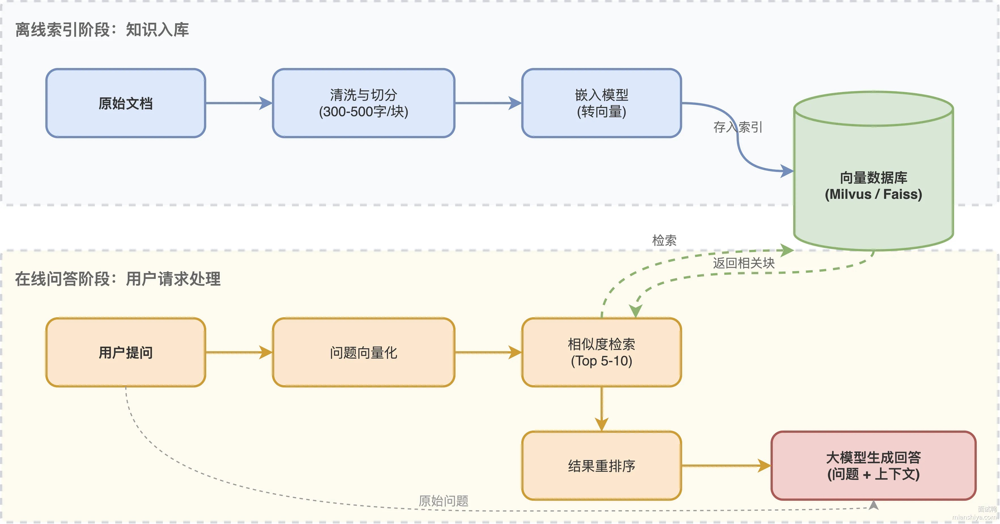
整个流程的精髓在于：大模型不再"裸奔"回答问题，而是带着检索到的知识去生成，既能减少幻觉，又能让回答有据可查。

### 文档分块策略

分块是 RAG 效果的关键，块太大检索不精准，块太小又丢失上下文。常见的三种切法：

1）语义切分：用 SemanticSplitter 这类工具，保证每个块语义完整独立，比如一个问答对不会被切成两半

2）结构切分：HTML、PDF 这种有层级的文档，按标题层级切割，像 HTMLHeaderTextSplitter 就能保留文档结构

3）递归切分：RecursiveCharacterTextSplitter 先按大的分隔符切，切不动了再按小的切，兼顾连贯性和长度限制

实际项目里，300-500 字一块是比较通用的起点，具体要根据业务场景调。

### 检索阶段的优化手段

单纯靠向量检索其实不够用，生产环境通常会做多路召回：

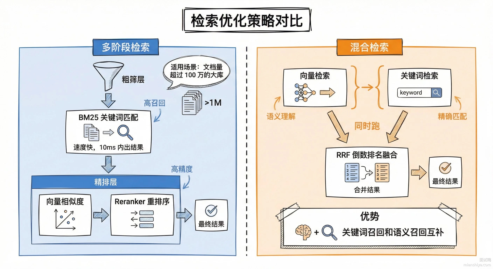
混合检索特别适合那种用户可能用专业术语搜索的场景，纯向量检索容易漏掉精确匹配的结果。

### Prompt 组装技巧

检索完拿到一堆文档块，怎么塞给大模型也有讲究：
```python
# 典型的 RAG Prompt 模板
prompt = """基于以下参考资料回答用户问题。如果资料中没有相关信息，请说明无法回答。 参考资料： {context} 用户问题：{query} 回答："""
```
上下文太长会影响模型效果，超过 4000 token 的时候可以考虑做摘要压缩，RAPTOR 这类树状摘要方案就是干这个的。

---

## 57. RAG 为什么需要做文档切割？

### 回答重点

RAG 系统需要文档切割的原因主要有三个。

第一是模型的上下文窗口限制。大模型一次能处理的文本长度有限，比如 4K、8K、16K token。一份完整文档可能有几万甚至几十万字，根本塞不进模型。必须切成小块，只把相关的几块传给模型。

第二是检索精度的需要。如果不切割，检索的粒度就是整篇文档。用户问一个具体问题，系统返回一整篇长文档，里面大部分内容都不相关。切成小块后，能更精准地找到包含答案的那几段，提高信息密度。

第三是向量表示的质量。一个向量要表示的内容越多，信息越复杂，向量就越难准确表达。切成小块后，每个向量只需要表达一小段内容的语义，表达更准确，检索效果也更好。

常见的切割策略有几种。按字符数切割是最简单的，比如每 500 字符一块。按段落切割，以自然段为单位，保持内容完整性。按句子切割，不破坏句子结构。更智能的是按语义切割，AI 分析内容后在语义完整的地方切分。不同类型的文档适合不同的策略。

---

## 58. 什么是文档分块（Chunking）？

分块就是把原始长文本拆成若干个小块，每个小块通常几百到上千字，包含相对完整的语义单元，比如一个段落、几个段落或一个小节。

为什么需要分块？核心原因有三个：

1）模型处理能力有上限。大语言模型一次能吃进去的文本长度是有限制的，GPT-4 Turbo 是 128K tokens，Claude 3 是 200K tokens。一本 10 万字的书直接塞进去，模型消化不了，得先切成小块。

2）检索需要精准定位。用户提问通常只关心局部内容，比如问"第三章的案例是什么"。把整本书向量化成一个大向量，检索时根本分不清哪段最相关。切成小块后，每个块都有自己的向量表示，检索时能快速找到最匹配的那几个块。

3）平衡上下文和计算效率。小块既能保留足够的上下文让模型理解前后逻辑，又能让向量计算和存储更高效。一个 500 tokens 的块比 5000 tokens 的块在相似度计算时快得多。


### 扩展知识

### 分块大小怎么定

这是个没有标准答案的问题，得根据场景权衡：


块太小，上下文丢了。比如一句话被拆成两半，前半句说"虽然这个方案有风险"，后半句说"但收益远大于成本"，拆开后模型只看到前半句，直接理解成"方案有风险不能用"，完全断章取义。

块太大，检索精度下降。一个 2000 tokens 的块里塞了三个不相关的话题，用户问其中一个话题时，另外两个话题的内容也被带进来了，干扰模型生成答案。


实践中常用的 chunk 大小在 **200 到 500 tokens** 之间作为起点。对于长技术文档或学术报告，可以放宽到 512 到 1024 tokens。同时建议设置 10% 到 20% 的重叠，让相邻块之间有交集，避免关键信息刚好卡在分界线上被截断。

也可以参考 [OpenAI官方RAG分块默认值](https://platform.openai.com/docs/guides/retrieval#chunking)

### 元数据标注不能少

光切块不够，每个块还得带上身份信息：

1）来源信息：这个块属于原文档的哪一章、哪一节 2）位置信息：在原文档中的页码、段落编号 3）类型信息：是正文、标题、列表还是图表说明

这些元数据在检索时很关键。用户问"附录 A 的公式怎么推导"，检索系统能通过元数据直接定位到附录 A 的块，不会误匹配到正文里长得像的内容。

### 常用分块工具

LangChain 的 RecursiveCharacterTextSplitter 支持滑动窗口和语义拆分，是目前用得最多的。Hugging Face 的 Tokenizers 能按 token 数精确拆分，适合对 token 限制敏感的场景。LlamaIndex 也有内置的分块器，支持按段落、句子等多种粒度切分。

---

## 59. 常见的文档分块策略有哪几种？

常见的分块策略有六种：**自然结构分块、固定大小分块、滑动窗口分块、递归分块、语义分块和混合分块**。

1）自然结构分块：按文档原有格式拆分，遇到标题、空行、章节编号、句号这些天然分隔符就切一刀。Markdown 文档按 ### 切、普通文档按段落空行切。

2）固定大小分块：不管内容是什么，按固定字符数、词数或 token 数均匀切。比如每 500 tokens 切一块，简单粗暴，适合快速处理大量非结构化文本。

3）滑动窗口分块：在固定大小基础上加了重叠机制。相邻两个块之间保留 10% 到 20% 的重叠内容，避免关键信息刚好卡在分界线上被截断。

4）递归分块：分层拆分，先按大结构粗分，超长的部分再递归细化。比如先按章节切，章节太长就按段落切，段落还长就按句子切，直到块大小达标。

5）语义分块：用 NLP 模型判断语义边界，确保每个块是完整的语义单元。不是机械按字数切，而是让模型识别"这段话讲完了，下一段是新话题"的位置。

6）混合分块：把上面几种策略组合起来用。先固定分块快速处理，再对关键部分做语义优化，类似粗筛加精修的思路。


---

## 60. RAG 的文档解析有哪几个核心步骤？

文档解析是 RAG 索引流程的第一步，主要分 **5 个核心步骤**，可以概括为"读、洗、拆、标、存"：

1）读，文档加载。支持多格式解析，PDF、Word、Markdown、HTML、图片都能处理，用工具库读取原始内容，比如 PyPDF2 读 PDF、Docx2Text 读 Word、Unstructured 处理复杂格式

2）洗，文本清洗。去除噪声内容，像页眉页脚、乱码、重复段落都要干掉，标准化文本格式，统一大小写、替换特殊符号，处理中英混合文本时保留语义完整性

3）拆，文本分块。按语义单元拆分成合适长度的知识块，[常见分块策略](https://www.mianshiya.com/bank/1906189461556076546/question/1912795349320720385)有固定长度、按句子、按段落等

4）标，元数据标注。给每个知识块附加来源信息，文档标题、URL、作者、上传时间都要记录，还有结构信息比如章节标题、段落位置，以及领域标签方便后续检索过滤

5）存，结构化输出。把分块后的文本和元数据整合成索引系统能识别的格式，输出给向量数据库 FAISS 或 Elasticsearch 建立索引


---

## 61. RAG 系统中数据接入与格式统一怎么做？

### 回答重点

**1、首先是数据接入与格式的统一**

- **多源数据整合**：文档（PDF/Word）、表格（CSV/Excel）、网页（HTML）、API接口等，用工具（如PyPDF2、BeautifulSoup）提取纯文本。
- **格式标准化**：统一编码（UTF-8）、去除乱码（如“�”替换为空格）、转换大小写（统一小写避免“iPhone”和“iphone”被视为不同词）。

**2、开始清洗降噪，过滤无效信息**

- 去除重复内容（如文档中的页眉页脚、会议记录的重复发言）。
- 过滤噪声符号（标点、特殊字符、markdown格式），保留核心文本。

> 还要注意**敏感信息处理**！用正则或库（如PII Detection）删除隐私数据（手机号、邮箱），避免泄露。

**3、需要进行分块**

- 段落、章节标题、标点（句号/分号）切分，避免切断上下文（如“第一段前半+第二段后半”导致语义断裂）。
- 控制长度，比如单个知识块300-500字（约500-800 tokens），适配大模型上下文窗口（如GPT-4默认8k tokens，可放10-15个块）。

具体操作的时候，可以用 LlamaIndex 的`RecursiveCharacterTextSplitter`（优先按标题/段落切分，再按字符数截断）、Hugging Face的`TokenTextSplitter`（按token数切分）。

**4、元数据标注**

- 用规则或LLM提取结构化信息（如文档中的“时间”“地点”“关键词标签”等元数据），作为检索时的过滤条件（如用户问“2025年的政策”，优先召回含“2025”元数据的块）。

最后就可以进行索引的构建了，为了用上混合检索，需要进行向量索引和关键词的倒排索引。

---

## 62. 如何选择 Embedding 模型？

### 回答重点

选择 Embedding 模型要考虑四个核心因素：语言支持、效果质量、成本和维度。

语言支持是首要考虑的。如果做中文 RAG，必须选对中文友好的模型。OpenAI 的 text-embedding-ada-002 和 text-embedding-3 系列对中文支持不错，国产模型如阿里云的 text-embedding-v4、智谱的 embedding-3、百度的 bge 系列专门针对中文优化，效果通常更好。如果是多语言场景，要选跨语言能力强的模型。

效果质量直接影响检索准确性。可以用 MTEB（Massive Text Embedding Benchmark）等基准测试的排名作为参考，但最好用自己的数据测试。准备一批典型问题和对应答案，看不同模型的检索召回率和准确率。有时候排名靠前的模型在你的场景不一定最好，要实测。

成本包括调用费用和响应时间。商业 API 如 OpenAI、阿里云都按调用次数或 token 数收费。如果数据量大、调用频繁，成本会很可观。开源模型如 bge、text2vec 可以自己部署，初期投入大但长期成本低。还要考虑响应时间，影响用户体验。

向量维度是个权衡点。维度越高，表达能力越强，但存储和计算成本也越高。OpenAI ada-002 是 1536 维，bge-large 是 1024 维，bge-base 是 768 维，bge-small 是 384 维。如果数据量不是特别大、对效果要求不是特别高，可以选维度低一点的模型降低成本。

---

## 63. RAG 中的 Rerank（重排序）是干什么的？

在 RAG 中，Rerank 是一个对初步检索返回的候选文档列表进行再次排序的过程。

我们可以把 RAG 的检索过程想象成**公司招聘**：

1）**初步检索（Retrieval）**

这就像是 **HR 筛简历**（海选）。HR 手里有几万份简历，她不可能每份都细看。她主要是看关键词，比如Java、5年经验。这样虽然速度快，但比较粗糙。有时候关键词匹配了，但其实候选人能力不行。

这就对应了我们常用的**向量检索**（Bi-Encoder），它算得快，但对语义理解没那么深。只能选出 **Top 100 个看起来还行的**候选人。

2）**重排序（Rerank）**

这就像是 **业务主管面试**（精选）。主管把这 100 个人的简历拿来，一份份仔细读，甚至还要面对面聊（计算 Query 和 Document 的深层交互）。

因此速度慢，比较费脑子，但看得准。这就是 Rerank 模型（通常是 Cross-Encoder），它能精准判断这个文档是不是真的能回答用户的问题。即从 100 个人里挑出 Top 5 个**最匹配**的，最后喂给大模型去生成答案。

所以，Rerank 的核心价值就是在**速度**和**精度**之间做一个平衡。 先用向量检索保速度，再用 Rerank 保精度，防止大模型因为看了垃圾文档而胡说八道。

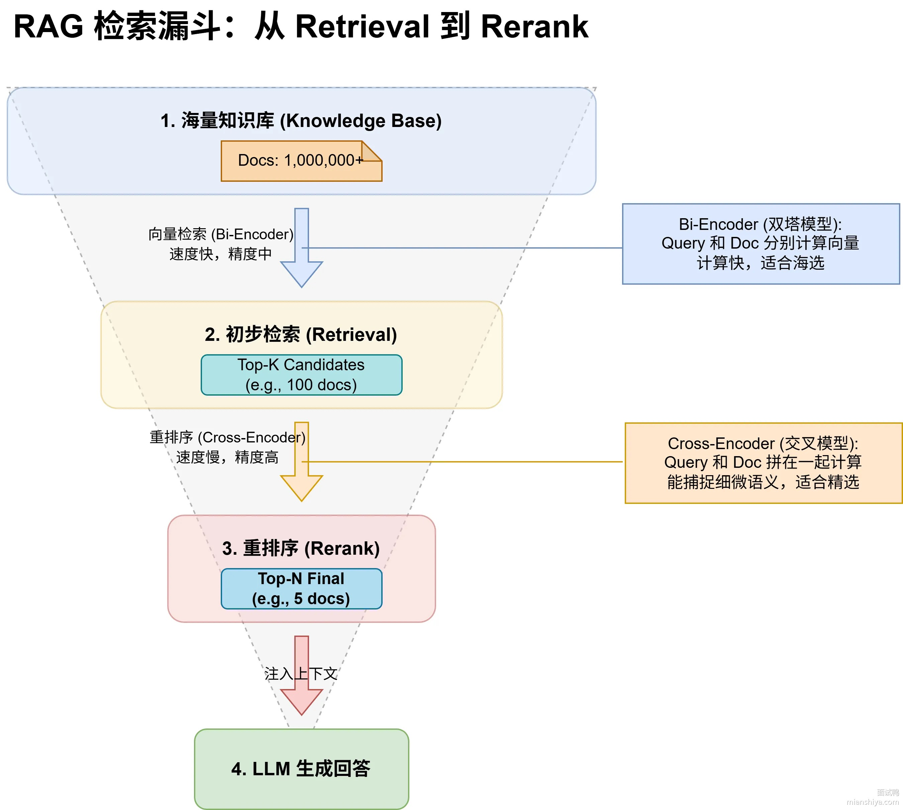
简单来说，A2A 就是为了建立一个去中心化的 Agent 互联网，让不同厂商的 AI 能在一个安全、标准的框架下，进行长时间、多模态的自主协作。

---

## 64. 什么是混合检索？为什么要把向量检索和关键词检索结合？

**混合检索**是指在 RAG 应用中，把向量检索和关键词检索结合起来，取长补短，提升检索结果的全面性和准确性。

为什么要混合？因为两种检索方式各有软肋：

向量检索擅长语义理解，比如"猫捕猎老鼠"和"猫追逐老鼠"能匹配上。但难以精准匹配专有名词比如 "iPhone 15"。

关键词检索正好反过来，精确匹配没问题，但理解不了语义，用户问"怎么减肥"，它匹配不到"如何瘦身"。

混合检索就是两条路并行走，向量检索走一遍，关键词检索走一遍，最后把两边的结果融合起来，用权重加权或者 RRF 算法重排序，取最优结果喂给大模型。

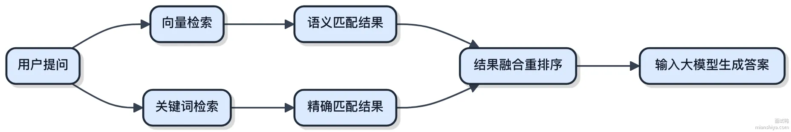

工程上 Elasticsearch 就同时支持关键词检索和向量检索，可以用 LlamaIndex + Elasticsearch 快速搭建混合检索系统。

---

## 65. 什么是查询扩展（Query Expansion）？

查询扩展就是把用户的原始问题"补全"，加上同义词、相关术语、隐含意图这些信息，让检索能覆盖更多相关文档。用户输入"减肥"，扩展后可能变成"健康减肥方法 饮食控制 运动减脂 避免反弹"。
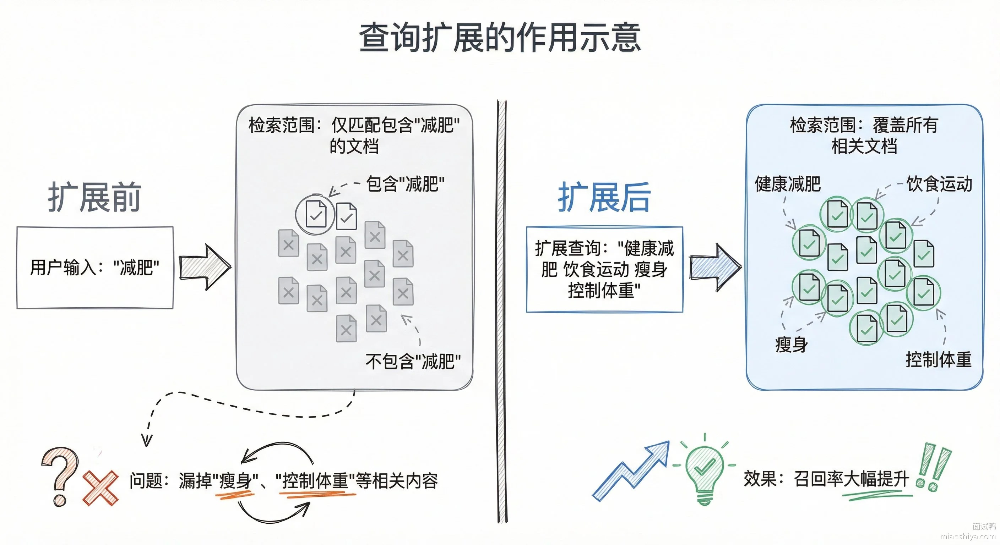

RAG 的核心是"先检索后生成"，检索这一步没捞到好东西，后面生成的回答肯定也好不了。查询扩展主要解决两个痛点：

1）**词汇不匹配**：用户说"新冠"，知识库里存的是"COVID-19"，不扩展就搜不到 
2）**查询太模糊**：用户就输入"怎么理财"三个字，扩展后变成"新手理财入门 低风险投资 基金股票区别"，检索方向一下就明确了

---

## 66. 什么是自查询（Self-Query）？怎么把自然语言转成结构化查询？

自查询（Self-Query）是 RAG 系统自动解析用户查询中隐含条件的机制，把模糊的自然语言转成**结构化查询语句**。

比如用户说"2025年鸭鸭的用户报告"，自查询会拆成两部分： 1）语义匹配：用户报告 2）元数据过滤：作者=鸭鸭、时间=2025

为什么需要自查询？用户提问往往带着隐含条件，传统向量检索只管语义相似度，压根不看元数据。结果就是检索出一堆语义相关但时间、作者、标签全不对的文档。自查询通过"解析+过滤"两步走，让检索同时满足语义相关性和元数据条件，直接解决"检索不准"的痛点。


### 扩展知识

### 自查询的工作流程

自查询发生在用户输入到检索文档之间的意图解析阶段，整个流程分这么几步：

用户输入一个查询后，系统先判断要不要做自查询。如果用户问得很明确，直接拿原始查询去检索就行。如果用户表述模糊、带隐含条件，就进入意图解析环节，让 LLM 把自然语言拆成语义关键词和元数据过滤条件，生成结构化查询。然后拿着这个结构化查询去向量库做检索，结合元数据过滤筛选文档，最后排序后送给生成模型出答案。


### 自查询模板示例

下面是一份结合语义向量搜索与元数据过滤的自查询指令模板：
```json
{
  "vector_search": {
    "query_text": "风险控制策略 监管趋势",
    "embedding_model": "text-embedding-3-large"
  },
  "metadata_filter": {
    "must": [
      {
        "field": "author",
        "operator": "=",
        "value": "李四"
      },
      {
        "field": "date",
        "operator": ">=",
        "value": "2025-01-01"
      }
    ],
    "should": [
      {
        "field": "tags",
        "operator": "in",
        "value": [
          "金融",
          "风控"
        ]
      }
    ]
  },
  "options": {
    "limit": 10,
    "score_threshold": 0.75
  }
}
```

---

## 67. 向量检索 + Metadata Filter 在工程上是怎么落地的？

vector_search 负责语义匹配，metadata_filter 里的 must 是必须满足的硬性条件，should 是加分项。这套结构在 Qdrant、Milvus 这类向量数据库里都能直接用。

### 自查询 vs 查询扩展

|维度|自查询|查询扩展|
|---|---|---|
|核心目标|精准匹配内容+元数据双重条件|解决词不匹配问题，提升查全率|
|技术手段|LLM 解析隐含元数据，生成结构化查询|同义词扩展、LLM 生成查询变体|
|数据依赖|知识库的元数据标注质量|语料库、用户日志、语义关系库|
|适用场景|带条件的专业搜索|用户表述模糊的问答场景|
|优点|精准过滤噪声、支持权限控制|提升语义覆盖、减少漏检|
|缺点|需预定义元数据字段、解析错误会带偏结果|可能引入无关词、需平衡查全率与查准率|

实际项目里两者可以配合用。比如先通过自查询过滤出"2025年的金融报告"，再通过查询扩展补充"风险控制""监管政策"等关键词，既精准又全面。

---

## 68. 什么是提示压缩（Prompt Compression）？

**提示压缩**是对检索出的文档内容做精简处理，提取核心信息、过滤无关文本，让最终喂给大模型的内容既保留关键信息，又不撑爆上下文窗口。

比如检索到一篇 10 页的技术白皮书，压缩后只保留跟用户问题相关的 2 个核心章节和关键数据，那些无关段落直接砍掉。

为什么需要提示压缩？RAG 的生成效果全靠喂给模型的文档质量，检索出来的文档通常有三个问题：

1）上下文窗口有限。GPT-4 Turbo 是 128k tokens，Claude 是 200k tokens，听着很大，但实际业务里检索 10 篇文档轻松就超了。压缩能把关键信息浓缩进有限的 token 里。

2）无关内容稀释重点。用户问"如何优化代码"，文档里 80% 是算法原理、只有 20% 是优化技巧，不压缩的话模型容易被原理部分带跑偏，甚至产生幻觉。

3）省钱省时间。调用商业大模型按 token 计费，GPT-4 每 1000 tokens 要 0.03 美元，多塞 5000 个无关 token 就是白花 0.15 美元。推理速度也会变慢，每多 1000 tokens 大概慢 200ms。


### 扩展知识

### 提示压缩在 RAG 中的位置

提示压缩模块夹在检索和生成之间。用户问题先走检索模块拿到原始文档集合，这些文档可能又长又杂，然后经过压缩模块精简成核心片段，最后把压缩后的内容拼上用户问题一起送进大模型生成答案。


### 压缩方案落地

一般用小模型或规则算法来做压缩，直接让大模型压缩太贵了。

LLMLingua 是微软开源的方案，基于信息熵评估每个 token 的重要性，把冗余内容直接砍掉。用 LlamaIndex 集成起来很简单：
```python
from llama_index.indices.postprocessor import LongLLMLinguaPostprocessor
node_postprocessor = LongLLMLinguaPostprocessor( instruction_str="根据上下文回答问题" )
contexts = retriever.retrieve(question)
compressed_contexts = node_postprocessor.process(contexts)
```

instruction_str 是压缩的指导方向，可以根据场景调整：
```python
# 强调保留关键实体
instruction_str = "保留文档中的人名、日期和数字"
# 任务导向压缩
instruction_str = "根据问题提取相关事实"
# 图文场景
instruction_str = "压缩文本时保留与图片中logo相关的描述"
```
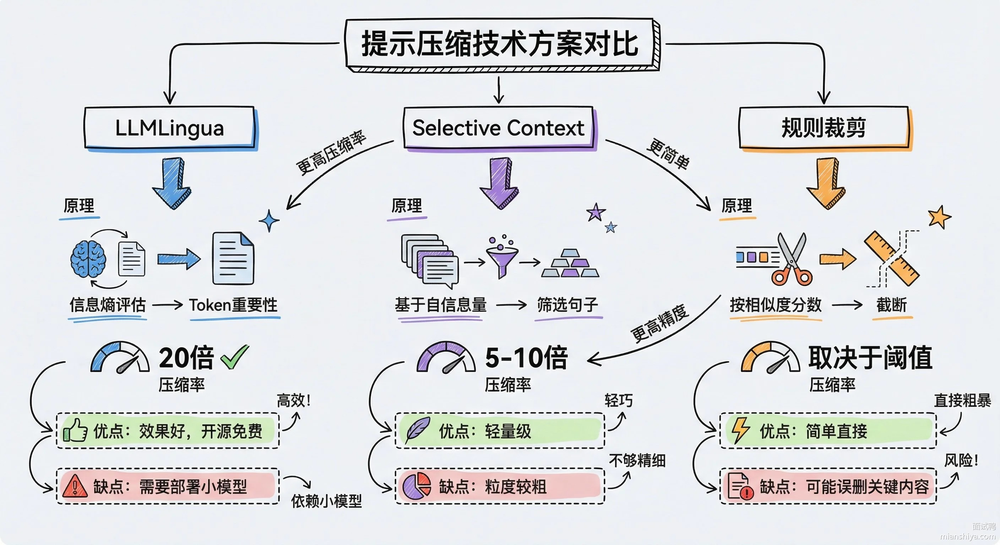
### 不做压缩会出什么问题

1）上下文溢出直接废掉。假设模型最大支持 8k tokens，用户问题占 500 tokens，文档占 9000 tokens，超出的部分直接被截断。用户问"文档第 3 章的结论"，但第 3 章因为长度超限压根没进去，模型只能干瞪眼。

2）生成质量崩盘。文档里塞了一堆无关内容会误导模型。用户问"如何治疗感冒"，检索到的文档同时提到了感冒和癌症，不压缩的话模型可能把癌症治疗方法也扯进来。

3）成本失控。处理长文档消耗的计算资源翻倍，token 单价成本能涨 50%，生成速度也拉胯。

---

## 69. RAG 中的提示工程要注意什么？

RAG 提示工程的核心就一句话：让模型老老实实基于检索内容回答，别自己瞎编。

具体落地时有几个关键点：

1）角色锁定：开头就把模型身份定死，"你是一个 xx 领域的专业助手，只能基于提供的资料回答"。这一句能把模型的自由发挥空间压缩 80%。

2）结构化模板：把检索内容、用户问题、输出格式用明确的标记分隔开，模型处理起来更清晰。常见的格式是"背景资料 + 用户问题 + 期望输出"三段式。

3）兜底指令：必须加一条"如果提供的资料中找不到答案，直接回复'未找到相关信息'"，不然模型会用自己的"知识"补位，幻觉就来了。

4）Few-shot 示例：给 1-2 个标准问答样例，让模型知道该用什么语气、什么结构回答。实测加示例比不加，输出格式稳定性能提升 30% 以上。


工业级 RAG 系统的 Prompt 模板一般长这样：
```text
# Role: {角色定义}

## Context 以下是检索到的相关资料： {retrieved_documents}

## User Question {user_question}

## Instructions
1. 只能基于上述资料回答，不要使用任何外部知识
2. 如果资料中找不到答案，回复"根据现有资料无法回答该问题"
3. 回答中需要标注引用来源

## Output Format - 回答： - 引用：
```

这个模板里有几个细节值得说：

1）Context 放在 Instructions 前面，让模型先"看"到资料再接收指令，符合人类阅读习惯，实测效果比反过来好。

2）Instructions 里的"不要使用任何外部知识"要反复强调，模型对这类否定指令的遵循度不高，写一遍不够可以写两遍。

3）Output Format 定死格式后，下游解析就简单了，正则一匹配就能拿到结构化数据。


---

## 70. 一个好的 RAG Prompt 应该怎么设计？

### 回答重点

RAG 中的 Prompt 设计要让大模型明确知道：这些是参考资料，要基于这些资料回答，不要编造。一个好的 RAG Prompt 通常包含三部分：系统指令、检索文档、用户问题。

系统指令部分要明确告诉模型角色和行为准则。比如"你是一个知识助手，请基于提供的文档回答问题。如果文档中没有相关信息，请明确说明，不要编造答案。"这样的指令能减少幻觉，让模型老实回答。

检索文档部分要有清晰的格式和边界。用分隔符（如 `###`、`---` 或 XML 标签）把文档括起来，让模型清楚哪部分是参考资料。可以给每个文档编号，方便模型引用。如果文档有标题或来源，也要包含进去，这些信息有助于模型理解和引用。

用户问题部分要放在最后，直接明了。有时候还可以加一些引导，比如"请结合上述文档回答：{问题}"、"请引用文档中的具体内容回答：{问题}"。这种引导能让模型更好地利用文档。

**Prompt 示例：**

```text
你是一个专业的知识助手。请仔细阅读以下参考文档，基于文档内容回答用户问题。
【重要规则】 - 只使用文档中的信息回答 - 如果文档中没有相关信息，明确告知用户 - 尽可能引用具体的文档片段 - 不要添加文档外的信息
【参考文档】 文档1： {检索到的文档1} 文档2： {检索到的文档2}
【用户问题】 {用户的问题} 请回答：
```

---

## 71. 什么是上下文查询增强？

上下文查询增强是 RAG 流程中的一个核心环节，指的是把用户的原始查询与从知识库中检索到的相关文档进行结合，形成一个信息更丰富的增强提示，然后将这个增强提示提供给 AI，让模型能基于这些特定知识生成回答。主要作用是为大模型提供必要的、实时的外部知识，这样 AI 的回答就不仅仅依赖于其预训练的通用知识，提高答案的准确性、相关性和时效性。


Spring AI 的 `RetrievalAugmentationAdvisor` 内部使用 `ContextualQueryAugmenter` 来实现上下文查询增强。当处理用户提出的无关问题时，`ContextualQueryAugmenter` 提供了空上下文处理机制。


我们可以配置 `ContextualQueryAugmenter` 的 `allowEmptyContext(false)`，并提供一个自定义的 `emptyContextPromptTemplate`。 检索不到相关文档时，系统会使用这个自定义模板来指示大模型如何回应。在我们的项目中，这个自定义模板会引导 AI 礼貌地告知用户 “它只能回答恋爱相关的问题”，并给出联系客服的方式，优雅地处理了超出知识库范围的提问。

---

## 72. 什么是 Advanced RAG？它对传统 RAG 做了哪些优化？

Advanced RAG 就是把传统 RAG 的三个阶段都加上"外挂"：**检索前优化、检索中优化、检索后优化**。传统 RAG 的问题很明显，检索不准、上下文断裂、生成质量不稳定，Advanced RAG 就是针对这些痛点一个一个打补丁。


检索前优化：在用户查询到达检索引擎之前先做预处理。包括滑动窗口分块让文档切得更合理、给文档加元数据方便过滤、建分层索引提升检索效率、查询重写把用户的口语化表达转成精准查询、查询扩展补充相关关键词扩大召回范围。

检索中优化：检索引擎内部的改造。动态嵌入根据场景调整向量表示、混合检索把关键词匹配和语义检索结合起来、文档嵌入优化让向量质量更高、递归块合并把相关内容拼成完整上下文。

检索后优化：拿到检索结果后再做一轮处理。重排序用模型给结果打分把最相关的提前、提示压缩砍掉冗余信息、上下文重构让内容逻辑更清晰、内容过滤剔除过时或错误数据。

对比： 

上图来自 [https://arxiv.org/pdf/2312.10997](https://arxiv.org/pdf/2312.10997)

> 前面很多 RAG 优化相关的面试题，其实都是 Advanced RAG 的某个环节。

---

## 73. 什么是 Modular RAG？

Modular RAG 就是把传统 RAG 系统拆成一堆**松耦合、可重组**的功能模块，每个模块各干各的事，由一个统一的编排器负责调度和路由，这样整体系统更灵活、可插拔、好维护。

核心模块拆解：

1）Indexing 索引模块：对文档做分块优化，比如拆成小句、合并大段保留上下文，还会构建知识图谱，让知识存储更有序，检索起来更快

2）Pre-Retrieval 检索前处理：通过查询转换把口语化的提问转成精准指令，再做查询扩展补充相关关键词，让检索目标更清晰

3）Retrieval 检索模块：采用混合检索策略，向量搜索 + 关键词匹配一起上，可以从句子、文档块、结构化数据等不同粒度召回内容

4）Post-Retrieval 检索后处理：对召回结果做重排序，把最相关的内容筛出来，同时压缩掉冗余信息，提升输入质量

5）Generation 生成模块：用大模型生成回答，并通过外部知识验证准确性，避免幻觉


它的核心优势就三点：替换或升级单个组件不影响整体、模块化测试迭代效率高、方便接入新型检索或多模态能力。

更详细的可以参考[这个图](https://arxiv.org/pdf/2407.21059)：


从图里能看到 Modular 包含 Advanced，Advanced 包含 Naive。实际上 Modular 和 Advanced 最显著的区别就是加了**编排层**，能自由控制和优化检索生成的全流程，动态决定查询处理路径，灵活应对复杂场景。

---

## 74. Spring AI 提出的模块化 RAG 架构是怎样的？

Spring AI 提出的模块化 RAG 架构是将整个检索增强生成过程分解为 **预检索、检索、检索后** 三个核心阶段，每个阶段包含可配置的组件，以提升大模型响应的准确性和灵活性。

1）预检索阶段 (Pre-Retrieval)：

- 职责：接收用户的原始查询，并对其进行优化和转换，生成更适合后续检索的查询版本。
- 组件：包括各种 `QueryTransformer`，如 `RewriteQueryTransformer`（改写查询使其更清晰）、`TranslationQueryTransformer`（翻译查询）、`CompressionQueryTransformer`（在多轮对话中压缩历史和当前问题）、以及 `MultiQueryExpander`（将单查询扩展为多查询，提高召回）。

2）检索阶段 (Retrieval)：

- 职责：使用预检索阶段优化后的查询，从知识库中搜索并召回最相关的文档片段。
- 组件：核心是 `DocumentRetriever`（如 `VectorStoreDocumentRetriever`），它负责执行相似性搜索并根据元数据过滤结果。如果涉及多源检索，还可能用到 `DocumentJoiner` 来合并结果。

3）检索后阶段 (Post-Retrieval)：

- 职责：对检索到的文档集进行进一步处理和优化，筛选出最适合提供给大模型的上下文，可以解决上下文丢失问题、上下文长度限制，并减少冗余内容。
- 组件：可能包括文档重排序、无关文档移除、文档内容压缩或摘要等。Spring AI 提供了 `DocumentPostProcessor` API 来支持自定义的后处理逻辑，但目前并不成熟。

---

## 75. RAG 检索效果差，应该从哪些方向优化？

### 回答重点

RAG 检索效果差，问题通常出在**文档切片、查询理解、检索策略**三个环节。优化要从源头抓起。

1）文档预处理：原始文档质量不行，后面再怎么调参都白搭。首先清洗掉水印、页眉页脚、乱码，保证内容干净。切片策略很关键，固定 512 tokens 切一刀这种做法太粗暴，容易把一句话从中间截断。推荐用语义边界切分，比如按段落、按小节，或者用 LangChain 的 RecursiveCharacterTextSplitter 先按段落切，段落太长再按句子切。另外给每个切片打上元数据标签，来源文档、章节、日期这些，检索时能做精确过滤。

2）查询增强：用户问的"鱼皮是谁"跟知识库里写的"程序员鱼皮，原名某某，技术博主"对不上，向量相似度不高。解决办法是用大模型做查询重写，把口语化的问题转成规范表达，或者做查询扩展，一个问题拆成 3-5 个不同角度的子查询，合并召回结果。

3）混合检索：单纯的向量检索有个致命问题，专有名词、代码片段、数字这些精确匹配的东西召回率很低。解决办法是向量检索 + BM25 关键词检索组合，用 RRF 算法融合排序。Elasticsearch 8.x 原生支持这种混合检索。


除此之外，还有重排序：召回 top 50 之后，用 Cross-Encoder 重排序模型精排一遍，把真正相关的排到前 5。Cross-Encoder 比 Bi-Encoder 准确率高 10-15%，但速度慢，所以只用来精排。

### 扩展知识

### 切片粒度的权衡

切片大小没有银弹，取决于业务场景：

|切片大小|优点|缺点|适用场景|
|---|---|---|---|
|小（100-200 tokens）|检索精准、定位准确|语义不完整、丢失上下文|FAQ、定义查询|
|中（300-500 tokens）|平衡精准度和完整性|需要调参|通用文档检索|
|大（800-1500 tokens）|上下文完整|引入噪音、超出上下文窗口|长文档摘要|

实际项目中推荐用**滑动窗口 + 重叠**的方式，比如 chunk_size=500，overlap=100，相邻切片有 100 tokens 重叠，避免边界处的信息丢失。

### 向量检索的调参细节

用 PGVector 或 Milvus 做向量检索，有几个参数直接影响效果：

1）相似度阈值：一般设 0.7-0.8。低于 0.6 的结果基本是噪音，但阈值设太高会漏掉相关文档。建议先不设阈值，看一批查询的相似度分布，再定阈值。

2）top_k 数量：召回阶段可以设大一点，比如 50-100，后面用重排序筛选。直接喂给大模型的话控制在 3-5 个，太多了模型反而会被干扰。

3）索引类型：HNSW 的召回率比 IVFFlat 高 5-10%，但内存占用大。百万级数据用 HNSW，千万级以上考虑 IVFFlat + 分区。

4）Embedding 维度：OpenAI 的 text-embedding-3-large 支持 256/1024/3072 三种维度。维度越高精度越高，但检索速度越慢、存储成本越高。大多数场景 1024 维够用。


### HyDE：假设性文档嵌入

这是一个很巧妙的查询增强技巧。用户问"Python 怎么读取 CSV 文件"，传统做法是把这个问题向量化去检索。HyDE 的做法是先让大模型生成一个"假设性答案"，比如生成一段 Python 读 CSV 的代码，然后用这个假设答案去做向量检索。

原理是假设答案跟知识库里的真实答案在语义空间里更接近。实验数据显示 HyDE 能把召回率提升 10-20%，特别是那种问题和答案表述差异大的场景。

代价是每次查询要多调一次大模型，延迟增加 1-2 秒，成本也翻倍。所以只适合对召回率要求极高的场景，比如医疗、法律咨询。

### Reranker 模型选型

重排序模型直接决定最终精度。几个主流选择：

1）Cohere Rerank：API 形式调用，简单但有网络延迟和成本

2）bge-reranker-v2-m3：开源模型，支持多语言，本地部署延迟低

3）cross-encoder/ms-marco-MiniLM：轻量级，速度快但精度稍逊

推荐组合：召回用 Bi-Encoder 快速拿到 top 50，精排用 Cross-Encoder 筛出 top 5。这种两阶段架构在工业界很常见，是精度和速度的最佳平衡点。

### 面试官追问

### 提问：如果知识库里有多种格式的文档，比如 PDF、Word、网页，切片策略要怎么处理？

回答：不同格式的文档结构差异很大，不能一刀切。PDF 要先用 PyMuPDF 或 Unstructured 提取文本，注意保留段落结构，表格单独处理。Word 文档可以按大纲级别切分，一级标题下的内容作为一个 chunk。网页要先清洗 HTML 标签，按 DOM 结构或者 `<article>` 标签提取正文。最好是建一个预处理 Pipeline，根据文件类型走不同的处理分支，最后统一输出成标准化的切片格式。

### 提问：检索结果里有重复内容怎么办？

回答：这个问题在用滑动窗口切片时很常见，相邻切片内容重叠导致召回的好几条结果其实是同一段话。解决办法是在召回之后做去重，可以用 MinHash 或者 SimHash 算相似度，相似度超过 0.9 的只保留一条。另一种办法是在检索时加上 document_id 去重，同一个文档最多召回 2-3 条。LangChain 的 MultiQueryRetriever 有内置的去重逻辑可以直接用。

### 提问：怎么评估 RAG 的检索效果？有什么指标？

回答：常用指标是 Recall@K 和 MRR。Recall@K 是看前 K 条结果里有没有包含正确答案，K 一般取 5 或 10。MRR 是正确答案排名的倒数的平均值，排名越靠前分数越高。评估需要一个标注好的测试集，包含问题和对应的正确文档 ID。实际操作中可以先人工标注 100-200 条，跑一遍看基线效果，然后每次调参之后对比变化。如果没人力标注，可以用大模型自动判断检索结果是否包含问题的答案，不完全准确但能看趋势。

---

## 76. 什么是多路召回与动态权重？

### 回答重点

多路召回就是同时用多个检索器去捞文档，比如一路用向量检索抓语义相关的，一路用 BM25 抓关键词匹配的，最后把结果合并起来。**动态权重**的意思是不写死每路的权重，而是根据 query 的特点实时调整。

LangChain 里实现这个功能主要靠 **EnsembleRetriever**，它能把多个 retriever 组合起来，每个 retriever 配一个权重，最后按权重做 RRF 融合排序。


核心代码长这样：

```javascript
import { EnsembleRetriever } from "langchain/retrievers/ensemble"
// 创建两路检索器
const vectorRetriever = vectorStore.asRetriever({ k: 10 })
const bm25Retriever = new BM25Retriever({ k: 10, docs: documents })
// 根据 query 动态计算权重
const getWeights =
async (query) => {
// 简单策略：query 短就偏向关键词，query 长就偏向语义
if (query.length < 20)
return [0.4, 0.6]
// [向量, BM25]
return [0.7, 0.3] }
// 动态创建 EnsembleRetriever
const dynamicRetrieve =
async (query) => {
const weights =
await getWeights(query)
const ensemble = new EnsembleRetriever({ retrievers: [vectorRetriever, bm25Retriever], weights: weights })
return ensemble.invoke(query) }
```

更复杂的场景可以让 LLM 来判断 query 类型，然后根据类型分配权重。比如技术问题向量权重高一点，日常闲聊 BM25 权重高一点。

---

## 77. RAG 召回不准应该怎么优化？

### 回答重点

RAG召回不准，问题一般出在三个环节：文档切得不对、检索策略太单一、或者排序没做好。优化也是围着这三个环节来。

**预处理阶段**：数据清洗把噪声去掉，元数据打标签方便后续过滤，分块策略要根据业务场景调，chunk太大信息稀释，太小上下文断裂

**检索阶段**：单纯靠向量检索容易漏掉关键词精确匹配的结果，单纯靠BM25又抓不住语义。混合检索把两者结合起来效果更好。另外查询重写能解决用户表达模糊的问题

**后处理阶段**：初检结果往往不够精准，加一层重排序模型二次打分。上下文压缩把不相关的内容过滤掉，省token也提升生成质量


### 扩展知识

### 查询重写的几种玩法

用户输入的query经常有问题：太短、太模糊、或者表达方式和文档库的描述对不上。查询重写就是让LLM帮忙把query"翻译"成更容易命中文档的形式。

**MultiQuery Retriever** 是让LLM从不同角度生成3到5个查询变体。比如用户问"Python怎么读文件"，可以扩展成"Python文件IO操作"、"Python open函数用法"、"Python读取txt文件"。每个变体分别检索，结果合并去重，召回率能提升不少。

**HyDE方法**更激进一点，先让LLM根据query生成一段"假设性答案"，再拿这个答案去检索。原理是答案文本和文档库的表达风格更接近，向量相似度更高。缺点是如果LLM瞎编，反而会把检索带偏。

**StepBack-prompt** 适合处理复杂问题。先让LLM把具体问题抽象成更宏观的概念，比如"Redis的zset怎么实现排行榜"抽象成"有序集合的数据结构特性"，用抽象query和原始query同时检索，覆盖面更广。


### 混合检索的实现细节

纯向量检索的问题是：对精确关键词不敏感。用户搜"BCELoss"，向量检索可能给你返回"交叉熵损失函数"的文档，语义上确实相关，但用户可能就是想找BCELoss这个具体的API。

BM25这类词频检索刚好相反，关键词匹配精准，但抓不住同义词、近义词的语义关联。

混合检索的做法是两路并行： 1）BM25检索一批结果 2）向量检索一批结果 3）用RRF算法或者加权合并把两批结果融合排序

RRF的计算很简单：每个文档的分数 = Σ 1/(k + rank)，k一般取60。两路检索都排在前面的文档，最终分数就高。

---

## 78. RAG 系统中 PDF 表格该怎么处理？

### 回答重点

PDF里的表格是RAG系统的老大难问题。普通的文本切分器根本不认表格结构，切出来的chunk要么把表头和数据分开了，要么把相邻行混在一起，向量化之后检索基本没法用。

解决思路是把表格当成**特殊内容单独处理**：先用专业工具把表格完整抽出来，给它补上上下文描述，转成LLM好理解的格式，最后作为一个整体存进向量库。


### 扩展知识

### 为什么表格这么难处理

普通PDF解析器把文档当成纯文本流处理，表格在它眼里就是一堆用空格或换行分隔的字符。一张3列10行的表格，可能被解析成：

```text
产品名称 销售额 增长率 A产品 100万 15% B产品 200万 20%
```

看着还行，但实际拿到的可能是"产品名称 销售额 增长率 A产品 100万 15% B产品"这样挤成一坨，或者被RecursiveCharacterTextSplitter切成两半，表头在一个chunk，数据在另一个chunk。

向量化之后问题更大。"A产品销售额多少"这个query，和"A产品 100万"这个chunk的语义相似度很低，因为向量模型不理解表格的列对应关系。

### 表格提取的工具选择

Unstructured.io是目前比较成熟的方案，能识别表格边界并保持结构。Camelot专门做PDF表格提取，对规整的表格效果很好。如果表格是扫描件，还得先过OCR。

```python
from langchain_community.document_loaders import UnstructuredPDFLoader
loader = UnstructuredPDFLoader( "financial_report.pdf", mode="elements", # 按元素类型分离
strategy="hi_res"
# 高精度模式 )
docs = loader.load()
# 过滤出表格元素
tables = [doc
for doc in docs
if doc.metadata.get("category") == "Table"]
```

关键是用elements模式加载，这样表格、段落、标题会被分开识别，而不是混成一锅粥。

### 上下文增强的实现

光有表格数据不够，还得告诉LLM这个表格在讲什么。用LLM给表格生成一段描述：

```python
from langchain_openai import ChatOpenAI
from langchain_core.prompts import ChatPromptTemplate
def generate_table_context(table_content: str, surrounding_text: str) -> str:
    prompt = ChatPromptTemplate.from_template(""" 根据表格内容和上下文，生成一段50字以内的表格描述，包含： 1. 表格主题 2. 关键指标含义 3. 数据时间范围 表格：{table} 上下文：{context} """)
    chain = prompt | ChatOpenAI(model="gpt-4o-mini")
    return chain.invoke({"table": table_content, "context": surrounding_text}).content
```

生成的描述类似"2023年Q1-Q4各产品线销售额及同比增长率对比表，单位万元"。这段描述和用户query的语义匹配度比原始表格高得多。


### 检索阶段的优化

表格数据的检索不能光靠语义相似度，还得结合结构化查询。几个实用技巧：

1）给表格建元数据索引，支持按"表格类型=财务报表"这种条件过滤

2）数值型数据单独建索引，支持范围查询。用户问"销售额超过100万的产品"，纯语义检索搞不定

3）表头关键词做BM25索引，用户query里提到的列名能精确匹配

```python
from langchain_community.vectorstores import Chroma
# 表格chunk带上丰富的元数据
table_doc = Document( page_content=f"{context_description}\n\n{markdown_table}", metadata={ "type": "table", "table_category": "financial", "columns": ["产品", "销售额", "增长率"], "page": 15, "source": "annual_report_2023.pdf" } )
```

### 复杂表格的处理

实际业务里经常碰到嵌套表头、合并单元格、跨页表格这些麻烦事。

嵌套表头要展开成扁平结构。原来是"2025年 > Q1/Q2/Q3/Q4"两层表头，展开成"2025年Q1、2025年Q2..."单层。

合并单元格要把值复制到每个被合并的位置。原来"华东区"合并了3行，展开后每行都带上"华东区"。

跨页表格最头疼，得先识别出来再拼接。判断依据是下一页开头没有表头但有数据行，和上一页表格列数对得上。

相关文档参考：

- LangChain文档：[https://python.langchain.com/docs/modules/data_connection/document_transformers/](https://python.langchain.com/docs/modules/data_connection/document_transformers/)
- Unstructured文档：[https://unstructured-io.github.io/unstructured/](https://unstructured-io.github.io/unstructured/)
- LlamaIndex表格处理：[https://docs.llamaindex.ai/en/stable/examples/table_index/](https://docs.llamaindex.ai/en/stable/examples/table_index/)

---

## 79. 如何用 LangChain 搭建一个文档问答系统？

### 回答重点

用 LangChain 搭文档问答系统，核心就是 **RAG** 那套东西，分两大阶段：先把文档灌进向量库，再根据用户提问去检索相关片段喂给大模型。

1）**文档索引阶段**

第一步是把文档加载进来，LangChain 提供了一堆 Document Loader，PDF、Word、网页、Markdown 都能搞定。加载完不能直接用，因为文档太长塞不进大模型的上下文窗口，得用 Text Splitter 切成小块，一般每块 500-1000 token，块与块之间留点重叠避免语义断裂。切完之后调用 Embedding 模型把文本转成向量，存到 Chroma、Pinecone、Milvus 这类向量数据库里。

2）**问答检索阶段**

用户提问进来，先把问题也转成向量，拿去向量库里做相似度检索，捞出 Top-K 个最相关的文档片段。然后把这些片段和用户问题拼成一个 Prompt，扔给 LLM 生成答案。这一步 LangChain 封装了各种 Chain，最简单的 stuff chain 直接把所有检索结果塞进去，文档多的话可以用 map_reduce 或 refine 分批处理。


---

## 80. 多知识库 RAG 系统应该怎么设计？

### 回答重点

多知识库 RAG 的核心挑战是查询效率和准确性的平衡，再加上幻觉问题。我们的做法是分层处理：**先路由、再召回、后校验**。

第一步是统一嵌入模型，所有知识库必须用同一个向量模型生成 embedding，比如 bge-large-zh 或者 text-embedding-3-large。不同模型生成的向量语义空间不一样，混着用相似度计算直接失真。

第二步是知识库路由，用户 query 进来先判断属于哪个领域，动态选择 1-2 个相关的子知识库去查，不用全库扫一遍。我们用一个轻量级的意图分类模型做这事，准确率能到 95% 以上，漏判的情况兜底走全库召回。

第三步是分阶段召回，先粗召回拉出 top 20 候选，再用 rerank 模型精排。粗召回靠向量检索速度快，rerank 用 CrossEncoder 或者 bge-reranker 这类模型，准确率高但慢，只跑 20 条也能接受。


第四步是减少幻觉，生成前在 prompt 里加约束，明确告诉模型"只能基于提供的内容回答，不确定就说不知道"。生成后再跑一轮校验，检查答案里提到的实体是不是真的在知识库里出现过。

### 扩展知识

### 嵌入模型和切块策略的坑

统一嵌入模型这步看着简单，实际坑不少。

最常见的问题是老数据用旧模型生成的 embedding，新数据换了更好的模型，结果两批数据在向量空间里根本不兼容。解决办法要么全量重新生成，要么做模型版本隔离，按版本分 collection。

切块策略也要统一，不同知识库的 chunk size 差太多会导致召回质量参差不齐。一般文档类内容用 512 token 左右配 128 token overlap，代码类内容可以按函数或类切。

### 知识库路由的实现方式

常见的路由方案有三种：

1）关键词匹配，最简单，给每个知识库定义一组关键词，query 命中哪个库的关键词就去哪个库查。缺点是泛化能力差，用户换个说法就匹配不上。

2）领域 embedding 聚类，给每个知识库算一个代表向量，query 进来算和各个库的相似度，选最高的。这种方法泛化能力强，但需要定期更新代表向量。

3）轻量分类模型，fine-tune 一个小模型专门做意图分类，输入 query 输出知识库 ID。准确率最高但需要标注数据和训练成本。

实际项目里这三种方案可以组合用，先走关键词快速命中，没命中再走 embedding 相似度，还是不确定就走全库。

### Rerank 模型的选型

粗召回拉出 20 条候选后，rerank 模型的质量直接决定最终效果。

CrossEncoder 类模型把 query 和 document 拼接起来一起编码，能捕捉更细粒度的语义关系，准确率比双塔模型高不少。但缺点是慢，20 条候选要跑 20 次 forward pass。

bge-reranker-large 是目前中文场景效果最好的开源 rerank 模型，百川、智谱这些厂商的云服务也提供 rerank API，按调用量计费，省得自己部署。

如果对延迟敏感，可以用 ColBERT 这种 late interaction 方案，query 和 document 分开编码再做 token 级别的交互，速度和效果之间取了个平衡。

### 减少幻觉的多层兜底


1）生成前过滤，给每个 chunk 打可信度标签，来源不可靠或者和 query 相关性低的直接不送给 LLM。还可以设置兜底逻辑，如果召回的 chunk 置信度都不高，直接回复"没有找到相关信息"，不让模型硬编。

2）生成时约束，prompt 里加一句"请仅基于提供的内容回答，如果信息不足请明确说明"，效果比想象中好。还可以要求模型在回答里标注引用来源，比如 [1] [2] 这种格式，方便后续校验。

3）生成后校验，用规则或者轻量模型检查答案里提到的实体、数字是不是真的在知识库里出现过。比如答案说"根据 2024 年财报，营收增长 30%"，就去查知识库里有没有这个数据，对不上就标红或者重新生成。

---

## 81. RAG 和 Fine-tuning 怎么结合使用效果更好？

### 回答重点

RAG（检索增强生成）和 Fine-tuning（微调）是提升提示词效果的两种不同路径，结合使用能发挥各自优势，达到更好的效果。

RAG 的思路是通过检索来补充知识。在提示词中不直接包含所有知识，而是根据问题检索相关文档，把检索到的内容作为上下文提供给 AI。这样能让 AI 基于最新、最相关的信息回答，而且可以处理超出训练数据范围的问题。RAG 的优势是灵活、实时、可控，知识库更新了，AI 的回答也会跟着更新。

Fine-tuning 的思路是通过训练来内化知识。用特定领域的数据对模型进行微调，让模型学会该领域的知识和表达方式。微调后的模型不需要额外提供知识，它已经"记住"了。Fine-tuning 的优势是响应快、成本低（不需要每次都检索和传递大量上下文）、输出风格更一致。

**结合策略：**

用 Fine-tuning 来优化基础能力和输出风格，用 RAG 来补充具体知识和实时信息。比如做客服机器人，用企业的历史对话数据微调模型，让它学会企业的话术风格和常见问题处理方式。同时配合 RAG，从知识库检索产品信息、政策文档等实时内容。这样既有好的对话风格，又有准确的知识支撑。

### 扩展知识

RAG 和 Fine-tuning 的选择要根据具体需求。如果知识经常变化、需要实时更新，RAG 更合适。如果知识相对固定、更看重输出风格和领域适配，Fine-tuning 更合适。很多时候不是非此即彼，而是组合使用，发挥各自长处。

在实际项目中，通常先用 RAG 验证可行性。RAG 不需要训练，实施周期短，可以快速搭建原型。如果 RAG 效果已经不错，可能就不需要 Fine-tuning 了。只有当 RAG 遇到瓶颈，比如输出风格不够统一、对话不够自然时，才考虑加入 Fine-tuning。

Fine-tuning 需要高质量的训练数据。如果数据量不够或质量不好，微调可能反而降低模型能力。一般建议至少有几百到几千条高质量样本才考虑微调。而且微调是有成本的，需要计算资源和时间。对于中小型项目，可能不值得专门微调，用好提示词工程和 RAG 就够了。

结合使用时要注意信息的优先级。微调模型学到的知识和 RAG 检索的知识可能有冲突，要在提示词中明确"以检索到的文档为准"或者"如果有冲突，优先相信知识库"。这样能避免 AI 在两种信息来源间摇摆不定。

提示词在这个组合中依然很重要。即使用了微调和 RAG，提示词的质量仍然影响最终效果。好的提示词能更好地利用微调模型的能力，更有效地整合 RAG 检索的信息。可以这样理解：Fine-tuning 提升了 AI 的基础能力，RAG 提供了知识支持，提示词工程则是把这些优势发挥出来的关键。

还有一种策略是用小模型+RAG 代替大模型。通过微调小模型+RAG 增强，可能达到接近大模型的效果，但成本更低。这在预算有限或需要本地部署的场景很实用。当然，这需要精心设计微调数据和 RAG 策略，难度比直接用大模型要高。

未来的趋势可能是这三种技术的深度融合。模型会内置更好的检索和知识整合能力，微调会更加高效和可控，提示词工程会跟这些技术无缝配合。掌握如何组合使用这些技术，会是 AI 工程师的核心竞争力之一。

---

## 82. 如何减少 RAG 系统的幻觉？

### 回答重点

虽然 RAG 本身就是为了减少幻觉而设计的，但不能完全消除。减少 RAG 系统的幻觉需要在多个环节采取措施。

首先是 Prompt 层面的约束。在系统提示词中明确要求"只基于提供的文档回答"、"如果文档中没有相关信息，明确说不知道，不要编造"、"必须能在文档中找到依据"。这些强约束能让模型更谨慎，遇到不确定的信息不会强行生成。

其次是提高检索质量。如果检索到的文档本身就不相关或质量不高，模型也容易产生幻觉。通过优化检索策略、使用重排序、设置合理的相似度阈值，确保给模型的都是高质量参考资料。检索是源头，源头质量好，幻觉自然少。

第三是要求标注来源。在 Prompt 中要求模型标明每条信息的出处，如"根据文档2，......"。这种要求会让模型更注重文档依据，不太敢随意发挥。而且标注来源方便人工核查，能快速发现幻觉内容。

第四是降低 temperature 参数。temperature 控制生成的随机性，值越低输出越确定。对于 RAG 这种事实性任务，建议设置 temperature=0 或接近 0，让模型选择最可能的输出，减少创造性发挥。虽然可能显得机械，但准确性更重要。

第五是使用验证机制。生成答案后，用另一个模型验证答案是否跟文档一致。或者设计规则检查，如答案中的数字、日期、人名是否在文档中出现。发现不一致的可以标记为"待核实"或重新生成。

---

## 83. RAG 调优后的效果应该怎么评估？

RAG 调优后的效果评估围绕三个维度：**检索质量、生成质量、系统性能**。

1）检索质量评估

客观指标主要看这几个：

- Precision@k：前 k 个结果里相关文档占多少，比如前 5 个结果有 3 个相关，Precision@5 就是 60%
- Recall@k：前 k 个结果覆盖了多少相关文档，知识库有 10 个相关文档，检索出 4 个，Recall@5 就是 40%
- MRR：第一个相关结果排第几，排名越靠前越好
- NDCG：综合考虑相关性等级和排名位置，区分"高度相关"和"沾点边"的文档

主观评测就是让人看检索结果是不是真的满足业务需求。

2）生成质量评估

三个核心指标：

- CR 检索相关性：答案是不是基于检索内容生成的
- AR 答案相关性：回答有没有解决用户的问题
- F 可信度：生成的内容有没有幻觉，有没有瞎编

评测方法可以用大模型打分，也可以人工打分。

3）系统性能评估

除了功能性指标，非功能性需求也得关注：延迟、吞吐量、错误率。
  


真实企业场景里的做法是分层测试：先测检索质量确保文档找得对，再测生成质量确保答案靠谱，最后压测系统性能确保扛得住流量。上线后还得持续监控用户满意度和业务指标。

### 扩展知识

### 检索指标详解

**Precision@k**

前 k 个检索结果中相关文档的比例，反映检索的精准度。法律咨询、金融风控这类对精度敏感的场景特别看重这个指标。

**MRR（平均倒数排名）**

首个相关结果的排名倒数均值，反映系统快速定位相关文档的能力。比如两个查询，相关结果分别排第 1、第 3 位，MRR = (1/1 + 1/3) / 2 = 0.67。客服、搜索这类需要快速响应的场景关注这个。

**NDCG（归一化折扣累积增益）**

结合文档相关性等级和排名位置，评估排序质量的综合指标。假设前 3 个结果的相关性等级是 3（高）、2（中）、1（低），DCG = 3 + 2/1.58 + 1/2 = 4.58；理想排序是 3、3、2，则 NDCG = 4.58/5.76 ≈ 0.79。电商推荐、新闻排序这类需要区分相关度优先级的场景适合用这个。

**Recall@k**

前 k 个结果覆盖所有相关文档的比例，反映检索的全面性。医疗诊断、科研文献检索这类不能漏检的场景必须关注。注意 k 不能设太大，k=1000 的召回率虚高没意义。

---

## 84. 什么是向量数据库？它解决了什么核心问题？

### 回答重点

向量数据库是专门用来存储和检索高维向量的数据库，核心能力是**相似性搜索**。把文本、图片、音频这些非结构化数据通过 embedding 模型转成 768 维或 1536 维的向量，存进去之后可以根据语义相似度快速找出最相关的内容。

在大模型应用开发中，向量数据库主要解决三个核心问题：

1）给大模型补上"长期记忆"。GPT-4 的上下文窗口最多 128K token，塞不下一个公司几万份文档。向量数据库可以把这些文档切片、embedding、存储，用户提问时先检索出最相关的 5-10 个片段，再喂给大模型生成答案，这就是 RAG 的核心链路。

2）突破知识时效性的限制。大模型的知识截止到训练时间点，不知道昨天发布的新闻。向量数据库可以实时更新知识库，检索时拿到的永远是最新内容。

3）降低推理成本。不用把所有背景知识都塞进 prompt 里，只检索最相关的内容，token 消耗能省一个数量级。10 万条文档全塞进去要几百万 token，检索后可能就 2000 token。


### 扩展知识

### 向量检索的底层原理

传统数据库用 B+ 树做索引，支持精确匹配和范围查询。向量数据库用的是**近似最近邻**算法，因为在几百维的空间里做精确最近邻搜索，计算量是 O(n×d)，1000 万条 1536 维向量精确搜一遍要几分钟，生产环境根本用不了。

近似最近邻牺牲一点准确率换速度，常见算法有三类：

**HNSW** 是目前最主流的算法，构建一个多层跳表结构。最底层存所有向量，往上每层随机抽取部分节点，查询时从最顶层开始，像走迷宫一样一层层往下找。1000 万向量的库，查询只需要访问几百个节点，延迟在 10ms 以内。Milvus、Pinecone、Weaviate 默认都用 HNSW。

**IVF** 先用 K-Means 把向量聚成几千个簇，查询时只在最相似的几个簇里搜索。建索引快，但查询精度不如 HNSW。适合向量数据量特别大、对延迟要求没那么高的场景。

**PQ** 把高维向量拆成多个子向量，每个子向量用聚类中心的 ID 代替，压缩存储空间。10 亿级向量的场景会用 IVF+PQ 的组合，内存占用能压到原来的 1/10。


### 主流向量数据库对比

|产品|特点|适用场景|
|---|---|---|
|Milvus|开源，支持分布式，10 亿级向量|企业私有化部署|
|Pinecone|全托管 SaaS，开箱即用|快速上线、不想运维|
|Weaviate|支持混合搜索，GraphQL 接口|需要结合结构化过滤|
|Qdrant|Rust 写的，性能好|对延迟敏感的场景|
|Chroma|轻量级，Python 原生|本地开发、快速原型|
|FAISS|Facebook 的向量检索库|需要深度定制算法|

Pinecone 按向量数和查询次数收费，10 万向量以下免费，百万级向量每月大概 70 美元。Milvus 开源免费，但要自己运维集群，生产环境至少 3 节点起步。

### embedding 模型的选择

向量数据库只负责存储和检索，向量本身是 embedding 模型生成的。模型选得不好，检索效果再好也没用。

OpenAI 的 text-embedding-3-large 是目前效果最好的通用模型，1536 维或 3072 维可选。缺点是调 API 有成本，100 万 token 大概 0.13 美元。

开源模型推荐 BGE 系列，智源发布的，中英文效果都不错。bge-large-zh-v1.5 在中文场景下效果接近 OpenAI，可以本地部署，成本低很多。

还有个容易踩的坑：query 和 document 要用同一个模型生成向量，不能混用。不同模型的向量空间不一样，混着用检索效果会很差。


### 与传统数据库配合使用

实际项目中，向量数据库很少单独使用，通常和传统数据库配合。比如一个文档问答系统，文档的元数据存在 PostgreSQL 里，向量存在 Milvus 里。查询时先在向量库里检索语义相似的 chunk，再根据 chunk ID 去关系库里捞完整的文档信息。

有些向量数据库支持 metadata filtering，可以在向量检索的同时加上结构化条件。比如"只在 2024 年的文档里搜索"，先按时间过滤，再在过滤后的子集里做向量检索。Weaviate 和 Qdrant 这方面做得比较好。

相关文档：

- Vercel Vector Database Guide: [https://vercel.com/guides/vector-databases](https://vercel.com/guides/vector-databases)
- Vector Database Research: [https://research.aimultiple.com/vector-database-llm/](https://research.aimultiple.com/vector-database-llm/)

---

## 85. 向量数据库的底层原理是什么？

向量数据库的核心原理是把高维数据转换为多维向量，然后基于相似性度量快速检索与目标最相似的向量结果。

关键三步：

1）向量化：把非结构化数据转成数值向量，保留语义或特征信息。比如一张猫图经过 Embedding 模型变成 768 维的浮点数数组。

2）索引构建：用 HNSW 图、产品量化 PQ、位置敏感哈希 LSH 等结构预处理向量，加速后续搜索。1000 万向量如果不建索引，暴力搜一次得算几秒钟。

3）近似搜索：允许一定误差，用 ANN 算法在速度与准确性间取平衡，返回 Top-K 相似结果。牺牲 5% 准确率能换来 100 倍的速度提升。


相似度计算常用的度量方式：余弦相似度衡量方向是否一致，欧氏距离衡量空间上的绝对距离。文本语义搜索一般用余弦，图像特征匹配用欧氏的多一些。

---

## 86. HNSW、IVF、PQ 这三种索引压缩技术有什么区别？

### 回答重点

它们是向量数据库中三种核心的**索引与压缩技术**，用于加速高维向量的相似性搜索。

HNSW 全称 Hierarchical Navigable Small World，分层可导航小世界图。把所有向量组织成多层图结构，查询时从上层稀疏图贪心跳转，逐层下探到底层密集图，快速定位近似最邻近点。Milvus、Qdrant 默认都用这个。

LSH 全称 Locality-Sensitive Hashing，局部敏感哈希。设计一组特殊的哈希函数，让相似向量大概率落入同一个桶。查询时只搜目标桶和相邻桶，检索范围能缩小到原来的千分之一。

PQ 全称 Product Quantization，乘积量化。把高维向量切成若干子块，每块用聚类中心的编号代替原始值。128 维向量拆成 8 段，每段 1 字节编码，存储空间直接压缩 64 倍。


| 技术   | 核心目的      | 适用场景       | 优势      | 代价     |
| ---- | --------- | ---------- | ------- | ------ |
| HNSW | 高精度快速搜索   | 十亿级数据实时检索  | 精度高、速度快 | 内存占用高  |
| LSH  | 极速粗筛      | 去重、过滤重复内容  | 速度极快    | 精度损失   |
| PQ   | 压缩存储+加速计算 | 移动端、内存受限场景 | 内存大幅降低  | 轻微精度损失 |
### 扩展知识

### HNSW 原理详解

HNSW 的核心思想来自"小世界网络"理论：任意两点之间平均只需要 6 步就能到达。

构建过程：每插入一个新向量，随机决定它能到达的最高层级。层级越高概率越小，大概呈指数分布。然后从最高层开始，贪心找当前层最近的邻居，连边，再下探到下一层重复这个过程。

查询过程：从顶层的入口点开始，贪心跳到当前层最近的邻居，直到没有更近的为止，然后下探到下一层。到了底层就在局部区域内做精细搜索，返回 Top-K。

关键参数：

1）M：每个节点的邻居数，越大图越稠密，召回率越高但内存也越大。一般设 16-64。

2）efConstruction：构建时的搜索宽度，越大索引质量越好但构建越慢。一般设 100-200。

3）efSearch：查询时的搜索宽度，越大召回率越高但查询越慢。可以动态调整。


HNSW 分层结构示意：

- 顶层 L2：只有 2-3 个节点，像高速公路入口
- 中层 L1：节点数量中等，像省道
- 底层 L0：包含所有节点，像城市街道
- 查询路径：从 L2 入口点开始，贪心跳转找最近邻居，逐层下探到 L0

### LSH 原理详解

LSH 的关键是设计一组哈希函数，让相似向量有高概率哈希到同一个桶，不相似向量有高概率哈希到不同桶。

常见的 LSH 家族：

1）随机投影 LSH：用随机超平面切分空间，向量落在超平面哪一侧就编码为 0 或 1。多个超平面组合起来形成哈希码。适合余弦相似度。

2）MinHash：用于集合相似度，把集合元素哈希后取最小值作为签名。适合 Jaccard 相似度，常用于文档去重。

3）SimHash：把高维向量降维成二进制指纹，汉明距离近的向量原始相似度也高。Google 用它做网页去重。

LSH 的优势是查询复杂度接近 O(1)，不管数据量多大，只要桶分得好，查询时间几乎不变。但召回率不太稳定，可能漏掉一些相似的向量。

实际使用中常见的做法是多表 LSH：建多张哈希表，每张表用不同的哈希函数族。查询时取所有表命中的候选集的并集，再做精排。表越多召回率越高，但存储和查询开销也越大。

### PQ 原理详解

PQ 的核心思想是分治：把一个高维向量拆成 M 个低维子向量，每个子空间独立做聚类量化。

具体步骤：

1）训练阶段：把所有向量按维度切成 M 段，每段独立跑 K-Means 聚类，得到 M 组码本，每组有 K 个聚类中心。

2）编码阶段：对于每个向量，找到每段子向量最近的聚类中心，用中心的编号代替原始值。M 段就用 M 个编号表示整个向量。

3）查询阶段：先计算查询向量每段到所有聚类中心的距离，存成查找表。然后对于库里每个编码向量，查表求和就能得到近似距离，不用算原始向量。

举个例子：128 维向量拆成 8 段，每段 16 维，每段用 256 个聚类中心。编码后一个向量只需要 8 字节，压缩比 64 倍。查询时每个候选向量只需要 8 次查表加法，比算 128 次浮点乘加快多了。

PQ 的变种：OPQ 在量化前加一个旋转矩阵，让子空间划分更均匀；IVFPQ 先用 IVF 粗筛再用 PQ 精排，是工业界最常用的组合。


---

## 87. 什么是 ANN（近似最近邻）搜索？

### 回答重点

ANN 全称 Approximate Nearest Neighbor，近似最近邻搜索，核心思想就是**用一点精度换大量速度**。

为什么要用它？想象一下你有 10 亿条 768 维的向量，要找和目标最像的 10 条。暴力计算每条的距离需要 10 亿次浮点运算，哪怕单机每秒算 1 亿次也得 10 秒，用户早跑了。ANN 通过建索引、分桶、分层等手段，把搜索范围从全量缩小到几千甚至几百条候选，最终 10 毫秒内就能返回结果，召回率还能保持在 95% 以上。

举个实际场景：电商的以图搜图功能，用户上传一张商品图，后台把图片编码成向量，然后在几亿商品向量里找相似的。如果用精确搜索，一次查询要几十秒，体验直接崩掉。换成 HNSW 索引的 ANN，同样的数据量，P99 延迟能压到 50ms 以内。


---

## 88. 余弦、欧氏、曼哈顿这三种向量相似度怎么选？

### 回答重点

向量搜索的核心就是衡量两个向量有多"像"，三种方法各有侧重：

**余弦相似度**只看方向不看长度，两个向量夹角越小、值越接近 1，说明方向越一致。文本向量检索基本都用它，因为我们关心的是语义方向，一篇 100 字的文章和一篇 1000 字的文章只要讲的是同一个主题，余弦相似度就会很高。取值范围 -1 到 1，1 是完全同向，-1 是完全反向。

**欧几里得距离**算的是空间中两点之间的直线距离，就是勾股定理那一套。图像检索、人脸识别这类场景用得多，因为像素特征向量本身就有"绝对位置"的含义，两张图的特征向量在空间里离得越近，长得就越像。取值 ≥ 0，越小越相似。

**曼哈顿距离**把各维度的差值绝对值加起来，像在城市街区里沿着街道走，不能斜着穿。网格数据、稀疏特征向量用得比较多，比如地图坐标计算、高维稀疏文本特征。取值 ≥ 0，同样越小越相似。


三种方法的选型逻辑：文本、推荐系统首选余弦相似度；图像、视频检索首选欧氏距离；网格坐标、稀疏高维数据考虑曼哈顿距离。

---

## 89. 什么是 MCP（Model Context Protocol）？

### 回答重点

MCP 全称 Model Context Protocol，模型上下文协议，是 Anthropic 在 2024 年 11 月发布的开放标准，核心目标是让大模型能够**标准化地连接外部数据源和工具**。

在 MCP 出现之前，想让大模型访问数据库、调用 API、读取本地文件，每个场景都要单独写一套对接代码，维护成本高得吓人。MCP 的思路很简单：定义一套通用协议，所有外部资源只要实现这个协议，大模型就能直接调用，不用关心底层是 MySQL 还是 MongoDB，是本地文件还是云存储。

用 USB 接口来类比最直观。以前各种设备的充电线、数据线五花八门，现在有了 USB-C，一根线搞定所有设备。MCP 就是 AI 领域的 USB-C，让模型和外部世界的连接变得**即插即用**。


MCP 的作用主要体现在三个层面：

1）标准化数据接入：一次实现 MCP Server，所有支持 MCP 的模型都能用，不用为 GPT、Claude、Gemini 各写一套适配代码

2）增强模型实时能力：模型可以动态获取最新数据，比如实时查 GitHub 仓库状态、读取本地日志文件、调用内部 API 拿业务数据，不再被训练数据的时间截止线卡住

3）降低集成复杂度：系统架构变得模块化，加一个新数据源只要部署一个 MCP Server，不用动模型侧的代码


### 扩展知识

### 为什么 Anthropic 要搞这个协议

以前让大模型访问外部数据，主流做法有两种：一是把数据灌进 prompt 里，受 token 限制很容易爆；二是用 Function Calling，但每个模型厂商的实现不一样，OpenAI 和 Anthropic 的接口就不兼容。

这导致一个很头疼的问题：开发者想做一个能访问本地文件的 AI 助手，得为每个模型分别适配，代码复用率极低。MCP 的出发点就是解决这个碎片化问题，把模型和外部世界的交互标准化。

官方文档：[MCP官方文档](https://modelcontextprotocol.io/introduction)

### MCP 的架构设计

MCP 采用经典的 Client-Server 架构：

1）MCP Host：运行大模型的应用程序，比如 Claude Desktop、Cursor IDE，负责发起请求

2）MCP Client：嵌入在 Host 里的协议客户端，和 Server 保持 1:1 的连接

3）MCP Server：轻量级服务，对接具体的数据源或工具，比如一个 MCP Server 专门连 PostgreSQL，另一个专门访问 Slack


---

## 90. MCP 的客户端-服务器架构是怎样的？

### 回答重点

MCP 的核心是**客户端-服务器**架构，一个主机应用可以同时连接多个服务器。


整体由 5 个核心组件构成：

1）MCP 主机：想通过 MCP 访问外部数据的程序，比如 Claude Desktop、Cursor、各种 AI 工具都属于这一类。

2）MCP 客户端：与服务器保持 1:1 连接的协议客户端，负责和服务器通信。

3）MCP 服务器：轻量级程序，通过标准化的 MCP 协议向客户端暴露特定功能，包括数据源、工具、API 接口等。

4）本地数据源：MCP 服务器可以安全访问的本机资源，比如文件系统、本地数据库、系统服务。

5）远程服务：MCP 服务器通过互联网连接的外部系统，比如第三方 API、云服务。


---

## 91. MCP 和 Function Calling 的本质区别是什么？

### 回答重点

MCP 和 Function Calling 是完全不同层面的东西。

**MCP** 是一个协议标准，定义了上下文与请求的结构化传递方式，通信格式遵循 JSON-RPC 2.0。它的核心价值是标准化：按协议开发一次接口，就能被多个模型调用，不用给每个模型单独适配。

**Function Calling** 是某些大模型提供的特有能力，比如 OpenAI 的 GPT-4、阿里的通义千问。它让模型能产出结构化的函数调用请求，应用读取这个请求去执行具体操作再把结果返回。但它不要求消息是 JSON-RPC 格式，也不遵守 MCP 的上下文管理方式，是各家厂商自己定义的调用机制。


用支付系统来比喻：Function Calling 像是直接对接微信、支付宝、银联，每个系统都要单独开发；MCP 像是对接一个支付网关，只需要开发一次，网关帮你搞定和各家的对接。

### 扩展知识

### 定位与层次

MCP 处于系统架构层面，像一个"桥梁"或"调度员"，协调大模型和不同模块之间的通信。它不只是传递请求响应，还提供 Resources、Tools、Prompts 三大类功能支持，确保各子系统之间标准化交互。

Function Calling 嵌入在大模型内部，让模型在生成答案时能根据上下文决定调用预定义的外部函数，扩展模型的实际操作能力。

### 功能与作用

MCP 通过统一的数据格式和通信接口，简化了系统各部分的集成工作。一次对接就能连上多种外部服务和数据源，系统扩展性和可维护性都上来了。

Function Calling 主要是增强模型的功能性。模型理解上下文后发现需要外部信息或者要执行某个操作，就直接触发对应函数，快速拿到精确结果。

### 流程对比

MCP 协议流程：


Function Calling 流程：


### 实际使用中的关系

在实际项目里，MCP 和 Function Calling 经常配合使用。MCP Client 从 MCP Server 拿到可用工具列表后，会把这些工具信息转换成 Function Calling 的格式发给大模型。模型通过 Function Calling 能力决定调用哪个工具，MCP Client 再把调用请求通过 MCP 协议发给对应的 Server 执行。

所以你可以理解为：MCP 是通信协议，Function Calling 是模型能力，两者配合才能让大模型真正"动手"干活。

---

## 92. MCP 的完整工作流程有哪 7 个阶段？

### 回答重点

MCP 的核心工作流程是一个**客户端-服务器协作**的闭环，整体分为 7 个阶段：

1）初始化连接：主机应用启动后，MCP Client 与 MCP Server 建立连接。一个主机可以同时连多个 Server，每个 Server 负责不同的工具和资源。

2）获取工具列表：Client 从 Server 拉取可用的工具清单，包括每个工具的名称、参数、用途描述。这一步相当于"能力注册"，让模型知道手里有哪些牌可以打。

3）构造 Function Calling 请求：用户输入问题后，Client 把工具描述和用户问题一起打包发给 LLM。传输格式是结构化的 Function Calling，告诉模型"你现在能调用这些函数"。

4）模型智能决策：LLM 根据上下文和工具信息，判断是否需要调用外部工具、调用哪个、传什么参数。比如用户问天气，模型就会选择 getWeather 工具并填入城市参数。

5）工具调用执行：如果模型决定调用工具，Client 把调用请求转发给 Server，Server 负责实际执行——跑脚本、查数据库、调 API，然后把结果返回。

6）结果整合：工具执行结果传回 LLM，模型把这个结果和原始问题、对话上下文糅在一起，生成最终的自然语言回答。

7）用户响应输出：Client 把模型生成的回答展示给用户，完成一次完整的人机协作。


---

## 93. 如何把现有应用改造成 MCP 服务？

### 回答重点

把现有应用转成 MCP 服务，核心就是把应用里的功能封装成标准化的 **MCP 工具**，再通过 MCP Server 暴露出去让大模型能调用。

整个转换流程分这几步：

1）梳理功能模块，把应用里需要暴露给外部的能力挑出来，比如 API 接口、数据查询、文件处理这些

2）创建独立的 MCP 服务，跟原有业务服务隔离开，通过 HTTP API 或者 SDK 跟业务服务通信

3）导入 MCP 依赖，Java 用 spring-ai-mcp，Python、TypeScript 等语言参考[官方 SDK](https://modelcontextprotocol.io/introduction)

4）定义工具描述，包括功能说明、入参字段及描述、返回值字段及描述，这些信息会被大模型用来理解什么时候该调用这个工具

5）实现 MCP Server，按照 MCP 协议规范构建服务端，负责接收 MCP 客户端请求、路由到对应功能模块、返回结果


---

## 94. A2A 协议的工作流程是怎样的？

A2A 协议的工作流程可以分成 5 个阶段：**发现、启动、处理、交互、完成**。

1）发现：客户端向 `/.well-known/agent.json` 发起 HTTP GET 请求，拿到远端智能体的 Agent Card。这个 Card 里包含了智能体的唯一标识、能力清单、回调 URL、认证方式等元数据，客户端可以根据这些信息快速筛选出合适的智能体来干活。

2）启动：客户端根据业务需求生成唯一的 Task ID，然后通过 JSON-RPC 调用 `tasks/send` 或 `tasks/sendSubscribe` 向目标智能体发送任务请求。前者是一次性请求，同步返回最终 Task 对象；后者是订阅式请求，服务端通过 Server-Sent Events 推送状态更新。

3）处理：远端智能体接收请求后，把任务状态从 `submitted` 切换到 `working`，在内部执行模型推理或外部工具调用。对于订阅式任务，会持续推送 `TaskStatusUpdateEvent` 和 `TaskArtifactUpdateEvent`，让客户端实时获取进度或中间成果。

4）交互：当智能体在处理过程中需要额外输入时，会发出 `input-required` 状态更新，并携带一条 Message 请求。客户端收到后可以用相同的 Task ID 通过 `tasks/send` 或 `tasks/sendSubscribe` 补充用户输入，保持会话的连续性和上下文一致。

5）完成：任务进入终态，比如 `completed`、`failed` 或 `canceled`。客户端可以选择主动拉取最终的 Task 对象，也可以继续通过 SSE 或 Webhook 机制订阅 `TaskStatusUpdateEvent`，并获取以 JSON Artifact 形式封装的最终结果。

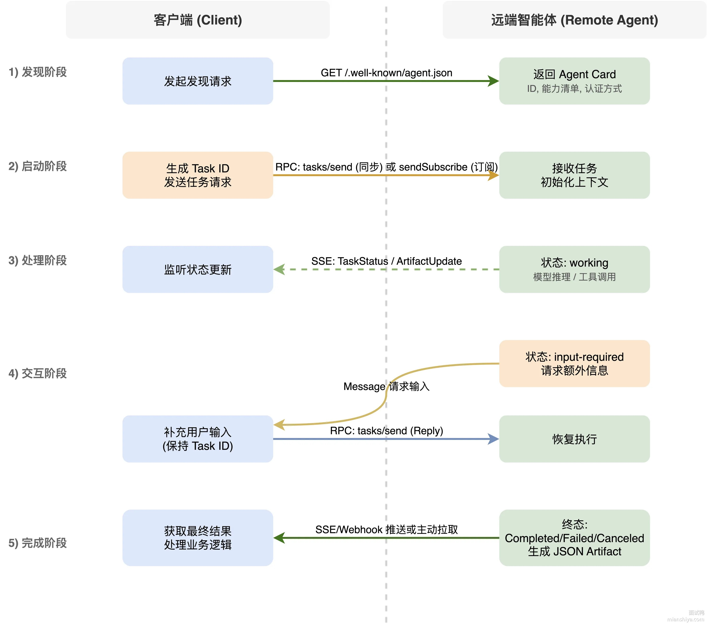

---

## 95. A2A 和 MCP 是什么关系？

A2A 和 MCP 是两个**互补的协议**，共同推动智能体生态的发展。

在智能体与外部系统之间实现互操作，标准化协议至关重要，主要聚焦两个密切关联的领域：工具与智能体。工具是具有结构化输入输出、预定义行为的基本单元；智能体则是能够调用工具、进行逻辑推理并与用户互动的自主应用。

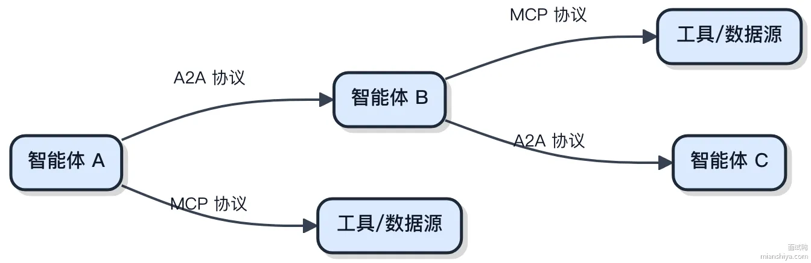

可以把 A2A 想象成智能体之间的"电话簿"，负责发现、呼叫和协作；MCP 则像工具的"使用说明书"，为智能体接入外部数据源和服务提供统一接口。两者结合，才能构建既能高效联动工具，又能自由组织多方智能体的完整生态。


具体来看：

1）MCP 由 Anthropic 于 2024 年发布，为 AI 模型提供与外部数据源和工具的标准化连接方式。它允许 AI 模型通过统一接口访问文件、数据库、API 等资源，实现"函数调用"功能的标准化。MCP 采用 JSON-RPC 2.0 协议，支持 STDIO 和 HTTP+SSE 等传输方式。

2）A2A 是 Google 发布的应用层协议，让 AI 智能体之间能用自然语言协作。A2A 允许不同智能体以"智能体"或"用户"的身份进行交流，而不是仅仅作为工具被调用。它更关注智能体之间的沟通和协作，促进多智能体系统的协同工作。

### 扩展知识

### MCP 的技术架构

MCP 采用客户端-服务器模型，主要由三个组件组成：

1）MCP Hosts：包含 MCP Client 的应用程序，比如 Claude 桌面程序、IDE 或其他 AI 工具

2）MCP Clients：在 Hosts 应用程序内维护与 Server 之间 1:1 连接的协议代理

3）MCP Servers：通过标准化协议实现 Client 与 Servers 之间的双向交互，提供本地或远程资源的访问能力


### A2A 的应用场景

A2A 协议在多智能体系统中应用前景很广：

1）企业协作：不同部门的 AI 智能体可以通过 A2A 协议共享信息和协作，比如销售智能体和客服智能体联动处理客户问题

2）跨平台协作：不同平台上的 AI 智能体可以通过 A2A 协议进行互操作，比如 OpenAI 的智能体和 Google 的智能体协同工作

3）多模型协作：不同类型的 AI 模型可以通过 A2A 协议共享上下文信息，比如擅长代码的智能体和擅长文档的智能体一起完成开发任务

---

**第四部分：场景应用与优化实践**

---

## 96. 如何通过提示词设计减少幻觉？

### 回答重点

幻觉（Hallucination）是指 AI 生成看似合理但实际错误或虚构的内容。减少幻觉问题需要在提示词设计上下功夫，从多个角度进行约束和引导。

最直接的方法是明确告诉 AI"如果不知道就说不知道，不要编造"。这句简单的提示能大幅减少幻觉，因为 AI 会更谨慎，遇到不确定的信息不会强行生成。可以进一步强调"只基于提供的信息回答，不要使用外部知识"或者"必须给出信息来源，不能臆测"。

提供充分的上下文和参考资料也很关键。如果给 AI 足够的相关信息，它就不需要"脑补"，可以基于实际内容回答。这就是 RAG（检索增强生成）的核心思想：先检索相关文档，然后让 AI 基于这些文档生成答案，而不是凭空想象。

要求 AI 给出依据和引用也有效。在提示词中说明"请引用具体的段落或数据"、"说明信息来源"，AI 就会更注重事实依据，减少主观臆测。这种方式还有个好处是方便验证，可以检查 AI 的引用是否正确。

**减少幻觉的提示词示例：**

```text
请基于以下文档回答问题。重要提示：
1. 只使用文档中的信息，不要添加文档外的内容
2. 如果文档中没有相关信息，明确说"文档中未提及"
3. 引用时请注明出处 文档：
```

[文档内容]

```text
问题：[用户问题]
```

### 扩展知识

幻觉问题的产生有多种原因。模型训练数据中的错误信息会被学习下来。模型对不确定的问题会倾向于生成流畅但不准确的内容。模型可能会混淆相似的概念或记忆错位。理解这些原因，才能针对性地设计提示词来规避。

降低 temperature 参数能减少幻觉。temperature 控制输出的随机性，值越低输出越确定。对于事实性任务，建议把 temperature 设置为 0 或接近 0 的值，这样 AI 会选择最可能的输出，而不是有创造性的输出。虽然可能显得有点机械，但准确性会提升。

分步验证也是个好方法。不要让 AI 直接给最终答案，而是要求它先列出关键事实，然后基于这些事实进行推理。每一步都可以人工或程序化检查，发现错误及时纠正。这种方式虽然复杂一些，但对于关键任务很有必要。

对于特定领域的应用，可以提供领域知识和术语表。比如医疗领域，给 AI 提供准确的医学术语定义和常见疾病信息。金融领域，提供准确的金融概念和计算方法。让 AI 在明确的知识框架下工作，幻觉就会少很多。

在实际项目中，还可以用多模型交叉验证。用不同的模型（如 GPT-4 和 Claude）回答同一个问题，对比结果。如果多个模型给出一致的答案，可信度更高。如果结果不一致，说明这个问题可能存在争议或超出模型能力，需要更谨慎处理。

最后要建立人工审核机制。对于重要的、对外的、可能产生影响的 AI 输出，都应该经过人工审核。AI 再智能也可能出错，人工把关是最后一道防线。可以设计一个审核流程，高风险内容必须审核，低风险内容可以直接发布，在效率和安全之间平衡。

---

## 97. 大模型的重复输出和幻觉问题怎么解决？

### 回答重点

重复和幻觉是大模型落地时最头疼的两个问题。**重复**就是模型车轱辘话来回说，比如"这个问题很重要，这个问题确实很重要，这个问题真的很重要"；**幻觉**就是一本正经地胡说八道，编造不存在的论文、虚构的 API、瞎编的数字。

通过微调来缓解这俩问题，核心思路就是：用高质量数据"教"模型什么该说、什么不该说，再配合训练策略让模型学会"老实"。

1）数据层面的治理。训练数据必须去重、去噪、事实核查。如果数据本身就有大量重复句式，或者包含错误信息，模型学出来肯定也是这德行。

2）引入重复惩罚。微调时在 Loss 函数里加一个 repetition penalty，让模型生成重复 token 的时候吃点苦头。

3）领域专精微调。在医疗、法律、金融这种对准确性要求极高的场景，用领域内经过人工审核的数据做 SFT，模型在这个垂直领域的幻觉率会明显下降。

4）RLHF 对齐。让人工标注员评判模型输出是否真实可靠，用强化学习把这种偏好"灌"给模型。ChatGPT 和 Claude 能做到相对诚实，RLHF 功不可没。

5）结合 RAG。微调让模型学会"先查后答"的模式，遇到事实性问题先去检索外部知识库，而不是凭记忆瞎编。


### 扩展知识

### 为什么模型会产生重复

重复问题的根源在于语言模型的自回归生成机制。模型每次生成下一个 token 时，只能看到前面已经生成的内容。如果某个模式在前文出现过，模型很容易陷入"正反馈循环"，不断强化这个模式。

另外，训练数据本身的问题也会放大重复。很多网上爬下来的语料里就有大量重复内容，比如新闻稿的模板、电商商品描述的套话，模型学了这些自然就容易重复。

从 Beam Search 角度看，如果解码策略太保守，只选概率最高的 token，也容易陷入重复的局部最优。所以现在主流都用 Nucleus Sampling 或者 Top-K Sampling 来增加生成多样性。

### 幻觉的三种类型

1）事实性幻觉。模型编造根本不存在的东西，比如虚构一篇论文《Transformer 架构的量子计算优化》作者张三，2019 年发表在 Nature。

2）忠实性幻觉。给了模型上下文，但模型的回答和上下文矛盾。比如文档里写的是"公司成立于 2018 年"，模型回答"该公司成立于 2015 年"。

3）推理性幻觉。模型的推理链条看起来合理，但某个环节有逻辑漏洞，最后得出错误结论。

### 微调解决幻觉的几个具体方法

**SynTra 合成任务训练**

这是斯坦福的一个研究，思路是构造一批专门用于训练模型"诚实"的合成数据。比如给模型一个它不可能知道答案的问题（因为答案是随机生成的），训练模型输出"我不知道"而不是瞎编。经过这种训练，模型在遇到不确定的问题时更愿意承认不知道。

**NoiseFiT 噪声增强微调**

在微调数据里故意加入一些噪声扰动，让模型学会区分"确定的知识"和"不确定的内容"。训练时模型需要对带噪声的输入保持鲁棒，这反过来增强了模型对可靠信息的辨别能力。

幻觉缓解的微调流程：

1. 原始数据收集
2. 数据清洗和事实核查
3. 构造对比样本（正确回答 vs 幻觉回答）
4. SFT 微调，让模型学会正确模式
5. RLHF 阶段，人工标注哪些是幻觉
6. 用 PPO 或 DPO 算法强化"诚实"偏好
7. 部署时结合 RAG 做事实兜底

---

## 98. 提示词优化的核心维度有哪些？

### 回答重点

提示词优化的核心就是让模型更精准地理解你要什么、用什么格式输出。主要从这几个维度入手：

1）目标明确性，开头就把任务讲清楚，别让模型猜。比如"帮我写一段 Python 代码实现快速排序"就比"帮我写代码"强太多。

2）结构清晰性，复杂任务用分点、Markdown 标题或者 ### 这种分隔符拆开，让模型知道哪块是输入、哪块是要求、哪块是示例。

3）少量样本，直接给 1-3 个输入输出的例子，模型一看就懂你要什么风格、什么格式，比你写一大堆描述管用。

4）角色设定，给模型一个身份，比如"你是一个有 10 年经验的 Java 架构师"，输出的专业度和用词风格会明显不一样。

5）约束条件，限死输出范围，字数、格式、禁止出现的内容都写上，防止模型跑偏或者瞎编。

还有一点很关键就是**持续迭代**，提示词不是一次写完就定死的。根据模型输出的效果不断调整，补充细节、优化示例，跑个 A/B 测试，慢慢逼近最优解。


提示词模板的常见字段：

1）角色定义，指定模型身份，比如"你是一个擅长数据分析的 Python 程序员"。

2）任务描述，用具体指令拆解目标，比如"请根据以下销售数据生成趋势分析，需包含 3 个核心结论"。

3）输入内容，提供原始数据、问题背景或者需要处理的文本。

4）输出格式，规定结果结构，比如要求输出 JSON、表格或者分点列表。

5）约束规则，说明限制条件，比如"回答不超过 200 字"、"只用中文"、"不要出现代码"。

6）评估标准，引导模型自检，比如"语言需口语化，避免书面腔"。

### 扩展知识

### 提示词工程的演进

早期大家用 GPT-3 的时候，提示词就是一句话扔进去，效果全靠运气。后来发现加个"让我们一步步思考"就能提升推理准确率，这就是 **Chain-of-Thought** 的雏形。再往后 few-shot learning 流行起来，大家开始在提示词里塞例子。现在的提示词工程已经发展成一套系统方法论，OpenAI、Anthropic、智谱这些厂商都出了官方的 Prompt 最佳实践文档。

### 结构化提示词模板实战

实际项目中，提示词模板一般长这样：

```text
## Role 你是一位资深的技术文档工程师，擅长将复杂的技术概念用通俗易懂的语言解释清楚。

## Task 根据用户提供的 API 接口信息，生成接口文档。

## Input {api_info}

## Output Format 输出 Markdown 格式，包含以下部分： - 接口名称 - 请求方式和路径 - 请求参数表格 - 响应示例 - 错误码说明

## Constraints - 参数表格必须包含字段名、类型、是否必填、说明四列 - 响应示例用 JSON 格式 - 总字数控制在 500 字以内
```

这种模板在 LangChain、LlamaIndex 这类框架里可以直接用 PromptTemplate 类管理，把变量用 {xxx} 占位，运行时动态填充。

---

## 99. 提示词过长怎么优化？

提示词过长会带来两个问题：一是消耗大量 Token 增加成本，二是可能超出上下文窗口限制。优化过长的提示词需要在保持效果的前提下精简内容。

首先要删除冗余信息。检查提示词中是否有重复的描述、不必要的解释、可有可无的例子。保留最核心的指令和最关键的信息，其他都可以删掉。很多时候，一个简洁有力的指令比长篇大论更有效。

其次是提炼关键词。把完整的句子压缩成关键词或短语。比如"请用专业但通俗易懂的语言，适合有一定基础但不是专家的读者"可以压缩成"语言：半专业，读者：中级"。虽然不够优雅，但 AI 通常能理解，而且 Token 数量大幅减少。

还可以用符号和缩写来节省空间。用数字编号代替"第一、第二、第三"，用符号"→"代替"然后"，用缩写代替常见词组。但要确保 AI 能理解这些简化，不要过度压缩导致歧义。

**压缩示例：**

```text
# 优化前（150+ Token） 你是一位非常有经验的 Python 高级工程师，在这个领域已经工作了 10 年以上。
你特别擅长用简单易懂的语言向初学者解释复杂的编程概念。
请帮我写一篇关于 Python 装饰器的技术文章。
要求文章字数在 800 到 1000 字之间，包含至少 2 个代码示例。
语言要通俗易懂，适合刚学完 Python 基础的初学者阅读。
# 优化后（50+ Token） 角色：10年+ Python 工程师，擅长教学 任务：写装饰器文章 要求：800-1000字，2个代码示例，适合初学者
```

---

## 100. temperature 和 top_p 的工作机制有什么区别？

### 回答重点

temperature 和 top_p 都是控制 AI 输出随机性和多样性的参数，但工作机制不同。

temperature（温度）控制输出分布的"平滑度"。值在 0-2 之间，0 表示完全确定性输出，每次都选概率最高的词；值越高输出越随机，越有创造性。可以这样理解：temperature 低就像一个严谨的学者，回答很稳定；temperature 高就像一个天马行空的艺术家，每次回答都不一样。

top_p（核采样）控制候选词的范围。它会从概率最高的词开始累加，直到累计概率达到 p 值，只从这个范围内采样。比如 top_p=0.9 表示只考虑累计概率前 90% 的词，过滤掉那些不太可能的选择。

**参数选择建议：**

```text
事实性任务（翻译、总结、问答）： temperature = 0-0.3 top_p =
0.1-0.5 创造性任务（写作、头脑风暴）： temperature =
0.7-1.0 top_p =
0.8-1.0 平衡任务（对话、解释）： temperature =
0.3-0.7 top_p =
0.5-0.9
```

### 扩展知识

temperature 和 top_p 通常不需要同时调整，选择其中一个就行。业界的常见做法是要么固定 top_p=1.0 然后调整 temperature，要么固定 temperature=1.0 然后调整 top_p。同时调整两个参数可能会产生意外的交互效果，不太好控制。

temperature 对输出质量的影响很明显。temperature=0 时，输出完全可预测，相同输入永远得到相同输出。这对于需要一致性的场景很有用，比如自动化测试、批量处理等。但完全确定性的输出可能显得机械，缺少灵活性。

temperature 过高也有问题。当 temperature 超过 1.0 时，输出会变得很随机，甚至可能产生不通顺的句子或无意义的内容。除非是刻意追求极度的多样性，否则不建议使用过高的 temperature。实践中很少看到 temperature 设置超过 1.5 的情况。

top_p 的优势是更加动态。它不是固定选择前 N 个词，而是根据概率分布自适应地确定范围。当模型对下一个词很确定时（某个词概率很高），候选范围会很小。当模型不确定时（多个词概率接近），候选范围会相对大一些。这种动态性让输出更自然。

在实际应用中，可以根据用户反馈动态调整参数。如果用户抱怨"回答太死板"，可以适当提高 temperature。如果抱怨"回答不稳定"，就降低 temperature。可以提供一个个性化设置选项，让用户自己选择偏好的输出风格，本质上就是在调整这些参数。

有个实用技巧是针对不同类型的输出内容使用不同参数。比如在一个复杂应用中，生成结构化数据时用低 temperature 保证准确性，生成用户提示时用高 temperature 增加友好性。通过精细化的参数控制，能让整体体验更好。

还要注意不同模型对参数的敏感度不同。有些模型即使 temperature 很高也比较稳定，有些模型稍微调高就会变得很随机。在使用新模型时，建议先做一些测试，了解参数的实际效果，找到适合的配置。不要直接套用其他模型的参数，可能会水土不服。

---

## 101. 如何用 Prompt 让大模型生成一个能直接用的 React 表单组件？

### 回答重点

让大模型生成一个能直接用的 React 表单组件，Prompt 得把**上下文约束**写死，不然 AI 就会按自己的理解乱发挥。一个完整的 Prompt 应该覆盖四个维度：字段定义、验证规则、交互行为、代码规范。


直接上一个实战级的 Prompt 示例：

```plaintext
用 React 18 + TypeScript + React Hook Form 写一个用户注册表单组件。
字段清单： - 用户名：必填，2-10 个字符，只能包含字母数字下划线 - 邮箱：必填，标准邮箱格式 - 密码：必填，8-20 位，至少包含一个大写、一个小写、一个数字 - 确认密码：必填，必须和密码字段一致 - 手机号：选填，11 位数字，1 开头 验证行为： - 每个字段失焦时触发校验，不要边打字边校验 - 错误提示红色小字，显示在对应输入框正下方 - 密码强度用三段式进度条展示（弱/中/强） - 确认密码字段只在密码字段有值后才启用 提交逻辑： - 任一必填字段未通过校验时，提交按钮 disabled 且置灰 - 点击提交后按钮变成 loading 状态，显示"提交中..." - 请求完成前禁止重复点击 - 成功后调用 onSuccess 回调并清空表单，失败后保留已填内容 代码要求： - 用函数组件 + hooks，不用 class 组件 - 类型定义单独放一个 types.ts 文件 - 验证规则用 zod schema 定义，不要散落在组件里 - 错误信息统一放 constants.ts，支持国际化替换 - 样式用 Tailwind CSS，响应式适配移动端 - 关键逻辑加注释，特别是正则表达式要写清楚匹配什么 输出格式： - RegisterForm.tsx（主组件） - types.ts（类型定义） - schema.ts（zod 验证规则） - constants.ts（错误信息常量） - 最后给一个使用示例
```

这个 Prompt 的关键在于把每个细节都定死了，AI 照着抄就行，没有发挥空间就不会出幺蛾子。

### 扩展知识

### 为什么用 React Hook Form 而不是受控组件

传统的受控组件写法，每个字段都要 useState，每次输入都触发 setState，组件就会重新渲染。5 个字段的表单，用户打一个字就要渲染 5 遍，字段多了性能很难看。

React Hook Form 用的是非受控组件，通过 ref 直接读取 DOM 的值，只在提交或校验时才收集数据。同样 5 个字段，用户打字时组件压根不重渲染，性能差距能到 10 倍以上。

而且受控组件写起来很啰嗦，每个字段都要写 value、onChange、错误状态，代码量轻松翻倍。React Hook Form 用 register 一行搞定，代码干净很多。


### 验证库选型对比

|维度|zod|yup|joi|
|---|---|---|---|
|包体积|12KB|22KB|140KB|
|TypeScript 支持|原生，类型推导完美|需要额外配置|类型支持较弱|
|API 风格|链式调用，更现代|链式调用|配置对象式|
|错误信息定制|简单直接|需要额外配置|比较麻烦|
|生态整合|React Hook Form 官方推荐|社区主流|主要用在 Node 端|
|运行时校验|支持|支持|支持|

现在新项目基本都用 zod，跟 TypeScript 配合是最好的，定义一个 schema 就能同时得到运行时校验和类型定义，不用写两遍。

### 写 Prompt 容易忽略的坑


很多人写 Prompt 只关注主流程，边界情况完全不提。AI 默认是不会处理这些的，你不说它就不做。比如用户名前后带空格，不 trim 的话会存进数据库，后面登录的时候就对不上了。这种细节要在 Prompt 里明确写出来。

### 分步生成 vs 一次性生成

复杂表单不建议一个 Prompt 全搞定。更好的做法是分三轮：

1）第一轮让 AI 生成类型定义和验证 schema，确认字段和规则没问题 2）第二轮基于第一轮的输出，生成组件骨架和基础交互 3）第三轮加上样式和性能优化

每一轮都能检查，出问题好定位。一口气全塞进去，AI 经常顾此失彼，验证规则对了但交互逻辑不对，或者交互对了但样式乱七八糟。

相关资源：

- React Hook Form 官方文档: [https://react-hook-form.com/](https://react-hook-form.com/)
- Tailwind CSS 官方文档: [https://tailwindcss.com/](https://tailwindcss.com/)
- Zod 类型验证库: [https://github.com/colinhacks/zod](https://github.com/colinhacks/zod)

### 面试官追问

### 提问：表单字段多了以后 Prompt 会很长，怎么组织才能让 AI 不漏东西？

回答：用结构化格式来组织，比如 Markdown 表格或者 YAML 风格的缩进。每个字段单独一个 block，里面包含名称、类型、必填性、校验规则、错误提示。AI 对结构化数据的理解能力比纯文本强很多，漏东西的概率会低不少。另外可以在末尾加一句"请确认你理解了所有 N 个字段的要求后再生成代码"，让 AI 先复述一遍需求。

### 提问：如果验证逻辑很复杂，比如字段之间有联动关系，Prompt 该怎么写？

回答：联动关系要单独拎出来写清楚，不要混在字段定义里。比如"当用户类型选择企业时，公司名称和营业执照号变成必填"，这种就单独一段描述。还可以用伪代码或者流程图来表达，比如"if userType === 'company' then companyName.required = true"。越复杂的逻辑越要写得明确，别指望 AI 能猜出你的意图。

### 提问：生成的代码跑起来有 bug，怎么通过改 Prompt 来修而不是自己手动改？

回答：把 bug 现象描述清楚喂回去。比如"你生成的代码在确认密码字段校验时有问题，当密码字段清空后再填确认密码，校验不会触发。请修复这个问题，确保密码字段变化时会重新校验确认密码字段"。本质上就是把你 debug 的思路用自然语言写出来。如果 bug 很隐蔽，可以把出问题的代码段贴回去，让 AI 重点看那一块。

### 提问：React Hook Form 和 Formik 你更推荐哪个？为什么？

回答：现在新项目肯定选 React Hook Form。性能上，React Hook Form 是非受控组件，重渲染次数少很多，官方 benchmark 显示能快 2-3 倍。体积上，React Hook Form 压缩后 8KB，Formik 要 12KB。API 上，React Hook Form 的 register 比 Formik 的 Field 组件更简洁。唯一 Formik 还有点优势的是社区资料多一些，毕竟出来得早，但 React Hook Form 现在文档也很完善了，上手不难。

---

## 102. 什么是结构化输出（Structured Outputs）？

### 回答重点

**结构化输出**是指让模型生成符合特定格式的数据，比如 JSON、XML、表格、SQL 语句等，而不是自由文本。这种输出能被程序直接解析和处理，存入数据库、生成 API 参数、驱动自动化流程都很方便。

常见的结构化输出形式包括：

1）数据格式：JSON 最常用，还有 YAML、CSV、XML

2）结构化文本：Markdown 表格、键值对、固定字段的段落

3）领域特定格式：SQL 语句用于数据库查询、HTML 用于网页生成、LaTeX 用于学术公式

技术实现的核心是通过提示工程、JSON Schema 定义或约束性解码强制模型遵循格式规则。


实现方法主要有三种：

1）提示工程：在输入提示中明确要求输出格式，比如"请以 JSON 格式返回用户姓名、年龄、邮箱，字段名分别为 name、age、email"

2）后处理：用代码解析模型生成的文本，转换为标准结构，比如用正则表达式提取表格数据

3）工具辅助：使用库或框架自动验证和解析输出格式，比如 LangChain 的 `StructuredOutputParser`

像 LangChain 的图介绍的，通过定义 schema，大模型就会返回结构化的输出： 

---

## 103. OpenAI 的 Structured Outputs 是怎么强制 Schema 输出的？

GPT Structured Outputs 是 OpenAI 提供的一种**强制大模型输出结构化数据**的能力，能保证生成的 JSON 100% 符合你定义的 Schema，不会出现字段缺失、类型错乱、格式错误这些老问题。

以前让 GPT 输出 JSON，只能在 Prompt 里写"请返回 JSON 格式"，模型尽力而为，但经常翻车：少个引号、字段名拼错、嵌套结构乱掉。线上服务接了这种不稳定的输出，后端还得写一堆 try-catch 和正则来兜底，体验很差。

现在用 Structured Outputs，你在 API 调用时通过 `response_format` 参数传入 JSON Schema，模型生成时会被约束在这个 Schema 定义的范围内。底层用的是 Constrained Decoding 技术，模型每生成一个 token，都会检查是否符合当前状态机允许的字符，不符合的直接屏蔽掉，从源头杜绝格式错误。


实际调用示例：

```python
from openai import OpenAI
from pydantic import BaseModel
class Person(BaseModel):
    name: str age: int skills: list[str]
    client = OpenAI()
    response = client.beta.chat.completions.parse( model="gpt-4o-2024-08-06", messages=[{"role": "user", "content": "介绍下张三，28岁Java工程师"}], response_format=Person )
    person = response.choices[0].message.parsed
    # person.name = "张三", person.age = 28, person.skills = ["Java", ...]
```

[按照 openAI 官网介绍](https://platform.openai.com/docs/guides/structured-outputs)，结构化输出的一些优点包括：

- 可靠的类型安全：无需验证或重试格式不正确的响应
- 明确拒绝：基于安全的模型拒绝现在可以通过编程检测
- 更简单的提示：无需使用措辞强烈的提示来实现格式一致

|特性|Structured Outputs|传统 Prompt 要求输出 JSON|
|---|---|---|
|格式保证|100% 合法且符合 Schema|可能缺引号、字段名错误|
|字段约束|支持枚举、类型校验、必填字段|全靠模型"尽力而为"|
|开发效率|直接拿到可用对象，无需后处理|需要 try-catch、正则清洗|
|嵌套结构|递归定义也能稳定输出|层级一深就容易乱|

### 扩展知识

### Constrained Decoding 原理

Structured Outputs 的核心是 **Constrained Decoding**，也叫受限解码。传统的文本生成，模型每一步从整个词表里挑概率最高的 token；受限解码则是在挑选之前，先用一个"过滤器"把不符合当前状态的 token 全部屏蔽掉。


具体实现上有两种主流方案：

1）**有限状态机**：把 JSON Schema 转换成状态转移图。比如生成 JSON 对象时，初始状态只允许 `{`，输出 `{` 后进入"期望键名"状态，这时只允许 `"` 开头的字符串或 `}`。每一步都有明确的合法字符集，模型被"圈"在这个范围里走。

2）**上下文无关语法**：处理递归嵌套结构时，光靠状态机搞不定，得用 CFG。比如 JSON 数组里套对象、对象里再套数组，这种递归定义用 CFG 的产生式规则来描述，解码时动态维护一个语法栈。

### 两种使用方式

OpenAI 提供了两种方式来启用 Structured Outputs：

1）**Pydantic 模型**：直接用 Python 类定义结构，SDK 自动转成 JSON Schema。代码可读性好，IDE 有类型提示，推荐日常开发用这种。

2）**原生 JSON Schema**：手写 Schema 传给 API，灵活度更高，适合 Schema 需要动态生成的场景，比如根据用户配置拼接不同的字段约束。

```python
# 方式一：Pydantic
class Order(BaseModel):
    order_id: str items: list[str] total: float
    # 方式二：JSON Schema
    schema = { "type": "object", "properties": { "order_id": {"type": "string"}, "items": {"type": "array", "items": {"type": "string"}}, "total": {"type": "number"} }, "required": ["order_id", "items", "total"] }
```

### 开源替代方案

不用 OpenAI 的服务，本地部署模型也能实现类似效果：

1）**Outlines**：支持 Llama、Mistral 等开源模型，通过正则表达式或 JSON Schema 约束输出。底层也是状态机实现，和 vLLM 集成后推理速度影响不大。

2）**Instructor**：封装层更高，支持 OpenAI、Anthropic、本地模型等多种后端，用 Pydantic 定义结构后自动处理重试和校验逻辑。

### 相关文档与扩展阅读链接

- [OpenAI结构化输出官方文档](https://platform.openai.com/docs/guides/structured-outputs)
- [LangChain结构化输出指南](https://python.langchain.com/v0.1/docs/modules/model_io/chat/structured_output)
- [Azure OpenAI Service 结构化输出教程](https://learn.microsoft.com/azure/ai-services/openai/how-to/structured-outputs)
- [Instructor github](https://github.com/jxnl/instructor)
- [Outlines官方文档](https://dottxt-ai.github.io/outlines/main/)

### 面试官追问

### 提问：Structured Outputs 会影响模型的生成速度吗？

回答：基本不影响。受限解码只是在每一步生成时加了个 mask 操作，把不合法的 token 概率置零，这个操作是 O(词表大小) 的，相比 Transformer 的前向计算开销可以忽略。OpenAI 的 gpt-4o 系列在启用 Structured Outputs 后，延迟和不启用时基本一致。

### 提问：如果我定义的 Schema 很复杂，模型会不会因为约束太严而生成质量下降？

回答：确实有这个风险。Schema 越复杂，模型的"自由度"越低，可能会出现内容重复、表达僵硬的问题。建议 Schema 只约束必要的字段和类型，不要把所有业务逻辑都塞进去。比如字段描述、枚举值说明这些，可以放在 Prompt 里引导，而不是全靠 Schema 硬约束。

### 提问：Structured Outputs 能保证输出内容的正确性吗？比如让它返回用户年龄，它会不会返回负数？

回答：格式正确不等于语义正确。Structured Outputs 保证的是输出符合 Schema 定义的类型和结构，但不保证值的合理性。你定义 age 是 int，它可能返回 -1 或 999。要约束值的范围，可以用 JSON Schema 的 `minimum`、`maximum` 关键字，或者在业务层做校验。

---

## 104. 什么是护栏（Guardrails）技术？

### 回答重点

护栏技术就是给 AI 系统加的一层**安全围栏**，核心作用是防止模型输出有害、错误或违背人类价值观的内容。

比如用户问大模型"怎么制作炸弹"，护栏技术会拦截这个请求直接拒绝回答；用户诱导模型输出歧视性内容，护栏会检测到语义风险并阻断输出。它让 AI 在既定的规则和目标范围内运行，不会"失控"。

常见的护栏技术分三类：

1）内容安全过滤：用 NLP 模型识别有害文本、暴力图像、虚假信息等，直接拦截或打标

2）伦理规则引擎：预设禁止行为的逻辑判断，比如"禁止输出涉及种族歧视的内容"

3）错误处理机制：当 AI 无法处理问题或检测到风险时，拒绝回答或引导人工介入


---

## 105. 什么是 GPTCache？它解决什么问题？

### 回答重点

GPTCache 是专为大语言模型设计的**语义缓存工具**，通过存储和复用模型响应，降低 API 调用成本并提升响应速度。


和传统缓存只能精确匹配不一样，GPTCache 用向量嵌入技术把用户问题转成向量，通过向量数据库做相似性搜索，实现语义级的缓存命中。意思就是"今天天气怎么样"和"今儿天气咋样"虽然字面不同，但语义相似，能命中同一条缓存。

它的核心价值：

1）降本增效：缓存相似查询的结果，减少重复调用 LLM 的次数。官方数据显示能把 ChatGPT 的 API 成本降低 10 倍，响应速度提升 100 倍

2）语义匹配：支持 OpenAI Embeddings、SentenceTransformers 等嵌入模型，配合 Milvus、FAISS 等向量数据库做相似性搜索

3）模块化设计：嵌入模型、缓存存储、逐出策略都可以自定义，SQLite、MySQL、Redis 都能当存储后端


典型使用场景：聊天机器人和客服系统里重复问题的快速响应；测试环境里模拟 LLM 响应，减少对真实 API 的依赖，加速开发迭代。

### 扩展知识

### 核心工作流程

一个请求进来后经历这几步：

1）预处理：提取用户问题中的核心信息，比如对话场景里会把历史上下文拼进去

2）向量生成：用嵌入模型把问题转成高维向量，常用 BERT、text-embedding-ada-002 这些模型

3）相似性搜索：在向量数据库里找最相似的历史查询，计算余弦相似度或欧氏距离

4）缓存判断：如果相似度超过设定阈值就直接返回缓存结果，否则调用 LLM 生成新回答并存入缓存

5）后处理：根据 temperature 参数调整响应的随机性，平衡准确性和多样性


### 相似度阈值怎么定

这个阈值直接决定缓存的命中率和准确率。设太低容易误命中，用户问"怎么做红烧肉"结果返回"怎么做糖醋排骨"的答案；设太高又命中不了几条，失去缓存的意义。

一般从 0.85 开始调，观察线上效果：

1）命中率太低就往下调，0.80、0.75 这样试 2）用户反馈答案不对就往上调，0.90、0.95 这样试 3）不同业务场景阈值差很多，FAQ 类的可以设低点因为问题相对标准，开放式对话要设高点

### 和传统缓存的本质区别

|维度|传统缓存|GPTCache|
|---|---|---|
|匹配方式|精确匹配 key|语义相似度匹配|
|存储内容|原始字符串|向量 + 原始内容|
|命中条件|key 完全一致|相似度超过阈值|
|适用场景|固定参数的 API|自然语言查询|
|存储开销|小|大，向量维度通常 768 到 1536|

传统缓存只能处理"北京天气"和"北京天气"这种完全相同的查询，GPTCache 能处理"北京天气怎么样"、"北京今天冷不冷"、"帝都天气如何"这类语义相似但字面不同的查询。

### 工程落地注意事项

1）冷启动问题：刚上线缓存是空的，命中率为零。可以提前用历史日志预热，把高频问题灌进去

2）缓存失效策略：LRU 最常用，但语义缓存还要考虑时效性。比如"今天股价多少"这种问题，缓存有效期得设短，几分钟就要过期

3）向量计算开销：每次请求都要算向量，嵌入模型本身也有延迟。可以把嵌入服务独立部署，用 GPU 加速

4）存储成本：向量维度高、数据量大了存储压力不小。可以做向量压缩，或者只缓存高频问题

5）多租户隔离：不同用户的缓存要隔离，不然 A 用户的私密问题可能被 B 用户命中

---

## 106. 上下文超长有哪些工程解法？

### 回答重点

工程上主要有三条路：**砍内容**、**分批喂**、**只检索相关的**。

1）文本压缩和截断

最简单粗暴的办法就是砍。中间截断法是常用手段，因为很多文档开头是摘要、结尾是总结，中间是细节，砍中间影响最小。更聪明的做法是用 LLMLingua 这类工具做语义压缩，让小模型先过一遍，把冗余信息剔掉，压缩比能到 10 倍以上，核心信息还能保住。

2）分段处理再汇总

文档太长就切成多段，每段单独处理，最后把结果汇总。Map-Reduce 模式就是这个思路：Map 阶段每个分段独立生成摘要或中间结果，Reduce 阶段把所有中间结果合并成最终答案。还有 Refine 模式，第一段先出个初步答案，后面每段都在前一个答案基础上迭代优化。

3）RAG 检索增强

压根不用把整篇文档塞进去，先把文档切块存向量库，用户提问时只检索最相关的几个片段，拼进 Prompt 里就行。这是目前最主流的方案，几百 MB 的知识库也能秒级响应。检索质量决定了最终效果，向量检索加 BM25 混合检索，再配个 Rerank 模型，召回率能上一个台阶。


### 扩展知识

### 为什么上下文窗口是个硬限制

Transformer 的自注意力机制计算复杂度是 O(n²)，n 是序列长度。4K token 的时候还好，到了 100K，显存和计算量都扛不住。虽然现在有 Flash Attention、Ring Attention 这些优化，能把窗口撑大，但成本还是随长度飙升。更关键的是，模型在超长上下文里容易"迷路"，中间的内容注意力权重会被稀释，所谓的"Lost in the Middle"问题。


### 文本压缩方案详解

压缩有几个层次：

1）规则压缩：去掉 HTML 标签、重复空白、无意义符号，能省 20%-30% 的 token 2）摘要压缩：让模型先生成摘要，用摘要替代原文，适合不需要细节的场景 3）语义压缩：LLMLingua、Selective Context 这类工具，训练一个小模型来判断哪些 token 可以删，哪些必须保留

语义压缩的原理是计算每个 token 的困惑度，困惑度低的说明可预测性高，删了影响不大。实测下来，压缩到原来的 1/5 甚至 1/10，模型输出质量下降不明显。

### 分段处理的几种模式

|模式|工作流程|适用场景|
|---|---|---|
|Map-Reduce|每段独立处理 → 结果汇总|文档摘要、信息抽取|
|Refine|逐段迭代更新答案|需要全局一致性的任务|
|Map-Rerank|每段独立处理 → 按相关性排序取最优|问答、事实查找|

Map-Reduce 的问题是中间结果汇总时可能丢信息，Refine 的问题是串行处理慢。实际项目里可以混着用，先 Map 再 Refine。

### 技术选型决策树


### 相关文档参考

1）IBM Research Blog: [https://research.ibm.com/blog/larger-context-window](https://research.ibm.com/blog/larger-context-window) 2）Scale AI Blog: [https://scale.com/blog/long-context-instruction-following](https://scale.com/blog/long-context-instruction-following) 3）Swimm Learn: [https://swimm.io/learn/large-language-models/llm-context-windows-basics-examples-and-prompting-best-practices](https://swimm.io/learn/large-language-models/llm-context-windows-basics-examples-and-prompting-best-practices)

### 面试官追问

### 提问：Lost in the Middle 问题具体是什么，怎么缓解？

回答：大模型处理长上下文时，对开头和结尾的内容关注度高，中间的内容容易被忽略。实验表明，把关键信息放在 Prompt 中间，准确率会明显下降。缓解方法有几个：一是把重要信息放开头或结尾；二是用 RAG 检索时按相关性排序，最相关的放最前面；三是对检索结果做 Rerank，确保高相关内容不被埋没；四是用支持更好位置编码的模型，比如 ALiBi、RoPE 外推效果比原始正弦位置编码好。

### 提问：RAG 和 Fine-tune 长上下文模型，什么时候该用哪个？

回答：看数据更新频率和成本预算。知识库经常更新的场景必须用 RAG，Fine-tune 一次要好几天，等不起。数据量小、格式固定、追求极致效果的场景可以 Fine-tune。成本上 RAG 是按检索和生成的 token 付费，Fine-tune 是一次性训练成本加推理成本。一般建议先上 RAG，效果不够再考虑 Fine-tune，两者也可以结合用。

### 提问：文本压缩会不会把关键信息压没了，怎么保证压缩质量？

回答：确实有这个风险。保证质量的办法：一是压缩前先做信息抽取，把实体、数字、关键结论标记出来强制保留；二是设置压缩比上限，别压得太狠，一般不超过 5 倍比较安全；三是用困惑度指导压缩，高困惑度的 token 是关键信息，不能删；四是压缩后做验证，让模型回答几个基于原文的问题，答不上来说明压过头了。

### 提问：多轮对话场景下，历史消息太长怎么处理？

回答：几个常用策略：滑动窗口只保留最近 N 轮对话；重要消息标记，被引用过的消息权重高不删；定期做对话摘要，把早期对话压缩成一段摘要放在开头；分层存储，完整历史存数据库，Prompt 里只放摘要和最近几轮。还可以结合 RAG，历史对话也切块存向量库，需要的时候检索相关历史。

---

## 107. 大模型 API 响应慢，前端怎么优化用户体验？

### 回答重点

大模型 API 动辄 2-5 秒的响应时间，用户干等着界面没反应肯定受不了。前端优化的核心就是**让用户感知不到等待**，主要靠三板斧：立即反馈、流式输出、状态兜底。

**立即反馈**是指用户点发送的瞬间，界面就要有动静。消息气泡先出来，哪怕内容是空的，加个 loading 动画或者骨架屏，让用户知道系统在干活。这招叫乐观 UI，核心思路是把用户反馈和网络请求解耦，不等后端响应就先更新界面。


**流式输出**是大模型场景的标配。OpenAI、Claude 这些 API 都支持 SSE 流式返回，后端每生成一个 token 就往前端推一次，前端拿到就渲染，用户看到的就是文字一个一个蹦出来的打字机效果。心理学上这叫"进度反馈"，用户看着文字在动，等 5 秒也不觉得烦。

```javascript
// 流式响应处理核心逻辑
const response =
await fetch('/api/chat', { method: 'POST', body: JSON.stringify({ message }) })
const reader = response.body.getReader()
const decoder = new TextDecoder()
while (true) {
const { done, value } =
await reader.read()
if (done) break
const chunk = decoder.decode(value)
// 逐块追加到界面 appendToMessage(chunk) }
```

**状态兜底**是保底策略。设置 30 秒超时，超了就提示"响应超时，请重试"；网络断了要能检测到并给出提示；请求失败要有重试按钮。这些边界情况处理不好，用户体验直接崩盘。

---

## 108. 多用户并发下，每个人看到的 token/s 是怎么算的？

### 回答重点

不会简单平均成每人 1 token/s，实际上每个用户看到的响应速度可能是几十 token/s。

LLM 推理不是把算力切成 1000 份分给 1000 个用户，而是靠**批处理**把多个请求打包到一起算。GPU 擅长的就是并行计算，100 个请求打成一个 batch，计算耗时跟处理单个请求差不多，吞吐量直接翻几十倍。

假设每次批处理包含 100 个用户的请求，每个用户请求 10 tokens，那 1000 个用户分 10 批就处理完了。单用户实际体验到的速度是 10 tokens/s，不是 1 token/s。


实际响应速度取决于三个核心因素：请求的 token 长度、batch 大小策略、排队调度机制。

---

## 109. 智能工单分类系统应该怎么设计？

### 回答重点

智能工单分类系统里，AI 能介入的环节其实挺多的，从用户提交工单那一刻到最后自动派单，整条链路都能用上。核心就三块：**理解工单在说啥**、**决定往哪分**、**自动化处理**。

1）工单内容理解

用户提交的工单五花八门，有的啰嗦一大堆，有的就几个字，AI 得先把内容"读懂"。传统做法是分词、去停用词那套 NLP 流程，现在直接上 BERT 或者 GPT 类模型做文本编码更省事。关键是要提取出几个核心信息：用户到底遇到了什么问题、涉及哪个产品或模块、情绪是不是很激动。实体识别能把"我的 iPhone 15 屏幕碎了"里的产品名、问题类型抠出来，意图识别能判断用户是想退货还是要维修。

2）智能分类决策

理解完内容就要决定这工单该派给谁。简单场景用 XGBoost、LightGBM 这类传统机器学习模型就够了，训练快、推理快、可解释性还好。复杂场景可以上 BERT 做 fine-tune，分类准确率能高不少。工单分类一般是多级的，先分大类再分小类，比如先判断是售后还是售前，售后里再分退款、换货、维修。还得评估优先级，VIP 客户的工单、涉及资金安全的工单得优先处理。

3）自动化处理

分类完不是结束，还能让 AI 干更多。比如接入 RAG 系统，从企业知识库里捞出历史类似工单的处理方案，直接推荐给客服。简单问题甚至可以让 LLM 生成回复，用户一提交就秒回，不用等人工。分类结果还能触发工作流，自动创建 Jira 工单、发企业微信通知、更新 CRM 状态。


### 扩展知识

### 为什么工单分类要上 AI

传统工单系统靠人工分类或者关键词规则匹配，问题很多。人工分类慢还容易出错，高峰期工单堆积严重；关键词规则太死板，用户换个说法就匹配不上，"手机坏了"和"设备故障"规则引擎识别不出来是一回事。AI 模型能理解语义，泛化能力强，一个模型能覆盖各种表述方式。

### 技术选型思路


选型要看业务规模和准确率要求：

|场景|推荐方案|理由|
|---|---|---|
|日工单量 < 1000，类别 < 20|FastText + XGBoost|简单够用，部署成本低|
|日工单量 1000-10000，类别 20-100|BERT fine-tune|准确率高，推理延迟可接受|
|日工单量 > 10000，需要实时响应|蒸馏小模型 + GPU 推理|平衡效果和性能|
|类别经常变动，难以穷举|LLM few-shot + RAG|灵活性强，不用频繁重训|

### 工单分类流程实现

完整的处理流程是这样的：工单进来先做预处理，去掉 HTML 标签、特殊字符、表情这些噪音。然后过一遍 NER 模型提取实体，再用分类模型预测类别。预测结果有个置信度阈值，高于 0.9 的直接自动分发，0.7-0.9 的人工复核，低于 0.7 的全量人工处理。自动分发出去的工单还要定期抽检，发现错分的案例收集起来做增量训练。


### 相似工单检索

分类之外，检索历史相似工单也很有价值。客服看到新工单，系统自动推送 3-5 条历史类似案例和处理方案，处理效率能提升 30% 以上。技术上就是把工单文本用 Sentence-BERT 转成向量，存到 Milvus 这类向量库里，来新工单时做 ANN 检索。还可以把历史工单的处理方案也向量化，做 RAG 直接生成回复建议。

### 模型持续优化

工单分类不是一锤子买卖，业务在变、产品在变、用户表述习惯也在变。得搞一套持续迭代的机制：

1）线上埋点收集错分案例，客服手动改了分类的就是负样本 2）每周或每月做增量训练，新数据权重可以调高一点 3）A/B 测试验证新模型效果，灰度切流上线 4）监控分类准确率、平均处理时长这些指标，发现异常及时排查

---

## 110. 智能客服的长尾问题怎么用 RAG 解决？

### 回答重点

智能客服的**长尾问题**就是那些单个出现频率很低、但汇总起来占了 60%-70% 咨询量的零散问题。比如某电商平台，热门问题"怎么退货"一天能被问 1 万次，但"XX 型号充电器能不能用在 YY 手机上"这类问题可能一个月才问 1 次，这种问题的种类加起来有上万种，靠人工写死规则根本覆盖不过来。

解决长尾问题的核心思路是搭建一套**向量化知识库 + RAG 检索增强生成**的架构。整体链路是：用户提问先过 Embedding 模型转成向量，然后去向量数据库里做相似度检索，捞出 Top-K 条最相关的知识片段，最后把这些片段塞给大模型做上下文，让它生成最终答案。这套方案的好处是知识库可以无限扩展，不用改代码，往里面灌文档就行。


具体实现分三步走：

1）知识入库阶段。把产品文档、历史工单、FAQ 这些原始材料切成 300-500 字的小段落，用 text-embedding-ada-002 或者 BGE-large 这类 Embedding 模型转成 1536 维的向量，存到 Milvus、Pinecone 这类向量数据库里。切片的时候要注意保留上下文，别把一句话切断了。

2）检索匹配阶段。用户问题同样过 Embedding，然后用余弦相似度或者内积去向量库里找最近邻，一般取 Top-5 到 Top-10。这里可以加一层关键词精排，用 BM25 做个混合检索，语义匹配和关键词匹配结合起来效果更好。

3）答案生成阶段。把检索到的知识片段拼成 Prompt，格式大概是"根据以下参考资料回答用户问题：{知识片段} 用户问题：{query}"，扔给 GPT-4 或者 Claude 生成回答。这一步可以加 system prompt 约束回答风格，比如"如果参考资料里没有相关信息，请回答不知道"。

```python
# 核心检索 + 生成伪代码
from langchain.embeddings import OpenAIEmbeddings
from langchain.vectorstores import Milvus
from langchain.chat_models import ChatOpenAI
embeddings = OpenAIEmbeddings(model="text-embedding-ada-002")
vector_store = Milvus(embedding_function=embeddings, collection_name="knowledge_base")
def answer_question(query: str) -> str:
    # 向量检索 Top-5
    docs = vector_store.similarity_search(query, k=5)
    context = "\n".join([doc.page_content
    for doc in docs])
    # 构造 Prompt 生成回答
    llm = ChatOpenAI(model="gpt-4", temperature=0.3)
    prompt = f"根据以下参考资料回答用户问题：\n{context}\n\n用户问题：{query}"
    return llm.predict(prompt)
```

### 扩展知识

### 为什么传统方案搞不定长尾

传统客服系统要么靠规则匹配，要么靠意图分类。规则匹配就是写一堆"如果包含 XX 关键词就回复 YY"，问题是长尾问题的表述五花八门，"充电器兼容性"用户可能问"能不能混用"、"通不通用"、"插得进去吗"，规则写到吐血也覆盖不全。意图分类把问题往预设的几十个意图上归类，但长尾问题的意图本身就有上万种，分类器压根训不过来，准确率惨不忍睹。


---

## 111. 电商系统中使用大模型有哪些核心原则？

### 回答重点

电商系统里用大模型的核心原则是：**对精度要求不高、容错空间大的场景直接用，涉及钱和库存的场景必须加工程化兜底**。

适合直接用大模型的场景：

1）用户咨询解答，比如"这款手机防不防水"、"衣服会不会起球"这种开放性问题，大模型能理解问题并从商品描述里提取答案

2）商品文案生成，给一堆参数让 AI 写出有营销感的描述，比如把"屏幕 6.7 寸、120Hz"包装成"大屏沉浸、丝滑流畅"

3）个性化客服回复，根据用户的购买记录和当前情绪，生成有温度的话术

必须结合工程化手段的场景：

1）商品检索和推荐，用户搜"500 块以下的蓝牙耳机"，光靠大模型没法精准过滤价格区间，得先用 Elasticsearch 或数据库查出来，再让大模型排序和润色

2）库存和价格查询，这类数据实时变化、差一分钱都是事故，必须走数据库查询，大模型只负责把结果组织成自然语言

3）订单状态追踪，物流信息在第三方系统里，大模型没法直接访问，得通过 API 拿到数据后再生成回复


### 扩展知识

### 为什么不能让大模型直接干所有活

大模型有三个天生的短板：

1）幻觉问题，问它"这款商品有没有货"，它可能编一个"库存充足"出来，实际上早卖光了。京东、淘宝这种日活上亿的平台，一个库存错误可能引发几十万订单翻车

2）延迟和成本，调一次 GPT 要 1-3 秒、花几分钱，用户搜一次商品可能要召回上万条结果，全交给大模型处理根本扛不住

3）数据实时性，大模型的知识是训练时定死的，今天的促销价、当前的库存量它压根不知道


---

## 112. 医疗场景下的 AI 系统怎么设计才安全？

### 回答重点

医疗场景的核心原则是**宁可漏诊也不能误诊**，所以系统设计必须把"防幻觉"放在第一位，效率提升是在安全基础上的加分项。

整体架构分 4 层防护：

1）RAG 层，所有回答必须基于权威医学文献和药品说明书，大模型不允许凭空编造

2）边界控制层，通过 Prompt 工程限定 AI 只能做"信息整理"，禁止输出诊断结论和处方建议

3）风险分级层，根据症状严重程度自动分流，发烧咳嗽这种走 AI 自动回复，胸痛呼吸困难直接转人工

4）人工兜底层，所有 AI 回复在展示前要过一道医学规则引擎，高风险内容必须医生审核


技术手段主要包括：

1）知识图谱增强，把疾病、症状、药物、禁忌之间的关系建成图谱，AI 输出的每个医学断言都要去图谱里校验

2）不确定性量化，让模型输出时带一个置信度分数，低于 0.8 的回答自动标记"仅供参考，建议就医"

3）多模态交叉验证，文字描述和检查报告图片结合分析，减少单一信息源带来的误判

### 扩展知识

### AI 幻觉在医疗场景的危害

大模型幻觉在普通场景最多是闹笑话，在医疗场景可能出人命。丁香园曾经测试过，让 ChatGPT 回答"阿司匹林和华法林能不能一起吃"，它有时候会说可以，但实际上两者联用会大幅增加出血风险。


### RAG 技术在医疗场景的落地

RAG 不是万能药，医疗场景的 RAG 和普通问答 RAG 有几个关键区别：

1）知识库质量要求极高，只能用 NCBI、PubMed、药监局官网这类权威来源，网上搜来的科普文章不能入库

2）检索精度要求高，普通场景召回率优先，医疗场景准确率优先，宁可少返回几条也不能返回错的

3）必须保留溯源链路，每一句话是从哪篇文献哪一页来的，要能追溯

基于 LangChain 的实现示例：

```python
from langchain.embeddings import OpenAIEmbeddings
from langchain.vectorstores import Chroma
from langchain.chains import RetrievalQA
# 医学专用向量库
medical_db = Chroma( collection_name="medical_knowledge", embedding_function=OpenAIEmbeddings() )
# 检索器配置，只返回高相关度结果
retriever = medical_db.as_retriever( search_type="similarity_score_threshold", search_kwargs={"score_threshold": 0.85, "k": 3} )
# 医疗专用系统提示
system_prompt = """你是医疗信息助手，遵循以下原则： 1. 只基于检索到的文献回答，禁止推测 2. 每个医学陈述必须注明来源文献 3. 遇到检索结果不足的问题，回复"建议咨询专业医生" 4. 禁止给出诊断结论和处方建议"""
qa_chain = RetrievalQA.from_chain_type( llm=OpenAI(temperature=0), retriever=retriever, chain_type_kwargs={"prompt": system_prompt} )
```

### 人机协作的分级审核机制

不是所有问题都需要医生盯着，那样效率太低。合理的做法是按风险分级：

1）低风险问题，比如"感冒了多喝水有用吗"、"维生素 C 每天吃多少"，AI 直接回复，后台抽检

2）中风险问题，涉及具体症状描述的，AI 生成初稿后护士快速过一遍，30 秒内放行或修改

3）高风险问题，涉及急症症状、慢病用药调整的，必须医生审核后才能发给用户

京东健康的智能问诊就是这个模式，AI 处理 70% 的常规咨询，医护只需要聚焦那 30% 的复杂问题，人效提升了 3 倍。


### 不确定性量化的实现

让模型"知道自己不知道"是防幻觉的关键。实现方式有几种：

1）输出校准，用医学问答数据集对模型做校准训练，让它输出的概率分布更接近真实正确率

2）多次采样，同一个问题让模型回答 5 次，看答案一致性，一致性低的标记为不确定

3）基于检索的置信度，如果 RAG 召回的文档相关度都不高，直接判定为知识库覆盖不足，拒绝回答

```python
def calculate_confidence(query, retrieved_docs, model_output):
    # 检索置信度：最高相关度文档的分数
    retrieval_conf = max(doc.score
    for doc in retrieved_docs)
    # 多次采样一致性
    samples = [model.generate(query)
    for _ in range(5)] consistency = calculate_semantic_similarity(samples)
    # 综合置信度
    final_conf = 0.6 * retrieval_conf + 0.4 * consistency
    if final_conf < 0.7:
        return "建议咨询专业医生", final_conf
elif final_conf < 0.85:
    return model_output + "\n\n 仅供参考", final_conf
else:
    return model_output, final_conf
```

---

## 113. AI 应用的测试和传统软件测试有什么异同？

AI 应用的测试和传统软件测试有相似之处，当然也有其独特性。

相似之处在于，我们仍然需要关注功能性、兼容性、安全性等方面。但其独特性在于，AI 系统的核心是模型和数据，因此测试的重点要向这两个方面倾斜。比如：

- 数据质量：模型是数据驱动的，输入数据的质量、分布以及是否能覆盖各种真实场景，对模型的表现影响很大。我们要测试模型在不同数据集、边缘案例以及对抗性样本下的表现。
- 模型性能：这涉及到模型的准确率、召回率、F1-score 等一系列评估指标。同时，我们也要关注模型在不同环境、不同输入扰动下的稳定性，即鲁棒性。例如，应用是否会对微小的、人眼难以察觉的输入变化产生截然不同的输出。
- 部署：应用最终部署到生产环境上。测试也需要覆盖模型与系统的交互、API 的稳定性以及在真实部署环境下的性能表现，比如延迟、吞吐量等。

效果评估更侧重于衡量 AI 应用在实际业务场景中产生的价值和影响。通常是一个持续的过程，而不仅仅是一次性的测试。

在效果评估方面，我们需要注意以下几个点：

- 明确评估指标：这些指标需要紧密围绕业务目标。例如，一个推荐系统可能关注点击率、转化率、用户停留时长等；一个风控模型更关注误报率、漏报率以及由此带来的经济损失减少。
- A/B 测试：将新功能与现有版本进行对比测试，观察其在真实用户和真实环境中的表现差异，这是评估效果最直接有效的方法之一。
- 成本效益分析：除了技术指标，还要从商业角度评估 AI 应用的投入产出比，考虑其带来的实际经济效益或社会效益。

AI 应用的测试和效果评估是一个系统性的工程，不只是要关注应用本身的技术指标，还要关注我们上面提到的内容，以及最终在真实业务场景中产生的价值，这是一个迭代和持续优化的过程。
