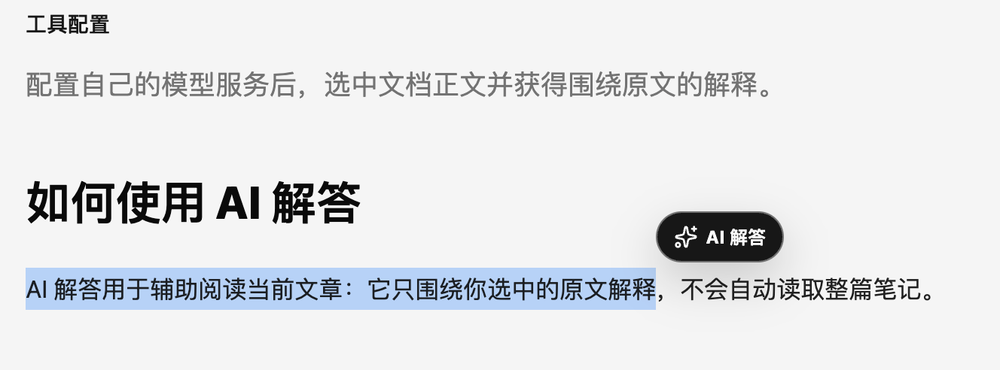
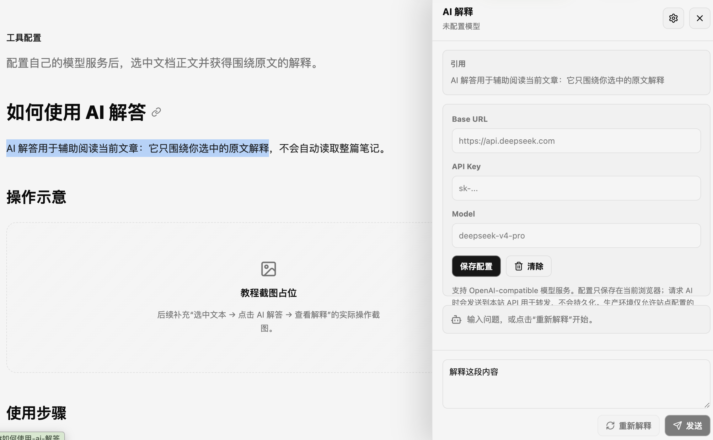

# 如何使用 AI 解答

AI 解答用于辅助阅读当前文章：它只围绕你选中的原文解释，不会自动读取整篇笔记。

## 操作示意

  <figure>
    
    <figcaption>
      <strong>1. 选中想深入理解的内容</strong>
      在正文中划选一段文字，选区旁会出现“AI 解答”入口。
    </figcaption>
  </figure>
  <figure>
    
    <figcaption>
      <strong>2. 在侧边栏查看解释并继续追问</strong>
      点击入口后，在不离开当前文章的情况下获得解释和延伸问答。
    </figcaption>
  </figure>

## 使用步骤

1. 在任意文档正文中选中想进一步理解的内容。
2. 点击选区旁出现的“AI 解答”。
3. 首次使用时，填写自己的 OpenAI-compatible `Base URL`、`API Key` 与模型名称。
4. 保存后即可获得解释，也可以继续围绕当前引用追问。

## 配置与隐私

- 模型配置只保存在当前浏览器的本地存储中。
- API Key 请求时会经由本站 API 转发，但不会由本站持久化。
- 生产环境只接受 HTTPS 且在站点允许列表中的模型服务域名。
- 选中的内容最多 4000 个字符，追问最多 1000 个字符。
